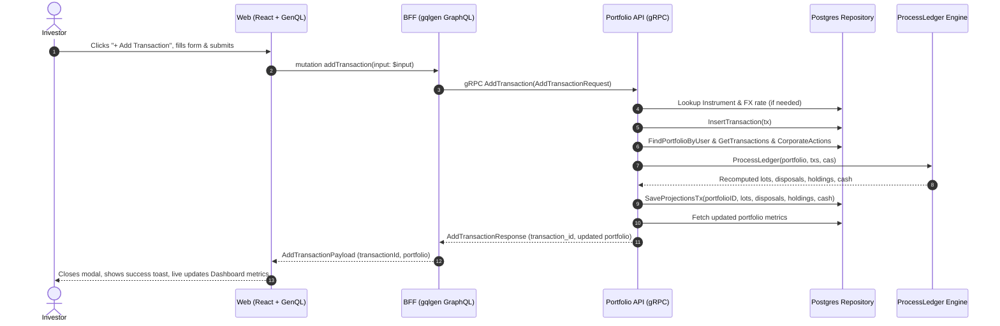

# Add Transactions Implementation Plan (FE, BFF, and Service)

> **Branch**: `feat/add-transactions`  
> **Targets**: `proto/`, `services/portfolio-api`, `bff/`, and `web/`  
> **Key Principle**: End-to-end exact precision (zero IEEE 754 float policy) using `shopspring/decimal` in Go and GraphQL `Decimal` scalar in the UI.

---

## 1. Architectural Overview & Data Flow

When a user submits a new transaction (e.g., BUY, SELL, DEPOSIT, WITHDRAWAL, DIVIDEND), the system writes an append-only event to the ledger and immediately triggers the ledger projection replay engine so holdings, tax lots, and cash balances update deterministically.



---

## 2. Layer-by-Layer Specifications

### 2.1 Protocol Buffers (`proto/`)

Extend `proto/portfolio/v1/portfolio.proto` with transaction mutations and instrument discovery:

```protobuf
enum TransactionType {
  TRANSACTION_TYPE_UNSPECIFIED = 0;
  TRANSACTION_TYPE_BUY = 1;
  TRANSACTION_TYPE_SELL = 2;
  TRANSACTION_TYPE_DIVIDEND = 3;
  TRANSACTION_TYPE_DEPOSIT = 4;
  TRANSACTION_TYPE_WITHDRAWAL = 5;
  TRANSACTION_TYPE_INTEREST = 6;
  TRANSACTION_TYPE_FEE = 7;
  TRANSACTION_TYPE_TAX = 8;
  TRANSACTION_TYPE_TRANSFER_IN = 9;
  TRANSACTION_TYPE_TRANSFER_OUT = 10;
  TRANSACTION_TYPE_FX_CONVERSION = 11;
}

message AddTransactionRequest {
  string user_id = 1;
  TransactionType type = 2;
  string symbol = 3;                  // e.g. "AAPL" (optional for DEPOSIT/WITHDRAWAL)
  string trade_date = 4;              // ISO format: "YYYY-MM-DD"
  common.v1.Decimal quantity = 5;     // Required for BUY/SELL/TRANSFER
  common.v1.Money price = 6;          // Unit price for trade
  common.v1.Money amount = 7;         // Gross/net trade amount or cash amount
  common.v1.Money fee = 8;            // Optional brokerage fee
  string notes = 9;
}

message AddTransactionResponse {
  string transaction_id = 1;
  Portfolio portfolio = 2;            // Recomputed portfolio snapshot
}

message Instrument {
  string id = 1;
  string symbol = 2;
  string name = 3;
  string currency_code = 4;
  string asset_class = 5;
}

message ListInstrumentsRequest {}

message ListInstrumentsResponse {
  repeated Instrument instruments = 1;
}

service PortfolioService {
  rpc GetPortfolio(GetPortfolioRequest) returns (GetPortfolioResponse) {}
  rpc AddTransaction(AddTransactionRequest) returns (AddTransactionResponse) {}
  rpc ListInstruments(ListInstrumentsRequest) returns (ListInstrumentsResponse) {}
}
```

---

### 2.2 Microservice Layer (`services/portfolio-api`)

#### 1. Repository Interface & PostgreSQL Implementation
- **Files**: `internal/repository/repository.go`, `internal/repository/postgres.go`, `internal/repository/queries.go`
- **New Operations**:
  - `InsertTransaction(ctx context.Context, tx domain.Transaction) (*domain.Transaction, error)`
    - SQL: `INSERT INTO portfolio.transactions (portfolio_id, instrument_id, type, trade_date, quantity, price, amount, currency_code, fee, fx_rate_to_base, notes) VALUES (...) RETURNING id, created_at`
  - `FindInstrumentBySymbol(ctx context.Context, symbol string) (*domain.Instrument, error)`
    - SQL: `SELECT id, symbol, exchange_code, name, asset_class, currency_code, isin FROM portfolio.instruments WHERE symbol = $1 AND is_active = true LIMIT 1`
  - `ListActiveInstruments(ctx context.Context) ([]domain.Instrument, error)`
    - SQL: `SELECT id, symbol, exchange_code, name, asset_class, currency_code, isin FROM portfolio.instruments WHERE is_active = true ORDER BY symbol ASC`

#### 2. Service Layer (`internal/service/`)
- **Files**: `internal/service/service.go`, `internal/service/transaction.go`
- **Method**: `AddTransaction(ctx context.Context, req domain.AddTransactionInput) (*domain.Transaction, *domain.PortfolioSummary, error)`
- **Validation & Business Logic**:
  - Verify portfolio exists for `userID`.
  - Validate transaction type requirements:
    - `BUY` / `SELL`: `symbol` required, `quantity > 0`, `price >= 0`. Calculate `amount = quantity * price` if omitted.
    - `DEPOSIT` / `WITHDRAWAL`: `amount > 0`, `currency` required, `instrument_id = nil`.
    - `DIVIDEND`: `symbol` required, `amount > 0`.
  - Resolve instrument UUID from symbol.
  - Determine FX rate to portfolio base currency if trade currency differs.
  - Persist transaction via `repo.InsertTransaction`.
  - Trigger projection replay: invoke `s.RebuildProjections(ctx, userID)` to recalculate lots, disposals, holdings, and cash.
  - Compute and return updated summary via `s.GetPortfolioSummary(ctx, userID)`.

#### 3. gRPC Server Handler (`internal/server.go`)
- Implement `AddTransaction(ctx context.Context, req *pb.AddTransactionRequest) (*pb.AddTransactionResponse, error)`
- Implement `ListInstruments(ctx context.Context, req *pb.ListInstrumentsRequest) (*pb.ListInstrumentsResponse, error)`
- Convert between Protobuf messages and internal domain models using `pkg/decimalpb`.

---

### 2.3 Backend-for-Frontend Layer (`bff/`)

#### 1. GraphQL Schema (`bff/graph/schema.graphqls`)
Extend schema with mutations and input types:

```graphql
enum TransactionType {
  BUY
  SELL
  DIVIDEND
  DEPOSIT
  WITHDRAWAL
}

input AddTransactionInput {
  type: TransactionType!
  symbol: String
  tradeDate: String!
  quantity: Decimal
  price: Decimal
  amount: Decimal
  currencyCode: String
  fee: Decimal
  notes: String
}

type AddTransactionPayload {
  transactionId: String!
  portfolio: Portfolio!
}

type Instrument {
  id: ID!
  symbol: String!
  name: String!
  currencyCode: String!
  assetClass: String!
}

extend type Query {
  instruments: [Instrument!]!
}

type Mutation {
  addTransaction(input: AddTransactionInput!): AddTransactionPayload!
}
```

#### 2. GraphQL Resolvers (`bff/graph/schema.resolvers.go`)
- Implement `Mutation.AddTransaction`:
  - Validate and construct `*pb.AddTransactionRequest`.
  - Invoke `r.PortfolioClient.AddTransaction(ctx, req)`.
  - Map protobuf `Portfolio` to GraphQL `model.Portfolio` via `helpers.go`.
- Implement `Query.Instruments`:
  - Call `r.PortfolioClient.ListInstruments(ctx, &pb.ListInstrumentsRequest{})`.
  - Map protobuf instruments to `model.Instrument`.

---

### 2.4 Frontend Layer (`web/`)

#### 1. Code Generation
- Run `make generate` to regenerate `genql` client in `web/src/generated/`.
- Typed queries & mutations will be automatically available:
  ```typescript
  client.mutation({
    addTransaction: [{ input: transactionInput }, {
      transactionId: true,
      portfolio: { /* requested fields */ }
    }]
  })
  ```

#### 2. UI Components & User Flow
- **Dashboard Action**:
  - Add primary action button `+ Add Transaction` to the header of `Dashboard.tsx`.
- **New Component: `AddTransactionModal`** (`web/src/components/AddTransactionModal.tsx` & `AddTransactionModal.css`):
  - **Type Tabs**: Segmented control for `BUY`, `SELL`, `DEPOSIT`, `WITHDRAWAL`, `DIVIDEND`.
  - **Instrument Selector**: Dropdown / autocomplete searching active instruments (`AAPL`, `MSFT`, `TSLA`, `NVDA`, `V`).
  - **Dynamic Fields**:
    - For `BUY` / `SELL`: Trade Date, Symbol, Quantity, Price, auto-calculated Total Amount (`quantity * price + fee`), Fee, Notes.
    - For `DEPOSIT` / `WITHDRAWAL`: Amount, Currency (USD, EUR, GBP, AUD), Date, Notes.
  - **Live Validation**:
    - Disables submit if quantity/amount $\le 0$.
    - Formatting with exact decimal inputs (strings preserved without float loss).
  - **Success / Feedback State**:
    - Loading indicator on submission button.
    - Optimistic or direct update of Dashboard state with returned updated portfolio payload.
    - Feedback toast ("Transaction recorded successfully").

---

## 3. Implementation Phases & Work Breakdown

| Phase | Tasks & Files | Deliverables & Verification |
|---|---|---|
| **Phase 1: Contracts & Proto** | 1. Update `proto/portfolio/v1/portfolio.proto`<br>2. Run `make proto` | Proto compiles; generated Go stubs in `proto/portfolio/v1` have `AddTransaction` and `ListInstruments`. |
| **Phase 2: Service & Repo** | 1. Add `InsertTransaction`, `FindInstrumentBySymbol`, `ListActiveInstruments` in `repository/`<br>2. Add `AddTransaction` domain & service logic in `service/`<br>3. Implement gRPC handlers in `server.go`<br>4. Generate mocks: `go generate ./...` | Unit tests in `service_test.go` and `server_test.go` pass with `go test -v -race ./services/portfolio-api/...`. |
| **Phase 3: BFF GraphQL** | 1. Update `bff/graph/schema.graphqls`<br>2. Run `go run github.com/99designs/gqlgen generate`<br>3. Implement resolvers in `schema.resolvers.go`<br>4. Add helpers for type mapping | BFF tests pass; `curl` / Playground mutation executes against running portfolio API. |
| **Phase 4: Web Frontend** | 1. Generate GenQL client: `npx genql --schema ...`<br>2. Create `AddTransactionModal.tsx` & `.css`<br>3. Wire modal into `Dashboard.tsx` with live state refresh | UI allows adding BUY/SELL/DEPOSIT; submitting updates portfolio total value and table in real time. |
| **Phase 5: Verification & Polish** | 1. Run `make generate`<br>2. Run `gofmt -s -l services/ pkg/ bff/`<br>3. Run `go vet ./...`<br>4. Run `make test` | All tests pass, race detection clean, end-to-end smoke test with `make run`. |

---

## 4. Verification & Testing Strategy

1. **Service Unit Tests (`services/portfolio-api/internal/service/transaction_test.go`)**:
   - Table-driven tests validating:
     - BUY order inserts transaction and triggers projection replay.
     - Cash DEPOSIT increases cash balance.
     - Negative quantity/price returns validation error.
     - Missing instrument returns `ErrInstrumentNotFound`.
2. **Server Unit Tests (`services/portfolio-api/internal/server_test.go`)**:
   - Verifies gRPC request/response decimal transformations using `MockPortfolioService`.
3. **BFF Integration / Resolver Tests (`bff/graph/schema.resolvers_test.go`)**:
   - Tests mutation unmarshaling and proto client invocation.
4. **End-to-End Verification**:
   - Execute `make run`.
   - Add a transaction in the browser (e.g. BUY 10 AAPL @ $200).
   - Verify that:
     1. Transaction is persisted in `portfolio.transactions`.
     2. Cash balance decreases by $2,000 + fee.
     3. AAPL holding quantity increases by 10.
     4. Dashboard UI updates automatically without a browser reload.

---

## 5. Execution Status: COMPLETED

- [x] **Phase 1 (Contracts & Proto)**: Added `AddTransaction` & `ListInstruments` in `proto/portfolio/v1/portfolio.proto`, ran `make proto`.
- [x] **Phase 2 (Service & Repository)**: Implemented `InsertTransaction`, `FindInstrumentBySymbol`, `ListActiveInstruments`, `GetFXRate`, `AddTransaction` with automatic `RebuildProjections` projection replay, generated Uber-go mocks, and passed table-driven unit tests.
- [x] **Phase 3 (BFF GraphQL)**: Extended GraphQL schema with `addTransaction` mutation and `instruments` query, updated `gqlgen`, implemented resolvers and helper mappers, and added resolver unit tests.
- [x] **Phase 4 (Web Frontend)**: Generated typed GenQL client, implemented `AddTransactionModal.tsx` and `AddTransactionModal.css` with live calculations and exact decimal scalar inputs, integrated with `Dashboard.tsx` with instant in-place state updating and feedback toast.
- [x] **Phase 5 (Verification & Polish)**: `make generate` succeeded; `gofmt` verified; `go vet` clean; all 30 Go unit tests passing with `-race`; web frontend bundle compiles with zero TypeScript errors.

