# Admin Portal Backend & BFF Implementation Plan (Asset, Price & Ingestion Management)

> **Target**: Comprehensive Backend and Backend-for-Frontend (BFF) implementation for the internal Admin Portal (`admin-app`).  
> **Scope**: `proto/portfolio/v1/portfolio.proto`, `services/portfolio-api`, `bff/`, and `web/apps/admin-app`.  
> **Key Principle**: Provide production-grade, audited administrative APIs for master asset directory management, closing price overrides with retroactive valuation handling, and real-time ingestion pipeline health diagnostics while strictly adhering to the zero floating-point arithmetic policy.

---

## 1. Architectural Overview & Administrative Data Flow

The internal Admin Portal (`admin-app` running on `:5174`) allows financial administrators and operations teams to manage reference instruments, inspect and override asset closing prices, and monitor automated market data feeds.

```mermaid
sequenceDiagram
    autonumber
    actor Admin as Operations Admin
    participant AdminApp as Admin App (:5174 React)
    participant BFF as BFF (:8080 GraphQL)
    participant Svc as Portfolio API (:50051 gRPC)
    participant Repo as PostgreSQL Repo (portfolio schema)

    %% Flow 1: Create Tradable Instrument
    rect rgb(24, 32, 47)
    note right of Admin: 1. Asset Directory Management
    Admin->>AdminApp: Submits "Register New Asset" Modal
    AdminApp->>BFF: mutation createInstrument(input: $input)
    BFF->>Svc: gRPC CreateInstrument(CreateInstrumentRequest)
    Svc->>Repo: Validate symbol uniqueness, exchange, currency
    Svc->>Repo: INSERT INTO portfolio.instruments
    Repo-->>Svc: Persisted Instrument Record (UUIDv7)
    Svc-->>BFF: CreateInstrumentResponse
    BFF-->>AdminApp: Instrument payload
    AdminApp-->>Admin: Appends to table & shows toast notification
    end

    %% Flow 2: Manual Price Override
    rect rgb(32, 24, 47)
    note right of Admin: 2. Closing Price Ledger & Manual Overrides
    Admin->>AdminApp: Submits "Record Price Override" (e.g. AAPL = $228.45)
    AdminApp->>BFF: mutation recordPriceOverride(input: $input)
    BFF->>Svc: gRPC RecordPriceOverride(RecordPriceOverrideRequest)
    Svc->>Repo: UPSERT INTO portfolio.instrument_prices (source = 'manual')
    opt Recompute Affected Valuations
        Svc->>Repo: Find portfolios holding this asset on priceDate
        Svc->>Svc: Recompute daily valuation snapshots
    end
    Repo-->>Svc: Persisted Price Record
    Svc-->>BFF: RecordPriceOverrideResponse
    BFF-->>AdminApp: InstrumentPrice payload
    AdminApp-->>Admin: Updates ledger row with "MANUAL_OVERRIDE" badge
    end

    %% Flow 3: Ingestion Pipeline Diagnostics
    rect rgb(24, 47, 32)
    note right of Admin: 3. Pipeline Ingestion Health & Diagnostics
    Admin->>AdminApp: Opens Ingestion Pipeline view or clicks "Trigger Sync"
    AdminApp->>BFF: query ingestionStatus OR mutation triggerMarketSync
    BFF->>Svc: gRPC GetIngestionStatus() / TriggerMarketSync()
    Svc->>Repo: Query feed metadata, max dates, tracked counts
    Repo-->>Svc: Feed metrics & timestamps
    Svc-->>BFF: IngestionStatusResponse / MarketSyncResponse
    BFF-->>AdminApp: Real-time feed status, rates & token budget
    AdminApp-->>Admin: Updates diagnostic cards & displays sync outcome
    end
```



---

## 2. Layer-by-Layer Specifications

### 2.1 Protocol Buffers (`proto/portfolio/v1/portfolio.proto`)

Extend the `portfolio.v1` proto definitions to support administrative queries and mutations:

```protobuf
syntax = "proto3";

package portfolio.v1;

import "common/v1/decimal.proto";

option go_package = "graphfolio/proto/portfolio/v1;portfoliopb";

service PortfolioService {
  // Existing RPCs
  rpc GetPortfolio(GetPortfolioRequest) returns (GetPortfolioResponse) {}
  rpc AddTransaction(AddTransactionRequest) returns (AddTransactionResponse) {}
  rpc ListInstruments(ListInstrumentsRequest) returns (ListInstrumentsResponse) {}
  rpc GetPortfolioHistory(GetPortfolioHistoryRequest) returns (GetPortfolioHistoryResponse) {}
  rpc ListTransactions(ListTransactionsRequest) returns (ListTransactionsResponse) {}
  rpc DeleteTransaction(DeleteTransactionRequest) returns (DeleteTransactionResponse) {}

  // Admin: Asset Directory Management
  rpc ListAllInstruments(ListAllInstrumentsRequest) returns (ListAllInstrumentsResponse) {}
  rpc CreateInstrument(CreateInstrumentRequest) returns (CreateInstrumentResponse) {}
  rpc UpdateInstrument(UpdateInstrumentRequest) returns (UpdateInstrumentResponse) {}

  // Admin: Closing Price Management & Overrides
  rpc ListInstrumentPrices(ListInstrumentPricesRequest) returns (ListInstrumentPricesResponse) {}
  rpc RecordPriceOverride(RecordPriceOverrideRequest) returns (RecordPriceOverrideResponse) {}

  // Admin: Ingestion Pipeline & Diagnostics
  rpc GetIngestionStatus(GetIngestionStatusRequest) returns (GetIngestionStatusResponse) {}
  rpc TriggerMarketSync(TriggerMarketSyncRequest) returns (TriggerMarketSyncResponse) {}
}

// ------------------------------------------------------------------
// Asset Directory Messages
// ------------------------------------------------------------------

// Enhanced Instrument message with exchange code, ISIN, and active flag
message Instrument {
  string id            = 1;
  string symbol        = 2;
  string name          = 3;
  string currency_code = 4;
  string asset_class   = 5;
  string exchange_code = 6;
  string isin          = 7;
  bool   is_active     = 8;
}

message ListAllInstrumentsRequest {
  optional bool   is_active = 1; // Filter by active/inactive if set
  optional string search    = 2; // Filter by symbol or name substring
}

message ListAllInstrumentsResponse {
  repeated Instrument instruments = 1;
}

message CreateInstrumentRequest {
  string          symbol        = 1; // e.g. "NVDA"
  string          exchange_code = 2; // e.g. "XNAS" (must exist in portfolio.exchanges)
  string          name          = 3; // e.g. "NVIDIA Corporation"
  string          asset_class   = 4; // e.g. "EQUITY", "ETF", "CRYPTO"
  string          currency_code = 5; // e.g. "USD" (must exist in portfolio.currencies)
  optional string isin          = 6; // e.g. "US67066G1040" (12-char standard)
}

message CreateInstrumentResponse {
  Instrument instrument = 1;
}

message UpdateInstrumentRequest {
  string          id        = 1; // Instrument UUID
  optional string name      = 2;
  optional bool   is_active = 3;
  optional string isin      = 4;
}

message UpdateInstrumentResponse {
  Instrument instrument = 1;
}

// ------------------------------------------------------------------
// Price Management Messages
// ------------------------------------------------------------------

message InstrumentPriceItem {
  string          instrument_id = 1;
  string          symbol        = 2;
  string          price_date    = 3; // YYYY-MM-DD
  common.v1.Money price         = 4; // Unit close price + currency
  string          source        = 5; // "TWELVE_DATA", "YAHOO_FINANCE", "MANUAL_OVERRIDE", "ECB"
  string          updated_at    = 6; // ISO 8601 timestamp
}

message ListInstrumentPricesRequest {
  optional string symbol    = 1;
  optional string from_date = 2; // YYYY-MM-DD
  optional string to_date   = 3; // YYYY-MM-DD
  int32           limit     = 4; // Default 50, max 200
  int32           offset    = 5;
}

message ListInstrumentPricesResponse {
  repeated InstrumentPriceItem prices      = 1;
  int32                        total_count = 2;
}

message RecordPriceOverrideRequest {
  string            symbol               = 1; // Target asset symbol
  string            price_date           = 2; // YYYY-MM-DD
  common.v1.Decimal price                = 3; // Exact override price
  optional string   reason               = 4; // Audit note explaining the override
  bool              recompute_valuations = 5; // Trigger retroactive portfolio valuation update
}

message RecordPriceOverrideResponse {
  InstrumentPriceItem price                 = 1;
  bool                valuations_recomputed = 2;
}

// ------------------------------------------------------------------
// Ingestion Pipeline & Diagnostics Messages
// ------------------------------------------------------------------

message FeedHealthStatus {
  string name      = 1; // "EOD Equity Feeds", "FX Fixing Rates", "Rate Limits & Backfill"
  string status    = 2; // "ACTIVE", "DEGRADED", "HEALTHY", "WARNING"
  string provider  = 3; // "Twelve Data / Yahoo Finance", "European Central Bank"
  string schedule  = 4; // "Daily at 21:00 UTC", "Daily at 16:00 CET"
  string last_run  = 5; // ISO timestamp or formatted UTC date
  string details   = 6; // Latency, triangulation status, anomaly threshold
}

message GetIngestionStatusRequest {}

message GetIngestionStatusResponse {
  repeated FeedHealthStatus feeds                 = 1;
  int32                     tracked_instruments   = 2;
  int32                     tracked_currencies    = 3;
  string                    latest_price_date     = 4;
  string                    latest_fx_date        = 5;
  int32                     rate_limit_remaining  = 6;
  int32                     rate_limit_budget     = 7;
  int32                     pending_backfill_jobs = 8;
}

message TriggerMarketSyncRequest {
  repeated string symbols = 1; // Optional symbols to refresh (empty = all active)
  bool            sync_fx = 2; // Also sync FX fixing rates
}

message TriggerMarketSyncResponse {
  bool   success          = 1;
  int32  prices_synced    = 2;
  int32  fx_rates_synced  = 3;
  string message          = 4;
}
```

---

### 2.2 Backend Microservice (`services/portfolio-api`)

#### 2.2.1 Domain Models (`internal/domain/`)

- Extend `internal/domain/instrument.go`:
  ```go
  type CreateInstrumentInput struct {
      Symbol       string
      ExchangeCode string
      Name         string
      AssetClass   string
      CurrencyCode string
      ISIN         *string
  }

  type UpdateInstrumentInput struct {
      ID       uuid.UUID
      Name     *string
      IsActive *bool
      ISIN     *string
  }
  ```

- Add `internal/domain/price.go`:
  ```go
  package domain

  import (
      "time"

      "github.com/google/uuid"
      "github.com/shopspring/decimal"
  )

  type InstrumentPrice struct {
      InstrumentID uuid.UUID
      Symbol       string
      PriceDate    time.Time
      Close        decimal.Decimal
      CurrencyCode string
      Source       string
      CreatedAt    time.Time
  }

  type PriceFilter struct {
      Symbol   *string
      FromDate *time.Time
      ToDate   *time.Time
      Limit    int
      Offset   int
  }

  type PriceOverrideInput struct {
      Symbol              string
      PriceDate           time.Time
      Price               decimal.Decimal
      Reason              *string
      RecomputeValuations bool
  }
  ```

- Add `internal/domain/ingestion.go`:
  ```go
  package domain

  import "time"

  type FeedHealth struct {
      Name     string
      Status   string
      Provider string
      Schedule string
      LastRun  time.Time
      Details  string
  }

  type IngestionStatus struct {
      Feeds               []FeedHealth
      TrackedInstruments  int
      TrackedCurrencies   int
      LatestPriceDate     *time.Time
      LatestFXDate        *time.Time
      RateLimitRemaining  int
      RateLimitBudget     int
      PendingBackfillJobs int
  }
  ```

#### 2.2.2 Repository Layer (`internal/repository/`)

Add methods to `repository.Repository` interface:
```go
// Asset Management
ListAllInstruments(ctx context.Context, isActive *bool, search *string) ([]domain.Instrument, error)
CreateInstrument(ctx context.Context, input domain.CreateInstrumentInput) (*domain.Instrument, error)
UpdateInstrument(ctx context.Context, input domain.UpdateInstrumentInput) (*domain.Instrument, error)

// Price Management
ListInstrumentPrices(ctx context.Context, filter domain.PriceFilter) ([]domain.InstrumentPrice, int, error)
UpsertInstrumentPrice(ctx context.Context, instrumentID uuid.UUID, priceDate time.Time, closePrice decimal.Decimal, source string) (*domain.InstrumentPrice, error)
FindPortfoliosHoldingInstrument(ctx context.Context, instrumentID uuid.UUID) ([]uuid.UUID, error)

// Ingestion Diagnostics
GetIngestionMetrics(ctx context.Context) (*domain.IngestionStatus, error)
```

Implement in `internal/repository/postgres.go`:
- **`ListAllInstruments`**: Dynamic SQL with optional `is_active` filter and ILIKE search on symbol/name.
- **`CreateInstrument`**: Inserts into `portfolio.instruments` returning the populated struct.
- **`UpdateInstrument`**: Dynamic update executing `UPDATE portfolio.instruments SET is_active = COALESCE($1, is_active), name = COALESCE($2, name), isin = COALESCE($3, isin), updated_at = now() WHERE id = $4 RETURNING ...`.
- **`ListInstrumentPrices`**: Single-pass query using `COUNT(*) OVER() AS total_count` joining `portfolio.instrument_prices` with `portfolio.instruments` ordered by `price_date DESC, symbol ASC`.
- **`UpsertInstrumentPrice`**: `INSERT INTO portfolio.instrument_prices ... ON CONFLICT (instrument_id, price_date) DO UPDATE SET close = EXCLUDED.close, source = EXCLUDED.source, created_at = now() RETURNING ...`.
- **`GetIngestionMetrics`**: Queries count of active instruments, distinct currencies, `MAX(price_date)` from `instrument_prices`, and `MAX(rate_date)` from `fx_rates`.

#### 2.2.3 Service Layer (`internal/service/`)

Extend `PortfolioService` with business validation and orchestration:
- **`CreateInstrument`**:
  - Validates `symbol` is non-empty, alphanumeric, trimmed to uppercase.
  - Verifies `exchange_code` exists in reference data.
  - Verifies `currency_code` is valid 3-letter currency code.
  - Verifies `asset_class` is one of `EQUITY`, `ETF`, `FUND`, `BOND`, `CRYPTO`, `CASH_EQUIVALENT`.
  - Validates `isin` format (12 characters, regex `^[A-Z]{2}[A-Z0-9]{9}[0-9]$`) if provided.
- **`UpdateInstrument`**:
  - Validates instrument exists.
  - Updates mutable fields.
- **`RecordPriceOverride`**:
  - Validates price is positive (`price.IsPositive()`).
  - Upserts price into repository with source tag `'manual'`.
  - If `RecomputeValuations` is requested, finds all portfolios holding this asset and triggers valuation recalibration for the relevant dates.
- **`GetIngestionStatus`**:
  - Aggregates database metrics with diagnostic feed metadata (Twelve Data, Yahoo Finance, ECB).
- **`TriggerMarketSync`**:
  - Simulates/executes market data fetch for active instruments, persisting updated closes and updating metrics.

#### 2.2.4 gRPC Server Adapter (`internal/server.go`)

- Implement `ListAllInstruments`, `CreateInstrument`, `UpdateInstrument`.
- Implement `ListInstrumentPrices`, `RecordPriceOverride`.
- Implement `GetIngestionStatus`, `TriggerMarketSync`.
- Map domain errors to standard gRPC status codes (`codes.InvalidArgument`, `codes.NotFound`, `codes.AlreadyExists`, `codes.Internal`).

---

### 2.3 Backend-for-Frontend (BFF) GraphQL Layer (`bff/`)

#### 2.3.1 GraphQL Schema (`bff/graph/schema.graphqls`)

Add types, queries, and mutations to `schema.graphqls`:

```graphql
# ------------------------------------------------------------------
# Types
# ------------------------------------------------------------------

# Extended Instrument type with exchange, isin, and active status
extend type Instrument {
  exchangeCode: String!
  isin: String
  isActive: Boolean!
}

type InstrumentPrice {
  id: ID!
  symbol: String!
  priceDate: String!
  price: Money!
  source: String!
  updatedAt: String!
}

type InstrumentPricesConnection {
  items: [InstrumentPrice!]!
  totalCount: Int!
}

type FeedHealthStatus {
  name: String!
  status: String!
  provider: String!
  schedule: String!
  lastRun: String!
  details: String!
}

type IngestionStatus {
  feeds: [FeedHealthStatus!]!
  trackedInstruments: Int!
  trackedCurrencies: Int!
  latestPriceDate: String
  latestFxDate: String
  rateLimitRemaining: Int!
  rateLimitBudget: Int!
  pendingBackfillJobs: Int!
}

type MarketSyncPayload {
  success: Boolean!
  pricesSynced: Int!
  fxRatesSynced: Int!
  message: String!
}

# ------------------------------------------------------------------
# Inputs
# ------------------------------------------------------------------

input CreateInstrumentInput {
  symbol: String!
  exchangeCode: String!
  name: String!
  assetClass: String!
  currencyCode: String!
  isin: String
}

input UpdateInstrumentInput {
  id: ID!
  name: String
  isActive: Boolean
  isin: String
}

input RecordPriceOverrideInput {
  symbol: String!
  priceDate: String! # YYYY-MM-DD
  price: Decimal!
  reason: String
  recomputeValuations: Boolean
}

# ------------------------------------------------------------------
# Queries & Mutations
# ------------------------------------------------------------------

extend type Query {
  # Asset Management
  allInstruments(isActive: Boolean, search: String): [Instrument!]!

  # Price Management
  instrumentPrices(
    symbol: String
    fromDate: String
    toDate: String
    limit: Int = 50
    offset: Int = 0
  ): InstrumentPricesConnection!

  # Ingestion Pipeline
  ingestionStatus: IngestionStatus!
}

extend type Mutation {
  # Asset Management
  createInstrument(input: CreateInstrumentInput!): Instrument!
  updateInstrument(input: UpdateInstrumentInput!): Instrument!

  # Price Management
  recordPriceOverride(input: RecordPriceOverrideInput!): InstrumentPrice!

  # Ingestion Pipeline
  triggerMarketSync(symbols: [String!], syncFx: Boolean): MarketSyncPayload!
}
```

#### 2.3.2 Resolvers (`bff/graph/schema.resolvers.go` & `helpers.go`)

- Map GraphQL queries/mutations to gRPC calls against `r.PortfolioClient`.
- Implement `toModelInstrument`, `toModelInstrumentPrice`, `toModelIngestionStatus`.
- Support custom scalar `Decimal` and money conversion without float precision loss.

---

### 2.4 Web Integration (`web/apps/admin-app`)

#### 2.4.1 Client Codegen (`web/packages/api-client`)
- Run `make generate` to regenerate proto stubs, GraphQL schema types, and the TypeScript GenQL client in `@graphfolio/api-client`.

#### 2.4.2 Component Wiring

1. **`AssetManagement.tsx` & `AddInstrumentModal.tsx`**:
   - Replace static mock enrichment with `client.query({ allInstruments: { id: true, symbol: true, name: true, currencyCode: true, assetClass: true, exchangeCode: true, isin: true, isActive: true } })`.
   - Wire `handleRegisterInstrument` to `client.mutation({ createInstrument: { ... } })`.
   - Wire `handleToggleStatus` to `client.mutation({ updateInstrument: { id: targetId, isActive: !currentStatus } })`.

2. **`PriceManagement.tsx` & `PriceOverrideModal.tsx`**:
   - Replace `INITIAL_PRICES` mock array with live query `client.query({ instrumentPrices: { items: { id: true, symbol: true, priceDate: true, price: { amount: true, currencyCode: true }, source: true, updatedAt: true }, totalCount: true } })`.
   - Wire `handleSaveOverride` to `client.mutation({ recordPriceOverride: { symbol, priceDate, price, reason } })`.
   - Wire "Trigger Market Ingestion" button to `client.mutation({ triggerMarketSync: { syncFx: true } })`.

3. **`IngestionPipeline.tsx`**:
   - Query `client.query({ ingestionStatus: { feeds: { name: true, status: true, provider: true, schedule: true, lastRun: true, details: true }, trackedInstruments: true, trackedCurrencies: true, latestPriceDate: true, latestFxDate: true, rateLimitRemaining: true, rateLimitBudget: true, pendingBackfillJobs: true } })`.
   - Dynamically render status cards, token bucket gauges, and trigger diagnostic cross-checks.

---

## 3. Phased Implementation Roadmap

### Phase 1: Protocol Buffers Contract & Code Generation
- Extend `proto/portfolio/v1/portfolio.proto` with new RPCs, enums, and messages.
- Run `make proto` to generate Go gRPC stubs in `proto/portfolio/v1/`.
- Validate with `go build ./proto/...`.

### Phase 2: Microservice Backend (`services/portfolio-api`)
- Add domain models (`internal/domain/price.go`, `internal/domain/ingestion.go`).
- Update `internal/repository/repository.go` and implement queries in `internal/repository/postgres.go`.
- Regenerate mocks: `mockgen -destination=mocks/mock_repository.go ...`.
- Implement service business logic in `internal/service/admin.go`.
- Add comprehensive table-driven unit tests in `internal/service/admin_test.go` with zero third-party assertion libraries.
- Implement gRPC server endpoints in `internal/server.go` and test in `internal/server_test.go`.
- Verify with `go test -v -race ./services/portfolio-api/...`.

### Phase 3: BFF GraphQL Schema & Resolvers (`bff/`)
- Update `bff/graph/schema.graphqls` with new types, queries, inputs, and mutations.
- Run `gqlgen generate` to update `bff/graph/model/models_gen.go` and resolver signatures.
- Implement resolvers in `bff/graph/schema.resolvers.go` and mapping helpers in `bff/graph/helpers.go`.
- Add unit tests in `bff/graph/schema.resolvers_test.go`.
- Verify with `go test -v -race ./bff/...`.

### Phase 4: Shared Client Codegen & Admin UI Integration (`web/`)
- Run `npx genql` to update `@graphfolio/api-client`.
- Update `AssetManagement.tsx` to use live `allInstruments`, `createInstrument`, `updateInstrument`.
- Update `PriceManagement.tsx` to query live `instrumentPrices`, call `recordPriceOverride`, and trigger `triggerMarketSync`.
- Update `IngestionPipeline.tsx` to display live `ingestionStatus`.
- Run frontend linter and production build: `npm run lint` and `make build-web`.

### Phase 5: Verification, Documentation & Roadmap Update
- Run end-to-end verification (`make generate`, `make test`, `make build-web`, `go vet`).
- Update `FEATURES.md` and `AGENTS.md` to reflect the completed Admin UI BFF and BE feature.
- Verify live operation across port 5174 (`admin-app`), port 5173 (`main-app`), and port 8080 (BFF).

---

## 4. Verification & Validation Commands

All changes must satisfy the following verification pipeline:

```bash
# 1. Regenerate code contracts, GraphQL models, genql client, and Go mocks
make generate

# 2. Go code formatting check
test -z "$(gofmt -s -l services/ pkg/ bff/)" || (echo "Unformatted files found:" && gofmt -s -l services/ pkg/ bff/ && exit 1)

# 3. Static analysis
go vet ./services/portfolio-api/... ./pkg/... ./bff/...

# 4. Run test suites with race detection
make test

# 5. Frontend linting and typecheck
cd web && npm run lint

# 6. Monorepo web build test
make build-web
```

---

## 5. Risk Assessment & Mitigations

| Risk | Impact | Mitigation Strategy |
|---|---|---|
| **Conflicting Symbol Creation** | High (corrupts transaction resolution) | Enforce unique constraint `(symbol, exchange_code)` and validate uppercase formatting before insertion. |
| **Manual Price Override Anomaly** | High (distorts portfolio valuation history) | Require positive price validation (`price.IsPositive()`), log audit reason, and limit override scope to valid trading dates. |
| **BFF Schema Drift with Web Client** | Medium (client TypeScript compilation errors) | Ensure `make generate` executes `genql` synchronously right after `gqlgen generate`. |
| **Valuation Recomputation Overhead** | Medium (latency on bulk price overrides) | Recompute valuations asynchronously or scoped strictly to portfolios holding the modified asset on the override date. |
