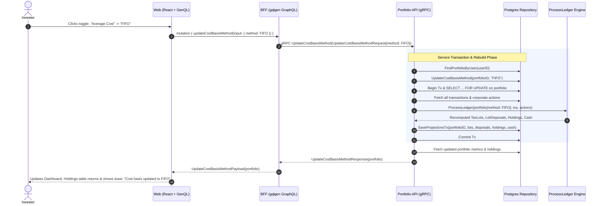

# Dynamic Cost Basis Method Switching (AVERAGE_COST ↔ FIFO) Implementation Plan

> **Target**: Dynamic Cost Basis Method Toggle, Ledger Replay, and Instant Valuation Recalculation  
> **Scope**: `proto/`, `services/portfolio-api`, `bff/`, and `web/`  
> **Key Principle**: Cost basis methods (`AVERAGE_COST` and `FIFO`) govern how lots are relieved and capital gains are computed. Since `ProcessLedger` already contains deterministic math for both methods, switching the portfolio's method triggers an atomic ledger projection rebuild (`RebuildProjections`), updating open tax lots, disposals, holding cost bases, and total returns in real time.

---

## 1. Executive Summary & Value Proposition

### Why Dynamic Cost Basis Switching Matters
- **Tax Optimization & Planning**: Investors in different tax jurisdictions or strategies benefit from comparing **FIFO** (selling oldest shares first, often securing long-term capital gains rates) versus **Average Cost** (smoothing purchase prices across multiple buy orders, common for ETFs and dollar-cost averaging).
- **Zero Schema Migrations Required**: The database schema already supports `portfolio.cost_basis_method` enum (`'AVERAGE_COST'`, `'FIFO'`) in `portfolio.portfolios`.
- **Pure Deterministic Ledger Projection**: Because the raw transactions in `portfolio.transactions` remain pristine and immutable, switching the calculation method is completely non-destructive: replaying the ledger with the new parameter recomputes tax lots, lot disposals, holding cost bases, and return percentages from scratch.

---

## 2. Architectural Overview & Data Flow



---

## 3. Mathematical Impact Example: FIFO vs Average Cost

Consider an investor who executes:
1. **BUY 10 AAPL @ $100** ($1,000 cost basis)
2. **BUY 10 AAPL @ $200** ($2,000 cost basis)
   - *Total held*: 20 AAPL, Total invested: $3,000
   - *Average cost per share*: $150
3. **SELL 10 AAPL @ $250** ($2,500 proceeds)

| Metric | Under `AVERAGE_COST` | Under `FIFO` |
|---|---|---|
| **Relieved Shares Cost** | 10 shares @ $150 = **$1,500** | 10 shares from Lot 1 @ $100 = **$1,000** |
| **Realized PnL** | $2,500 - $1,500 = **+$1,000** | $2,500 - $1,000 = **+$1,500** |
| **Remaining Lot(s)** | 10 shares @ $150 average | 10 shares from Lot 2 @ $200 |
| **Remaining Holding Cost Basis** | **$1,500** | **$2,000** |
| **Unrealized Gain (@ $250 market price)** | $2,500 - $1,500 = **+$1,000** | $2,500 - $2,000 = **+$500** |
| **Total Return (Realized + Unrealized)** | **+$2,000** | **+$2,000** |

Switching the toggle in GraphFolio instantly recalculates these values across all holdings and tax lots.

---

## 4. Layer-by-Layer Technical Specifications

### 4.1 Protocol Buffers (`proto/portfolio/v1/portfolio.proto`)

Extend the service contract:

```protobuf
enum CostBasisMethod {
  COST_BASIS_METHOD_UNSPECIFIED = 0;
  COST_BASIS_METHOD_AVERAGE_COST = 1;
  COST_BASIS_METHOD_FIFO = 2;
}

message UpdateCostBasisMethodRequest {
  string          user_id = 1;
  CostBasisMethod method  = 2;
}

message UpdateCostBasisMethodResponse {
  Portfolio portfolio = 1;
}

message Portfolio {
  common.v1.Money   total_value               = 1;
  common.v1.Money   today_return_amount       = 2;
  common.v1.Decimal today_return_percent      = 3;
  common.v1.Decimal annualized_return_percent = 4;
  common.v1.Money   cash_balance              = 5;
  repeated Investment investments             = 6;
  CostBasisMethod   cost_basis_method         = 7; // Exposed on portfolio
}

service PortfolioService {
  rpc GetPortfolio(GetPortfolioRequest) returns (GetPortfolioResponse) {}
  rpc AddTransaction(AddTransactionRequest) returns (AddTransactionResponse) {}
  rpc ListInstruments(ListInstrumentsRequest) returns (ListInstrumentsResponse) {}
  rpc UpdateCostBasisMethod(UpdateCostBasisMethodRequest) returns (UpdateCostBasisMethodResponse) {}
}
```

---

### 4.2 Microservice Layer (`services/portfolio-api`)

#### 1. Repository Interface & PostgreSQL Implementation
- **File**: `internal/repository/repository.go` & `internal/repository/postgres.go`
- **Method**:
  ```go
  UpdateCostBasisMethod(ctx context.Context, portfolioID uuid.UUID, method domain.CostBasisMethod) error
  ```
- **SQL**:
  ```sql
  UPDATE portfolio.portfolios
  SET cost_basis_method = $1, updated_at = now()
  WHERE id = $2;
  ```

#### 2. Service Layer (`internal/service/service.go`)
- **Method**:
  ```go
  UpdateCostBasisMethod(ctx context.Context, userID string, method domain.CostBasisMethod) (*domain.PortfolioSummary, error)
  ```
- **Execution Steps**:
  1. Retrieve portfolio via `repo.FindPortfolioByUser(ctx, parsedUserID)`.
  2. If `portfolio.CostBasisMethod == method`, return existing `GetPortfolioSummary(ctx, userID)` (no-op).
  3. Validate `method` is either `domain.CostBasisMethodAverageCost` or `domain.CostBasisMethodFIFO`.
  4. Call `repo.UpdateCostBasisMethod(ctx, portfolio.ID, method)`.
  5. Call `s.RebuildProjections(ctx, userID)` — this automatically:
     - Locks the portfolio row with `SELECT ... FOR UPDATE`.
     - Loads fresh portfolio entity (with new method), all transactions in chronological order, and corporate actions.
     - Runs `ProcessLedger`, executing either FIFO lot popping or Average Cost proportional relief.
     - Commits updated tax lots, disposals, holdings, and cash balances via `SaveProjectionsTx`.
  6. Return `s.GetPortfolioSummary(ctx, userID)`.

#### 3. gRPC Server (`internal/server.go`)
- Implement `UpdateCostBasisMethod(ctx context.Context, req *pb.UpdateCostBasisMethodRequest) (*pb.UpdateCostBasisMethodResponse, error)`.
- Convert protobuf enum `pb.CostBasisMethod` to `domain.CostBasisMethod`.
- Map `domain.PortfolioSummary` to `pb.Portfolio` including `CostBasisMethod`.

---

### 4.3 Backend-for-Frontend Layer (`bff/`)

#### 1. GraphQL Schema (`bff/graph/schema.graphqls`)
```graphql
enum CostBasisMethod {
  AVERAGE_COST
  FIFO
}

extend type Portfolio {
  costBasisMethod: CostBasisMethod!
}

input UpdateCostBasisMethodInput {
  method: CostBasisMethod!
}

type UpdateCostBasisMethodPayload {
  portfolio: Portfolio!
}

extend type Mutation {
  updateCostBasisMethod(input: UpdateCostBasisMethodInput!): UpdateCostBasisMethodPayload!
}
```

#### 2. Domain & Resolver Mapping (`bff/graph/helpers.go` & `schema.resolvers.go`)
- Helper functions to convert between proto `pb.CostBasisMethod` and GraphQL `model.CostBasisMethod`.
- Mutation resolver `UpdateCostBasisMethod` calls gRPC `PortfolioClient.UpdateCostBasisMethod`.

---

### 4.4 Web UI Layer (`web/`)

#### 1. GenQL Client Generation
- Run `make generate` to regenerate TypeScript types and client queries for `costBasisMethod` and `updateCostBasisMethod`.

#### 2. UI Component: `CostBasisSwitcher` (`web/src/components/CostBasisSwitcher.tsx` & `.css`)
- **Placement**: Located in the Dashboard header or top of the Investments table.
- **Controls**:
  - Segmented control / toggle buttons:
    ```
    [ • Average Cost ] [ FIFO ]
    ```
  - Help / info icon with tooltip:
    - **Average Cost**: Spreads cost basis evenly across all shares purchased. Recommended for long-term index and mutual fund investing.
    - **FIFO**: Assumes the oldest shares are sold first. Useful for tax-loss harvesting or long-term capital gains qualification.
- **Interaction & State**:
  - Clicking the alternate option enters an active transition state (`isUpdating = true`).
  - Calls `client.mutation({ updateCostBasisMethod: { ... } })`.
  - Replaces parent `portfolio` state immediately upon response.
  - Triggers a subtle notification toast: `"Cost basis method updated to FIFO. Holdings & tax lots recalculated."`

---

## 5. Work Breakdown & Implementation Phases

| Phase | Tasks | Key Deliverables & Commands |
|---|---|---|
| **Phase 1: Proto Contracts** | 1. Update `proto/portfolio/v1/portfolio.proto`<br>2. Add `CostBasisMethod` enum, RPC, and field<br>3. Compile protobufs | `make proto`<br>`proto/portfolio/v1/portfolio.pb.go` generated |
| **Phase 2: Microservice & Repository** | 1. Add `UpdateCostBasisMethod` to repository<br>2. Add service method with `RebuildProjections`<br>3. Implement gRPC handler in `server.go`<br>4. Generate mocks (`go generate ./...`)<br>5. Write unit tests in `service_test.go` and `server_test.go` | `go test -v -race ./services/portfolio-api/...` passing |
| **Phase 3: BFF GraphQL** | 1. Update `bff/graph/schema.graphqls`<br>2. Run `gqlgen generate`<br>3. Update `helpers.go` mapping<br>4. Implement resolver in `schema.resolvers.go`<br>5. Add resolver unit test | `go test -v -race ./bff/...` passing |
| **Phase 4: Web UI Integration** | 1. Regenerate GenQL: `npx genql ...`<br>2. Create `CostBasisSwitcher.tsx` & `CostBasisSwitcher.css`<br>3. Integrate into `Dashboard.tsx`<br>4. Wire dynamic state update & toast alert | Interactive switcher in browser; changing method updates holdings in real time |
| **Phase 5: Verification & End-to-End Testing** | 1. Run `make generate`<br>2. Check `gofmt`<br>3. Run `go vet ./...`<br>4. Run `make test`<br>5. `npm run build` | Full workspace tests clean with zero race conditions |

---

## 6. Verification & Testing Strategy

1. **Service Unit Tests (`services/portfolio-api/internal/service/service_test.go`)**:
   - `TestUpdateCostBasisMethod_Success`: Verify changing method updates repository, triggers `RebuildProjections`, and returns recalculated summary.
   - `TestUpdateCostBasisMethod_NoOp`: Verify if the requested method equals the current method, no database write or rebuild is performed.
   - `TestUpdateCostBasisMethod_CalculationDivergence`: Seed multi-lot buy/sell history; assert that `FIFO` yields higher/lower realized PnL and holding cost basis than `AVERAGE_COST`.
2. **Server Unit Tests (`services/portfolio-api/internal/server_test.go`)**:
   - Verify gRPC request validation and status codes (`InvalidArgument` on unknown enum).
3. **BFF Unit Tests (`bff/graph/schema.resolvers_test.go`)**:
   - Verify GraphQL mutation correctly passes the enum to gRPC and converts the returned portfolio.
4. **End-to-End Verification**:
   - Start the stack with `make run`.
   - In UI, add transactions for multiple buys at different prices, followed by a partial sell.
   - Observe the holding's "Total Return" amount.
   - Click the "FIFO" toggle -> Observe the holding's "Total Return" update instantly.
   - Click back to "Average Cost" -> Observe the holding's numbers restore to average cost values.
