# Currency Pair Historical Prices Implementation Plan (Admin Portal)

> **Target**: End-to-end implementation for inspecting, visualizing, and managing historical exchange rates for currency pairs in the internal Admin Portal (`admin-app`).  
> **Scope**: `proto/portfolio/v1/portfolio.proto`, `services/portfolio-api`, `bff/`, and `web/apps/admin-app`.  
> **Key Principle**: Provide high-precision (10-decimal fixed-point) foreign exchange time-series access, interactive SVG trend visualization, reciprocal rate calculations, and administrative ledger controls while strictly enforcing GraphFolio's **zero floating-point policy**.

---

## 1. Architectural Overview & Data Flow

The internal Admin Portal (`admin-app` running on `:5174`) allows administrators and financial operations teams to inspect historical exchange rates, track FX benchmarks (ECB daily fixing rates, Twelve Data feeds), analyze foreign exchange rate movements over multiple time horizons, and manually override fixing marks if discrepancies arise.

```mermaid
sequenceDiagram
    autonumber
    actor Admin as Operations Admin
    participant AdminApp as Admin App (:5174 React)
    participant BFF as BFF (:8080 GraphQL)
    participant Svc as Portfolio API (:50051 gRPC)
    participant Repo as PostgreSQL Repo (portfolio.fx_rates)

    %% Flow 1: Discover Active Currency Pairs
    rect rgb(24, 32, 47)
    note right of Admin: 1. Pair Discovery & Metadata
    Admin->>AdminApp: Navigates to "Currency Pairs (FX)" Tab
    AdminApp->>BFF: query currencyPairs
    BFF->>Svc: gRPC ListCurrencyPairs()
    Svc->>Repo: Query distinct (base, quote), latest rate, record counts
    Repo-->>Svc: Currency pair list with latest marks
    Svc-->>BFF: ListCurrencyPairsResponse
    BFF-->>AdminApp: CurrencyPair[]
    AdminApp-->>Admin: Renders pair selector chips & summary statistics
    end

    %% Flow 2: Historical Time-Series & Visual Chart
    rect rgb(32, 24, 47)
    note right of Admin: 2. Historical Prices & Trend Curve
    Admin->>AdminApp: Selects Pair (e.g. "EUR/USD") & Timeframe ("1M")
    AdminApp->>BFF: query currencyPairHistory(pair: "EUR/USD", timeframe: TIMEFRAME_1M)
    BFF->>Svc: gRPC GetCurrencyPairHistory(GetCurrencyPairHistoryRequest)
    Svc->>Repo: SELECT rate_date, rate, source FROM portfolio.fx_rates ...
    Repo-->>Svc: Chronological daily rate points
    Svc->>Svc: Calculate delta, % change, period high/low, reciprocal rates
    Svc-->>BFF: GetCurrencyPairHistoryResponse
    BFF-->>AdminApp: CurrencyPairHistory payload
    AdminApp-->>Admin: Renders interactive SVG trend line, crosshairs & KPI metrics
    end

    %% Flow 3: Detailed Ledger & Reciprocal Inversion
    rect rgb(24, 47, 32)
    note right of Admin: 3. Authoritative Rate Ledger & Reciprocal Calculation
    Admin->>AdminApp: Toggles "Invert Pair (USD/EUR)" or adjusts Date Range
    AdminApp->>BFF: query fxRates(baseCurrency: "EUR", quoteCurrency: "USD", fromDate, toDate, limit, offset)
    BFF->>Svc: gRPC ListFXRates(ListFXRatesRequest)
    Svc->>Repo: Paginated query with COUNT(*) OVER()
    Repo-->>Svc: Rows + totalCount
    Svc-->>BFF: ListFXRatesResponse
    BFF-->>AdminApp: FXRatesConnection
    AdminApp-->>Admin: Updates glassmorphic table with exact & reciprocal rates
    end
```



---

## 2. Layer-by-Layer Technical Specifications

### 2.1 Database & Persistence Layer (`portfolio.fx_rates`)

The database table `portfolio.fx_rates` is defined in migration `000004_market_data.up.sql`:

```sql
CREATE TABLE portfolio.fx_rates (
    base_currency   char(3)        NOT NULL REFERENCES portfolio.currencies(code),
    quote_currency  char(3)        NOT NULL REFERENCES portfolio.currencies(code),
    rate_date       date           NOT NULL,
    rate            numeric(20,10) NOT NULL CHECK (rate > 0),
    source          text           NOT NULL DEFAULT 'manual',
    PRIMARY KEY (base_currency, quote_currency, rate_date),
    CHECK (base_currency <> quote_currency)
);
```

#### New Repository Queries (`services/portfolio-api/internal/repository/`)

1. **`ListCurrencyPairs`**:
   Aggregates all unique currency pairs in `portfolio.fx_rates`, their latest fixing rate, latest fixing date, previous day's rate (for 1-day change), and total historical observations:
   ```sql
   WITH ranked_rates AS (
       SELECT 
           base_currency,
           quote_currency,
           rate_date,
           rate,
           source,
           ROW_NUMBER() OVER (
               PARTITION BY base_currency, quote_currency 
               ORDER BY rate_date DESC
           ) as rn
       FROM portfolio.fx_rates
   ),
   pair_stats AS (
       SELECT 
           base_currency,
           quote_currency,
           COUNT(*) as total_records,
           MIN(rate_date) as first_date,
           MAX(rate_date) as last_date
       FROM portfolio.fx_rates
       GROUP BY base_currency, quote_currency
   )
   SELECT 
       r1.base_currency,
       r1.quote_currency,
       r1.rate as latest_rate,
       r1.rate_date as latest_date,
       r1.source as latest_source,
       r2.rate as previous_rate,
       ps.total_records,
       ps.first_date,
       ps.last_date
   FROM ranked_rates r1
   LEFT JOIN ranked_rates r2 
       ON r1.base_currency = r2.base_currency 
      AND r1.quote_currency = r2.quote_currency 
      AND r2.rn = 2
   JOIN pair_stats ps 
       ON r1.base_currency = ps.base_currency 
      AND r1.quote_currency = ps.quote_currency
   WHERE r1.rn = 1
   ORDER BY r1.base_currency ASC, r1.quote_currency ASC;
   ```

2. **`ListFXRates` (Paginated & Filtered)**:
   Returns paginated rows matching base/quote filters with single-pass `COUNT(*) OVER()`:
   ```sql
   SELECT 
       base_currency,
       quote_currency,
       rate_date,
       rate,
       source,
       COUNT(*) OVER() AS total_count
   FROM portfolio.fx_rates
   WHERE ($1::char(3) IS NULL OR base_currency = $1)
     AND ($2::char(3) IS NULL OR quote_currency = $2)
     AND ($3::date IS NULL OR rate_date >= $3)
     AND ($4::date IS NULL OR rate_date <= $4)
   ORDER BY rate_date DESC
   LIMIT $5 OFFSET $6;
   ```

3. **`GetHistoricalFXRates` (Chronological for Charting)**:
   Returns continuous time-series points sorted chronologically:
   ```sql
   SELECT 
       base_currency,
       quote_currency,
       rate_date,
       rate,
       source
   FROM portfolio.fx_rates
   WHERE base_currency = $1 
     AND quote_currency = $2
     AND ($3::date IS NULL OR rate_date >= $3)
     AND ($4::date IS NULL OR rate_date <= $4)
   ORDER BY rate_date ASC;
   ```

4. **`UpsertFXRate` (Manual Override Support)**:
   Permits operations administrators to record or correct a specific date's rate:
   ```sql
   INSERT INTO portfolio.fx_rates (base_currency, quote_currency, rate_date, rate, source)
   VALUES ($1, $2, $3, $4, $5)
   ON CONFLICT (base_currency, quote_currency, rate_date)
   DO UPDATE SET rate = EXCLUDED.rate, source = EXCLUDED.source
   RETURNING base_currency, quote_currency, rate_date, rate, source;
   ```

---

### 2.2 Domain Models (`services/portfolio-api/internal/domain/`)

Add domain models in a new file `internal/domain/fx.go`:

```go
package domain

import (
	"time"

	"github.com/shopspring/decimal"
)

// FXRate represents a single historical foreign exchange mark.
type FXRate struct {
	BaseCurrency  string
	QuoteCurrency string
	RateDate      time.Time
	Rate          decimal.Decimal
	Source        string
}

// FXRateFilter provides filtering criteria for paginated FX queries.
type FXRateFilter struct {
	BaseCurrency  *string
	QuoteCurrency *string
	FromDate      *time.Time
	ToDate        *time.Time
	Limit         int
	Offset        int
}

// CurrencyPairSummary provides aggregate operational telemetry on a currency pair.
type CurrencyPairSummary struct {
	BaseCurrency   string
	QuoteCurrency  string
	LatestRate     decimal.Decimal
	LatestDate     time.Time
	LatestSource   string
	PreviousRate   *decimal.Decimal
	Change1DAmount *decimal.Decimal
	Change1DPct    *decimal.Decimal
	TotalRecords   int
	FirstDate      time.Time
	LastDate       time.Time
}

// CurrencyPairHistory aggregates chronological points and key range statistics.
type CurrencyPairHistory struct {
	BaseCurrency   string
	QuoteCurrency  string
	Points         []FXRatePoint
	StartRate      decimal.Decimal
	EndRate        decimal.Decimal
	PeriodChange   decimal.Decimal
	PeriodChangePct decimal.Decimal
	PeriodHigh     decimal.Decimal
	PeriodLow      decimal.Decimal
}

// FXRatePoint is a single point for charting and trend evaluation.
type FXRatePoint struct {
	Date          time.Time
	Rate          decimal.Decimal
	InvertedRate  decimal.Decimal // 1 / Rate (10 decimal precision)
	Source        string
}
```

---

### 2.3 Protocol Buffers (`proto/portfolio/v1/portfolio.proto`)

Extend the `PortfolioService` with currency pair RPCs and types:

```protobuf
// ------------------------------------------------------------------
// Admin: Foreign Exchange (FX) & Currency Pair Management
// ------------------------------------------------------------------

service PortfolioService {
  // ... existing RPCs ...

  // Admin: FX Rates & Currency Pair Inspection
  rpc ListCurrencyPairs(ListCurrencyPairsRequest) returns (ListCurrencyPairsResponse) {}
  rpc ListFXRates(ListFXRatesRequest) returns (ListFXRatesResponse) {}
  rpc GetCurrencyPairHistory(GetCurrencyPairHistoryRequest) returns (GetCurrencyPairHistoryResponse) {}
  rpc RecordFXRateOverride(RecordFXRateOverrideRequest) returns (RecordFXRateOverrideResponse) {}
}

message CurrencyPairItem {
  string            base_currency    = 1;
  string            quote_currency   = 2;
  common.v1.Decimal latest_rate      = 3;
  string            latest_date      = 4; // YYYY-MM-DD
  string            latest_source    = 5;
  common.v1.Decimal previous_rate    = 6; // nullable
  common.v1.Decimal change_1d_amount = 7; // nullable
  common.v1.Decimal change_1d_pct    = 8; // nullable
  int32             total_records    = 9;
  string            first_date       = 10;
  string            last_date        = 11;
}

message ListCurrencyPairsRequest {}

message ListCurrencyPairsResponse {
  repeated CurrencyPairItem pairs = 1;
}

message FXRateItem {
  string            base_currency  = 1;
  string            quote_currency = 2;
  string            rate_date      = 3; // YYYY-MM-DD
  common.v1.Decimal rate           = 4;
  common.v1.Decimal inverted_rate  = 5; // 1 / rate (exact 10 decimals)
  string            source         = 6;
}

message ListFXRatesRequest {
  optional string base_currency  = 1;
  optional string quote_currency = 2;
  optional string from_date      = 3; // YYYY-MM-DD
  optional string to_date        = 4; // YYYY-MM-DD
  int32           limit          = 5; // Default 50, max 200
  int32           offset         = 6;
}

message ListFXRatesResponse {
  repeated FXRateItem rates       = 1;
  int32               total_count = 2;
}

message FXHistoryPoint {
  string            date          = 1; // YYYY-MM-DD
  common.v1.Decimal rate          = 2;
  common.v1.Decimal inverted_rate = 3;
  string            source        = 4;
}

message GetCurrencyPairHistoryRequest {
  string           base_currency  = 1;
  string           quote_currency = 2;
  HistoryTimeframe timeframe      = 3; // 1D, 1W, 1M, 1Y, ALL
}

message GetCurrencyPairHistoryResponse {
  string                  base_currency     = 1;
  string                  quote_currency    = 2;
  repeated FXHistoryPoint points            = 3;
  common.v1.Decimal       start_rate        = 4;
  common.v1.Decimal       end_rate          = 5;
  common.v1.Decimal       period_change     = 6;
  common.v1.Decimal       period_change_pct = 7;
  common.v1.Decimal       period_high       = 8;
  common.v1.Decimal       period_low        = 9;
}

message RecordFXRateOverrideRequest {
  string            base_currency        = 1;
  string            quote_currency       = 2;
  string            rate_date            = 3; // YYYY-MM-DD
  common.v1.Decimal rate                 = 4; // Greater than zero
  optional string   reason               = 5; // Audit note
  bool              recompute_valuations = 6;
}

message RecordFXRateOverrideResponse {
  FXRateItem rate                  = 1;
  bool       valuations_recomputed = 2;
}
```

---

### 2.4 Service Layer (`services/portfolio-api/internal/service/`)

Add implementation in `services/portfolio-api/internal/service/fx.go`:

1. **Validation Rules**:
   - Currency codes must be 3 uppercase alphabetical ASCII characters (`len(base) == 3 && len(quote) == 3`).
   - Base currency and quote currency must not be equal (`base != quote`).
   - Rate must be positive (`rate.IsPositive()`).
   - Fixing date must not be in the future (compared to `todayUTC`).
   - `from_date` must not be after `to_date`.
2. **Exact Fixed-Point Arithmetic & Reciprocals**:
   - Inverted rate calculated via `decimal.NewFromInt(1).DivRound(rate, 10)`.
   - Period return percentage calculated via `end_rate.Sub(start_rate).DivRound(start_rate, 6).Mul(decimal.NewFromInt(100))`.
   - Day-over-day change calculated via `latest_rate.Sub(*previous_rate)`.
3. **Mocking & Unit Tests**:
   - Update `MockRepository` to include `ListCurrencyPairs`, `ListFXRates`, `GetHistoricalFXRates`, and `UpsertFXRate`.
   - Table-driven unit tests in `services/portfolio-api/internal/service/fx_test.go` verifying valid ranges, reciprocal precision, validation errors, and empty time-series fallbacks.

---

### 2.5 BFF & GraphQL Gateway (`bff/`)

#### 1. Schema Additions (`bff/graph/schema.graphqls`)

```graphql
type CurrencyPair {
  baseCurrency: String!
  quoteCurrency: String!
  pair: String! # e.g. "EUR/USD"
  latestRate: Decimal!
  latestDate: String!
  latestSource: String!
  previousRate: Decimal
  change1dAmount: Decimal
  change1dPct: Decimal
  totalRecords: Int!
  firstDate: String!
  lastDate: String!
}

type FXRate {
  baseCurrency: String!
  quoteCurrency: String!
  pair: String!
  rateDate: String!
  rate: Decimal!
  invertedRate: Decimal!
  source: String!
}

type FXRatesConnection {
  items: [FXRate!]!
  totalCount: Int!
}

type FXHistoryPoint {
  date: String!
  rate: Decimal!
  invertedRate: Decimal!
  source: String!
}

type CurrencyPairHistory {
  baseCurrency: String!
  quoteCurrency: String!
  pair: String!
  points: [FXHistoryPoint!]!
  startRate: Decimal!
  endRate: Decimal!
  periodChange: Decimal!
  periodChangePct: Decimal!
  periodHigh: Decimal!
  periodLow: Decimal!
}

input RecordFXRateOverrideInput {
  baseCurrency: String!
  quoteCurrency: String!
  rateDate: String! # YYYY-MM-DD
  rate: Decimal!
  reason: String
  recomputeValuations: Boolean
}

type RecordFXRateOverridePayload {
  rate: FXRate!
  valuationsRecomputed: Boolean!
}

extend type Query {
  # FX & Currency Pair Queries
  currencyPairs: [CurrencyPair!]!
  currencyPairHistory(
    baseCurrency: String!
    quoteCurrency: String!
    timeframe: HistoryTimeframe!
  ): CurrencyPairHistory!
  fxRates(
    baseCurrency: String
    quoteCurrency: String
    fromDate: String
    toDate: String
    limit: Int = 50
    offset: Int = 0
  ): FXRatesConnection!
}

extend type Mutation {
  recordFXRateOverride(input: RecordFXRateOverrideInput!): RecordFXRateOverridePayload!
}
```

#### 2. Resolvers & Mapping Helpers (`bff/graph/`)
- In `bff/graph/helpers.go`: Map proto types (`CurrencyPairItem`, `FXRateItem`, `GetCurrencyPairHistoryResponse`) to GraphQL models with stringified decimal representations.
- In `bff/graph/schema.resolvers.go`: Implement `CurrencyPairs`, `CurrencyPairHistory`, `FxRates`, and `RecordFXRateOverride`.

---

### 2.6 Frontend Admin App (`web/apps/admin-app/`)

#### 1. Navigation & Tab Integration (`src/components/AdminLayout.tsx`)
Add a dedicated tab for Currency Pairs with currency exchange branding:
```tsx
export type AdminTab = 'assets' | 'prices' | 'fx' | 'ingestion';

// Sidebar button:
<button
  type="button"
  className={`admin-nav-item ${currentTab === 'fx' ? 'admin-nav-item--active' : ''}`}
  onClick={() => onTabChange('fx')}
>
  <span>💱</span>
  <span>Currency Pairs (FX)</span>
</button>
```

Topbar title:
```tsx
{currentTab === 'fx' && 'Foreign Exchange (FX) & Currency Pair History'}
```

#### 2. FX Management Component (`src/components/FXManagement.tsx`)
Create a dedicated component with the following capabilities:

1. **Pair Selector & Inversion Toggle**:
   - Quick selector pills for tracked currency pairs (`EUR/USD`, `USD/EUR`, `USD/GBP`, `USD/AUD`, `USD/JPY`, `EUR/GBP`, `USD/CAD`).
   - "Invert Pair (Base ⇄ Quote)" button to switch between direct quote (e.g. `EUR/USD = 1.0850`) and indirect quote (e.g. `USD/EUR = 0.9216`) seamlessly.
   - Pair filter search or dropdown for less frequent currency pairs.

2. **KPI Summary Metric Cards**:
   - **Current Spot Rate**: Large primary value (e.g. `1.085200`) with 6 decimal precision.
   - **1-Day Change**: Absolute delta and percentage badge (e.g. `+0.001800 (+0.17%)` in green or red).
   - **Period High / Low**: Range badges showing highest and lowest rate for the active timeframe.
   - **Primary Data Provider**: Source badge (`ECB Reference Fixing` or `Twelve Data`).
   - **Total Historical Observations**: Count of stored dates (e.g. `365 daily fixings`).

3. **Interactive SVG Historical Trend Chart**:
   - Range selectors: `1W`, `1M`, `3M`, `1Y`, `ALL`.
   - Smooth cubic Bezier SVG path with glowing cyan/green gradient area fill.
   - Dynamic crosshairs on hover showing the exact rate, inverted rate, date, and data source.
   - Reference baseline dashed line showing period average.

4. **Authoritative Rates Ledger (Table)**:
   - Filter bar: Date range picker (`From Date`, `To Date`).
   - Columns:
     - `Date` (formatted via `formatDate`)
     - `Pair` (e.g. `EUR / USD`)
     - `Exchange Rate` (formatted to 6 decimals, e.g. `1.085200`)
     - `Reciprocal Rate (1/X)` (e.g. `0.921489`)
     - `Benchmark Source` (e.g. `ECB`, `TWELVE_DATA`, `MANUAL`)
     - `Actions` ("Override Rate" button)
   - Pagination: Previous/Next buttons, page indicator.

5. **Action Bar & Modals**:
   - "Sync FX Rates" button calling `triggerMarketSync(syncFx: true)`.
   - "Record FX Override" modal (`FXOverrideModal.tsx`) allowing operators to fix or backfill a rate for a holiday or data vendor outage with required audit note.

---

## 3. Precision & Formatting Standards

1. **Zero IEEE-754 Floats**:
   - Rates in Go code are typed as `github.com/shopspring/decimal.Decimal`.
   - In proto, rates use `common.v1.Decimal` (value string + scale).
   - In GraphQL, rates use the `Decimal` scalar.
2. **FX Rate Display Precision**:
   - Standard currencies (EUR/USD, GBP/USD, AUD/USD): Displayed to **4 or 6 decimal places** (`0.000001` precision).
   - Inverted rates: Computed with **10 decimal places** before display rounding.
   - Percentage changes: Formatted to **2 or 3 decimal places** (e.g. `+0.125%`).

---

## 4. Implementation Phases & Step-by-Step Task Breakdown

| Phase | Description | Components / Files | Key Deliverables & Validation |
| :--- | :--- | :--- | :--- |
| **Phase 1: Contract & Proto Updates** | Define gRPC messages and service RPCs for currency pairs and FX history | `proto/portfolio/v1/portfolio.proto` | Run `make proto`. Generates Go proto code without compiler warnings. |
| **Phase 2: Database & Repository** | Implement repository queries for pair listing, history time-series, and filtered pagination | `services/portfolio-api/internal/repository/queries.go`<br>`services/portfolio-api/internal/repository/postgres.go` | SQL queries pass integration tests; returns correct aggregates and rates. |
| **Phase 3: Domain & Service Logic** | Implement `internal/domain/fx.go` and `internal/service/fx.go` with validation, math, and mock tests | `services/portfolio-api/internal/domain/fx.go`<br>`services/portfolio-api/internal/service/fx.go`<br>`services/portfolio-api/internal/service/fx_test.go` | Unit tests verify validation, 10-decimal reciprocal math, and date cutoffs. |
| **Phase 4: gRPC Server Handlers** | Expose gRPC RPC handlers in portfolio service | `services/portfolio-api/internal/server.go`<br>`services/portfolio-api/internal/server_test.go` | gRPC server tests pass with `MockPortfolioService`. |
| **Phase 5: BFF GraphQL Gateway** | Update GraphQL schema, run code generation, implement resolvers and helpers | `bff/graph/schema.graphqls`<br>`bff/graph/schema.resolvers.go`<br>`bff/graph/helpers.go` | Run `make generate`. GraphQL query tests return expected types. |
| **Phase 6: Frontend UI Components** | Build `FXManagement`, `FXTrendChart`, `FXOverrideModal`, and integrate into `AdminLayout` | `web/apps/admin-app/src/components/FXManagement.tsx`<br>`web/apps/admin-app/src/components/FXTrendChart.tsx`<br>`web/apps/admin-app/src/components/FXOverrideModal.tsx`<br>`web/apps/admin-app/src/components/AdminLayout.tsx` | Run `npm run build` in web workspace. UI renders smoothly on port 5174. |
| **Phase 7: End-to-End Verification** | Execute unit tests with race detection, static analysis, and verify live UI interactions | `Makefile` | `make test` passes; live admin portal on `:5174` displays interactive chart and ledger. |

---

## 5. Verification & Testing Procedures

### 5.1 Automated Backend & Unit Testing
```bash
# 1. Regenerate Protocol Buffers, GraphQL models, genql client, and Go mocks
make generate

# 2. Check code formatting
test -z "$(gofmt -s -l services/ pkg/ bff/)" || (echo "Unformatted files found:" && gofmt -s -l services/ pkg/ bff/ && exit 1)

# 3. Static analysis
go vet ./services/portfolio-api/... ./pkg/... ./bff/...

# 4. Run test suites with race detection
make test
```

### 5.2 Unit Test Matrix
- **`TestPortfolioService_ListCurrencyPairs`**: Verifies retrieval of aggregated pairs, null-safe 1-day change calculation, and sorting.
- **`TestPortfolioService_GetCurrencyPairHistory`**: Verifies period boundary filters (`1W`, `1M`, `1Y`, `ALL`), exact 10-decimal inverted rate calculation, and period high/low derivation.
- **`TestPortfolioService_ListFXRates`**: Verifies uppercase currency code normalization, date range filtering, and pagination offsets.
- **`TestPortfolioService_RecordFXRateOverride`**: Verifies non-positive rate rejection, future date prevention, and audit note recording.

### 5.3 Frontend Validation Steps (Admin Portal :5174)
1. **Currency Pair Discovery**: Navigate to `Currency Pairs (FX)` in the sidebar. Verify tracked currency pairs (`EUR/USD`, `USD/EUR`, `USD/GBP`, `USD/AUD`) load in selector pills.
2. **Chart Interaction**: Select `EUR/USD`. Verify SVG curve plots rates across `1W`, `1M`, `1Y`, and `ALL`. Verify hover crosshair displays exact date, rate, and reciprocal rate.
3. **Inversion Toggle**: Click "Invert (USD/EUR)". Verify chart and stats invert reciprocal rates correctly (`1 / rate`).
4. **Ledger & Filters**: Filter by date range `2025-01-01` to `2025-12-31`. Verify pagination works smoothly and total counts match.
5. **Sync Trigger**: Click "Sync FX Rates". Verify toast notification confirms completion and table refreshes.
