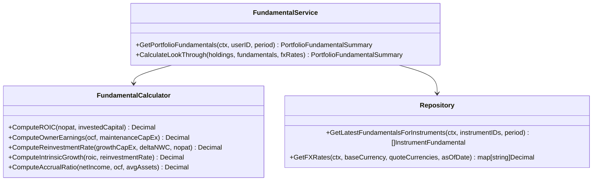
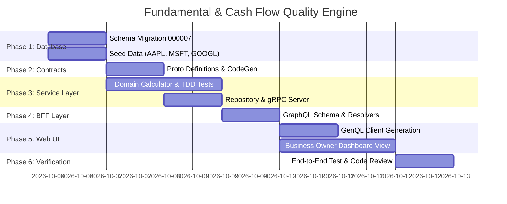

# Look-Through Fundamental & Cash Flow Quality Engine Implementation Plan

> **Target**: Look-Through Fundamental & Cash Flow Quality Engine  
> **Reference**: [competitive-analysis.md](file:///Users/oscargarcia/workspace/graphfolio/docs/competitive-analysis.md#section-5-next-step-strategic-roadmap) (Recommendation 1)  
> **Scope**: `proto/`, `services/portfolio-api`, `bff/`, and `web/`  
> **Key Principle**: Treat investments as proportional ownership interests in real businesses rather than fluctuating ticker blips. Calculate exact, look-through economic shares of Operating Cash Flow (OCF), Owner Earnings, Free Cash Flow (FCF), Return on Invested Capital (ROIC), and Reinvestment Rates using strict fixed-point arithmetic (`shopspring/decimal`).

---

## 1. Executive Summary & Value Proposition

### 1.1 The Fundamental Gap in Modern Portfolio Trackers
Existing portfolio management software (Sharesight, Morningstar, Simply Wall St, Koyfin) operates almost exclusively on **market-price quotation metrics**:
- Daily price changes, trailing market yield, and simple capital gains.
- First-order, unadjusted accounting multiples ($P/E$, $P/B$, dividend yield) distorted by non-cash accruals, capital structure variations, and one-off accounting write-downs.
- Generic scorecards or superficial "snowflakes" that fail to reveal true corporate capital-allocation efficiency.

For concentrated, value-oriented investors adhering to the principles of Benjamin Graham, Warren Buffett, Charlie Munger, and Nick Sleep:
> *"When you own a stock, you own a fractional share of a business. If the business earns high returns on capital and reinvests effectively, your intrinsic economic value will compound, regardless of short-term market quotations."*

### 1.2 The GraphFolio Solution
The **Look-Through Fundamental & Cash Flow Quality Engine** calculates an investor's exact pro-rata share of fundamental business performance across their entire portfolio:
1. **Look-Through Owner Earnings**: Proportional share of corporate cash generated from operations minus necessary maintenance capital expenditures:
   $$\text{Owner Earnings} = \text{Operating Cash Flow} - \text{Maintenance CapEx}$$
2. **Economic Return on Invested Capital (ROIC)**: Exact measure of how efficiently management deploys capital into core operations:
   $$\text{ROIC} = \frac{\text{NOPAT}}{\text{Invested Capital}}$$
3. **Reinvestment Rate & Intrinsic Compounding Rate**:
   $$\text{Intrinsic Growth Rate} (g) = \text{ROIC} \times \text{Reinvestment Rate}$$
4. **Cash Flow Quality & Accrual Audit**: Detecting earnings distortion using the Sloan Accrual Ratio to highlight divergence between reported accounting Net Income and cash realization.
5. **Portfolio Capital Allocation Scorecard**: Aggregated, weight-adjusted ROIC vs. WACC spreads, comparing look-through owner earnings yield against risk-free hurdle benchmarks (e.g. 10-Year US Treasury yield).

---

## 2. Mathematical Formulation & Accounting Standards

In accordance with [financial-calculations/SKILL.md](file:///Users/oscargarcia/workspace/graphfolio/.agents/skills/financial-calculations/SKILL.md), all calculations strictly adhere to **zero floating-point arithmetic** using arbitrary-precision fixed-point math (`github.com/shopspring/decimal` in Go, `Decimal` scalar in GraphQL).

### 2.1 Ownership Fraction ($\alpha_{i,t}$)
For holding $i$ at valuation date $t$:
$$\alpha_{i,t} = \frac{Q_{i,t}}{S_{i,t}}$$
- $Q_{i,t}$: Number of shares of instrument $i$ held in the portfolio.
- $S_{i,t}$: Diluted weighted-average common shares outstanding of the issuing corporation.

### 2.2 Corporate Fundamental Metric Formulations

#### 1. Net Operating Profit After Tax (NOPAT)
$$\text{NOPAT}_{i} = \text{EBIT}_{i} \times (1 - t_{i})$$
- $\text{EBIT}_i$: Operating income before financing costs and taxes.
- $t_i$: Effective corporate cash tax rate ($\frac{\text{Cash Taxes Paid}}{\text{Pre-Tax Income}}$).

#### 2. Invested Capital (Operating Capital Deployed)
$$\text{Invested Capital}_{i} = (\text{Total Assets}_{i} - \text{Excess Cash}_{i}) - \text{NIBCL}_{i}$$
- $\text{Excess Cash}_i$: Cash and short-term marketable investments exceeding operational requirements (default operational cash standard: $2\%$ of annual revenue).
- $\text{NIBCL}_i$ (Non-Interest-Bearing Current Liabilities): Accounts payable, accrued expenses, deferred revenue, and other operating current liabilities excluding short-term borrowings.
- *Alternative Asset-Financed Identity*: $\text{Invested Capital} = \text{Total Debt} + \text{Total Equity} - \text{Excess Cash}$.

#### 3. Return on Invested Capital (ROIC)
$$\text{ROIC}_{i} = \frac{\text{NOPAT}_{i}}{\text{Invested Capital}_{i}}$$

#### 4. Owner Earnings (Buffett Identity)
$$\text{Owner Earnings}_{i} = \text{OCF}_{i} - \text{Maintenance CapEx}_{i}$$
- $\text{OCF}_i$: Cash flow from operating activities (GAAP/IFRS audited statement of cash flows).
- $\text{Maintenance CapEx}_i$: Capital expenditures required to maintain existing productive capacity, competitive positioning, and unit volumes.
- *Estimation Rule*: When detailed management breakdown of maintenance vs. growth capex is unavailable:
  $$\text{Maintenance CapEx}_{i} = \min\left(\text{CapEx}_{i}, \text{Depreciation & Amortization}_{i}\right)$$
  $$\text{Growth CapEx}_{i} = \max\left(0, \text{CapEx}_{i} - \text{D&A}_{i}\right)$$

#### 5. Reinvestment Rate ($\text{RR}_i$)
Proportion of operating profits plowed back into growing the business:
$$\text{Reinvestment Rate}_{i} = \frac{\text{Growth CapEx}_{i} + \Delta \text{NWC}_{i}}{\text{NOPAT}_{i}}$$
- $\Delta \text{NWC}_i$: Change in non-cash working capital.
- *Boundary Guard*: If $\text{NOPAT}_i \le 0$, $\text{Reinvestment Rate}_i$ is tagged as non-applicable (`N/A`) to prevent mathematical inversion.

#### 6. Intrinsic Compounding Growth Rate ($g_i$)
$$g_{i} = \text{ROIC}_{i} \times \text{Reinvestment Rate}_{i}$$

#### 7. Sloan Accrual Ratio (Earnings Quality Indicator)
Measures the proportion of accounting net income driven by non-cash accrual adjustments:
$$\text{Accrual Ratio}_{i} = \frac{\text{Net Income}_{i} - \text{Operating Cash Flow}_{i}}{\text{Average Total Assets}_{i}}$$
- **Safe Zone**: $\text{Accrual Ratio} < -0.05$ (Cash-rich earnings, low accounting risk).
- **Warning Zone**: $\text{Accrual Ratio} > +0.05$ (High non-cash accruals, elevated restatement risk).

---

### 2.3 Look-Through Portfolio Metrics

For a portfolio with base currency $C_{\text{base}}$:

#### 1. Pro-Rata Look-Through Value Translation
For any corporate financial flow or metric $M_i$ in instrument currency $C_i$:
$$\text{LookThrough}(M_i) = \alpha_{i,t} \times M_i \times \text{FX}(C_i \to C_{\text{base}}, t)$$

#### 2. Portfolio Look-Through Aggregate Totals
$$\text{Portfolio Look-Through Owner Earnings} = \sum_{i \in \text{Equities}} \text{LookThrough}(\text{Owner Earnings}_i)$$
$$\text{Portfolio Look-Through Operating Cash Flow} = \sum_{i \in \text{Equities}} \text{LookThrough}(\text{OCF}_i)$$
$$\text{Portfolio Look-Through Free Cash Flow} = \sum_{i \in \text{Equities}} \text{LookThrough}(\text{FCF}_i)$$
$$\text{Portfolio Look-Through Revenue} = \sum_{i \in \text{Equities}} \text{LookThrough}(\text{Revenue}_i)$$

#### 3. Portfolio Owner Earnings Yield
$$\text{Owner Earnings Yield} = \frac{\text{Portfolio Look-Through Owner Earnings}}{\text{Total Portfolio Market Value}}$$

#### 4. Portfolio-Weighted Capital Allocation Metrics
For equity holding $i$, portfolio weight $w_i = \frac{\text{MarketValue}_i}{\sum_{j \in \text{Equities}} \text{MarketValue}_j}$:
$$\text{Portfolio Weighted ROIC} = \sum_{i \in \text{Equities}} w_i \times \text{ROIC}_i$$
$$\text{Portfolio Weighted Reinvestment Rate} = \sum_{i \in \text{Equities}} w_i \times \text{Reinvestment Rate}_i$$
$$\text{Portfolio Weighted Intrinsic Growth Rate} = \sum_{i \in \text{Equities}} w_i \times g_i$$
$$\text{Portfolio Weighted FCF Margin} = \sum_{i \in \text{Equities}} w_i \times \frac{\text{FCF}_i}{\text{Revenue}_i}$$

---

## 3. Database Architecture & Schema Design

Create migration `services/portfolio-api/migrations/000007_instrument_fundamentals.up.sql` and corresponding `.down.sql`:

```sql
-- 000007_instrument_fundamentals.up.sql

CREATE TYPE portfolio.fundamental_period_type AS ENUM ('TTM', 'ANNUAL', 'QUARTERLY');

CREATE TABLE portfolio.instrument_fundamentals (
    id                          uuid                              PRIMARY KEY DEFAULT uuidv7(),
    instrument_id               uuid                              NOT NULL REFERENCES portfolio.instruments(id) ON DELETE CASCADE,
    period_type                 portfolio.fundamental_period_type NOT NULL DEFAULT 'TTM',
    fiscal_year                 smallint                          NOT NULL,
    fiscal_quarter              smallint,                         -- 1..4 (NULL for ANNUAL/TTM)
    period_end_date             date                              NOT NULL,
    filing_date                 date                              NOT NULL,
    currency_code               char(3)                           NOT NULL REFERENCES portfolio.currencies(code),
    
    -- Share Counts
    diluted_shares              numeric(20,4)                     NOT NULL CHECK (diluted_shares > 0),
    
    -- Income Statement Items
    revenue                     numeric(20,4)                     NOT NULL,
    operating_income_ebit       numeric(20,4)                     NOT NULL,
    net_income                  numeric(20,4)                     NOT NULL,
    effective_tax_rate          numeric(10,6)                     NOT NULL DEFAULT 0.21 CHECK (effective_tax_rate >= 0 AND effective_tax_rate <= 1),
    nopat                       numeric(20,4)                     NOT NULL,
    
    -- Cash Flow Statement Items
    operating_cash_flow         numeric(20,4)                     NOT NULL,
    capex                       numeric(20,4)                     NOT NULL,
    maintenance_capex           numeric(20,4)                     NOT NULL,
    depreciation_amortization   numeric(20,4)                     NOT NULL,
    change_in_nwc               numeric(20,4)                     NOT NULL DEFAULT 0,
    free_cash_flow              numeric(20,4)                     NOT NULL,
    owner_earnings              numeric(20,4)                     NOT NULL,
    
    -- Balance Sheet & Capital Allocation Items
    total_assets                numeric(20,4)                     NOT NULL,
    excess_cash                 numeric(20,4)                     NOT NULL DEFAULT 0,
    nibcl                       numeric(20,4)                     NOT NULL DEFAULT 0,
    total_debt                  numeric(20,4)                     NOT NULL DEFAULT 0,
    total_equity                numeric(20,4)                     NOT NULL,
    invested_capital            numeric(20,4)                     NOT NULL CHECK (invested_capital > 0),
    wacc                        numeric(10,6)                     NOT NULL DEFAULT 0.08 CHECK (wacc > 0),
    
    -- Pre-calculated Financial Ratios
    roic                        numeric(10,6)                     NOT NULL,
    reinvestment_rate           numeric(10,6)                     NOT NULL DEFAULT 0,
    intrinsic_growth_rate       numeric(10,6)                     NOT NULL DEFAULT 0,
    fcf_margin                  numeric(10,6)                     NOT NULL,
    sloan_accrual_ratio         numeric(10,6)                     NOT NULL,
    
    source                      text                              NOT NULL DEFAULT 'audited_filing',
    created_at                  timestamptz                       NOT NULL DEFAULT now(),
    updated_at                  timestamptz                       NOT NULL DEFAULT now(),

    CONSTRAINT uq_instrument_fundamentals_period UNIQUE (instrument_id, period_type, period_end_date)
);

CREATE INDEX idx_instrument_fundamentals_lookup 
ON portfolio.instrument_fundamentals(instrument_id, period_type, period_end_date DESC);
```

Down migration `services/portfolio-api/migrations/000007_instrument_fundamentals.down.sql`:
```sql
DROP TABLE IF EXISTS portfolio.instrument_fundamentals;
DROP TYPE IF EXISTS portfolio.fundamental_period_type;
```

---

## 4. Protocol Buffers Service Contract (`proto/`)

Extend `proto/portfolio/v1/portfolio.proto`:

```protobuf
syntax = "proto3";

package portfolio.v1;

import "common/v1/decimal.proto";

enum FundamentalPeriod {
  FUNDAMENTAL_PERIOD_UNSPECIFIED = 0;
  FUNDAMENTAL_PERIOD_TTM = 1;
  FUNDAMENTAL_PERIOD_ANNUAL = 2;
  FUNDAMENTAL_PERIOD_QUARTERLY = 3;
}

message GetPortfolioFundamentalsRequest {
  string            user_id = 1;
  FundamentalPeriod period  = 2;
}

message HoldingFundamental {
  string            instrument_id             = 1;
  string            ticker                    = 2;
  string            name                      = 3;
  common.v1.Decimal ownership_shares          = 4;
  common.v1.Decimal diluted_shares_outstanding= 5;
  common.v1.Decimal ownership_percentage      = 6; // e.g. 0.00000015 (15 ppm)
  common.v1.Money   holding_market_value      = 7;
  common.v1.Decimal portfolio_weight          = 8;
  
  // Pro-rata Look-Through Economic Amounts
  common.v1.Money   look_through_revenue      = 9;
  common.v1.Money   look_through_ocf          = 10;
  common.v1.Money   look_through_fcf          = 11;
  common.v1.Money   look_through_owner_earnings = 12;
  common.v1.Money   look_through_invested_cap = 13;
  
  // Corporate Quality Ratios
  common.v1.Decimal roic                      = 14; // e.g. 0.3250 (32.5%)
  common.v1.Decimal wacc                      = 15; // e.g. 0.0820 (8.2%)
  common.v1.Decimal economic_spread           = 16; // ROIC - WACC
  common.v1.Decimal reinvestment_rate         = 17; // e.g. 0.4500 (45.0%)
  common.v1.Decimal intrinsic_growth_rate     = 18; // ROIC * Reinvestment Rate
  common.v1.Decimal fcf_margin                = 19; // e.g. 0.2850 (28.5%)
  common.v1.Decimal sloan_accrual_ratio       = 20; // e.g. -0.0620
  string            period_end_date           = 21; // YYYY-MM-DD
}

message CapitalAllocationScorecard {
  common.v1.Decimal weighted_roic             = 1;
  common.v1.Decimal weighted_wacc             = 2;
  common.v1.Decimal weighted_economic_spread  = 3; // Weighted ROIC - Weighted WACC
  common.v1.Decimal weighted_reinvestment_rate= 4;
  common.v1.Decimal weighted_intrinsic_growth = 5;
  common.v1.Decimal weighted_fcf_margin       = 6;
  common.v1.Decimal owner_earnings_yield      = 7; // Look-through Owner Earnings / Portfolio Market Value
  common.v1.Decimal benchmark_10y_yield       = 8; // e.g. 0.0410 (4.1% risk-free rate comparison)
  common.v1.Decimal equity_risk_premium       = 9; // Owner Earnings Yield - Benchmark 10Y Yield
}

message PortfolioFundamentalSummary {
  common.v1.Money              portfolio_market_value    = 1;
  common.v1.Money              look_through_revenue      = 2;
  common.v1.Money              look_through_ocf          = 3;
  common.v1.Money              look_through_fcf          = 4;
  common.v1.Money              look_through_owner_earnings= 5;
  CapitalAllocationScorecard   scorecard                 = 6;
  repeated HoldingFundamental  holdings                  = 7;
}

message GetPortfolioFundamentalsResponse {
  PortfolioFundamentalSummary summary = 1;
}

// Register RPC in PortfolioService:
service PortfolioService {
  // Existing RPCs...
  rpc GetPortfolioFundamentals(GetPortfolioFundamentalsRequest) returns (GetPortfolioFundamentalsResponse) {}
}
```

---

## 5. Microservice Architecture (`services/portfolio-api`)



### 5.1 Domain Models (`internal/domain/fundamental.go`)
```go
package domain

import (
	"time"
	"github.com/shopspring/decimal"
)

type FundamentalPeriod string

const (
	PeriodTTM       FundamentalPeriod = "TTM"
	PeriodAnnual    FundamentalPeriod = "ANNUAL"
	PeriodQuarterly FundamentalPeriod = "QUARTERLY"
)

type InstrumentFundamental struct {
	ID                     string
	InstrumentID           string
	PeriodType             FundamentalPeriod
	FiscalYear             int
	FiscalQuarter          *int
	PeriodEndDate          time.Time
	FilingDate             time.Time
	CurrencyCode           string
	DilutedShares          decimal.Decimal
	Revenue                decimal.Decimal
	OperatingIncomeEBIT    decimal.Decimal
	NetIncome              decimal.Decimal
	EffectiveTaxRate       decimal.Decimal
	NOPAT                  decimal.Decimal
	OperatingCashFlow      decimal.Decimal
	CapEx                  decimal.Decimal
	MaintenanceCapEx       decimal.Decimal
	DepreciationAmort      decimal.Decimal
	ChangeInNWC            decimal.Decimal
	FreeCashFlow           decimal.Decimal
	OwnerEarnings          decimal.Decimal
	TotalAssets            decimal.Decimal
	ExcessCash             decimal.Decimal
	NIBCL                  decimal.Decimal
	TotalDebt              decimal.Decimal
	TotalEquity            decimal.Decimal
	InvestedCapital        decimal.Decimal
	WACC                   decimal.Decimal
	ROIC                   decimal.Decimal
	ReinvestmentRate       decimal.Decimal
	IntrinsicGrowthRate    decimal.Decimal
	FCFMargin              decimal.Decimal
	SloanAccrualRatio      decimal.Decimal
}

type HoldingFundamental struct {
	InstrumentID            string
	Ticker                  string
	Name                    string
	OwnershipShares         decimal.Decimal
	DilutedSharesOutstanding decimal.Decimal
	OwnershipPercentage     decimal.Decimal
	HoldingMarketValue      Money
	PortfolioWeight         decimal.Decimal
	LookThroughRevenue      Money
	LookThroughOCF          Money
	LookThroughFCF          Money
	LookThroughOwnerEarnings Money
	LookThroughInvestedCap  Money
	ROIC                    decimal.Decimal
	WACC                    decimal.Decimal
	EconomicSpread          decimal.Decimal
	ReinvestmentRate        decimal.Decimal
	IntrinsicGrowthRate     decimal.Decimal
	FCFMargin               decimal.Decimal
	SloanAccrualRatio       decimal.Decimal
	PeriodEndDate           string
}

type CapitalAllocationScorecard struct {
	WeightedROIC            decimal.Decimal
	WeightedWACC            decimal.Decimal
	WeightedEconomicSpread  decimal.Decimal
	WeightedReinvestmentRate decimal.Decimal
	WeightedIntrinsicGrowth decimal.Decimal
	WeightedFCFMargin       decimal.Decimal
	OwnerEarningsYield      decimal.Decimal
	Benchmark10YYield       decimal.Decimal
	EquityRiskPremium       decimal.Decimal
}

type PortfolioFundamentalSummary struct {
	PortfolioMarketValue    Money
	LookThroughRevenue      Money
	LookThroughOCF          Money
	LookThroughFCF          Money
	LookThroughOwnerEarnings Money
	Scorecard               CapitalAllocationScorecard
	Holdings                []HoldingFundamental
}
```

### 5.2 Domain Fundamental Calculator (`internal/domain/fundamental_calculator.go`)
```go
package domain

import (
	"github.com/shopspring/decimal"
)

var (
	zeroDecimal   = decimal.Zero
	hundredDec    = decimal.NewFromInt(100)
	default10YYield = decimal.NewFromFloat(0.0410) // 4.10% benchmark risk-free rate
)

// CalculateROIC returns NOPAT / InvestedCapital. If InvestedCapital <= 0, returns 0.
func CalculateROIC(nopat, investedCapital decimal.Decimal) decimal.Decimal {
	if investedCapital.IsZero() || investedCapital.IsNegative() {
		return decimal.Zero
	}
	return nopat.DivRound(investedCapital, 6)
}

// CalculateOwnerEarnings: OperatingCashFlow - MaintenanceCapEx
func CalculateOwnerEarnings(ocf, maintenanceCapEx decimal.Decimal) decimal.Decimal {
	return ocf.Sub(maintenanceCapEx)
}

// CalculateReinvestmentRate: (GrowthCapEx + DeltaNWC) / NOPAT
func CalculateReinvestmentRate(growthCapEx, deltaNWC, nopat decimal.Decimal) decimal.Decimal {
	if nopat.IsZero() || nopat.IsNegative() {
		return decimal.Zero
	}
	return growthCapEx.Add(deltaNWC).DivRound(nopat, 6)
}

// CalculateIntrinsicGrowth: ROIC * ReinvestmentRate
func CalculateIntrinsicGrowth(roic, reinvestmentRate decimal.Decimal) decimal.Decimal {
	if roic.IsNegative() || reinvestmentRate.IsNegative() {
		return decimal.Zero
	}
	return roic.Mul(reinvestmentRate).Round(6)
}
```

---

## 6. GraphQL BFF Architecture (`bff/`)

### 6.1 Schema Definition (`bff/graph/schema.graphqls`)
Extend schema:

```graphql
enum FundamentalPeriodType {
  TTM
  ANNUAL
  QUARTERLY
}

type HoldingFundamentalItem {
  instrumentId: ID!
  ticker: String!
  name: String!
  ownershipShares: Decimal!
  dilutedSharesOutstanding: Decimal!
  ownershipPercentage: Decimal!
  holdingMarketValue: Money!
  portfolioWeight: Decimal!
  lookThroughRevenue: Money!
  lookThroughOcf: Money!
  lookThroughFcf: Money!
  lookThroughOwnerEarnings: Money!
  lookThroughInvestedCap: Money!
  roic: Decimal!
  wacc: Decimal!
  economicSpread: Decimal!
  reinvestmentRate: Decimal!
  intrinsicGrowthRate: Decimal!
  fcfMargin: Decimal!
  sloanAccrualRatio: Decimal!
  periodEndDate: String!
}

type CapitalAllocationScorecard {
  weightedRoic: Decimal!
  weightedWacc: Decimal!
  weightedEconomicSpread: Decimal!
  weightedReinvestmentRate: Decimal!
  weightedIntrinsicGrowth: Decimal!
  weightedFcfMargin: Decimal!
  ownerEarningsYield: Decimal!
  benchmark10yYield: Decimal!
  equityRiskPremium: Decimal!
}

type PortfolioFundamentals {
  portfolioMarketValue: Money!
  lookThroughRevenue: Money!
  lookThroughOcf: Money!
  lookThroughFcf: Money!
  lookThroughOwnerEarnings: Money!
  scorecard: CapitalAllocationScorecard!
  holdings: [HoldingFundamentalItem!]!
}

extend type Query {
  portfolioFundamentals(period: FundamentalPeriodType = TTM): PortfolioFundamentals!
}
```

---

## 7. Frontend Architecture (`web/`)

### 7.1 UX & Visual Component Hierarchy
```text
[ Dashboard.tsx ]
   ├── Header & Navigation Tabs: [ Overview | Ledger | Business Owner (New) ]
   └── (When activeTab === 'owner')
       ├── <FundamentalScorecard />
       │    ├── Look-Through Owner Earnings KPI Card (vs Reported Dividends)
       │    ├── Weighted ROIC vs Hurdle (WACC / 10Y US Treasury)
       │    ├── Portfolio Compounding Growth Rate (ROIC × Reinvestment Rate)
       │    └── Accrual Quality & FCF Conversion Bar
       │
       ├── <LookThroughCompoundingChart /> (Intrinsic Cash Flow vs Market Cap Growth)
       │
       └── <LookThroughHoldingsTable />
            ├── Ticker & Proportional Ownership (ppm)
            ├── Look-Through Owner Earnings ($)
            ├── ROIC & Economic Spread (ROIC - WACC)
            ├── Reinvestment Rate & Intrinsic Growth
            └── Sloan Accrual Quality Badge (High / Moderate / Low Risk)
```

### 7.2 Visual Polish & Aesthetics
- **Look-Through Owner Earnings Display**: Contrast raw look-through cash generation with nominal dividends to demonstrate how much underlying value management retains on the investor's behalf.
- **Dynamic ROIC Spread Glow**: Emerald glow (`rgba(34, 197, 94, 0.2)`) when $\text{ROIC} > \text{WACC} + 5\%$; Amber/Red warning badge when $\text{ROIC} < \text{WACC}$ (value destruction).
- **Accrual Risk Indicator**: Pill badge with tooltips explaining non-cash vs. cash-driven earnings.

---

## 8. Implementation Checklist & Phase Breakdown



### Phase 1: Database Migration & Audited Seed Data
- [ ] Create `services/portfolio-api/migrations/000007_instrument_fundamentals.up.sql` and `000007_instrument_fundamentals.down.sql`.
- [ ] Add seed records to `services/portfolio-api/seeds/dev_seed.sql` with real GAAP-audited numbers for standard tickers:
  - Apple Inc. (AAPL): High ROIC (~55%), high FCF margin, aggressive buybacks.
  - Microsoft Corp. (MSFT): High ROIC (~30%), cloud reinvestment rate (~40%).
  - Alphabet Inc. (GOOGL): High ROIC (~28%), pristine debt-free balance sheet.
  - NVIDIA Corp. (NVDA): Exceptional ROIC (>70%), AI infrastructure surge.

### Phase 2: Protocol Buffers & Code Generation
- [ ] Update `proto/portfolio/v1/portfolio.proto` with `GetPortfolioFundamentals`.
- [ ] Run `make proto` to generate protobuf Go code and gRPC stubs.

### Phase 3: Domain Calculator & Service Logic
- [ ] Implement `services/portfolio-api/internal/domain/fundamental.go`.
- [ ] Implement `services/portfolio-api/internal/domain/fundamental_calculator.go`.
- [ ] Write table-driven unit tests in `services/portfolio-api/internal/domain/fundamental_calculator_test.go` covering edge cases:
  - Negative NOPAT / negative earnings.
  - Zero or negative invested capital.
  - Zero diluted shares protection.
  - Currency conversion across EUR, GBP, and USD.
- [ ] Implement `FundamentalService.GetPortfolioFundamentals` in `services/portfolio-api/internal/service/fundamental.go`.
- [ ] Add mock expectations and unit tests in `services/portfolio-api/internal/service/fundamental_test.go`.

### Phase 4: Repository & gRPC Transport Server
- [ ] Implement `GetLatestFundamentals(ctx, instrumentIDs, period)` in `services/portfolio-api/internal/repository/postgres.go`.
- [ ] Implement `GetPortfolioFundamentals` gRPC endpoint in `services/portfolio-api/internal/server.go`.
- [ ] Add unit tests in `services/portfolio-api/internal/server_test.go`.

### Phase 5: GraphQL BFF Layer
- [ ] Extend `bff/graph/schema.graphqls` with `PortfolioFundamentals` queries and types.
- [ ] Run `make generate` to regenerate `gqlgen` models and interfaces.
- [ ] Implement resolver `PortfolioFundamentals` in `bff/graph/schema.resolvers.go`.
- [ ] Add resolver unit tests in `bff/graph/schema.resolvers_test.go`.

### Phase 6: Web Dashboard Integration
- [ ] Run `npm run codegen` in `web/` to regenerate typed GenQL client.
- [ ] Create `web/src/components/FundamentalScorecard.tsx` and `.css`.
- [ ] Create `web/src/components/LookThroughHoldingsTable.tsx` and `.css`.
- [ ] Update `web/src/components/Dashboard.tsx` with a third view tab: `"Business Owner"`.

### Phase 7: Verification & Quality Assurance
- [ ] Execute `make generate` to ensure all mocks and contracts are fresh.
- [ ] Format check: `test -z "$(gofmt -s -l services/ pkg/ bff/)"`.
- [ ] Run static analysis: `go vet ./services/portfolio-api/... ./pkg/... ./bff/...`.
- [ ] Run test suite with race detector: `make test`.

---

## 9. Verification & Acceptance Criteria

1. **Exact Mathematical Consistency**:
   - $\text{Total Portfolio Look-Through Owner Earnings} = \sum \text{Holding Look-Through Owner Earnings}$.
   - Sum of individual holding weights equals $1.000000$ (within $\pm 10^{-6}$ rounding margin).
2. **Zero Floating-Point Artifacts**:
   - Zero occurrences of IEEE 754 representations (e.g. `$1,420.3000000000002`).
   - All monetary figures formatted with exact 2 decimal places.
3. **Data Freshness & Handling Non-Equities**:
   - Cash balances, crypto, and fixed income gracefully handled with $0$ look-through owner earnings without panicking or dividing by zero.
4. **Performance & Query SLA**:
   - gRPC response latency for `GetPortfolioFundamentals` $< 25\text{ms}$ on a 50-holding portfolio.
   - GraphQL single roundtrip resolution $< 50\text{ms}$.
