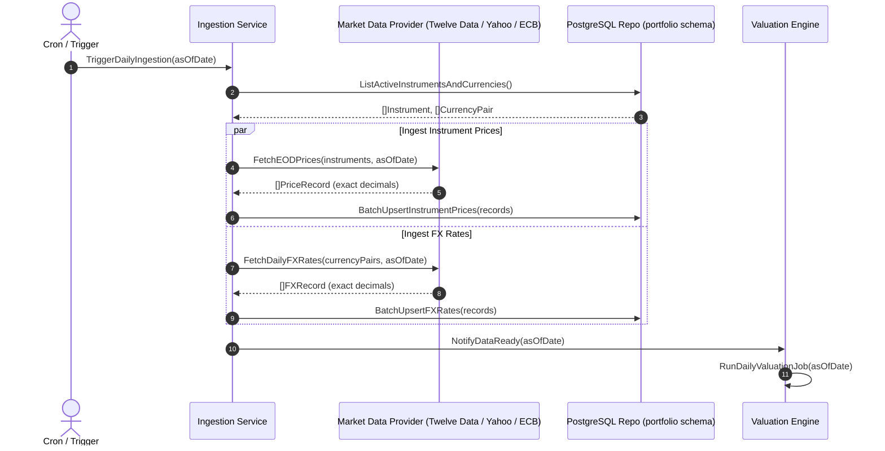

# Market Data Ingestion Implementation Plan (Asset Prices & FX Rates)

> **Branch**: `feat/market-data-ingestion`  
> **Targets**: `services/portfolio-api` (`internal/marketdata/`, `internal/repository/`, `cmd/market-ingest/`), `pkg/`  
> **Key Principle**: Provide an automated, resilient, multi-provider ingestion pipeline for daily asset closing prices and foreign exchange rates with zero floating-point arithmetic, configurable rate limiting, and automated backfill triggers.

---

## 1. Architectural Overview & Ingestion Workflow

Accurate portfolio valuation, time-weighted returns (TWR), and performance charts depend on timely and trustworthy historical and end-of-day (EOD) market data.

GraphFolio separates market data ingestion into two primary streams:
1. **End-of-Day (EOD) Market Closes & FX Fixings**: Scheduled pipeline that runs after equity exchanges close and central banks release official FX fixing rates.
2. **On-Demand Historical Backfill**: Triggered automatically when an investor inputs a transaction for an instrument or currency pair with missing historical pricing data.



---

## 2. Market Data Providers & Extensible Adapter Architecture

To prevent vendor lock-in and accommodate regional exchanges, the architecture defines provider interfaces with a pluggable adapter model:

```text
                        ┌───────────────────────────────┐
                        │   MarketDataIngestionService  │
                        └───────────────┬───────────────┘
                                        │
                 ┌──────────────────────┴──────────────────────┐
                 ▼                                             ▼
     ┌───────────────────────┐                     ┌───────────────────────┐
     │  PriceProvider (IF)   │                     │  FXRateProvider (IF)  │
     └───────────┬───────────┘                     └───────────┬───────────┘
                 │                                             │
      ┌──────────┴──────────┐                       ┌──────────┴──────────┐
      ▼                     ▼                       ▼                     ▼
┌───────────┐         ┌───────────┐           ┌───────────┐         ┌───────────┐
│Twelve Data│         │Yahoo Fin  │           │ECB Fixings│         │OpenExchange
└───────────┘         └───────────┘           └───────────┘         └───────────┘
```

### 2.1 Provider Interface Contracts (`internal/marketdata/provider.go`)

```go
package marketdata

import (
	"context"
	"time"

	"github.com/google/uuid"
	"github.com/shopspring/decimal"
)

type PriceRecord struct {
	InstrumentID uuid.UUID
	Symbol       string
	Exchange     string
	PriceDate    time.Time
	ClosePrice   decimal.Decimal
	Source       string
}

type FXRecord struct {
	BaseCurrency  string
	QuoteCurrency string
	RateDate      time.Time
	Rate          decimal.Decimal
	Source        string
}

// PriceProvider fetches equity, ETF, and fund closing prices.
type PriceProvider interface {
	Name() string
	FetchClosingPrices(ctx context.Context, instruments []InstrumentRef, date time.Time) ([]PriceRecord, error)
	FetchHistoricalPrices(ctx context.Context, instrument InstrumentRef, from, to time.Time) ([]PriceRecord, error)
}

// FXRateProvider fetches daily currency exchange rates.
type FXRateProvider interface {
	Name() string
	FetchFXRates(ctx context.Context, pairs []CurrencyPair, date time.Time) ([]FXRecord, error)
	FetchHistoricalFXRates(ctx context.Context, pair CurrencyPair, from, to time.Time) ([]FXRecord, error)
}
```

### 2.2 Provider Selection & Free-Tier Fallbacks

1. **Equities & ETFs**:
   - **Primary**: Twelve Data / Financial Modeling Prep (structured REST API, reliable adjusted closes).
   - **Fallback**: Yahoo Finance API adapter (public endpoint, wide ticker coverage including international exchanges).
2. **Foreign Exchange Rates**:
   - **Primary**: European Central Bank (ECB) Reference Rates via official daily XML/SDMX feed (100% free, official institutional fixing for ~32 global currencies against EUR).
   - **Fallback**: Open Exchange Rates / Frankfurter API.
   - **Triangulation Engine**: If rate $A \to B$ is not directly quoted, calculate via base anchor (e.g. $A \to \text{EUR} \times \text{EUR} \to B$) with exact decimal division.

---

## 3. Database Schema & Query Optimization

The target tables already exist in [`services/portfolio-api/migrations/000004_market_data.up.sql`](file:///Users/oscargarcia/workspace/graphfolio/services/portfolio-api/migrations/000004_market_data.up.sql):

```sql
CREATE TABLE portfolio.instrument_prices (
    instrument_id  uuid          NOT NULL REFERENCES portfolio.instruments(id),
    price_date     date          NOT NULL,
    close          numeric(20,8) NOT NULL CHECK (close >= 0),
    source         text          NOT NULL DEFAULT 'manual',
    created_at     timestamptz   NOT NULL DEFAULT now(),
    PRIMARY KEY (instrument_id, price_date)
);

CREATE TABLE portfolio.fx_rates (
    base_currency   char(3)        NOT NULL REFERENCES portfolio.currencies(code),
    quote_currency  char(3)        NOT NULL REFERENCES portfolio.currencies(code),
    rate_date       date           NOT NULL,
    rate            numeric(20,10) NOT NULL CHECK (rate > 0),
    source          text           NOT NULL DEFAULT 'manual',
    PRIMARY KEY (base_currency, quote_currency, rate_date),
    CHECK (base_currency <> quote_currency)
);
```

### 3.1 Batch Upsert Queries (`internal/repository/queries.go`)

High-throughput multi-row `INSERT ... ON CONFLICT DO UPDATE`:

```go
// BatchUpsertInstrumentPrices atomically persists daily close prices.
func (r *PostgresRepository) BatchUpsertInstrumentPrices(ctx context.Context, records []marketdata.PriceRecord) error {
	// INSERT INTO portfolio.instrument_prices (instrument_id, price_date, close, source)
	// VALUES (...)
	// ON CONFLICT (instrument_id, price_date)
	// DO UPDATE SET close = EXCLUDED.close, source = EXCLUDED.source, created_at = now();
}

// BatchUpsertFXRates atomically persists daily currency exchange rates.
func (r *PostgresRepository) BatchUpsertFXRates(ctx context.Context, records []marketdata.FXRecord) error {
	// INSERT INTO portfolio.fx_rates (base_currency, quote_currency, rate_date, rate, source)
	// VALUES (...)
	// ON CONFLICT (base_currency, quote_currency, rate_date)
	// DO UPDATE SET rate = EXCLUDED.rate, source = EXCLUDED.source;
}

// ListActiveInstruments returns all instruments currently referenced in transactions or holdings.
func (r *PostgresRepository) ListActiveInstruments(ctx context.Context) ([]domain.Instrument, error)

// ListActiveCurrencies returns all distinct currencies used in portfolios, cash accounts, and instruments.
func (r *PostgresRepository) ListActiveCurrencies(ctx context.Context) ([]string, error)
```

---

## 4. Rate Limiting, Resilience & Data Validation

### 4.1 Rate Limiting & Concurrency Control
- Ingesting hundreds of tickers can quickly exhaust upstream provider API quotas (e.g. 8 calls/min or 800 calls/day on free tiers).
- Implement a **Token Bucket Rate Limiter** using `golang.org/x/time/rate`.
- Worker pool bounded by configurable concurrency (default: 3 concurrent HTTP workers).
- Backoff policy: Exponential backoff with jitter on HTTP 429 (Too Many Requests) or HTTP 5xx.

### 4.2 Data Quality & Anomaly Detection
Before persisting external data to the database, apply validation rules:
1. **Zero / Negative Value Protection**: Prices and FX rates must be $> 0$.
2. **Price Spike Filter**: Flag/reject prices with $> 50\%$ single-day change unless verified by a secondary source (prevents unadjusted stock split corruption).
3. **Currency Inversion Symmetry**: Whenever pair $A/B = r$ is stored, ensure inverse $B/A = 1/r$ is recorded or can be derived deterministically.
4. **Calendar Awareness & LOCF**: Market close data is only requested for weekdays. Weekends and stock exchange holidays carry forward the last available closing price (LOCF).

---

## 5. Layer-by-Layer Implementation Specs

### 5.1 Configuration & Environment (`pkg/database/config.go` or `internal/config/`)

Add provider environment variables:
```env
# Market Data Providers
MARKET_DATA_PROVIDER=twelvedata          # Options: twelvedata, yahoo, mock
TWELVE_DATA_API_KEY=your_api_key_here
FX_DATA_PROVIDER=ecb                    # Options: ecb, openexchange, mock
MARKET_DATA_RATE_LIMIT_RPS=5            # Requests per second
MARKET_DATA_TIMEOUT_SECS=30
```

### 5.2 Ingestion Engine (`internal/marketdata/service.go`)

```go
type IngestionService struct {
	repo          repository.Repository
	priceProvider PriceProvider
	fxProvider    FXRateProvider
	limiter       *rate.Limiter
	logger        *logger.Logger
}

// IngestDailyMarketData coordinates daily price and FX updates for a specific trade date.
func (s *IngestionService) IngestDailyMarketData(ctx context.Context, asOfDate time.Time) error

// BackfillInstrumentPrices pulls historical daily closes for an instrument across a date range.
func (s *IngestionService) BackfillInstrumentPrices(ctx context.Context, instrumentID uuid.UUID, fromDate, toDate time.Time) error

// BackfillCurrencyPair pulls historical FX rates for a currency pair across a date range.
func (s *IngestionService) BackfillCurrencyPair(ctx context.Context, base, quote string, fromDate, toDate time.Time) error
```

### 5.3 Automated Ingestion Trigger Hooks

1. **Transaction Ingestion Hook** in `services/portfolio-api/internal/service/transaction.go`:
   - When a transaction is added for an instrument:
     ```go
     // Check if closing prices exist for this instrument between trade date and today
     hasPrices, err := s.repo.HasPricesForRange(ctx, instrument.ID, req.TransactionDate, todayUTC)
     if !hasPrices {
         // Asynchronously trigger backfill for this instrument
         go func() {
             _ = s.ingestionService.BackfillInstrumentPrices(context.Background(), instrument.ID, req.TransactionDate, todayUTC)
         }()
     }
     ```

2. **Scheduled CLI Entrypoint (`cmd/market-ingest/main.go`)**:
   - Runnable via cron or Make target:
     ```bash
     # Ingest yesterday's closing prices & FX fixings
     go run ./services/portfolio-api/cmd/market-ingest

     # Backfill specific date or date range
     go run ./services/portfolio-api/cmd/market-ingest -from 2026-01-01 -to 2026-10-04
     ```

---

## 6. Step-by-Step Implementation Phases

| Phase | Tasks | Verification Criteria |
|---|---|---|
| **Phase 1: Interfaces & Mock Provider** | 1. Create `internal/marketdata/provider.go`<br>2. Implement `MockMarketDataProvider` for deterministic unit testing<br>3. Unit tests for triangulation and anomaly filters | Unit tests pass with 100% test coverage for price validation and currency triangulation. |
| **Phase 2: Repository Queries** | 1. Implement `BatchUpsertInstrumentPrices`<br>2. Implement `BatchUpsertFXRates`<br>3. Implement `ListActiveInstruments` and `ListActiveCurrencies` | Integration tests verify conflict upserts work idempotently without duplicate key errors. |
| **Phase 3: ECB & Yahoo Providers** | 1. Implement ECB daily FX XML parser (`ecb_provider.go`)<br>2. Implement Twelve Data / Yahoo adapter (`equity_provider.go`)<br>3. Add token-bucket rate limiter | Successfully fetches and parses live or recorded fixture responses from upstream endpoints. |
| **Phase 4: Ingestion Service & Backfill** | 1. Implement `IngestionService`<br>2. Wire transaction creation hook in `AddTransaction`<br>3. Trigger downstream `ValuationEngine` update upon completion | Ingesting a new transaction for an unpriced ticker triggers price ingestion and subsequent valuation re-projection. |
| **Phase 5: CLI Worker & Makefile** | 1. Create `services/portfolio-api/cmd/market-ingest/main.go`<br>2. Add `make ingest-market-data` target in `Makefile` | CLI command runs cleanly, logs ingestion counts, and populates `instrument_prices` and `fx_rates`. |

---

## 7. Verification & Testing Strategy

- **Mocked HTTP Clients**: External APIs must be mockable using `httptest.Server` or provider interfaces. Tests must never make unmocked external network calls.
- **Precision Validation**: Assert that prices (up to 8 decimal places) and FX rates (up to 10 decimal places) are stored without IEEE 754 float drift.
- **Race Condition Safety**: All ingestion tests and rate-limiting concurrent workers must pass `go test -v -race ./...`.
