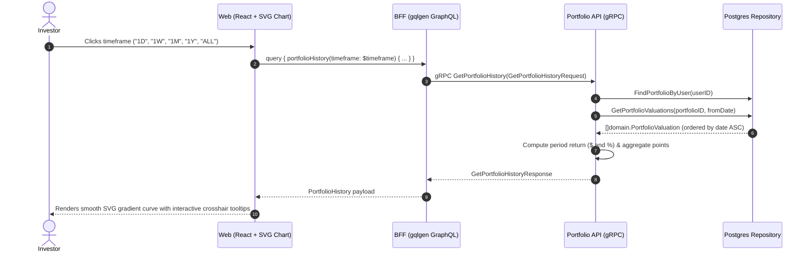

# Interactive Performance Chart & Historical Valuations Implementation Plan

> **Branch**: `feat/peformance-chart`  
> **Targets**: `proto/`, `services/portfolio-api`, `bff/`, and `web/`  
> **Key Principle**: Replace static mock chart with an interactive, data-driven SVG chart backed by time-series valuation points with zero floating-point loss.

---

## 1. Architectural Overview & Data Flow

Currently, `Dashboard.tsx` displays a static mock image (`portfolio_chart.jpg`) and static filter buttons. This feature replaces the mock image with an interactive SVG chart driven by real database snapshots stored in `portfolio.portfolio_valuations`.



---

## 2. Layer-by-Layer Specifications

### 2.1 Protocol Buffers (`proto/portfolio/v1/portfolio.proto`)

Define the timeframe enum and history messages:

```protobuf
enum HistoryTimeframe {
  HISTORY_TIMEFRAME_UNSPECIFIED = 0;
  HISTORY_TIMEFRAME_1D = 1;
  HISTORY_TIMEFRAME_1W = 2;
  HISTORY_TIMEFRAME_1M = 3;
  HISTORY_TIMEFRAME_1Y = 4;
  HISTORY_TIMEFRAME_ALL = 5;
}

message ValuationPoint {
  string            date         = 1; // YYYY-MM-DD
  common.v1.Money   total_value  = 2; // Market value + cash value
  common.v1.Money   market_value = 3;
  common.v1.Money   cash_value   = 4;
  common.v1.Decimal twr_index    = 5;
  common.v1.Decimal daily_return = 6;
}

message GetPortfolioHistoryRequest {
  string           user_id   = 1;
  HistoryTimeframe timeframe = 2;
}

message GetPortfolioHistoryResponse {
  repeated ValuationPoint points         = 1;
  common.v1.Money         start_value    = 2;
  common.v1.Money         end_value      = 3;
  common.v1.Money         return_amount  = 4;
  common.v1.Decimal       return_percent = 5;
}

service PortfolioService {
  rpc GetPortfolio(GetPortfolioRequest) returns (GetPortfolioResponse) {}
  rpc AddTransaction(AddTransactionRequest) returns (AddTransactionResponse) {}
  rpc ListInstruments(ListInstrumentsRequest) returns (ListInstrumentsResponse) {}
  rpc GetPortfolioHistory(GetPortfolioHistoryRequest) returns (GetPortfolioHistoryResponse) {}
}
```

---

### 2.2 Database & Seed Data (`services/portfolio-api`)

#### 1. Development Seed (`services/portfolio-api/seeds/dev_seed.sql`)
- Currently only 1 row exists in `portfolio.portfolio_valuations`.
- Use PostgreSQL's `generate_series(CURRENT_DATE - INTERVAL '365 days', CURRENT_DATE, '1 day')` to generate a 365-day historical valuation curve for the demo portfolio (`018f0000-0002-7000-8000-000000000001`):
  - Values scale realistically from ~$105,000 to the current $124,532.89.
  - Generates realistic daily fluctuation, cumulative `twr_index`, and cash/market splits.

#### 2. Repository Layer (`internal/repository/`)
- **Query** in `queries.go`:
  ```sql
  getPortfolioValuationsSQL = `
  SELECT portfolio_id, valuation_date, market_value_base, cash_value_base,
         net_flow_base, daily_return, twr_index
  FROM portfolio.portfolio_valuations
  WHERE portfolio_id = $1 AND valuation_date >= $2
  ORDER BY valuation_date ASC;`
  ```
- **Interface** in `repository.go`:
  ```go
  GetPortfolioValuations(ctx context.Context, portfolioID uuid.UUID, fromDate time.Time) ([]domain.PortfolioValuation, error)
  ```
- **Implementation** in `postgres.go`:
  Queries the rows and scans into `domain.PortfolioValuation`.

---

### 2.3 Service Layer (`services/portfolio-api/internal/service/`)

- **Interface** in `service.go`:
  ```go
  GetPortfolioHistory(ctx context.Context, userID string, timeframe domain.HistoryTimeframe) (*domain.PortfolioHistory, error)
  ```
- **Domain Entity** (`internal/domain/history.go`):
  ```go
  type HistoryTimeframe string

  type ValuationPoint struct {
      Date        time.Time
      TotalValue  Money
      MarketValue Money
      CashValue   Money
      TWRIndex    decimal.Decimal
      DailyReturn decimal.Decimal
  }

  type PortfolioHistory struct {
      Points        []ValuationPoint
      StartValue    Money
      EndValue      Money
      ReturnAmount  Money
      ReturnPercent decimal.Decimal
  }
  ```
- **Timeframe Boundary Calculation**:
  - `1D`: `now.AddDate(0, 0, -1)` (or intraday snapshots)
  - `1W`: `now.AddDate(0, 0, -7)`
  - `1M`: `now.AddDate(0, -1, 0)`
  - `1Y`: `now.AddDate(-1, 0, 0)`
  - `ALL`: `time.Time{}` (inception)
- **Period Return Formulas**:
  $$\text{ReturnAmount} = \text{EndValue} - \text{StartValue}$$
  $$\text{ReturnPercent} = \frac{\text{ReturnAmount}}{\text{StartValue}} \times 100$$
- **gRPC Server Handler** (`internal/server.go`):
  Maps proto request to service call and formats `GetPortfolioHistoryResponse`.

---

### 2.4 Backend-for-Frontend (`bff/`)

#### 1. GraphQL Schema (`bff/graph/schema.graphqls`)
```graphql
enum HistoryTimeframe {
  TIMEFRAME_1D
  TIMEFRAME_1W
  TIMEFRAME_1M
  TIMEFRAME_1Y
  TIMEFRAME_ALL
}

type ValuationPoint {
  date: String!
  totalValue: Money!
  marketValue: Money!
  cashValue: Money!
  twrIndex: Decimal!
  dailyReturn: Decimal
}

type PortfolioHistory {
  points: [ValuationPoint!]!
  startValue: Money!
  endValue: Money!
  returnAmount: Money!
  returnPercent: Decimal!
}

extend type Query {
  portfolioHistory(timeframe: HistoryTimeframe!): PortfolioHistory!
}
```

#### 2. Resolvers & Helpers (`bff/graph/`)
- Run `gqlgen generate`.
- Implement `Query.portfolioHistory`:
  - Maps GraphQL `HistoryTimeframe` to proto enum.
  - Calls `r.PortfolioClient.GetPortfolioHistory`.
  - Maps proto `ValuationPoint` array to GraphQL models.

---

### 2.5 Web Frontend (`web/`)

#### 1. Code Generation
- Run `npx genql --schema ../bff/graph/schema.graphqls --output ./src/generated`.

#### 2. New Component: `PerformanceChart` (`web/src/components/PerformanceChart.tsx` & `.css`)
- **Responsive SVG Line / Area Chart**:
  - Smooth Bezier or Polyline path across $(x, y)$ coordinates calculated dynamically from container dimensions.
  - Vibrant gradient fill under the curve (`#10b981` glow for positive return, `#ef4444` for negative).
  - Crosshair vertical tracker line following mouse cursor.
  - Hover tooltip displaying exact date, total valuation formatted as currency, and cumulative change.
  - Interactive timeframe bar (`1D`, `1W`, `1M`, `1Y`, `ALL`) with active state and smooth transition.
  - Graceful fallback / loading state during timeframe switches.
- **Integration**:
  - Replace `` in `Dashboard.tsx` with `<PerformanceChart />`.

---

## 3. Implementation Phases

| Phase | Scope & Files | Deliverables & Verification |
|---|---|---|
| **Phase 1: Contracts & Seed Data** | 1. `proto/portfolio/v1/portfolio.proto`<br>2. `dev_seed.sql` 365-day history<br>3. `make proto` | Proto compiles; dev seed generates 365 historical valuation records. |
| **Phase 2: Repository & Service** | 1. `GetPortfolioValuations` in repository<br>2. `GetPortfolioHistory` in service<br>3. Handler in `server.go`<br>4. Generate mocks: `go generate ./...` | Unit tests in `service_test.go` and `server_test.go` pass with `go test -v -race ./services/portfolio-api/...`. |
| **Phase 3: BFF GraphQL** | 1. Update `bff/graph/schema.graphqls`<br>2. Run `gqlgen generate`<br>3. Implement resolver in `schema.resolvers.go`<br>4. Resolver unit tests | BFF unit tests pass; `portfolioHistory` returns valuation time series. |
| **Phase 4: Web Chart Component** | 1. Run `genql`<br>2. Create `PerformanceChart.tsx` & `.css`<br>3. Integrate into `Dashboard.tsx` | Chart renders live SVG curve; switching `1D`/`1W`/`1M`/`1Y`/`ALL` dynamically updates curve and tooltip. |
| **Phase 5: Verification & Polish** | 1. Run `make generate`<br>2. Run `gofmt -s -l services/ pkg/ bff/`<br>3. Run `go vet ./...`<br>4. Run `make test`<br>5. `npm run build` | Zero linter or test errors; end-to-end smoke test with `make run`. |

---

## 4. Verification & Testing Strategy

1. **Service Unit Tests (`services/portfolio-api/internal/service/history_test.go`)**:
   - Verify date filtering for 1W, 1M, 1Y, ALL.
   - Verify `returnAmount` and `returnPercent` calculation with exact decimal precision.
   - Verify empty history handling.
2. **Server Unit Tests (`services/portfolio-api/internal/server_test.go`)**:
   - Verify gRPC status code mapping and protobuf conversion.
3. **BFF Unit Tests (`bff/graph/schema.resolvers_test.go`)**:
   - Verify GraphQL resolver maps time series points accurately.
4. **End-to-End Verification**:
   - Execute `make run`.
   - Open [http://localhost:5173](http://localhost:5173).
   - Toggle through `1W`, `1M`, `1Y`, `ALL`; verify that the chart curve, date range, and performance metrics update live without full page refresh.
