# Admin UI Portal Historical Backfill Implementation Plan (Asset Prices & Currency Rates)

> **Target**: Comprehensive end-to-end implementation plan for supporting user-configured historical backfills of asset closing prices and foreign exchange rates with custom date ranges in the internal Admin Portal (`admin-app`).  
> **Scope**: `proto/portfolio/v1/portfolio.proto`, `services/portfolio-api`, `bff/`, and `web/apps/admin-app`.  
> **Key Principle**: Enable financial operators to backfill missing EOD asset marks and central bank FX rates for specific instruments or batch market segments across custom historical horizons while maintaining the **zero floating-point policy**, token-bucket rate limit safeguards, and retroactive valuation recalculations.

---

## 1. Architectural Overview & Data Flow

The internal Admin Portal (`admin-app` on `:5174`) gives operations administrators direct control over market data pipelines. While daily EOD syncs capture current closing prices, onboarding new historical transactions, adding newly tracked assets, or resolving vendor gaps requires backfilling historical daily series over specific date intervals (e.g. 30 days, 90 days, 1 year, or arbitrary ranges).

```mermaid
sequenceDiagram
    autonumber
    actor Admin as Operations Admin
    participant AdminApp as Admin App (:5174)
    participant BFF as BFF (:8080 GraphQL)
    participant Svc as Portfolio API (:50051 gRPC)
    participant Ingest as Ingestion Service
    participant Providers as External Market Providers<br/>(Twelve Data / Yahoo / ECB)
    participant DB as PostgreSQL (portfolio schema)

    %% Trigger Backfill Request
    Admin->>AdminApp: Opens "Historical Backfill" modal (specifies From/To, Assets/FX, Scope)
    AdminApp->>AdminApp: Validates date bounds & calculates estimated API token consumption
    Admin->>AdminApp: Clicks "Execute Backfill"
    AdminApp->>BFF: mutation triggerBackfill(input: { fromDate, toDate, symbols, currencyPairs, backfillAssets, backfillFx, recomputeValuations })
    BFF->>Svc: gRPC TriggerBackfill(TriggerBackfillRequest)
    
    %% Execution in Portfolio API
    rect rgb(24, 32, 47)
    note right of Svc: 1. Input Validation & Scope Resolution
    Svc->>Svc: Validate YYYY-MM-DD bounds (fromDate <= toDate <= today)
    alt symbols empty & backfillAssets == true
        Svc->>DB: ListActiveInstruments()
    end
    alt currencyPairs empty & backfillFx == true
        Svc->>DB: ListActiveCurrencies() & generateCurrencyPairs()
    end
    end

    %% Market Data Ingestion
    rect rgb(32, 24, 47)
    note right of Svc: 2. Rate-Governed Backfill Ingestion
    loop For each Instrument / Currency Pair
        Svc->>Ingest: BackfillInstrumentPrices(id, symbol, exchange, fromDate, toDate)
        Ingest->>Providers: FetchHistoricalPrices / FetchHistoricalFXRates (RateLimiter)
        Providers-->>Ingest: Normalized PriceRecord[] / FXRecord[]
        Ingest->>DB: BatchUpsertInstrumentPrices / BatchUpsertFXRates
    end
    end

    %% Retroactive Valuations
    rect rgb(24, 47, 32)
    note right of Svc: 3. Valuation Reconciliation (Optional)
    opt recomputeValuations == true
        Svc->>DB: FindPortfoliosHoldingInstrument()
        Svc->>Svc: Rebuild historical daily valuations from fromDate
    end
    end

    Svc-->>BFF: TriggerBackfillResponse { success, pricesSynced, fxRatesSynced, message, warnings }
    BFF-->>AdminApp: BackfillPayload
    AdminApp-->>Admin: Displays success toast with counts & auto-refreshes data tables
```



---

## 2. Layer-by-Layer Technical Specifications

### 2.1 Protocol Buffers (`proto/portfolio/v1/portfolio.proto`)

Extend the administrative gRPC contract with the new `TriggerBackfill` RPC and payload messages:

```protobuf
service PortfolioService {
  // Existing Admin RPCs
  rpc ListAllInstruments(ListAllInstrumentsRequest) returns (ListAllInstrumentsResponse) {}
  rpc CreateInstrument(CreateInstrumentRequest) returns (CreateInstrumentResponse) {}
  rpc UpdateInstrument(UpdateInstrumentRequest) returns (UpdateInstrumentResponse) {}
  rpc ListInstrumentPrices(ListInstrumentPricesRequest) returns (ListInstrumentPricesResponse) {}
  rpc RecordPriceOverride(RecordPriceOverrideRequest) returns (RecordPriceOverrideResponse) {}
  rpc GetIngestionStatus(GetIngestionStatusRequest) returns (GetIngestionStatusResponse) {}
  rpc TriggerMarketSync(TriggerMarketSyncRequest) returns (TriggerMarketSyncResponse) {}

  // New Admin RPC: Historical Market Data Backfill
  rpc TriggerBackfill(TriggerBackfillRequest) returns (TriggerBackfillResponse) {}
}

message TriggerBackfillRequest {
  string          from_date            = 1; // YYYY-MM-DD (inclusive start date)
  string          to_date              = 2; // YYYY-MM-DD (inclusive end date, defaults to today)
  repeated string symbols              = 3; // Optional list of ticker symbols. If empty & backfill_assets=true, all active instruments are backfilled.
  repeated string currency_pairs       = 4; // Optional list of currency pairs (e.g. "EUR/USD"). If empty & backfill_fx=true, standard pairs are backfilled.
  bool            backfill_assets      = 5; // Whether to backfill equity/ETF/fund closing prices
  bool            backfill_fx          = 6; // Whether to backfill foreign exchange reference rates
  bool            recompute_valuations = 7; // Whether to recompute affected portfolio historical valuations
}

message TriggerBackfillResponse {
  bool            success         = 1;
  int32           prices_synced   = 2;
  int32           fx_rates_synced = 3;
  string          message         = 4;
  repeated string warnings        = 5;
}
```

---

### 2.2 Backend Domain & Service Layer (`services/portfolio-api/`)

#### 2.2.1 Domain Models (`internal/domain/backfill.go`)
Create domain representations for backfill execution:

```go
package domain

import "time"

// BackfillInput defines the parameters for a historical market data backfill job.
type BackfillInput struct {
    FromDate            time.Time
    ToDate              time.Time
    Symbols             []string
    CurrencyPairs       []string
    BackfillAssets      bool
    BackfillFX          bool
    RecomputeValuations bool
}

// BackfillResult summarizes the outcome of the backfill job.
type BackfillResult struct {
    Success       bool
    PricesSynced  int
    FXRatesSynced int
    Message       string
    Warnings      []string
}
```

#### 2.2.2 Service Interface & Implementation (`internal/service/admin.go`)

Extend the `PortfolioService` interface:
```go
type PortfolioService interface {
    // ... existing methods ...
    TriggerBackfill(ctx context.Context, input domain.BackfillInput) (*domain.BackfillResult, error)
}
```

Implement `TriggerBackfill` in `services/portfolio-api/internal/service/admin.go`:
1. **Date Range Validation**:
   - `input.FromDate` and `input.ToDate` must not be zero.
   - `input.ToDate` cannot precede `input.FromDate`.
   - `input.ToDate` cannot be in the future (capped at `s.nowFunc().UTC().Truncate(24 * time.Hour)`).
   - Maximum historical window limit: Enforce a sane ceiling (e.g. 5 years / 1825 days) to protect provider rate limits and memory footprint unless explicit override is provided.
   - At least one target must be enabled (`input.BackfillAssets || input.BackfillFX`).
2. **Asset Price Backfill Execution**:
   - If `input.BackfillAssets` is true:
     - If `len(input.Symbols) > 0`: Resolve instruments via `s.repo.FindInstrumentBySymbol`. Collect not-found errors as non-fatal warnings or return immediately if all invalid.
     - If `len(input.Symbols) == 0`: Fetch all active instruments via `s.repo.ListActiveInstruments(ctx)`.
     - For each resolved instrument, call `s.ingestion.BackfillInstrumentPrices(ctx, inst.ID, inst.Symbol, inst.ExchangeCode, input.FromDate, input.ToDate)`.
     - Accumulate `pricesSynced` count and log any provider failure to `warnings` without terminating the entire batch.
3. **Currency Pair Backfill Execution**:
   - If `input.BackfillFX` is true:
     - If `len(input.CurrencyPairs) > 0`: Parse each pair string (e.g. `"EUR/USD"` or `"EUR USD"`), normalize uppercase, validate 3-letter ISO codes.
     - If `len(input.CurrencyPairs) == 0`: Call `s.repo.ListActiveCurrencies(ctx)` and generate standard anchor pairs against USD and EUR via `generateCurrencyPairs()`.
     - For each pair, call `s.ingestion.BackfillCurrencyPair(ctx, pair.Base, pair.Quote, input.FromDate, input.ToDate)`.
     - Accumulate `fxRatesSynced` count and log provider warnings.
4. **Valuation Reconciliation (Optional)**:
   - If `input.RecomputeValuations` is true and `pricesSynced > 0`:
     - Identify all portfolios that held the backfilled instruments during `[input.FromDate, input.ToDate]`.
     - Trigger historical portfolio valuation replay to ensure investor dashboards reflect newly backfilled marks.
5. **Return Comprehensive Result**:
   - Construct descriptive `Message` (e.g., `"Historical backfill completed: 420 asset prices and 180 FX fixing rates stored between 2025-01-01 and 2025-10-01"`).

#### 2.2.3 gRPC Server Handler (`internal/server.go`)
Expose `TriggerBackfill`:
- Parse ISO-8601 `from_date` and `to_date` strings into `time.Time`.
- Map fields into `domain.BackfillInput`.
- Handle errors via `status.Errorf(codes.InvalidArgument, ...)` or `status.Errorf(codes.Internal, ...)`.
- Map domain result into `*pb.TriggerBackfillResponse`.

---

### 2.3 BFF Layer (`bff/`)

#### 2.3.1 GraphQL Schema (`bff/graph/schema.graphqls`)

Add the backfill input type, payload type, and mutation:

```graphql
input TriggerBackfillInput {
  fromDate: String! # YYYY-MM-DD
  toDate: String!   # YYYY-MM-DD
  symbols: [String!]
  currencyPairs: [String!]
  backfillAssets: Boolean
  backfillFx: Boolean
  recomputeValuations: Boolean
}

type BackfillPayload {
  success: Boolean!
  pricesSynced: Int!
  fxRatesSynced: Int!
  message: String!
  warnings: [String!]!
}

extend type Mutation {
  triggerBackfill(input: TriggerBackfillInput!): BackfillPayload!
}
```

#### 2.3.2 GraphQL Resolvers (`bff/graph/schema.resolvers.go`)

Implement `TriggerBackfill`:
```go
func (r *mutationResolver) TriggerBackfill(ctx context.Context, input model.TriggerBackfillInput) (*model.BackfillPayload, error) {
    backfillAssets := true
    if input.BackfillAssets != nil {
        backfillAssets = *input.BackfillAssets
    }
    backfillFX := true
    if input.BackfillFx != nil {
        backfillFX = *input.BackfillFx
    }
    recomputeValuations := false
    if input.RecomputeValuations != nil {
        recomputeValuations = *input.RecomputeValuations
    }

    req := &pb.TriggerBackfillRequest{
        FromDate:            input.FromDate,
        ToDate:              input.ToDate,
        Symbols:             input.Symbols,
        CurrencyPairs:       input.CurrencyPairs,
        BackfillAssets:      backfillAssets,
        BackfillFx:          backfillFX,
        RecomputeValuations: recomputeValuations,
    }

    resp, err := r.PortfolioClient.TriggerBackfill(ctx, req)
    if err != nil {
        return nil, fmt.Errorf("failed to trigger backfill: %w", err)
    }

    warnings := resp.GetWarnings()
    if warnings == nil {
        warnings = []string{}
    }

    return &model.BackfillPayload{
        Success:       resp.GetSuccess(),
        PricesSynced:  int(resp.GetPricesSynced()),
        FXRatesSynced: int(resp.GetFxRatesSynced()),
        Message:       resp.GetMessage(),
        Warnings:      warnings,
    }, nil
}
```

---

### 2.4 Frontend Layer (`web/apps/admin-app/`)

#### 2.4.1 Reusable Backfill Modal (`web/apps/admin-app/src/components/BackfillModal.tsx`)

Create an interactive, glassmorphic modal conforming to `@graphfolio/ui` aesthetics:

```text
┌────────────────────────────────────────────────────────────────────────┐
│  ⚡ Trigger Historical Market Data Backfill                        [✕] │
├────────────────────────────────────────────────────────────────────────┤
│  Pull authoritative historical closing prices and foreign exchange     │
│  rates across an inclusive date range from Twelve Data / Yahoo / ECB.  │
│                                                                        │
│  Date Range:                                                           │
│  [ Start Date: 2025-01-01 ]       [ End Date: 2025-10-05 ]             │
│  Quick Presets: [ 30 Days ] [ 90 Days ] [ YTD ] [ 1 Year ] [ Max ]     │
│                                                                        │
│  Scope & Data Feeds:                                                   │
│  ☑ Backfill Asset Prices (Equities / ETFs)                             │
│     Target Scope: (○) All Active Instruments   (●) Specific Symbols    │
│     Symbols: [ AAPL ✕ ] [ MSFT ✕ ] [ + Add Symbol ]                    │
│                                                                        │
│  ☑ Backfill Foreign Exchange Rates (ECB Daily Fixings)                 │
│     Target Scope: (●) All Active Currencies    (○) Specific Pairs      │
│     Pairs: [ EUR/USD ✕ ] [ USD/JPY ✕ ]                                 │
│                                                                        │
│  Options:                                                              │
│  ☑ Recompute historical portfolio valuations after ingestion           │
│                                                                        │
│  Telemetry Impact Projection:                                          │
│  ℹ Estimated External API Calls: ~24 requests (Budget: 480 remaining)  │
├────────────────────────────────────────────────────────────────────────┤
│  [ Cancel ]                                   [ ⚡ Execute Backfill ]   │
└────────────────────────────────────────────────────────────────────────┘
```

**Key UI Features & State Management**:
1. **Date Range Presets**:
   - `30D`: Today minus 30 days.
   - `90D`: Today minus 90 days.
   - `YTD`: January 1st of current year to today.
   - `1Y`: Today minus 365 days.
2. **Dynamic Validation**:
   - Verifies `fromDate <= toDate`.
   - Prevents selecting future dates.
   - Ensures at least one data target (`backfillAssets` or `backfillFx`) is checked.
   - When "Specific Symbols" is selected, requires at least one valid symbol.
3. **API Budget Telemetry Indicator**:
   - Inspects `rateLimitRemaining` and `rateLimitBudget` from `IngestionStatus`.
   - Projects estimated API consumption based on selected date span and symbol count.
   - Displays a warning badge if requested backfill could deplete more than 50% of the active token budget.
4. **Execution Progress & Feedback**:
   - Button shows `isLoading` spinner with `"Ingesting Market Data..."` state.
   - On completion, displays toast notification with exact records persisted:
     `"Backfill complete: 420 prices and 180 FX rates stored."`
   - If warnings occurred, lists non-fatal issues (e.g. `"ECB rate for 2025-01-01 was a bank holiday; carried forward."`).

#### 2.4.2 Integration in `IngestionPipeline.tsx`

Add a dedicated **"Historical Range Backfill Console"** section to the Ingestion Pipeline screen:
- **Card**: Displays historical backfill capability alongside real-time feeds.
- **Action Button**: `"⚡ Launch Range Backfill"` opens `BackfillModal`.
- **Auto-Refresh**: Re-queries `ingestionStatus` upon backfill completion to immediately reflect updated `latestPriceDate`, `latestFxDate`, and API budget counts.

#### 2.4.3 Integration in `PriceManagement.tsx`

Add a **"Backfill Asset Prices"** button to the `PriceManagement` toolbar:
- When clicked, opens `BackfillModal` with:
  - `backfillAssets = true`
  - `backfillFx = false`
  - Pre-selected symbol matching the currently active filter in the price table (e.g. `"AAPL"`).
- On completion, triggers `fetchPrices()` to display newly ingested closing marks in the table.

#### 2.4.4 Integration in `FXManagement.tsx` (Currency Pairs View)

Add a **"Backfill FX Rates"** button to the FX toolbar:
- When clicked, opens `BackfillModal` with:
  - `backfillAssets = false`
  - `backfillFx = true`
  - Pre-selected currency pair matching the active pair (e.g. `"EUR/USD"`).
- On completion, auto-refreshes historical FX chart and rate ledger.

---

## 3. Rate Limiting, Vendor Nuance & Resilience Standards

1. **Zero IEEE-754 Floating-Point Policy**:
   - All ingested prices and FX rates are parsed directly into `shopspring/decimal.Decimal` (or string-based JSON numbers) and persisted with exact column types (`numeric(18,4)` for equity prices, `numeric(20,10)` for FX rates).
2. **Token-Bucket Rate Limiter Compliance**:
   - Twelve Data tier limits outbound requests (e.g. 8 calls/min). The `marketdata.RateLimiter` enforces delays between paginated requests.
   - If a request fails with HTTP 429 or 5xx, the existing exponential backoff with randomized jitter (`RetryConfig`) retries the request up to 3 times before recording a warning.
3. **Weekend & Holiday Handling**:
   - Stock exchanges and central banks are closed on weekends and official holidays.
   - Providers return trading days only. The service does not fabricate zero-price records; missing weekend marks use Last Observation Carried Forward (LOCF) during portfolio projection replays.
4. **Valuation Reconciliation Safeguards**:
   - If `recomputeValuations` is enabled, the service only touches portfolios holding the backfilled assets during the impacted date span, avoiding unneeded full-database valuation rewrites.

---

## 4. Implementation Phases & Step-by-Step Task Breakdown

| Phase | Description | Files & Artifacts | Acceptance Criteria & Validation |
| :--- | :--- | :--- | :--- |
| **Phase 1: Contract & Proto Updates** | Define `TriggerBackfillRequest`, `TriggerBackfillResponse`, and RPC in proto | `proto/portfolio/v1/portfolio.proto` | Run `make proto`. Generates Go proto stubs cleanly. |
| **Phase 2: Domain & Service Implementation** | Implement `domain.BackfillInput`, `domain.BackfillResult`, and `PortfolioService.TriggerBackfill` | `services/portfolio-api/internal/domain/backfill.go`<br>`services/portfolio-api/internal/service/admin.go`<br>`services/portfolio-api/internal/service/service.go` | Unit tests verify range validation, batch looping, and warning collection. |
| **Phase 3: gRPC Server Adapter & Mock Testing** | Expose gRPC server endpoint and add unit tests with `MockPortfolioService` | `services/portfolio-api/internal/server.go`<br>`services/portfolio-api/internal/server_test.go`<br>`services/portfolio-api/internal/service/admin_test.go` | `go test -v -race ./services/portfolio-api/...` passes with zero race conditions. |
| **Phase 4: BFF GraphQL Schema & Resolvers** | Add `TriggerBackfillInput`, `BackfillPayload`, mutation resolver, and helper mapping | `bff/graph/schema.graphqls`<br>`bff/graph/schema.resolvers.go`<br>`bff/graph/schema.resolvers_test.go` | Run `make generate`. GraphQL tests verify resolver invocation and error handling. |
| **Phase 5: API Client Generation & Types** | Re-generate `@graphfolio/api-client` GenQL SDK and models | `web/packages/api-client/src/generated/` | Generated client includes typed `triggerBackfill` mutation. |
| **Phase 6: Frontend Backfill Modal Component** | Build `BackfillModal.tsx` and `BackfillModal.css` with date presets and telemetry display | `web/apps/admin-app/src/components/BackfillModal.tsx`<br>`web/apps/admin-app/src/components/BackfillModal.css` | Modal renders cleanly with input validation and preset chips. |
| **Phase 7: Admin UI Integrations** | Integrate `BackfillModal` into `IngestionPipeline.tsx`, `PriceManagement.tsx`, and `FXManagement.tsx` | `web/apps/admin-app/src/components/IngestionPipeline.tsx`<br>`web/apps/admin-app/src/components/PriceManagement.tsx` | Buttons open modal with appropriate pre-filled scopes; completion refreshes tables. |
| **Phase 8: End-to-End Verification** | Execute full test suite, linting, and interactive browser verification | `Makefile`, Admin Portal (`:5174`) | `make test` passes; backfilling range in UI persists prices to Postgres. |

---

## 5. Verification & Testing Procedures

### 5.1 Automated Backend & Unit Testing
```bash
# 1. Regenerate Protocol Buffers, GraphQL models, genql client, and Go mocks
make generate

# 2. Check code formatting
test -z "$(gofmt -s -l services/ pkg/ bff/)" || (echo "Unformatted files found:" && gofmt -s -l services/ pkg/ bff/ && exit 1)

# 3. Static analysis
go vet ./services/portfolio-api/... ./pkg/... ./bff/...

# 4. Run test suites with race detection
make test
```

### 5.2 Unit Test Matrix
- **`TestPortfolioService_TriggerBackfill_Validation`**:
  - Rejects `toDate` before `fromDate`.
  - Rejects `fromDate` in the future.
  - Rejects empty targets (`backfillAssets = false` and `backfillFX = false`).
- **`TestPortfolioService_TriggerBackfill_SingleSymbol`**:
  - Verifies resolution of symbol to instrument ID and invocation of `BackfillInstrumentPrices`.
- **`TestPortfolioService_TriggerBackfill_AllActiveAssets`**:
  - Verifies iteration through `ListActiveInstruments` and cumulative record tally.
- **`TestPortfolioService_TriggerBackfill_FXPairs`**:
  - Verifies parsing of currency pair strings (e.g. `"EUR/USD"`) and invocation of `BackfillCurrencyPair`.
- **`TestPortfolioService_TriggerBackfill_PartialFailure`**:
  - Verifies that a failure on one instrument does not abort subsequent instruments; captures non-fatal errors in `warnings`.
- **`TestMutationResolver_TriggerBackfill`**:
  - BFF resolver unit test verifying request mapping and gRPC response translation.

### 5.3 Interactive Frontend Validation Steps (`admin-app` on `:5174`)
1. **Ingestion Pipeline Console**:
   - Navigate to **"Ingestion Pipeline"** in the sidebar.
   - Click **"⚡ Historical Range Backfill"**.
   - Verify modal opens with today's date and presets.
2. **Date Preset Selection**:
   - Click **"90 Days"**. Verify `fromDate` updates to 90 days prior to today.
3. **Single Asset Backfill**:
   - Select "Specific Symbols", type `AAPL`, click "Execute Backfill".
   - Verify loading spinner is displayed.
   - Verify success notification appears with price count.
   - Switch to **"Market Prices"** tab and verify `AAPL` closing prices are populated for the 90-day window.
4. **Currency Pair Backfill**:
   - Open backfill modal, uncheck "Backfill Asset Prices", check "Backfill Foreign Exchange Rates", select "Specific Pairs", choose `EUR/USD`.
   - Execute backfill. Verify success toast and verify `portfolio.fx_rates` table contains fixing marks for the range.
5. **Rate Limit Safety Indicator**:
   - Verify that changing the date range dynamically updates the estimated API call consumption indicator.
