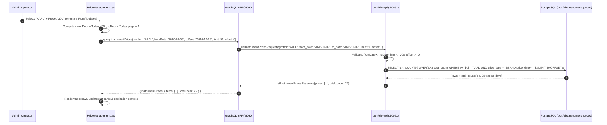

# Asset Prices Date Range Filter & Pagination Implementation Plan

> **Goal**: Upgrade the **Closing Prices Ledger** (`PriceManagement`) in the Admin Portal to support comprehensive date range filtering (`fromDate` and `toDate`), quick range presets (`Today`, `7D`, `30D`, `90D`, `YTD`, `1Y`, `ALL`), and full multi-page pagination. Currently, the UI only accepts a single date and locks queries to `limit: 50, offset: 0`.

---

## 1. Current State & Gap Analysis

| Layer | Current State | Gap / Required Change |
|---|---|---|
| **Web Admin App (`PriceManagement.tsx`)** | Holds a single `dateFilter: string` state. Passes `fromDate: dateFilter, toDate: dateFilter` to the GraphQL query. | Only retrieves records matching the exact single day. Cannot inspect a range of historical prices (e.g. past 30 days or 1 year) for an asset. |
| **Quick Presets** | None. Manual typing or browser date picker required for every change. | Need fast preset buttons (`Today`, `7D`, `30D`, `90D`, `YTD`, `1Y`, `ALL`) consistent with [`BackfillModal.tsx`](file:///Users/oscargarcia/workspace/graphfolio/web/apps/admin-app/src/components/BackfillModal.tsx) and [`FXTrendChart.tsx`](file:///Users/oscargarcia/workspace/graphfolio/web/apps/admin-app/src/components/FXTrendChart.tsx). |
| **Date Range Validation** | If an inverted range is passed, backend throws `ErrInvalidDateRange` (`codes.InvalidArgument`), but the UI has no client-side guard. | Add client-side validation to alert the operator if `fromDate > toDate` before triggering a query. |
| **Pagination** | Hardcoded to `limit: 50, offset: 0` with no UI pagination bar. | Querying a date range or all symbols yields more than 50 rows. Operators cannot view records past the first 50. Add page state (`page`, `pageSize`, `totalPages`) and navigation controls. |
| **Styling (`PriceManagement.css`)** | `.price-mgmt__date-filter` width is fixed to 170px for a single input. | Add styles for dual date inputs, date preset pill group, and glassmorphic table pagination bar. |
| **BFF (`bff/graph/`)** | GraphQL query `instrumentPrices(symbol, fromDate, toDate, limit, offset)` already exists and maps to gRPC `ListInstrumentPrices`. | Already implemented. Add dedicated unit tests in `schema.resolvers_test.go` verifying query execution with distinct `fromDate` and `toDate`. |
| **Backend API (`services/portfolio-api/`)** | gRPC `ListInstrumentPrices` in `server.go`, service validation in `admin.go`, and SQL window query in `postgres.go` already support bounded and half-open date ranges. | Already implemented. Add unit tests in `admin_test.go` and `server_test.go` validating distinct `fromDate`/`toDate` combinations and pagination bounds. |

---

## 2. Architecture & Data Flow



---

## 3. Layer-by-Layer Technical Specifications

### 3.1 Backend Service (`services/portfolio-api`)

#### 3.1.1 Existing Architecture Verification
The backend is already architected to handle date ranges:
- **Proto** ([`proto/portfolio/v1/portfolio.proto`](file:///Users/oscargarcia/workspace/graphfolio/proto/portfolio/v1/portfolio.proto)):
  ```protobuf
  message ListInstrumentPricesRequest {
    optional string symbol    = 1;
    optional string from_date = 2; // YYYY-MM-DD
    optional string to_date   = 3; // YYYY-MM-DD
    int32           limit     = 4; // Default 50, max 200
    int32           offset    = 5;
  }
  ```
- **Service** ([`services/portfolio-api/internal/service/admin.go`](file:///Users/oscargarcia/workspace/graphfolio/services/portfolio-api/internal/service/admin.go)):
  ```go
  if filter.FromDate != nil && filter.ToDate != nil && filter.FromDate.After(*filter.ToDate) {
      return nil, 0, ErrInvalidDateRange
  }
  ```
- **Repository** ([`services/portfolio-api/internal/repository/queries.go`](file:///Users/oscargarcia/workspace/graphfolio/services/portfolio-api/internal/repository/queries.go)):
  ```sql
  SELECT 
      ip.instrument_id, i.symbol, ip.price_date, ip.close, i.currency_code, ip.source, ip.created_at,
      COUNT(*) OVER() AS total_count
  FROM portfolio.instrument_prices ip
  JOIN portfolio.instruments i ON i.id = ip.instrument_id
  WHERE ($1::text IS NULL OR UPPER(i.symbol) = UPPER($1))
    AND ($2::date IS NULL OR ip.price_date >= $2)
    AND ($3::date IS NULL OR ip.price_date <= $3)
  ORDER BY ip.price_date DESC, i.symbol ASC
  LIMIT $4 OFFSET $5;
  ```

#### 3.1.2 Unit Tests Enhancements
In [`services/portfolio-api/internal/service/admin_test.go`](file:///Users/oscargarcia/workspace/graphfolio/services/portfolio-api/internal/service/admin_test.go):
- Add test case verifying date range query with distinct `FromDate` and `ToDate` (`fromDate <= toDate`).
- Add test case verifying half-open range with only `FromDate` (open upper bound).
- Add test case verifying half-open range with only `ToDate` (open lower bound).
- Add test case verifying pagination (`Limit` and `Offset` clamping).

In [`services/portfolio-api/internal/server_test.go`](file:///Users/oscargarcia/workspace/graphfolio/services/portfolio-api/internal/server_test.go):
- Add test verifying `ListInstrumentPrices` parses both `from_date` and `to_date` strings correctly and maps response.

---

### 3.2 Backend-For-Frontend (`bff/`)

#### 3.2.1 GraphQL Schema & Resolver Verification
The GraphQL schema ([`bff/graph/schema.graphqls`](file:///Users/oscargarcia/workspace/graphfolio/bff/graph/schema.graphqls)) and resolver ([`bff/graph/schema.resolvers.go`](file:///Users/oscargarcia/workspace/graphfolio/bff/graph/schema.resolvers.go)) already declare and forward both arguments:
```graphql
instrumentPrices(
  symbol: String
  fromDate: String
  toDate: String
  limit: Int = 50
  offset: Int = 0
): InstrumentPricesConnection!
```

#### 3.2.2 BFF Unit Tests
In [`bff/graph/schema.resolvers_test.go`](file:///Users/oscargarcia/workspace/graphfolio/bff/graph/schema.resolvers_test.go):
- Expand `TestQueryResolver_InstrumentPrices` to pass distinct `fromDate`, `toDate`, `limit`, and `offset` arguments and assert that the request dispatched to `PortfolioClient.ListInstrumentPrices` contains the exact fields.

---

### 3.3 Web Admin Application (`web/apps/admin-app/`)

#### 3.3.1 Component State Refactoring (`PriceManagement.tsx`)
Replace the single date filter with date range and pagination states:

```typescript
// Filter and pagination state
const [symbolFilter, setSymbolFilter] = useState('ALL');
const [fromDate, setFromDate] = useState('');
const [toDate, setToDate] = useState('');
const [activePreset, setActivePreset] = useState<string | null>(null);
const [page, setPage] = useState(1);
const pageSize = 50;
```

#### 3.3.2 Preset Calculation Logic
Implement helper function `calculatePresetDates(preset)`:
- `'TODAY'`: `fromDate = todayISO`, `toDate = todayISO`
- `'7D'`: `fromDate = (today - 7d)ISO`, `toDate = todayISO`
- `'30D'`: `fromDate = (today - 30d)ISO`, `toDate = todayISO`
- `'90D'`: `fromDate = (today - 90d)ISO`, `toDate = todayISO`
- `'YTD'`: `fromDate = ${year}-01-01`, `toDate = todayISO`
- `'1Y'`: `fromDate = (today - 365d)ISO`, `toDate = todayISO`
- `'ALL'`: `fromDate = ''`, `toDate = ''`

When clicking a preset:
1. Update `fromDate` and `toDate`.
2. Set `activePreset` to the selected preset key (or null for manual entry).
3. Reset `page` to `1`.

When the user manually edits either `fromDate` or `toDate`:
1. Clear `activePreset` to `null`.
2. Reset `page` to `1`.

#### 3.3.3 Client-Side Date Range Validation
```typescript
const isDateRangeInvalid = Boolean(fromDate && toDate && fromDate > toDate);
```
- If `isDateRangeInvalid`, display an inline warning / error message (e.g. `"Start date cannot be after end date"`) and avoid making invalid network requests.
- Provide a "Clear Filters" button whenever any filter is active (`symbolFilter !== 'ALL' || fromDate || toDate`).

#### 3.3.4 Query Invocation with Pagination
```typescript
const fetchPrices = useCallback(() => {
  if (fromDate && toDate && fromDate > toDate) {
    return; // Don't query invalid ranges
  }

  setLoading(true);
  client
    .query({
      instrumentPrices: {
        __args: {
          symbol: symbolFilter === 'ALL' ? undefined : symbolFilter,
          fromDate: fromDate || undefined,
          toDate: toDate || undefined,
          limit: pageSize,
          offset: (page - 1) * pageSize,
        },
        items: {
          id: true,
          symbol: true,
          priceDate: true,
          price: {
            amount: true,
            currencyCode: true,
          },
          source: true,
          updatedAt: true,
        },
        totalCount: true,
      },
    })
    .then((res) => {
      if (res.instrumentPrices) {
        setPrices(res.instrumentPrices.items);
        setTotalCount(res.instrumentPrices.totalCount);
        if (res.instrumentPrices.items.length > 0 && page === 1) {
          setLatestPriceDate(res.instrumentPrices.items[0].priceDate);
        }
      }
      setLoading(false);
    })
    .catch((err) => {
      console.error('Failed to query instrument prices:', err);
      onNotify(`Error loading prices: ${err?.message || 'Server error'}`);
      setLoading(false);
    });
}, [symbolFilter, fromDate, toDate, page, pageSize, onNotify]);
```

#### 3.3.5 UI Layout & Controls Structure
```tsx
<div className="price-mgmt__toolbar">
  <div className="price-mgmt__filters">
    {/* Symbol Select */}
    <Select
      className="price-mgmt__symbol-filter"
      value={symbolFilter}
      onChange={(e) => {
        setSymbolFilter(e.target.value);
        setPage(1);
      }}
      options={[
        { label: 'All Symbols', value: 'ALL' },
        ...availableSymbols.map((s) => ({ label: s, value: s })),
      ]}
    />

    {/* From Date Input */}
    <div className="price-mgmt__date-input-group">
      <Input
        type="date"
        placeholder="From Date"
        value={fromDate}
        onChange={(e) => {
          setFromDate(e.target.value);
          setActivePreset(null);
          setPage(1);
        }}
        error={isDateRangeInvalid ? 'Invalid range' : undefined}
      />
    </div>

    {/* To Date Input */}
    <div className="price-mgmt__date-input-group">
      <Input
        type="date"
        placeholder="To Date"
        value={toDate}
        onChange={(e) => {
          setToDate(e.target.value);
          setActivePreset(null);
          setPage(1);
        }}
        error={isDateRangeInvalid ? 'Must be ≥ From' : undefined}
      />
    </div>

    {/* Preset Chips */}
    <div className="price-mgmt__presets">
      {(['7D', '30D', '90D', 'YTD', '1Y'] as const).map((preset) => (
        <Button
          key={preset}
          size="sm"
          variant={activePreset === preset ? 'primary' : 'ghost'}
          onClick={() => handleApplyPreset(preset)}
        >
          {preset}
        </Button>
      ))}
    </div>

    {/* Clear Action */}
    {(symbolFilter !== 'ALL' || fromDate || toDate) && (
      <Button
        size="sm"
        variant="ghost"
        onClick={handleClearFilters}
      >
        Clear Filters
      </Button>
    )}
  </div>

  <div className="price-mgmt__actions">
    {/* Action Buttons: Trigger EOD Ingestion, Backfill Asset Prices, Manual Override */}
  </div>
</div>
```

#### 3.3.6 Table Pagination Footer
Consistent with [`FXManagement.tsx`](file:///Users/oscargarcia/workspace/graphfolio/web/apps/admin-app/src/components/FXManagement.tsx):
```tsx
<div className="price-mgmt__pagination">
  <div className="price-mgmt__pagination-info">
    Showing {prices.length > 0 ? (page - 1) * pageSize + 1 : 0} to{' '}
    {Math.min(page * pageSize, totalCount)} of {totalCount} records
  </div>
  <div className="price-mgmt__pagination-controls">
    <Button
      size="sm"
      variant="ghost"
      disabled={page <= 1 || loading}
      onClick={() => setPage((p) => Math.max(1, p - 1))}
    >
      Previous
    </Button>
    <span className="price-mgmt__page-indicator">
      Page {page} of {totalPages}
    </span>
    <Button
      size="sm"
      variant="ghost"
      disabled={page >= totalPages || loading}
      onClick={() => setPage((p) => Math.min(totalPages, p + 1))}
    >
      Next
    </Button>
  </div>
</div>
```

#### 3.3.7 CSS Styling Specifications (`PriceManagement.css`)
- **Filter Groups**:
  - Replace single fixed `.price-mgmt__date-filter` with `.price-mgmt__date-input-group` (min-width: 150px).
  - Add `.price-mgmt__presets` flex container displaying compact pill buttons with smooth hover and active state highlights.
- **Pagination**:
  - Add `.price-mgmt__pagination` footer with glassmorphic border-top, flex justify-between, and responsive wrapping.
  - Page indicator font: tabular figures / mono font for stable alignment.

---

## 4. UI / UX Design Specifications

### 4.1 Filter Toolbar Layout

```text
+-------------------------------------------------------------------------------------------------------+
|  [All Symbols v]  [ From: YYYY-MM-DD ]  [ To: YYYY-MM-DD ]  [7D] [30D] [90D] [YTD] [1Y] [Clear Filters] |
|                                                                                                       |
|  [⚡ Trigger EOD Ingestion]   [⚡ Backfill Asset Prices]   [+ Manual Price Override]                   |
+-------------------------------------------------------------------------------------------------------+
```

### 4.2 Behavior Matrix

| User Action | `fromDate` | `toDate` | `activePreset` | `page` | Result |
|---|---|---|---|---|---|
| Select **30D** | Today - 30d | Today | `'30D'` | `1` | Queries last 30 calendar days for the symbol(s). |
| Select **YTD** | Jan 1 of current year | Today | `'YTD'` | `1` | Queries prices from year start to present. |
| Pick `fromDate` manually | Custom date | Previous / Empty | `null` | `1` | Half-open or custom range. |
| Invert dates (`from > to`) | `2026-10-10` | `2026-10-01` | `null` | — | Display error on date inputs, skip query dispatch. |
| Click **Clear Filters** | `''` | `''` | `null` | `1` | Clears dates and symbol back to `'ALL'`. |
| Next Page | Unchanged | Unchanged | Unchanged | `page + 1` | Queries offset `page * 50`. |

---

## 5. Verification & Testing Plan

### 5.1 Automated Tests
1. **portfolio-api Unit Tests**:
   - Run `go test -v -race ./services/portfolio-api/internal/service/...`
   - Verify `ListInstrumentPrices` handles range queries, half-open queries, and returns `ErrInvalidDateRange` on inverted dates.
2. **bff Unit Tests**:
   - Run `go test -v -race ./bff/graph/...`
   - Verify `InstrumentPrices` resolver properly passes `fromDate`, `toDate`, `limit`, and `offset` to the gRPC client mock.
3. **Full Suite**:
   - Run `make test` from repository root to guarantee zero regressions.

### 5.2 Manual & UI Verification
1. Open Admin Portal at `http://localhost:5174` (Price Management tab).
2. **Date Range Filtering**:
   - Select an asset (e.g. `AAPL`).
   - Click the `30D` preset button. Confirm table displays the last 30 days of closing prices.
   - Click `1Y` preset. Confirm record count updates and table populates up to 50 records.
3. **Pagination**:
   - On `1Y` view (approx. 250 records), confirm footer displays `Showing 1 to 50 of 252 records` and `Page 1 of 6`.
   - Click `Next`. Confirm records 51 to 100 are loaded and `Page 2 of 6` is highlighted.
   - Click `Previous`. Confirm returns to page 1.
4. **Validation Guard**:
   - Set `From Date` to tomorrow and `To Date` to yesterday.
   - Confirm red validation error renders and no erroneous request is sent.
5. **Clear Action**:
   - Click `Clear Filters`. Confirm inputs reset and table reloads unconstrained records.

---

## 6. Implementation Checklist

- [ ] **Step 1: Backend & BFF Test Enhancements**
  - [ ] Add date range and pagination tests in `services/portfolio-api/internal/service/admin_test.go`
  - [ ] Add gRPC mapping tests in `services/portfolio-api/internal/server_test.go`
  - [ ] Add GraphQL resolver tests in `bff/graph/schema.resolvers_test.go`
- [ ] **Step 2: Admin App UI State & Logic (`PriceManagement.tsx`)**
  - [ ] Replace `dateFilter` with `fromDate` and `toDate` state variables
  - [ ] Add `activePreset` state and `calculatePresetDates` helper
  - [ ] Add `page` and `pageSize` pagination state variables
  - [ ] Update `fetchPrices` to pass `fromDate`, `toDate`, `limit: pageSize`, and `offset: (page - 1) * pageSize`
  - [ ] Add client-side validation for `fromDate > toDate`
- [ ] **Step 3: Admin App UI Components & Toolbar**
  - [ ] Render dual date inputs with placeholders/labels
  - [ ] Render preset buttons (`7D`, `30D`, `90D`, `YTD`, `1Y`)
  - [ ] Render "Clear Filters" action button
  - [ ] Render pagination bar at the bottom of the table
- [ ] **Step 4: Admin App Styling (`PriceManagement.css`)**
  - [ ] Style date input groups and preset pill buttons
  - [ ] Style pagination bar, page indicator, and controls
  - [ ] Ensure mobile and desktop responsive layout
- [ ] **Step 5: Verification & Quality Assurance**
  - [ ] Run `make test`
  - [ ] Verify build via TypeScript compiler / dev server
  - [ ] Validate UI interactions and edge cases
