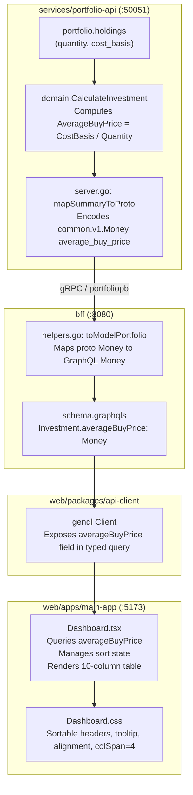

# Implementation Plan: Average Buy Price Column in Investments Holding Table

> **User Story**: [user_story_average_buy_price_column.md](file:///Users/oscargarcia/workspace/graphfolio/docs/user-stories/user_story_average_buy_price_column.md) (US-INV-104)  
> **Status**: Completed  
> **Roadmap Reference**: [FEATURES.md](file:///Users/oscargarcia/workspace/graphfolio/FEATURES.md)  
> **Calculation Standard**: [financial-calculations skill](file:///Users/oscargarcia/workspace/graphfolio/.agents/skills/financial-calculations/SKILL.md)  
> **Target Layers**: Protobuf (`proto/portfolio/v1/`), Domain Microservice (`services/portfolio-api`), BFF (`bff/`), Shared Web Client (`packages/api-client`), Main Application (`web/apps/main-app`)  

---

## 1. Executive Summary & Objective

The objective of this feature is to add an **`Avg Buy Price`** (Average Buy Price) column to the **Your Investments** holdings table in the primary investor dashboard (`apps/main-app`). Positioned directly adjacent to the existing market **`Price`** column, this metric gives investors an immediate benchmark of their position cost basis relative to current market trading levels, answering the primary question: *"Am I currently in profit or loss on my invested position per share?"*

The metric will:
1. Accurately reflect the volume-weighted average price paid per share/unit across all open lots for each active holding.
2. Incorporate corporate actions (stock splits / reverse splits) seamlessly via the existing deterministic ledger projection engine.
3. Be denominated in the instrument's local listing currency (matching the market `Price` column) to allow direct, unconfused numeric comparison.
4. Support interactive column sorting (ascending and descending) with an informational tooltip.
5. Gracefully display an empty neutral dash (`—`) when cost basis is missing or zero (e.g. unpriced corporate gifts or external transfers without execution history).
6. Preserve full layout integrity by adjusting table footer column spans (`colSpan={4}`).

---

## 2. Technical Architecture & Data Flow



---

## 3. Mathematical & Financial Specifications

All calculations must adhere to the [financial-calculations guidelines](file:///Users/oscargarcia/workspace/graphfolio/.agents/skills/financial-calculations/SKILL.md) and use arbitrary-precision fixed-point math (`shopspring/decimal`).

### 3.1 Input Parameters for Holding $i$
| Variable | Type | Description |
| :--- | :--- | :--- |
| $Q_i$ | `decimal.Decimal` | Total open share quantity across all remaining tax lots (`h.Quantity`) |
| $C_{\text{local}, i}$ | `decimal.Decimal` | Total remaining purchase cost in instrument currency (`h.CostBasis`) |
| $P_{\text{local}, i}$ | `decimal.Decimal` | Latest official close price in instrument currency (`h.LatestPrice`) |
| $C_{\text{inst}}$ | `string` | Instrument denomination currency (e.g., `USD`, `AUD`, `EUR`) |

### 3.2 Mathematical Formulation

$$\text{AvgBuyPrice} = \begin{cases} \dfrac{C_{\text{local}, i}}{Q_i} & \text{if } Q_i > 0 \text{ and } C_{\text{local}, i} > 0 \\ \text{null / 0} & \text{otherwise} \end{cases}$$

#### Behavior Under Corporate Actions & Disposals:
- **Tax Lot Ingestion (`BUY`, `TRANSFER_IN`)**: Increments $Q$ and increments $C_{\text{local}}$ by the transaction consideration (including brokerage fees where applicable).
- **Partial Disposals (`SELL`, `TRANSFER_OUT`)**: Under both `AVERAGE_COST` and `FIFO`, $C_{\text{local}}$ is relieved proportionally to the quantity sold ($C_{\text{relieved}} = C_{\text{lot}} \times \frac{Q_{\text{sold}}}{Q_{\text{lot}}}$). Thus, the unit cost basis $\frac{C_{\text{local}}}{Q}$ is preserved invariant across partial sales.
- **Stock Splits (`SPLIT`)**: Replayed in `service.ProcessLedger` where $Q_{\text{lot, new}} = Q_{\text{lot, old}} \times M$, while $C_{\text{local}}$ is invariant. Hence, the post-split average buy price automatically adjusts:
  $$\text{AvgBuyPrice}_{\text{split}} = \frac{C_{\text{local}}}{Q_{\text{new}}} = \frac{C_{\text{local}}}{Q_{\text{old}} \times M} = \frac{\text{AvgBuyPrice}_{\text{pre-split}}}{M}$$
- **Zero Cost / Missing Cost Basis**: If $C_{\text{local}} \le 0$ or $Q_i \le 0$, the calculated amount is zero/nil, instructing the consumer layers to render an unvalued placeholder (`—`).

### 3.3 Currency & Precision Rules
- **Denomination**: Denominated in $C_{\text{inst}}$ (instrument trading currency), exactly matching the denomination of the adjacent market `Price` column (`inv.price.currencyCode`).
- **Precision**: Rounded to 2 decimal places for conventional equities (`.Round(2)` in `Money`), formatted via `formatMoney(inv.averageBuyPrice)`.

---

## 4. Layer-by-Layer Implementation Breakdown

### 4.1 Layer 1: Protocol Buffers (`proto/portfolio/v1/portfolio.proto`)

Add the `average_buy_price` field to the `Investment` message contract:

```protobuf
message Investment {
  string            id                     = 1;
  string            ticker                 = 2;
  string            name                   = 3;
  common.v1.Money   price                  = 4;
  common.v1.Decimal quantity               = 5;
  common.v1.Money   total_value            = 6;
  common.v1.Money   today_return_amount    = 7;
  common.v1.Decimal today_return_percent   = 8;
  common.v1.Money   total_return_amount    = 9;
  common.v1.Decimal total_return_percent   = 10;
  common.v1.Money   capital_gain_amount    = 11;
  common.v1.Decimal capital_gain_percent   = 12;
  common.v1.Money   income_amount          = 13;
  common.v1.Decimal income_yield_percent   = 14;
  common.v1.Money   currency_gain_amount   = 15;
  common.v1.Decimal currency_gain_percent  = 16;
  bool              is_international       = 17;
  common.v1.Money   average_buy_price      = 18; // New volume-weighted average buy price
}
```

Run `make proto` to re-generate Go protobuf bindings in `proto/`.

---

### 4.2 Layer 2: Portfolio Domain Microservice (`services/portfolio-api`)

#### 4.2.1 Update Domain Entities (`internal/domain/holding.go`)
Extend `InvestmentSummary` with `AverageBuyPrice Money`:

```go
type InvestmentSummary struct {
    ID                  string
    Ticker              string
    Name                string
    Price               Money
    AverageBuyPrice     Money // Volume-weighted average purchase price
    Quantity            decimal.Decimal
    TotalValue          Money
    TodayReturnAmount   Money
    TodayReturnPercent  decimal.Decimal
    TotalReturnAmount   Money
    TotalReturnPercent  decimal.Decimal
    CapitalGainAmount   Money
    CapitalGainPercent  decimal.Decimal
    IncomeAmount        Money
    IncomeYieldPercent  decimal.Decimal
    CurrencyGainAmount  Money
    CurrencyGainPercent decimal.Decimal
    IsInternational     bool
}
```

#### 4.2.2 Calculation Engine (`internal/domain/calculator.go`)
In `CalculateInvestment`, compute the average buy price:

```go
var avgBuyPrice decimal.Decimal
if h.Quantity.IsPositive() && h.CostBasis.IsPositive() {
    avgBuyPrice = h.CostBasis.DivRound(h.Quantity, 4)
}

return InvestmentSummary{
    ID:                  h.InstrumentID.String(),
    Ticker:              h.Ticker,
    Name:                h.Name,
    Price:               NewMoney(h.LatestPrice.Round(2), h.InstrumentCurrency),
    AverageBuyPrice:     NewMoney(avgBuyPrice.Round(2), h.InstrumentCurrency),
    Quantity:            h.Quantity,
    // ... remaining fields unchanged
}
```

#### 4.2.3 gRPC Server Adapter (`internal/server.go`)
1. In `mapSummaryToProto`:
   ```go
   var avgBuyPriceProto *commonpb.Money
   if inv.AverageBuyPrice.Amount.IsPositive() {
       avgBuyPriceProto = decimalpb.MoneyToProto(inv.AverageBuyPrice.Amount, inv.AverageBuyPrice.CurrencyCode)
   }
   
   investments[i] = &pb.Investment{
       // ...
       AverageBuyPrice: avgBuyPriceProto,
       // ...
   }
   ```
2. In `fallbackMock`:
   ```go
   AverageBuyPrice: money("156.24", "USD"),
   ```

#### 4.2.4 Domain Unit Tests (`internal/domain/calculator_test.go`)
Add test assertions verifying:
1. **Standard position**: `CostBasis = 22263.50`, `Quantity = 142.5` $\to$ `AverageBuyPrice = 156.24 USD`.
2. **Post-split position**: Pre-split 100 shares @ $100 ($10,000 cost basis), split 2-for-1 $\to$ 200 shares @ $50 average buy price.
3. **Zero / missing cost basis**: `CostBasis = 0`, `Quantity = 50` $\to$ `AverageBuyPrice.Amount.IsZero() == true`.
4. **Zero quantity**: `Quantity = 0` $\to$ zero/nil average buy price without division-by-zero panic.

---

### 4.3 Layer 3: Backend-for-Frontend (`bff/`)

#### 4.3.1 GraphQL Schema (`bff/graph/schema.graphqls`)
Add `averageBuyPrice` to `Investment` type:

```graphql
type Investment {
  id: ID!
  ticker: String!
  name: String!
  price: Money!
  averageBuyPrice: Money # Volume-weighted average purchase price across open lots
  quantity: Decimal!
  totalValue: Money!
  todayReturnAmount: Money!
  todayReturnPercent: Decimal!
  totalReturnAmount: Money!
  totalReturnPercent: Decimal!

  # Multi-Currency Return Attribution
  capitalGainAmount: Money!
  capitalGainPercent: Decimal!
  incomeAmount: Money!
  incomeYieldPercent: Decimal!
  currencyGainAmount: Money!
  currencyGainPercent: Decimal!
  isInternational: Boolean!
}
```

#### 4.3.2 BFF Helpers & Mapping (`bff/graph/helpers.go`)
In `toModelPortfolio`:

```go
var avgBuyPrice *model.Money
if inv.AverageBuyPrice != nil && inv.AverageBuyPrice.Amount != nil {
    d, err := decimal.NewFromString(inv.AverageBuyPrice.Amount.GetValue())
    if err == nil && d.IsPositive() {
        avgBuyPrice = &model.Money{
            Amount:       model.Decimal(d),
            CurrencyCode: inv.AverageBuyPrice.GetCurrencyCode(),
        }
    }
}

investments[i] = &model.Investment{
    ID:                  inv.Id,
    Ticker:              inv.Ticker,
    Name:                inv.Name,
    Price:               toModelMoney(inv.Price),
    AverageBuyPrice:     avgBuyPrice,
    Quantity:            toModelDecimal(inv.Quantity),
    // ...
}
```

Run `cd bff && go run github.com/99designs/gqlgen generate` to update `bff/graph/model/models_gen.go`.

---

### 4.4 Layer 4: Shared Web Client (`packages/api-client`)

Run `make generate` (or `cd web && npx genql --schema ../bff/graph/schema.graphqls --output ./packages/api-client/src/generated`) to update the typed GraphQL client so `averageBuyPrice: { amount: true, currencyCode: true }` is valid TypeScript.

---

### 4.5 Layer 5: Main Application (`web/apps/main-app`)

#### 4.5.1 Query Selection in `src/components/Dashboard.tsx`
Update the `portfolio` query to request `averageBuyPrice`:

```typescript
investments: {
  id: true,
  ticker: true,
  name: true,
  price: { amount: true, currencyCode: true },
  averageBuyPrice: { amount: true, currencyCode: true },
  quantity: true,
  totalValue: { amount: true, currencyCode: true },
  todayReturnAmount: { amount: true, currencyCode: true },
  todayReturnPercent: true,
  totalReturnAmount: { amount: true, currencyCode: true },
  totalReturnPercent: true,
  capitalGainAmount: { amount: true, currencyCode: true },
  capitalGainPercent: true,
  incomeAmount: { amount: true, currencyCode: true },
  incomeYieldPercent: true,
  currencyGainAmount: { amount: true, currencyCode: true },
  currencyGainPercent: true,
  isInternational: true,
}
```

#### 4.5.2 Client-Side Sorting State (`src/components/Dashboard.tsx`)
Add sorting state for the holdings table:

```typescript
type SortField = 'ticker' | 'price' | 'averageBuyPrice' | 'quantity' | 'totalValue' | 'capitalGain' | 'income' | 'currencyGain' | 'totalReturn' | 'todayReturn';
type SortDirection = 'asc' | 'desc';

const [sortField, setSortField] = useState<SortField | null>(null);
const [sortDirection, setSortDirection] = useState<SortDirection>('asc');

const handleSort = (field: SortField) => {
  if (sortField === field) {
    setSortDirection(prev => prev === 'asc' ? 'desc' : 'asc');
  } else {
    setSortField(field);
    setSortDirection('asc');
  }
};
```

Sort the investments array before rendering:
```typescript
const sortedInvestments = useMemo(() => {
  if (!sortField) return investments;
  return [...investments].sort((a: any, b: any) => {
    let aVal = 0;
    let bVal = 0;
    if (sortField === 'averageBuyPrice') {
      aVal = a.averageBuyPrice?.amount ? parseFloat(a.averageBuyPrice.amount) : -Infinity;
      bVal = b.averageBuyPrice?.amount ? parseFloat(b.averageBuyPrice.amount) : -Infinity;
    } else if (sortField === 'price') {
      aVal = a.price?.amount ? parseFloat(a.price.amount) : 0;
      bVal = b.price?.amount ? parseFloat(b.price.amount) : 0;
    }
    // ... other fields as needed
    if (aVal < bVal) return sortDirection === 'asc' ? -1 : 1;
    if (aVal > bVal) return sortDirection === 'asc' ? 1 : -1;
    return 0;
  });
}, [investments, sortField, sortDirection]);
```

#### 4.5.3 Table Header (`src/components/Dashboard.tsx`)
Place `Avg Buy Price` adjacent to `Price`, right-aligned, with tooltip and sort indicator:

```tsx
<thead>
  <tr>
    <th>Asset</th>
    <th className="num-col">Price</th>
    <th
      className="num-col sortable-th"
      onClick={() => handleSort('averageBuyPrice')}
      title="The weighted average price paid per share/unit across all open lots."
    >
      <div className="th-content">
        <span>Avg Buy Price</span>
        <span className="sort-icon">
          {sortField === 'averageBuyPrice' ? (sortDirection === 'asc' ? ' ▲' : ' ▼') : ' ↕'}
        </span>
      </div>
    </th>
    <th className="num-col">Quantity</th>
    <th className="num-col">Total Value</th>
    <th>Capital Gain</th>
    <th>Income</th>
    <th>Currency Gain</th>
    <th>Total Return</th>
    <th>Today's Return</th>
  </tr>
</thead>
```

#### 4.5.4 Table Row Cell (`src/components/Dashboard.tsx`)
Render formatted money value or neutral dash:

```tsx
<td className="num-col">{formatMoney(inv.price)}</td>
<td className="num-col">
  {inv.averageBuyPrice && parseFloat(inv.averageBuyPrice.amount) > 0 ? (
    <span className="avg-buy-price-val">{formatMoney(inv.averageBuyPrice)}</span>
  ) : (
    <span className="neutral-dash" title="Cost basis unavailable">—</span>
  )}
</td>
<td className="num-col">{inv.quantity}</td>
```

#### 4.5.5 Table Footer Spans (`src/components/Dashboard.tsx`)
Update `colSpan={3}` to `colSpan={4}` across the three summary footer rows (`table-footer-subtotal`, `table-footer-cash`, `table-footer-total`):

```tsx
<tfoot>
  <tr className="table-footer-subtotal">
    <td colSpan={4}>
      <div className="footer-title-cell">
        <span className="footer-title">Invested Assets Subtotal</span>
        <span className="footer-count">{investments.length} {investments.length === 1 ? 'asset' : 'assets'}</span>
      </div>
    </td>
    <td className="footer-amount">...</td>
    {/* remaining subtotal cells unchanged */}
  </tr>
  <tr className="table-footer-cash">
    <td colSpan={4}>
      <div className="footer-title-cell">
        <span className="footer-title">Cash Balance</span>
        <span className="cash-pill">Liquid</span>
      </div>
    </td>
    <td className="footer-amount">...</td>
    {/* remaining cash cells unchanged */}
  </tr>
  <tr className="table-footer-total">
    <td colSpan={4}>
      <div className="footer-title-cell">
        <span className="footer-title-total">Total Portfolio Value</span>
        <span className="footer-formula">Assets + Cash</span>
      </div>
    </td>
    <td className="footer-amount-total">...</td>
    {/* remaining total cells unchanged */}
  </tr>
</tfoot>
```

#### 4.5.6 CSS Styling (`src/components/Dashboard.css`)
Add styles for numeric right-alignment, sortable headers, hover states, and sort icons:

```css
.investments-table th.num-col,
.investments-table td.num-col {
  text-align: right;
}

.sortable-th {
  cursor: pointer;
  user-select: none;
  transition: color 0.2s ease;
}

.sortable-th:hover {
  color: var(--text-primary);
}

.sortable-th .th-content {
  display: inline-flex;
  align-items: center;
  justify-content: flex-end;
  gap: 0.35rem;
}

.sort-icon {
  font-size: 0.75rem;
  opacity: 0.6;
}

.sortable-th:hover .sort-icon {
  opacity: 1;
}

.avg-buy-price-val {
  font-family: var(--font-mono, monospace);
  font-weight: 500;
  color: var(--text-primary);
}
```

---

## 5. Verification & Testing Strategy

### 5.1 Automated Unit Tests

#### 1. Backend Domain Calculations (`services/portfolio-api/internal/domain/calculator_test.go`)
- **Domestic Asset**: Test AAPL holding (Cost: $22,263.50, Qty: 142.5) verifies `inv.AverageBuyPrice` equals $156.24 USD.
- **Foreign Asset**: Test BHP holding in EUR/USD/AUD verifies `inv.AverageBuyPrice` is in instrument denomination currency with correct unit price.
- **Stock Split Ingestion**: Test open lot split from 50 to 100 shares verifies average buy price halves proportionally ($200 $\to$ $100).
- **Zero Cost / Unpriced Asset**: Holding with zero cost basis produces zero/nil `AverageBuyPrice`.
- **Zero Quantity**: Holding with zero quantity handles division gracefully with zero/nil result.

#### 2. gRPC Server Serialization (`services/portfolio-api/internal/server_test.go`)
- Verify that `mapSummaryToProto` properly populates `pb.Investment.AverageBuyPrice`.
- Verify nil handling when `inv.AverageBuyPrice.Amount.IsZero()`.

#### 3. BFF Resolver Mapping (`bff/graph/schema.resolvers_test.go`)
- Verify GraphQL query `portfolio { investments { averageBuyPrice { amount currencyCode } } }` returns exact decimal string and currency code.
- Verify null return when proto `AverageBuyPrice` is absent.

### 5.2 Frontend Interactive Verification
- **Visual Alignment**: Verify table headers and rows maintain 10-column alignment; verify numbers are right-aligned.
- **Footer Span Alignment**: Verify `Invested Assets Subtotal`, `Cash Balance`, and `Total Portfolio Value` line up under `Total Value` without table drift.
- **Sorting**: Click `Avg Buy Price` header:
  - First click sorts ascending (lowest buy price first).
  - Second click sorts descending (highest buy price first).
  - Check that non-priced assets (`—`) sort to the bottom.
- **Tooltip**: Hover over `Avg Buy Price` column header and verify native browser tooltip displays:  
  `"The weighted average price paid per share/unit across all open lots."`
- **Responsive Viewport**: Narrow browser to mobile/tablet (<768px): verify horizontal scrolling container (`.table-responsive`) keeps `Price` and `Avg Buy Price` grouped seamlessly without wrapping artifacts.

---

## 6. Implementation Steps & Sequencing

| Step | Action | Files / Commands |
| :---: | :--- | :--- |
| **1** | Update Protobuf Schema | Edit `proto/portfolio/v1/portfolio.proto`<br>`make proto` |
| **2** | Update Domain Entities & Calculator | Edit `services/portfolio-api/internal/domain/holding.go`<br>Edit `services/portfolio-api/internal/domain/calculator.go` |
| **3** | Update Domain Unit Tests | Edit `services/portfolio-api/internal/domain/calculator_test.go`<br>`cd services/portfolio-api && go test -v -race ./...` |
| **4** | Update gRPC Server Adapter | Edit `services/portfolio-api/internal/server.go`<br>Edit `services/portfolio-api/internal/server_test.go` |
| **5** | Update BFF GraphQL Schema & Helpers | Edit `bff/graph/schema.graphqls`<br>Edit `bff/graph/helpers.go`<br>`cd bff && go run github.com/99designs/gqlgen generate` |
| **6** | Regenerate GraphQL Client & Mocks | Run `make generate` |
| **7** | Update BFF Unit Tests | Edit `bff/graph/schema.resolvers_test.go`<br>`cd bff && go test -v -race ./...` |
| **8** | Update Frontend Holdings Table | Edit `web/apps/main-app/src/components/Dashboard.tsx`<br>Edit `web/apps/main-app/src/components/Dashboard.css` |
| **9** | End-to-End Build & Test | Run `make test`<br>Run `cd web && npm run build` |
| **10** | Update Features Matrix | Update `FEATURES.md` with new feature entry or link |

---

## 7. Risk Analysis & Mitigations

| Risk | Impact | Mitigation |
| :--- | :--- | :--- |
| **Division by Zero** | Svc panic if $Q = 0$ | Explicit `if h.Quantity.IsPositive()` guard in `CalculateInvestment`. |
| **Currency Mismatch Confusion** | User compares USD Price with AUD Avg Buy Price | Denominate `AverageBuyPrice` strictly in `InstrumentCurrency` (same as `Price`), clearly passing `h.InstrumentCurrency` in `NewMoney`. |
| **Table Layout Drift in Footers** | Subtotal/Cash columns shifted left by 1 column | Increment footer `colSpan` from `3` to `4` on all 3 summary rows. |
| **Missing Trade History for Transfers** | Misleading `$0.00` average price | Return `nil` in GraphQL when cost basis is zero/unavailable; frontend renders `—`. |
