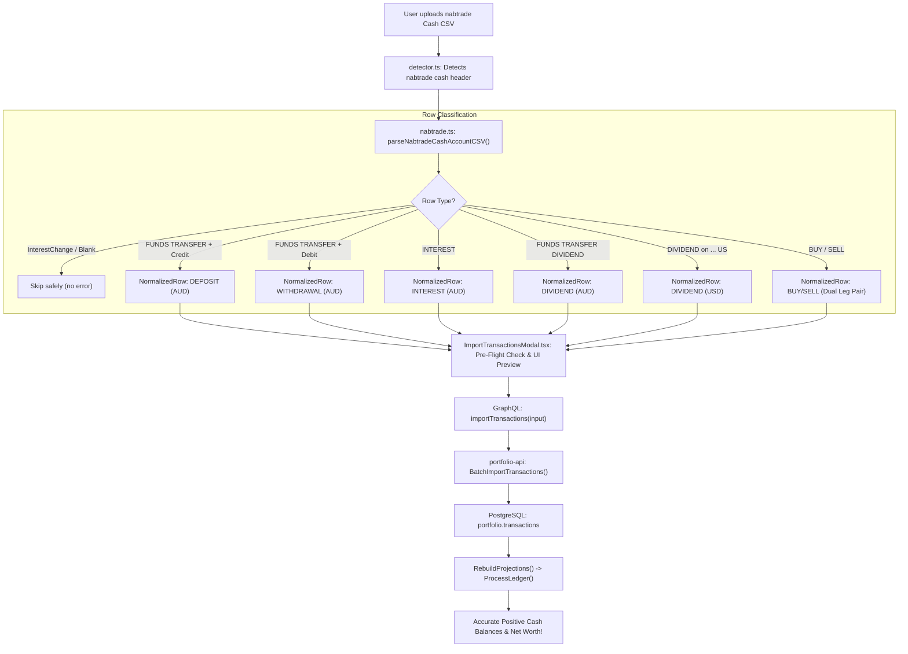

# Implementation Plan: Cash Statement CSV Ingestion (Option 2)

> **Target**: Extend the CSV ingestion engine to parse full **nabtrade Cash Account statements**, automatically capturing cash deposits, withdrawals, interest credits, and domestic/international dividends alongside equity trades to eliminate negative cash balances and maintain exact portfolio accounting.  
> **Scope**: 
> - `web/apps/main-app/src/services/csv/types.ts`
> - `web/apps/main-app/src/services/csv/detector.ts`
> - `web/apps/main-app/src/services/csv/parsers/nabtrade.ts`
> - `web/apps/main-app/src/services/csv/parsers/nabtrade.test.ts`
> - `web/apps/main-app/src/components/ImportTransactionsModal.tsx`
> - `web/apps/main-app/src/components/ImportTransactionsModal.css`
> - `services/portfolio-api/internal/service/transaction.go`
> - `services/portfolio-api/internal/service/transaction_test.go`  
> **Status**: Ready for Implementation  

---

## 1. Problem Statement & Motivation

### 1.1 The Issue
As identified in [docs/negative-cash-balance-investigation-report.md](file:///Users/oscargarcia/workspace/graphfolio/docs/negative-cash-balance-investigation-report.md), the user's portfolio currently exhibits a negative cash balance of **`-A$250,187.80`** because the transaction ledger contains 310 stock purchases debited against a baseline of `$0.00` with **zero `DEPOSIT` transactions**.

### 1.2 The Root Cause in the Ingestion Engine
The user's actual **nabtrade Cash Account statement** (`Date,Type,Description,Debit,Credit,Balance`) contains all cash deposits, withdrawals, monthly interest, and domestic/international dividends. However:
1. `types.ts` strictly limits `NormalizedTxType` to `'BUY' | 'SELL' | 'DIVIDEND'`.
2. `nabtrade.ts` only matches regex patterns for trades (`BUY`/`SELL`) and international dividends (`DIVIDEND on ...`).
3. Any description containing `FUNDS TRANSFER`, `deposit`, `transfer`, `INTEREST`, or domestic dividends (`FUNDS TRANSFER DIVIDEND - ...`) is either ignored or flagged as an error:
   `Unrecognized nabtrade cash account transaction description: "${rawDesc}"`.
4. Informational rows (such as interest rate policy updates) cause parse failures if not recognized.

---

## 2. Analysis of the User's Sample Statement Patterns

Based on the provided sample statement, the parser must handle 7 distinct row archetypes:

```csv
Date,Type,Description,Debit,Credit,Balance
2026-10-09,Credit,FUNDS TRANSFER DIVIDEND - IVV PAYMENT OCT26/00877665,,258.57,5572.18
2026-10-09,Credit,DIVIDEND on GOOGL.US (WHT of USD -4.09) - USD to AUD @ 1.4248,,33.04,5313.61
2026-09-30,Interest,INTEREST,,0.54,5174.45
2026-09-23,Credit,SELL AMD.NAS 6 USD 615.94 189411314 NT2678442-004 0.7147,,5150.74,5173.91
2026-09-03,Debit,BUY IVV.ASX 12 AUD 71.43 188373640 NT2678442-002,867.11,,23.17
2026-05-15,InterestChange,Please note from 15/05/2026 the interest rate on your account is  0.50%p.a.,,,44.15
2026-05-01,Credit,nabtrade: 24461797 FUNDS TRANSFER 083543 200538980 deposit Oscar,,300.00,908.58
2024-09-18,Debit,nabtrade: 19114270 FUNDS TRANSFER 083543 786570266 transfer Oscar,4300.00,,14.52
```

### Pattern Mapping Matrix

| Category | Description Pattern / Header Signature | Debit / Credit | Mapped Type | Currency | Symbol | External Ref |
| :--- | :--- | :---: | :---: | :---: | :---: | :--- |
| **Cash Deposit** | `nabtrade: {ref} FUNDS TRANSFER ... deposit {name}` | Credit > 0 | `DEPOSIT` | `AUD` | `""` | `nabtrade:cash:{ref}` |
| **Cash Withdrawal** | `nabtrade: {ref} FUNDS TRANSFER ... transfer/deposit {name}` | Debit > 0 | `WITHDRAWAL` | `AUD` | `""` | `nabtrade:cash:{ref}` |
| **Interest Income** | `INTEREST` (Type = `Interest` or Desc = `INTEREST`) | Credit > 0 | `INTEREST` | `AUD` | `""` | `nt_interest_{hash}` |
| **Domestic Dividend** | `FUNDS TRANSFER DIVIDEND - {TICKER} ... {REF}` | Credit > 0 | `DIVIDEND` | `AUD` | `{TICKER}` | `nabtrade:cash:div:{ref}` |
| **US Equities Dividend** | `DIVIDEND on {TICKER}.US (WHT of USD {WHT}) - USD to AUD @ {FX}` | Credit > 0 | `DIVIDEND` | `USD` | `{TICKER}` | `nt_div_{hash}` |
| **Equity Trades** | `BUY/SELL {TICKER}.{EXCH} {QTY} {CURR} {PRICE} {ORDER_ID} ...` | Debit/Credit | `BUY` / `SELL` | Native | `{TICKER}` | `nabtrade:{ORDER_ID}` |
| **Informational Row** | `Type == 'InterestChange'` or `Please note from ...` | None | *Ignore* | — | — | *Skip cleanly* |

---

## 3. Technical Architecture & Modifications



---

## 4. Detailed Component Implementation Plan

### 4.1 Frontend Types Expansion (`web/apps/main-app/src/services/csv/types.ts`)
Update `NormalizedTxType` to include cash transactions:

```typescript
export type NormalizedTxType =
  | 'BUY'
  | 'SELL'
  | 'DIVIDEND'
  | 'DEPOSIT'
  | 'WITHDRAWAL'
  | 'INTEREST';
```

- Ensure `NormalizedTransactionRow.symbol` is allowed to be empty (`""`) for cash deposits, withdrawals, and interest.
- Ensure `quantity`, `price`, and `fee` default to `"0"` and `"0.00"` for non-trade cash entries.

---

### 4.2 Broker Format Detection (`web/apps/main-app/src/services/csv/detector.ts`)
Strengthen detection for cash account statement signatures:

- Enhance the `isCashStatement` detection block:
  - Check for columns: `date`, `description`, `debit`, `credit`, `balance` (with optional `type` column).
  - Check rows for nabtrade-specific keywords: `FUNDS TRANSFER`, `deposit Oscar`, `DIVIDEND on`, `INTEREST`, `BUY `, `SELL `, or `nabtrade:`.
  - When detected, return `{ detected: 'nabtrade', headerIndex, headers }`.

---

### 4.3 Parser Engine Updates (`web/apps/main-app/src/services/csv/parsers/nabtrade.ts`)
Refactor and extend `parseNabtradeInternationalCSV` into a unified `parseNabtradeCashAccountCSV`:

#### 1. Regex Definitions
```typescript
// Cash transfer (Deposit / Withdrawal): "nabtrade: 24461797 FUNDS TRANSFER 083543 200538980 deposit Oscar"
const CASH_TRANSFER_REGEX =
  /^nabtrade:\s*([0-9]+)\s+FUNDS\s+TRANSFER\s+(?:[0-9]+\s+[0-9]+)?\s+(?:deposit|transfer)\s+(.+)/i;

// Domestic ETF/Equity Dividend: "FUNDS TRANSFER DIVIDEND - IVV PAYMENT OCT26/00877665" or "FUNDS TRANSFER DIVIDEND - CBA DIV 001312807160"
const DOMESTIC_DIV_REGEX =
  /^FUNDS\s+TRANSFER\s+DIVIDEND\s*-\s*([A-Z0-9]+)(?:\s+(?:PAYMENT|DST|DIV|ITM\s+DIV|DISTRIBUTION|REPLACEMENT))?(?:.*?([0-9]{6,12}))?/i;

// Monthly Interest: "INTEREST"
const INTEREST_REGEX = /^INTEREST$/i;
```

#### 2. Row Processing Pipeline
1. **Informational Rows**:
   - Check if `cells[typeIdx]?.toLowerCase() === 'interestchange'` or `rawDesc.toLowerCase().startsWith('please note from')`.
   - If true, silently `continue` without recording errors or transactions.
2. **Equity Trades (`BUY` / `SELL`)**:
   - Retain current pairing of `debitRow` and `creditRow` via `TRADE_REGEX` to prevent double-counting.
3. **Cash Deposits & Withdrawals (`FUNDS TRANSFER`)**:
   - Match `CASH_TRANSFER_REGEX`.
   - If `Credit > 0`: Record `type: 'DEPOSIT'`, `amount: creditVal`, `currencyCode: 'AUD'`, `externalRef: 'nabtrade:cash:' + refId`.
   - If `Debit > 0`: Record `type: 'WITHDRAWAL'`, `amount: debitVal`, `currencyCode: 'AUD'`, `externalRef: 'nabtrade:cash:' + refId`.
4. **Monthly Cash Account Interest**:
   - Match `INTEREST_REGEX` or `type === 'Interest'`.
   - If `Credit > 0`: Record `type: 'INTEREST'`, `amount: creditVal`, `currencyCode: 'AUD'`, `externalRef: nt_interest_{hash}`.
5. **Domestic Dividends**:
   - Match `DOMESTIC_DIV_REGEX`.
   - Extract ticker symbol (e.g., `IVV`, `STW`, `CBA`, `WTC`, `EDV`).
   - Extract confirmation/payment ID if present; fallback to idempotent hash `nt_div_{hash}`.
   - Record `type: 'DIVIDEND'`, `amount: creditVal`, `currencyCode: 'AUD'`.
6. **Remediation / Special Cash Credits**:
   - If description includes `REMEDIATIONPAYME` or similar bank adjustments, record as `type: 'INTEREST'` (or `DEPOSIT`) with credit amount.

---

### 4.4 Importer Modal UI (`web/apps/main-app/src/components/ImportTransactionsModal.tsx`)

1. **Table Presentation**:
   - For rows where `type` is `DEPOSIT`, `WITHDRAWAL`, or `INTEREST`:
     - Display `symbol` as `—` (or `CASH`).
     - Display `quantity` and `price` as `—`.
     - Display `fee` as `$0.00`.
     - Format `amount` with currency indicator (e.g., `$300.00 AUD`).
2. **Status Pills**:
   - Add CSS styling in `ImportTransactionsModal.css` for `.status-pill.deposit`, `.status-pill.withdrawal`, and `.status-pill.interest`:
     - `deposit`: Emerald green border/badge.
     - `withdrawal`: Amber/orange border/badge.
     - `interest`: Cyan/blue border/badge.
3. **KPI Metric Cards**:
   - Total rows, Ready to import, Duplicates, and Malformed rows now properly categorize all cash movements.

---

### 4.5 Backend Service Ingestion (`services/portfolio-api/internal/service/transaction.go`)

In `BatchImportTransactions`:
1. Check `item.Symbol == ""`:
   - If `item.Symbol` is empty (for `DEPOSIT`, `WITHDRAWAL`, `INTEREST`):
     - Bypass instrument database lookup (`instID = nil`).
     - If `item.CurrencyCode != ""`, preserve `currencyCode = strings.ToUpper(strings.TrimSpace(item.CurrencyCode))`; otherwise fallback to `portfolio.BaseCurrency`.
2. Existing `ProcessLedger` in `services/portfolio-api/internal/service/projection.go` already handles:
   ```go
   case domain.TxTypeDeposit:
       cashBalances[tx.CurrencyCode] = cashBalances[tx.CurrencyCode].Add(tx.Amount)
   case domain.TxTypeWithdrawal:
       cashBalances[tx.CurrencyCode] = cashBalances[tx.CurrencyCode].Sub(tx.Amount)
   case domain.TxTypeDividend, domain.TxTypeInterest:
       netIncome := tx.Amount.Sub(tx.WithholdingTax)
       cashBalances[tx.CurrencyCode] = cashBalances[tx.CurrencyCode].Add(netIncome)
   ```
3. After `BatchInsertTransactions`, `RebuildProjections` recalculates the portfolio cash balances with real deposits, lifting the cash balance out of the negative!

---

## 5. Step-by-Step Implementation Strategy

```text
Step 1: Frontend Types & Detection
  ├── Update web/apps/main-app/src/services/csv/types.ts
  └── Update web/apps/main-app/src/services/csv/detector.ts

Step 2: CSV Parser Implementation
  ├── Implement new patterns in web/apps/main-app/src/services/csv/parsers/nabtrade.ts
  └── Add comprehensive unit tests in nabtrade.test.ts using the user's sample data

Step 3: Frontend Modal Enhancements
  ├── Update ImportTransactionsModal.tsx table rendering for non-trade rows
  └── Add status-pill CSS classes in ImportTransactionsModal.css

Step 4: Backend Microservice Verification & Currency Fix
  ├── Audit services/portfolio-api/internal/service/transaction.go for empty symbols
  └── Add unit test in services/portfolio-api/internal/service/transaction_test.go

Step 5: End-to-End Verification
  ├── Run automated test suites (pnpm test, go test)
  └── Validate with the full sample statement CSV
```

---

## 6. Verification & Testing Strategy

### 6.1 Parser Unit Tests (`web/apps/main-app/src/services/csv/parsers/nabtrade.test.ts`)
Add table-driven test cases verifying:
1. **Funds Transfer In (Deposit)**:
   - `nabtrade: 24461797 FUNDS TRANSFER 083543 200538980 deposit Oscar,,300.00,908.58`
   - Expect `type: 'DEPOSIT'`, `amount: '300.00'`, `currencyCode: 'AUD'`, `externalRef: 'nabtrade:cash:24461797'`.
2. **Funds Transfer Out (Withdrawal)**:
   - `nabtrade: 19114270 FUNDS TRANSFER 083543 786570266 transfer Oscar,4300.00,,14.52`
   - Expect `type: 'WITHDRAWAL'`, `amount: '4300.00'`, `currencyCode: 'AUD'`, `externalRef: 'nabtrade:cash:19114270'`.
3. **Monthly Interest**:
   - `2026-09-30,Interest,INTEREST,,0.54,5174.45`
   - Expect `type: 'INTEREST'`, `amount: '0.54'`, `currencyCode: 'AUD'`.
4. **Domestic Dividend**:
   - `2026-10-09,Credit,FUNDS TRANSFER DIVIDEND - IVV PAYMENT OCT26/00877665,,258.57,5572.18`
   - Expect `type: 'DIVIDEND'`, `symbol: 'IVV'`, `amount: '258.57'`, `currencyCode: 'AUD'`.
5. **Skipped Informational Rows**:
   - `2026-05-15,InterestChange,Please note from 15/05/2026 the interest rate on your account is  0.50%p.a.,,,44.15`
   - Expect row to be ignored with zero errors.
6. **No Regressions on Equity Trades**:
   - Confirm existing ASX and US buy/sell trade pairing works seamlessly.

### 6.2 Backend Unit Tests (`services/portfolio-api/internal/service/transaction_test.go`)
- Test `BatchImportTransactions` with mixed items containing `DEPOSIT`, `WITHDRAWAL`, and `INTEREST` with empty symbols.
- Verify `RebuildProjections` properly accumulates cash into `portfolio.cash_balances`.

### 6.3 Test Execution Commands
```bash
# 1. Run web unit tests
cd web && pnpm test

# 2. Run backend portfolio-api tests
cd services/portfolio-api && go test -v -race ./...

# 3. Run BFF tests
cd bff && go test -v -race ./...
```

---

## 7. Acceptance Criteria

- [ ] All rows in the attached sample cash statement parse without throwing unrecognized description errors.
- [ ] Informational `InterestChange` rows are silently skipped.
- [ ] Deposits and withdrawals parse with exact amounts and unique `externalRef` keys.
- [ ] Monthly interest rows parse with type `INTEREST` and currency `AUD`.
- [ ] Domestic dividends parse with the correct equity ticker (e.g. `IVV`, `STW`, `CBA`) and credit amount.
- [ ] Existing trade rows (`BUY`, `SELL`) match without duplicate creation when re-imported.
- [ ] Importing the statement replenishes the portfolio cash balance and eliminates the `-A$250,187.80` overdraft.
- [ ] All TypeScript and Go unit tests pass with zero regressions.
