# Delete Asset Implementation Plan (Admin › Asset Management)

> **Goal**: Add the ability to permanently delete an asset (tradable instrument) from the GraphFolio master directory. When an asset is deleted, all corresponding historical market prices in `portfolio.instrument_prices` are deleted atomically. If an asset is actively referenced by existing user transactions or holdings, deletion is blocked with a clear precondition error to safeguard ledger integrity.

---

## 1. Executive Summary & Context

GraphFolio allows administrators to register tradable assets (`AAPL`, `NVDA`, `BHP.AX`, etc.) and ingest or backfill closing market prices for them across vendor feeds (Twelve Data, Yahoo Finance, ECB).

Currently, administrators in `admin-app` can only toggle an asset's status (`isActive = true | false`). If an asset was created in error (e.g. invalid symbol, wrong exchange MIC, duplicate identifier, or obsolete test fixture), there is no way to remove it. Furthermore, deleting an asset requires cascading deletion of all associated market prices in `portfolio.instrument_prices`.

### Key Constraints & Design Principles
1. **Atomic Price Cascade**: When an instrument is deleted, all associated historical closing prices in `portfolio.instrument_prices` must be wiped in the same atomic database transaction.
2. **Referential Integrity Guard**: If an instrument is referenced by existing investor transactions (`portfolio.transactions`) or open holdings (`portfolio.holdings`), deletion must be rejected with `ErrInstrumentInUse` (`codes.FailedPrecondition`). Administrators should deactivate such assets instead of deleting them.
3. **Audit & Safety in UI**: Deleting an asset is a destructive administrative operation. The admin UI must require explicit confirmation in a modal dialog before invoking the mutation.
4. **Contract-First Architecture**: Follow GraphFolio's layered pipeline: Proto RPC (`portfolio.proto`) → Domain & Repository (`portfolio-api`) → gRPC Server → BFF GraphQL (`schema.graphqls`) → GenQL Client (`@graphfolio/api-client`) → Admin UI (`admin-app`).

---

## 2. Current State vs. Target State

| Layer | Current State | Target State |
|---|---|---|
| **Database** | `portfolio.instrument_prices` has an FK to `portfolio.instruments(id)` **without** `ON DELETE CASCADE`. Manual deletion causes an FK violation. | Add migration `000007_cascade_instrument_prices.up.sql` updating FK with `ON DELETE CASCADE`. Repository executes atomic transaction deleting prices and instrument. |
| **Proto Contract** | `PortfolioService` has `CreateInstrument`, `UpdateInstrument`, `ListAllInstruments`, but no `DeleteInstrument`. | Add `rpc DeleteInstrument(DeleteInstrumentRequest) returns (DeleteInstrumentResponse)`. |
| **Repository** | No repository method for instrument deletion. | Implement `DeleteInstrument(ctx context.Context, id uuid.UUID) error` with transaction lock and in-use check. |
| **Service Layer** | `portfolioService` in `admin.go` only supports creating and updating instruments. | Add `DeleteInstrument(ctx context.Context, id uuid.UUID) error` with UUID validation and usage checks. |
| **gRPC Server** | No gRPC handler for deleting instruments. | Implement `DeleteInstrument` gRPC handler mapping domain errors to gRPC status codes (`NotFound`, `FailedPrecondition`, `Internal`). |
| **BFF / GraphQL** | `schema.graphqls` lacks a `deleteInstrument` mutation. | Add `deleteInstrument(id: ID!): DeleteInstrumentPayload!` and resolver implementation. |
| **Admin Portal UI** | `AssetManagement.tsx` only offers an Activate/Deactivate button in the table actions. | Add red "Delete" button (`variant="danger"`), a confirmation modal detailing the permanent deletion of market prices, and dynamic table state removal. |

---

## 3. Architecture & Data Flow

```mermaid
sequenceDiagram
    autonumber
    actor Admin as Operations Admin
    participant UI as AssetManagement (:5174 React)
    participant Modal as DeleteAssetModal
    participant BFF as BFF (:8080 GraphQL)
    participant Svc as Portfolio API (:50051 gRPC)
    participant Repo as PostgreSQL (portfolio schema)

    Admin->>UI: Clicks "Delete" on asset row (e.g. "FOO")
    UI->>Modal: Opens confirmation dialog
    Admin->>Modal: Confirms deletion
    Modal->>BFF: mutation deleteInstrument(id: $id)
    BFF->>Svc: gRPC DeleteInstrument(DeleteInstrumentRequest{id: $id})

    rect rgb(20, 30, 45)
    note over Svc,Repo: Transactional Integrity Check & Deletion
    Svc->>Repo: Begin DB Transaction
    Repo->>Repo: SELECT id FROM portfolio.instruments WHERE id = $id FOR UPDATE
    alt Instrument not found
        Repo-->>Svc: ErrInstrumentNotFound
        Svc-->>BFF: gRPC codes.NotFound
        BFF-->>UI: GraphQL Error: "instrument not found"
    else Instrument referenced in transactions / holdings
        Repo->>Repo: SELECT EXISTS(SELECT 1 FROM portfolio.transactions WHERE instrument_id = $id)
        Repo-->>Svc: ErrInstrumentInUse
        Svc-->>BFF: gRPC codes.FailedPrecondition ("asset is referenced by existing transactions")
        BFF-->>UI: GraphQL Error with precondition message
    else Eligible for Deletion
        Repo->>Repo: DELETE FROM portfolio.instrument_prices WHERE instrument_id = $id
        Repo->>Repo: DELETE FROM portfolio.instruments WHERE id = $id
        Repo-->>Svc: Commit DB Transaction
        Svc-->>BFF: DeleteInstrumentResponse{success: true, id: $id}
        BFF-->>UI: DeleteInstrumentPayload{success: true, id: $id}
        UI->>UI: Remove instrument from table state
        UI-->>Admin: Success toast: "Asset FOO and its market prices deleted"
    end
    end
```



---

## 4. Layer-by-Layer Technical Specifications

### 4.1 Database Layer (PostgreSQL Migrations)

Create migration files in `services/portfolio-api/migrations/`:

#### `000007_cascade_instrument_prices.up.sql`
```sql
-- 000007_cascade_instrument_prices.up.sql
-- Allow cascading deletion of historical prices when an instrument is deleted.

ALTER TABLE portfolio.instrument_prices
    DROP CONSTRAINT IF EXISTS instrument_prices_instrument_id_fkey,
    ADD CONSTRAINT instrument_prices_instrument_id_fkey
        FOREIGN KEY (instrument_id) REFERENCES portfolio.instruments(id) ON DELETE CASCADE;
```

#### `000007_cascade_instrument_prices.down.sql`
```sql
-- 000007_cascade_instrument_prices.down.sql
-- Revert cascading deletion on instrument prices.

ALTER TABLE portfolio.instrument_prices
    DROP CONSTRAINT IF EXISTS instrument_prices_instrument_id_fkey,
    ADD CONSTRAINT instrument_prices_instrument_id_fkey
        FOREIGN KEY (instrument_id) REFERENCES portfolio.instruments(id);
```

---

### 4.2 Protocol Buffers Contract (`proto/portfolio/v1/portfolio.proto`)

Add the deletion RPC to `PortfolioService` under the **Admin: Asset Directory Management** section:

```protobuf
service PortfolioService {
  ...
  // Admin: Asset Directory Management
  rpc ListAllInstruments(ListAllInstrumentsRequest) returns (ListAllInstrumentsResponse) {}
  rpc CreateInstrument(CreateInstrumentRequest) returns (CreateInstrumentResponse) {}
  rpc UpdateInstrument(UpdateInstrumentRequest) returns (UpdateInstrumentResponse) {}
  rpc DeleteInstrument(DeleteInstrumentRequest) returns (DeleteInstrumentResponse) {}
  rpc ListExchanges(ListExchangesRequest) returns (ListExchangesResponse) {}
  ...
}

message DeleteInstrumentRequest {
  string id = 1; // Instrument UUID
}

message DeleteInstrumentResponse {
  bool   success = 1;
  string id      = 2; // Instrument UUID that was deleted
}
```

---

### 4.3 Backend Microservice (`services/portfolio-api/`)

#### 4.3.1 Repository Queries & Interface (`internal/repository/`)

**In `internal/repository/repository.go`**:
```go
var (
    ErrPortfolioNotFound   = errors.New("portfolio not found")
    ErrInstrumentNotFound  = errors.New("instrument not found")
    ErrTransactionNotFound = errors.New("transaction not found")
    ErrInstrumentConflict  = errors.New("instrument already exists")
    ErrInstrumentInUse     = errors.New("cannot delete instrument: it is referenced by existing transactions or holdings")
)

type Repository interface {
    ...
    DeleteInstrument(ctx context.Context, id uuid.UUID) error
    ...
}
```

**In `internal/repository/queries.go`**:
```go
const (
    ...
    checkInstrumentUsageSQL = `
SELECT EXISTS (
    SELECT 1 FROM portfolio.transactions WHERE instrument_id = $1
) OR EXISTS (
    SELECT 1 FROM portfolio.holdings WHERE instrument_id = $1
);`

    deleteInstrumentPricesByInstrumentSQL = `
DELETE FROM portfolio.instrument_prices
WHERE instrument_id = $1;`

    deleteInstrumentSQL = `
DELETE FROM portfolio.instruments
WHERE id = $1;`
)
```

**In `internal/repository/postgres.go`**:
```go
func (r *PostgresRepository) DeleteInstrument(ctx context.Context, id uuid.UUID) error {
    tx, err := r.pool.Begin(ctx)
    if err != nil {
        return fmt.Errorf("repository: begin tx for delete instrument: %w", err)
    }
    defer tx.Rollback(ctx)

    // 1. Verify existence with row-lock
    var existingID uuid.UUID
    err = tx.QueryRow(ctx, "SELECT id FROM portfolio.instruments WHERE id = $1 FOR UPDATE;", id).Scan(&existingID)
    if err != nil {
        if errors.Is(err, pgx.ErrNoRows) {
            return ErrInstrumentNotFound
        }
        return fmt.Errorf("repository: check instrument existence: %w", err)
    }

    // 2. Guard against in-use assets (transactions or active holdings)
    var inUse bool
    if err := tx.QueryRow(ctx, checkInstrumentUsageSQL, id).Scan(&inUse); err != nil {
        return fmt.Errorf("repository: check instrument usage: %w", err)
    }
    if inUse {
        return ErrInstrumentInUse
    }

    // 3. Atomically delete associated market prices
    if _, err := tx.Exec(ctx, deleteInstrumentPricesByInstrumentSQL, id); err != nil {
        return fmt.Errorf("repository: delete instrument prices: %w", err)
    }

    // 4. Delete the instrument record
    cmdTag, err := tx.Exec(ctx, deleteInstrumentSQL, id)
    if err != nil {
        return fmt.Errorf("repository: delete instrument: %w", err)
    }
    if cmdTag.RowsAffected() == 0 {
        return ErrInstrumentNotFound
    }

    return tx.Commit(ctx)
}
```

#### 4.3.2 Service Layer (`internal/service/`)

**In `internal/service/service.go`**:
```go
type PortfolioService interface {
    ...
    DeleteInstrument(ctx context.Context, id uuid.UUID) error
    ...
}
```

**In `internal/service/admin.go`**:
```go
var (
    ...
    ErrInstrumentInUse = repository.ErrInstrumentInUse
)

func (s *portfolioService) DeleteInstrument(ctx context.Context, id uuid.UUID) error {
    if id == uuid.Nil {
        return errors.New("invalid instrument id")
    }
    return s.repo.DeleteInstrument(ctx, id)
}
```

#### 4.3.3 gRPC Server Handler (`internal/server.go`)

```go
func (s *PortfolioServer) DeleteInstrument(ctx context.Context, req *pb.DeleteInstrumentRequest) (*pb.DeleteInstrumentResponse, error) {
    if s.svc == nil {
        return nil, status.Error(codes.Unavailable, "service not initialized")
    }

    if req.GetId() == "" {
        return nil, status.Error(codes.InvalidArgument, "instrument id cannot be empty")
    }

    id, err := uuid.Parse(req.GetId())
    if err != nil {
        return nil, status.Errorf(codes.InvalidArgument, "invalid instrument id: %v", err)
    }

    err = s.svc.DeleteInstrument(ctx, id)
    if err != nil {
        if errors.Is(err, repository.ErrInstrumentNotFound) {
            return nil, status.Errorf(codes.NotFound, "instrument %s not found", req.GetId())
        }
        if errors.Is(err, repository.ErrInstrumentInUse) {
            return nil, status.Errorf(codes.FailedPrecondition, "cannot delete instrument: %v", err)
        }
        return nil, status.Errorf(codes.Internal, "failed to delete instrument: %v", err)
    }

    return &pb.DeleteInstrumentResponse{
        Success: true,
        Id:      req.GetId(),
    }, nil
}
```

---

### 4.4 Backend-for-Frontend (BFF GraphQL Layer)

#### 4.4.1 GraphQL Schema (`bff/graph/schema.graphqls`)

```graphql
type DeleteInstrumentPayload {
  success: Boolean!
  id: ID!
}

extend type Mutation {
  deleteInstrument(id: ID!) : DeleteInstrumentPayload!
}
```

#### 4.4.2 GraphQL Resolver (`bff/graph/schema.resolvers.go`)

```go
// DeleteInstrument is the resolver for the deleteInstrument field.
func (r *mutationResolver) DeleteInstrument(ctx context.Context, id string) (*model.DeleteInstrumentPayload, error) {
    req := &pb.DeleteInstrumentRequest{
        Id: id,
    }

    resp, err := r.PortfolioClient.DeleteInstrument(ctx, req)
    if err != nil {
        return nil, err
    }

    return &model.DeleteInstrumentPayload{
        Success: resp.Success,
        Id:      resp.Id,
    }, nil
}
```

---

### 4.5 Web Admin Portal (`web/apps/admin-app/`)

#### 4.5.1 Delete Asset Confirmation Modal (`DeleteAssetModal.tsx`)

Create `web/apps/admin-app/src/components/DeleteAssetModal.tsx`:
- Render within `@graphfolio/ui` `<Modal>` component.
- Display warning message specifying that all associated market price history will be permanently deleted.
- Display asset details: Symbol, Name, Exchange MIC, and Currency.
- Provide a red "Delete Asset & Prices" confirmation button with loading spinner and a "Cancel" button.
- Surface error messages cleanly if the backend returns a precondition error (e.g., asset in use).

#### 4.5.2 Asset Management View Integration (`AssetManagement.tsx`)

Update `web/apps/admin-app/src/components/AssetManagement.tsx`:
- Add `assetToDelete: InstrumentRecord | null` state.
- In the table `Actions` column, render a red "Delete" button (`variant="danger"`, `size="sm"`).
- On delete confirmation:
  ```ts
  const handleConfirmDelete = async () => {
    if (!assetToDelete) return;
    setIsDeleting(true);
    try {
      const res = await client.mutation({
        deleteInstrument: {
          __args: { id: assetToDelete.id },
          success: true,
          id: true,
        },
      });
      if (res.deleteInstrument?.success) {
        setInstruments((prev) => prev.filter((i) => i.id !== assetToDelete.id));
        onNotify(`Asset ${assetToDelete.symbol} and its market prices were deleted.`);
        setAssetToDelete(null);
      }
    } catch (err: any) {
      onNotify(`Cannot delete ${assetToDelete.symbol}: ${err?.message || 'In use by transactions'}`);
    } finally {
      setIsDeleting(false);
    }
  };
  ```

---

## 5. Step-by-Step Implementation Sequence

### Phase 1: Database Migration & Schema
1. Create `services/portfolio-api/migrations/000007_cascade_instrument_prices.up.sql`.
2. Create `services/portfolio-api/migrations/000007_cascade_instrument_prices.down.sql`.
3. Apply migration: `make migrate-up`.

### Phase 2: Proto Contracts & Code Generation
1. Update `proto/portfolio/v1/portfolio.proto` with `DeleteInstrument` RPC and messages.
2. Run `make proto` to generate protobuf Go stubs.

### Phase 3: Microservice Implementation (`portfolio-api`)
1. Add `ErrInstrumentInUse` to `internal/repository/repository.go`.
2. Add queries `checkInstrumentUsageSQL`, `deleteInstrumentPricesByInstrumentSQL`, and `deleteInstrumentSQL` to `internal/repository/queries.go`.
3. Implement `DeleteInstrument` in `internal/repository/postgres.go`.
4. Update `PortfolioService` interface in `internal/service/service.go`.
5. Implement `DeleteInstrument` in `internal/service/admin.go`.
6. Implement `DeleteInstrument` gRPC handler in `internal/server.go`.
7. Regenerate mocks: `make generate`.

### Phase 4: BFF GraphQL Schema & Resolver
1. Update `bff/graph/schema.graphqls` with `DeleteInstrumentPayload` and `deleteInstrument` mutation.
2. Run `cd bff && go run github.com/99designs/gqlgen generate`.
3. Implement `DeleteInstrument` in `bff/graph/schema.resolvers.go`.
4. Regenerate GenQL client: `cd web && npx genql --schema ../bff/graph/schema.graphqls --output ./packages/api-client/src/generated`.

### Phase 5: Admin UI (`apps/admin-app`)
1. Create `DeleteAssetModal.tsx` and accompanying CSS if needed.
2. Wire delete action and modal into `AssetManagement.tsx`.
3. Verify interactive state updates, table removal, and notifications.

### Phase 6: Automated Testing & Verification
1. Unit tests in `services/portfolio-api/internal/service/admin_test.go`:
   - Success case: Repo deletes instrument without error.
   - Nil UUID error.
   - Propagate `ErrInstrumentNotFound`.
   - Propagate `ErrInstrumentInUse`.
2. Unit tests in `services/portfolio-api/internal/server_test.go`:
   - Success mapping: returns `success: true`.
   - Empty ID: returns `codes.InvalidArgument`.
   - Invalid UUID: returns `codes.InvalidArgument`.
   - Not found: returns `codes.NotFound`.
   - In use: returns `codes.FailedPrecondition`.
3. Unit tests in `bff/graph/schema.resolvers_test.go`:
   - Resolver calling gRPC client and returning payload.
4. Run full test suites:
   - `make test`
   - `go test -v -race ./...`

---

## 6. Testing Strategy & Verification Procedures

### 6.1 Unit Tests (Standard Library `testing` Only)
Per GraphFolio rules, avoid 3rd-party assertions (`testify`). Use standard Go table-driven tests:
- **`TestPortfolioService_DeleteInstrument`**:
  ```go
  func TestPortfolioService_DeleteInstrument(t *testing.T) {
      ctrl := gomock.NewController(t)
      defer ctrl.Finish()
      mockRepo := mocks.NewMockRepository(ctrl)
      svc := service.NewPortfolioService(mockRepo)
      ctx := context.Background()
      instID := uuid.New()

      t.Run("success", func(t *testing.T) {
          mockRepo.EXPECT().DeleteInstrument(ctx, instID).Return(nil)
          err := svc.DeleteInstrument(ctx, instID)
          if err != nil {
              t.Fatalf("expected no error, got %v", err)
          }
      })

      t.Run("nil uuid returns error", func(t *testing.T) {
          err := svc.DeleteInstrument(ctx, uuid.Nil)
          if err == nil {
              t.Fatal("expected error for nil uuid, got nil")
          }
      })

      t.Run("instrument in use returns ErrInstrumentInUse", func(t *testing.T) {
          mockRepo.EXPECT().DeleteInstrument(ctx, instID).Return(repository.ErrInstrumentInUse)
          err := svc.DeleteInstrument(ctx, instID)
          if !errors.Is(err, repository.ErrInstrumentInUse) {
              t.Fatalf("expected ErrInstrumentInUse, got %v", err)
          }
      })
  }
  ```

- **`TestPortfolioServer_DeleteInstrument`**:
  - Test valid UUID deletion.
  - Test missing ID (`InvalidArgument`).
  - Test invalid UUID string (`InvalidArgument`).
  - Test non-existent instrument (`NotFound`).
  - Test referenced instrument (`FailedPrecondition`).

- **`TestMutationResolver_DeleteInstrument`**:
  - Test GraphQL mutation forwarding to gRPC mock and payload unmarshaling.

### 6.2 Manual Verification Steps
1. **Empty Asset Deletion**:
   - Register new test asset `TESTX` on exchange `XNAS`.
   - Backfill or manually insert 5 closing prices for `TESTX`.
   - Click "Delete" in Admin Portal.
   - Verify confirmation modal displays warning.
   - Confirm deletion.
   - Query DB: Verify `TESTX` is gone from `portfolio.instruments` AND all 5 rows are gone from `portfolio.instrument_prices`.
2. **In-Use Asset Protection**:
   - Attempt to delete `AAPL` (which is held in demo portfolio).
   - Verify modal or notification alerts: "Cannot delete instrument: it is referenced by existing transactions or holdings".
   - Verify `AAPL` and its prices remain intact in the database.
