# Exchange Code Dropdown Implementation Plan (Admin › Register Tradable Asset)

> **Goal**: In the admin portal's **Register Tradable Asset** modal, replace the free-text *Exchange Code* input with a dropdown populated from the authoritative list of available exchanges. The selected option submits the exchange **code** as a plain string, shows a `Select Exchange` placeholder, and all existing form validation is preserved.

---

## 1. Current State & Gap Analysis

| Area | Current State | Gap |
|------|---------------|-----|
| UI | [`AddInstrumentModal.tsx`](../../web/apps/admin-app/src/components/AddInstrumentModal.tsx) renders `<Input label="Exchange Code *">` with default state `'US'`. | Free text allows invalid codes. Default `'US'` is **not** a valid exchange code and fails the FK on insert. |
| Shared UI | [`Select.tsx`](../../web/packages/ui/src/components/Select/Select.tsx) renders `options` **or** `children`, never both. | No first-class placeholder support. |
| Database | `portfolio.exchanges (code PK, name, country, timezone)` in [`000001_reference_data.up.sql`](../../services/portfolio-api/migrations/000001_reference_data.up.sql). `instruments.exchange_code` is an FK. Seeds: `XNAS`, `XNYS`, `XASX`. | Data exists. |
| Proto / gRPC | No exchange listing RPC. | Need `ListExchanges`. |
| BFF / GraphQL | No `exchanges` query. | Need `exchanges: [Exchange!]!`. |
| Validation | Client side: `!cleanExchange` → "Symbol, exchange code, and instrument name are required." Server side: `ErrInvalidExchange` when the code is empty ([`admin.go`](../../services/portfolio-api/internal/service/admin.go)). DB FK. | Keep all three layers unchanged. |

> [!NOTE]
> The data source is `portfolio.exchanges`, so new exchanges appear in the dropdown without frontend changes. A hard-coded frontend list would drift from the FK-constrained table.

---

## 2. Data Flow

```mermaid
sequenceDiagram
    participant UI as AssetManagement / AddInstrumentModal
    participant BFF as BFF (gqlgen)
    participant API as portfolio-api (gRPC)
    participant DB as PostgreSQL (portfolio.exchanges)

    UI->>BFF: query { exchanges { code name country timezone } }
    BFF->>API: ListExchanges()
    API->>DB: SELECT code, name, country, timezone ORDER BY code
    DB-->>API: rows
    API-->>BFF: ListExchangesResponse
    BFF-->>UI: [Exchange!]!
    UI->>UI: Render <Select placeholder="Select Exchange" options=[{label:"XNAS — NASDAQ Stock Market", value:"XNAS"}...]>
    UI->>BFF: mutation createInstrument(input: { exchangeCode: "XNAS", ... })
```



---

## 3. Layer-by-Layer Technical Specifications

### 3.1 Protocol Buffers (`proto/portfolio/v1/portfolio.proto`)

Add to the admin RPC block of `PortfolioService`:

```protobuf
rpc ListExchanges(ListExchangesRequest) returns (ListExchangesResponse) {}

message Exchange {
  string code     = 1; // ISO 10383 MIC, e.g. "XNAS"
  string name     = 2; // e.g. "NASDAQ Stock Market"
  string country  = 3; // ISO 3166-1 alpha-2, e.g. "US"
  string timezone = 4; // IANA tz, e.g. "America/New_York"
}

message ListExchangesRequest {}

message ListExchangesResponse {
  repeated Exchange exchanges = 1;
}
```

### 3.2 Backend (`services/portfolio-api/`)

#### 3.2.1 Domain (`internal/domain/exchange.go`, new)

```go
type Exchange struct {
    Code     string
    Name     string
    Country  string
    Timezone string
}
```

#### 3.2.2 Repository (`internal/repository/repository.go`, `postgres.go`)

- Interface: `ListExchanges(ctx context.Context) ([]domain.Exchange, error)`
- Query:
  ```sql
  SELECT code, name, country, timezone
  FROM portfolio.exchanges
  ORDER BY code ASC;
  ```
- Return an empty slice (not `nil`) when there are no rows, so the GraphQL response is `[]`.

#### 3.2.3 Service (`internal/service/service.go`, `admin.go`)

- Interface: `ListExchanges(ctx context.Context) ([]domain.Exchange, error)`
- Implementation delegates to `s.repo.ListExchanges(ctx)` and wraps errors (`fmt.Errorf("list exchanges: %w", err)`).
- **No change** to `CreateInstrument` validation. `ErrInvalidExchange` and the FK remain the server-side guards.

#### 3.2.4 gRPC Server (`internal/server.go`)

- `func (s *PortfolioServer) ListExchanges(ctx, *pb.ListExchangesRequest) (*pb.ListExchangesResponse, error)`
- Map domain to proto. On error, return `status.Error(codes.Internal, ...)` (same as `ListAllInstruments`).

### 3.3 BFF (`bff/`)

#### 3.3.1 Schema (`bff/graph/schema.graphqls`)

```graphql
type Exchange {
  code: String!
  name: String!
  country: String!
  timezone: String!
}

type Query {
  # ...existing
  exchanges: [Exchange!]!
}
```

#### 3.3.2 Resolver (`bff/graph/schema.resolvers.go`, `helpers.go`)

- `Exchanges(ctx)` calls `r.PortfolioClient.ListExchanges` and maps the result with a `toGQLExchange` helper in `helpers.go`.
- Add `ListExchanges` to `fakePortfolioClient` in `schema.resolvers_test.go`. This is required for the package to compile.

### 3.4 Shared UI (`web/packages/ui/src/components/Select/Select.tsx`)

Add an optional `placeholder` prop. The change is backward compatible: existing call sites are unaffected.

```tsx
export interface SelectProps extends React.SelectHTMLAttributes<HTMLSelectElement> {
  label?: string;
  options?: SelectOption[];
  placeholder?: string;   // NEW
  error?: string;
  helperText?: string;
}

// inside <select>:
{placeholder !== undefined && (
  <option value="" disabled>
    {placeholder}
  </option>
)}
{options ? options.map(...) : children}
```

- The placeholder option uses `value=""`. When the component's `value` is `''`, the placeholder is shown.
- `disabled` stops the user from re-selecting the placeholder after choosing a real exchange.
- Add a `.gf-select:has(option[value=""]:checked)` (or `:invalid` when `required`) rule in `Select.css` to show the placeholder in muted text (`var(--color-text-muted)`).

### 3.5 Admin App (`web/apps/admin-app/`)

#### 3.5.1 `AssetManagement.tsx`: fetch exchanges

Data fetching stays in the parent, so the modal remains presentational (same as `onSubmit`):

```tsx
interface ExchangeOption { code: string; name: string; }

const [exchanges, setExchanges] = useState<ExchangeOption[]>([]);
const [exchangesLoading, setExchangesLoading] = useState(false);
const [exchangesError, setExchangesError] = useState<string | null>(null);

useEffect(() => {
  if (!isModalOpen || exchanges.length > 0) return; // lazy, fetch once
  setExchangesLoading(true);
  client.query({ exchanges: { code: true, name: true } })
    .then((res) => { setExchanges(res.exchanges); setExchangesError(null); })
    .catch((err) => setExchangesError(err?.message || 'Failed to load exchanges'))
    .finally(() => setExchangesLoading(false));
}, [isModalOpen, exchanges.length]);

<AddInstrumentModal
  ...
  exchanges={exchanges}
  exchangesLoading={exchangesLoading}
  exchangesError={exchangesError}
/>
```

#### 3.5.2 `AddInstrumentModal.tsx`: swap Input for Select

1. **Props**: add `exchanges: { code: string; name: string }[]`, `exchangesLoading?: boolean`, `exchangesError?: string | null`.
2. **State**: change the initial and reset value of `exchangeCode` from `'US'` to `''`, so the placeholder shows by default.
3. **Options**: memoise them.
   ```tsx
   const exchangeOptions = useMemo(
     () => exchanges.map((x) => ({ label: `${x.code} — ${x.name}`, value: x.code })),
     [exchanges]
   );
   ```
4. **Render** (replaces lines 114–121):
   ```tsx
   <Select
     id="instrument-exchange-code"
     label="Exchange Code *"
     placeholder={exchangesLoading ? 'Loading exchanges…' : 'Select Exchange'}
     value={exchangeCode}
     onChange={(e) => setExchangeCode(e.target.value)}
     options={exchangeOptions}
     disabled={isSubmitting || exchangesLoading || !!exchangesError}
     error={exchangesError ?? undefined}
     required
   />
   ```
5. **Validation is preserved as-is**:
   - `cleanExchange = exchangeCode.trim().toUpperCase()` stays. It is a no-op on MIC codes but keeps the same safety net.
   - `if (!cleanSymbol || !cleanExchange || !cleanName)` produces the same error message. The empty placeholder value `''` triggers it.
   - Currency and ISIN checks are unchanged.
   - Submits `exchangeCode: cleanExchange`, a `string`. The `NewInstrumentData` contract is unchanged.

> [!IMPORTANT]
> The footer *Register Asset* button calls `handleSubmit` through `onClick`, not native form submit. The browser's `required` constraint therefore does **not** block submission, and the existing JS check stays the authoritative client-side guard. Do not remove it.

---

## 4. Implementation Phases

| # | Phase | Tasks |
|---|-------|-------|
| 1 | Contract | Add `Exchange`, `ListExchanges*` to proto. Run `make proto`. |
| 2 | Backend | Domain struct, repository query, service method, gRPC handler. Run `make generate` (mocks). |
| 3 | Backend tests | Service + server unit tests (see §5.2). |
| 4 | BFF | Schema type + query, `gqlgen generate`, resolver + helper, fake client method, resolver test. |
| 5 | API client | Regenerate genql client (`make generate`) so `client.query({ exchanges })` is typed. |
| 6 | Shared UI | `placeholder` prop + muted placeholder styling in `Select`. |
| 7 | Admin app | Fetch in `AssetManagement`, swap the field in `AddInstrumentModal`, reset to `''`. |
| 8 | Docs | Update `AGENTS.md` (proto RPC list, repository list, GraphQL query list) and `FEATURES.md`. |

---

## 5. Verification

### 5.1 Automated

```bash
make proto && make generate
gofmt -l . && go vet ./...
go test -v -race ./services/portfolio-api/... ./bff/...
npm --prefix web run build      # type-checks ui, api-client, admin-app
```

### 5.2 Unit Test Matrix (stdlib `testing` only, no testify)

| Layer | Test | Cases |
|-------|------|-------|
| Service | `TestPortfolioService_ListExchanges` | returns repo rows in order; repo error is wrapped and propagated |
| gRPC | `TestPortfolioServer_ListExchanges` | maps all four fields; service error → `codes.Internal`; empty list → empty `exchanges` |
| BFF | `TestQueryResolver_Exchanges` | maps proto → GraphQL; gRPC error surfaces as GraphQL error |

### 5.3 Manual (admin-app on `:5174`)

1. Open **Assets → Register Asset**. The Exchange field shows **"Select Exchange"** in muted text.
2. Expand the dropdown. It lists `XASX — Australian Securities Exchange`, `XNAS — NASDAQ Stock Market`, `XNYS — New York Stock Exchange`.
3. Fill symbol/name but leave Exchange unset, then click **Register Asset**. You see the existing error *"Symbol, exchange code, and instrument name are required."*
4. Select `XNAS`, fill the remaining fields, and submit. The network payload has `exchangeCode: "XNAS"` (string), the instrument appears in the table, and the form resets to the placeholder.
5. Stop `portfolio-api` and reopen the modal. The Exchange field is disabled, the inline error shows, and the other fields remain usable.
6. Re-check the invalid-currency and invalid-ISIN errors. Both still trigger.

---

## 6. Out of Scope / Follow-ups

- Admin CRUD for exchanges (create/edit MICs from the portal).
- Filtering exchanges by selected asset class (e.g. a `CRYPTO` pseudo-exchange).
- Using the dropdown in an Edit Instrument flow (today `UpdateInstrument` only toggles `isActive`).
- Converting *Trading Currency* to a dropdown backed by `portfolio.currencies` using the same pattern.
