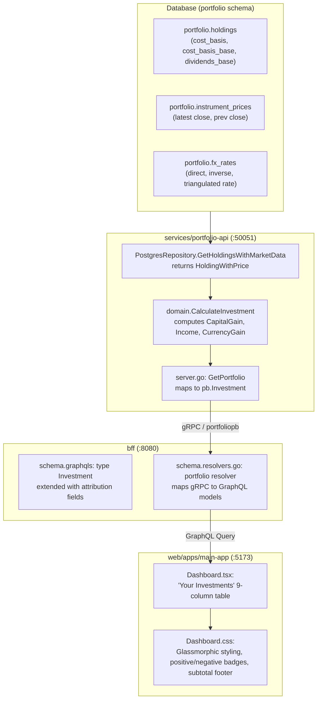

# Implementation Plan: Investment Holding Return Attribution (Capital Gain, Income & Currency Gain/Loss)

> **User Story**: [investment-holding-capital-gain-income-currency.md](file:///Users/oscargarcia/workspace/graphfolio/docs/user-stories/investment-holding-capital-gain-income-currency.md)  
> **Status**: Completed  
> **Roadmap Reference**: [FEATURES.md (Feature #25)](file:///Users/oscargarcia/workspace/graphfolio/FEATURES.md#L35)  
> **Calculation Standard**: [financial-calculations skill](file:///Users/oscargarcia/workspace/graphfolio/.agents/skills/financial-calculations/SKILL.md)  
> **Target Layers**: Protobuf (`proto/portfolio/v1/`), Domain Microservice (`services/portfolio-api`), BFF (`bff/`), Web Monorepo (`web/apps/main-app`)  

---

## 1. Executive Summary & Objective

The objective of this feature is to decompose individual investment returns in the primary investor dashboard into three distinct financial pillars:
1. **Capital Gain / Loss**: Pure asset price appreciation or depreciation in the local listing currency, translated to the portfolio base currency at the historical acquisition exchange rate.
2. **Income**: Cumulative dividends and cash interest credited to the instrument (net of foreign withholding tax), accompanied by Yield on Cost (YOC%).
3. **Currency Gain / Loss**: Foreign exchange fluctuations between the instrument denomination currency ($C_{\text{inst}}$) and the investor's base currency ($C_{\text{base}}$) for international assets; safely rendered as neutral (`—`) for domestic holdings.

The sum of Capital Gain and Currency Gain mathematically reconciles to total mark-to-market unrealized gain/loss:
$$\text{CapGain}_{\text{base}} + \text{FXGain}_{\text{base}} \equiv V_{\text{base}} - C_{\text{base}}$$
And full total economic return reconciles to:
$$\text{TotalReturn}_{\text{base}} = \text{CapGain}_{\text{base}} + \text{FXGain}_{\text{base}} + \text{Income}_{\text{base}} + \text{RealizedPnL}_{\text{base}}$$

---

## 2. Technical Architecture & Data Flow



---

## 3. Mathematical Attribution Specifications

All calculations must be performed using arbitrary-precision fixed-point math (`github.com/shopspring/decimal` in Go, `Decimal` scalar in GraphQL).

### 3.1 Input Parameters for Holding $i$
| Variable | Domain Type | Source / Meaning |
| :--- | :--- | :--- |
| $Q_t$ | `decimal.Decimal` | Open share quantity (`h.Quantity`) |
| $P_t$ | `decimal.Decimal` | Latest official close price in instrument currency (`h.LatestPrice`) |
| $C_{\text{inst}}$ | `string` | Instrument denomination currency (e.g. `USD`, `EUR`, `AUD`) |
| $C_{\text{base}}$ | `string` | Portfolio base currency (e.g. `AUD`) |
| $C_{\text{local}}$ | `decimal.Decimal` | Total purchase cost in instrument currency (`h.CostBasis`) |
| $C_{\text{base}}$ | `decimal.Decimal` | Total purchase cost in portfolio base currency (`h.CostBasisBase`) |
| $\text{FX}_t$ | `decimal.Decimal` | Current spot exchange rate ($C_{\text{inst}} \to C_{\text{base}}$) (`h.FXRateToBase`) |
| $\text{Income}_{\text{base}}$ | `decimal.Decimal` | Cumulative dividends/interest in base currency (`h.DividendsBase`) |
| $\text{Realized}_{\text{base}}$ | `decimal.Decimal` | Realized PnL from partial sales (`h.RealizedPnLBase`) |

### 3.2 Computation Steps in `domain.CalculateInvestment`
```go
// 1. Determine International Status
isInternational := h.InstrumentCurrency != baseCurrency

// 2. Resolve Spot FX Rate (fallback to 1.0 if domestic or missing)
fxRate := h.FXRateToBase
if !fxRate.IsPositive() {
    fxRate = one
}

// 3. Weighted-Average Acquisition FX Rate
// FX_0 = CostBasisBase / CostBasis (when CostBasis > 0)
histFX := fxRate
if h.CostBasis.IsPositive() && h.CostBasisBase.IsPositive() {
    histFX = h.CostBasisBase.DivRound(h.CostBasis, 8)
}

// 4. Market Values
totalValueInst := h.Quantity.Mul(h.LatestPrice)
totalValueBase := totalValueInst.Mul(fxRate)

// 5. Capital Gain (Price Movement)
capGainLocal := totalValueInst.Sub(h.CostBasis)
capGainBase := capGainLocal.Mul(histFX)

var capGainPercent decimal.Decimal
if h.CostBasis.IsPositive() {
    capGainPercent = capGainLocal.DivRound(h.CostBasis, 6).Mul(oneHundred).Round(2)
}

// 6. Currency Gain (FX Movement)
var currencyGainBase decimal.Decimal
var currencyGainPercent decimal.Decimal

if isInternational {
    // FXGainBase = TotalValueInst * (FX_t - FX_0)
    fxDelta := fxRate.Sub(histFX)
    currencyGainBase = totalValueInst.Mul(fxDelta)

    if histFX.IsPositive() {
        currencyGainPercent = fxDelta.DivRound(histFX, 6).Mul(oneHundred).Round(2)
    }
}

// 7. Income & Yield on Cost (YOC)
incomeBase := h.DividendsBase
var incomeYieldPercent decimal.Decimal
if h.CostBasisBase.IsPositive() {
    incomeYieldPercent = incomeBase.DivRound(h.CostBasisBase, 6).Mul(oneHundred).Round(2)
}

// 8. Total Return (Consolidated)
totalReturnBase := totalValueBase.Sub(h.CostBasisBase).Add(h.RealizedPnLBase).Add(incomeBase)
var totalReturnPercent decimal.Decimal
if h.CostBasisBase.IsPositive() {
    totalReturnPercent = totalReturnBase.DivRound(h.CostBasisBase, 6).Mul(oneHundred).Round(2)
}
```

---

## 4. Phase-by-Phase Implementation Plan

### Phase 1: Protocol Buffers Definition (`proto/`)
Extend `message Investment` in `proto/portfolio/v1/portfolio.proto`:
- Add fields 11 through 17:
  ```protobuf
  message Investment {
    string            id                     = 1;
    string            ticker                 = 2;
    string            name                   = 3;
    common.v1.Money   price                  = 4;
    common.v1.Decimal quantity               = 5;
    common.v1.Money   total_value            = 6;
    common.v1.Money   today_return_amount    = 7;
    common.v1.Decimal today_return_percent   = 8;
    common.v1.Money   total_return_amount    = 9;
    common.v1.Decimal total_return_percent   = 10;

    // Multi-Currency Return Attribution
    common.v1.Money   capital_gain_amount    = 11;
    common.v1.Decimal capital_gain_percent   = 12;
    common.v1.Money   income_amount          = 13;
    common.v1.Decimal income_yield_percent   = 14;
    common.v1.Money   currency_gain_amount   = 15;
    common.v1.Decimal currency_gain_percent  = 16;
    bool              is_international       = 17;
  }
  ```
- Run: `make proto` to compile Go stubs.

### Phase 2: Domain Engine & Unit Tests (`services/portfolio-api`)
1. **Extend `domain.InvestmentSummary` in `internal/domain/holding.go`**:
   - Add `CapitalGainAmount Money`, `CapitalGainPercent decimal.Decimal`
   - Add `IncomeAmount Money`, `IncomeYieldPercent decimal.Decimal`
   - Add `CurrencyGainAmount Money`, `CurrencyGainPercent decimal.Decimal`
   - Add `IsInternational bool`
2. **Update `domain.CalculateInvestment` in `internal/domain/calculator.go`**:
   - Implement the attribution formulation with exact decimal arithmetic.
   - Return rounded 2-decimal `Money` structures in base currency.
3. **Comprehensive Unit Tests in `internal/domain/calculator_test.go`**:
   - **Test 1**: Domestic Holding (`AUD` in `AUD` portfolio) $\to$ `CurrencyGainAmount == 0`, `CurrencyGainPercent == 0`, `IsInternational == false`.
   - **Test 2**: International Holding with Positive Price & Positive FX gain $\to$ verify exact reconciliation $\text{CapGain} + \text{FXGain} = \text{TotalValueBase} - \text{CostBasisBase}$.
   - **Test 3**: International Holding with Positive Price Gain but Negative FX Headwind (net drag).
   - **Test 4**: Zero Cost Basis edge case $\to$ safe `decimal.Zero` for percentages without division panic.
   - **Test 5**: Holding with Dividends $\to$ verify `IncomeAmount` and `IncomeYieldPercent` calculations.
4. **Update gRPC Server in `internal/server.go`**:
   - In `convertPortfolioSummaryToProto`, map the new fields into `*pb.Investment`.
5. **Update gRPC Mocks & Tests**:
   - Update `server_test.go` and `service_test.go`.
   - Run: `go test -v -race ./services/portfolio-api/...`

### Phase 3: BFF GraphQL Layer (`bff/`)
1. **Extend GraphQL Schema in `bff/graph/schema.graphqls`**:
   ```graphql
   type Investment {
     id: ID!
     ticker: String!
     name: String!
     price: Money!
     quantity: Decimal!
     totalValue: Money!
     todayReturnAmount: Money!
     todayReturnPercent: Decimal!
     totalReturnAmount: Money!
     totalReturnPercent: Decimal!

     # Multi-Currency Return Attribution
     capitalGainAmount: Money!
     capitalGainPercent: Decimal!
     incomeAmount: Money!
     incomeYieldPercent: Decimal!
     currencyGainAmount: Money!
     currencyGainPercent: Decimal!
     isInternational: Boolean!
   }
   ```
2. **Regenerate Models**:
   - Run `go run github.com/99designs/gqlgen generate` in `bff/` (or `make generate`).
3. **Update Resolvers in `bff/graph/schema.resolvers.go`**:
   - In `Portfolio` query resolver, map gRPC fields to GraphQL models.
4. **Unit Tests in `bff/graph/schema.resolvers_test.go`**:
   - Ensure null-safety and proper decimal scalar serialization.
   - Run: `go test -v -race ./bff/...`

### Phase 4: Frontend Web App (`web/apps/main-app`)
1. **GraphQL Codegen & API Client**:
   - Run `make generate` to update `@graphfolio/api-client` query fragments and generated types.
2. **Update `web/apps/main-app/src/components/Dashboard.tsx`**:
   - Add new fields to the `PORTFOLIO_QUERY`:
     ```graphql
     capitalGainAmount { amount currencyCode }
     capitalGainPercent
     incomeAmount { amount currencyCode }
     incomeYieldPercent
     currencyGainAmount { amount currencyCode }
     currencyGainPercent
     isInternational
     ```
   - Update Table Columns in `<thead>`:
     ```tsx
     <tr>
       <th>Asset</th>
       <th>Price</th>
       <th>Quantity</th>
       <th>Total Value</th>
       <th>Capital Gain</th>
       <th>Income</th>
       <th>Currency Gain</th>
       <th>Total Return</th>
       <th>Today's Return</th>
     </tr>
     ```
   - Render `<tbody>` row cells:
     - **Capital Gain**:
       ```tsx
       <td>
         <div className={`return-info ${isPositive(inv.capitalGainAmount) ? 'positive' : 'negative'}`}>
           <span className="amount">{isPositive(inv.capitalGainAmount) ? '+' : ''}{formatMoney(inv.capitalGainAmount)}</span>
           <span className="percent">{formatPercent(inv.capitalGainPercent, 2)}</span>
         </div>
       </td>
       ```
     - **Income**:
       ```tsx
       <td>
         <div className="return-info positive">
           <span className="amount">+{formatMoney(inv.incomeAmount)}</span>
           <span className="percent">{formatPercent(inv.incomeYieldPercent, 2)} YOC</span>
         </div>
       </td>
       ```
     - **Currency Gain**:
       ```tsx
       <td>
         {inv.isInternational ? (
           <div className={`return-info ${isPositive(inv.currencyGainAmount) ? 'positive' : 'negative'}`}>
             <span className="amount">{isPositive(inv.currencyGainAmount) ? '+' : ''}{formatMoney(inv.currencyGainAmount)}</span>
             <span className="percent">{formatPercent(inv.currencyGainPercent, 2)}</span>
           </div>
         ) : (
           <span className="neutral-dash" title="Domestic holding — zero currency exposure">—</span>
         )}
       </td>
       ```
   - Update Table Footer (`table-footer-subtotal`):
     - Calculate aggregated sums for `Capital Gain`, `Income`, `Currency Gain`, and `Total Return`.
     - Reconcile subtotal equation in the UI.
3. **Update `web/apps/main-app/src/components/Dashboard.css`**:
   - Add `.neutral-dash` styling (`color: var(--text-secondary); text-align: center;`).
   - Ensure table handles 9 columns gracefully with horizontal scrolling on mobile/smaller desktop screens.
   - Fine-tune table header typography and padding for high density readability.

---

## 5. Verification & Acceptance Testing

### 5.1 Automated Testing Matrix
| Test Suite | File / Scope | Target Scenarios | Command |
| :--- | :--- | :--- | :--- |
| **Go Domain Tests** | `services/portfolio-api/internal/domain/calculator_test.go` | Attribution math, FX delta, domestic vs foreign, zero cost basis | `go test -v -race ./services/portfolio-api/internal/domain/...` |
| **Go Server Tests** | `services/portfolio-api/internal/server_test.go` | gRPC protobuf serialization, mock assertions | `go test -v -race ./services/portfolio-api/internal/...` |
| **BFF Resolver Tests** | `bff/graph/schema.resolvers_test.go` | GraphQL query mappings, Decimal scalar checks | `go test -v -race ./bff/...` |
| **Frontend Typecheck** | `web/apps/main-app` | TypeScript type-safety against generated GenQL client | `npm run check-types` in `web/` |
| **Frontend Unit Tests** | `web/apps/main-app` | Component rendering, subtotal calculations | `npm test` in `web/` |

### 5.2 Manual & Visual Verification (Browser Subagent)
1. Start dev environment (`make run` or services + Vite).
2. Load dashboard on `http://localhost:5173`.
3. Verify domestic stock (e.g., `BHP.AX` in `AUD` portfolio):
   - Capital Gain shows price gain.
   - Income shows dividend received.
   - Currency Gain shows `—`.
4. Verify international stock (e.g., `AAPL` / `MSFT` in `AUD` portfolio):
   - Capital Gain shows price gain at purchase FX.
   - Currency Gain shows positive or negative FX impact.
   - Sum of Capital Gain + Currency Gain + Income matches Total Return.
5. Verify footer row displays correct subtotal sums.

---

## 6. Files Changed & Created Summary

| Layer | File Path | Action | Description |
| :--- | :--- | :--- | :--- |
| **Proto** | [portfolio.proto](file:///Users/oscargarcia/workspace/graphfolio/proto/portfolio/v1/portfolio.proto) | Modify | Add attribution fields 11-17 to `message Investment` |
| **Domain** | [holding.go](file:///Users/oscargarcia/workspace/graphfolio/services/portfolio-api/internal/domain/holding.go) | Modify | Add attribution fields to `InvestmentSummary` struct |
| **Domain** | [calculator.go](file:///Users/oscargarcia/workspace/graphfolio/services/portfolio-api/internal/domain/calculator.go) | Modify | Implement 3-way attribution formula in `CalculateInvestment` |
| **Domain** | [calculator_test.go](file:///Users/oscargarcia/workspace/graphfolio/services/portfolio-api/internal/domain/calculator_test.go) | Modify | Add table-driven unit tests for multi-currency attribution |
| **Service** | [server.go](file:///Users/oscargarcia/workspace/graphfolio/services/portfolio-api/internal/server.go) | Modify | Map domain summary attribution fields to protobuf response |
| **Service** | [server_test.go](file:///Users/oscargarcia/workspace/graphfolio/services/portfolio-api/internal/server_test.go) | Modify | Update mock test cases with attribution fields |
| **BFF** | [schema.graphqls](file:///Users/oscargarcia/workspace/graphfolio/bff/graph/schema.graphqls) | Modify | Add attribution fields to `type Investment` |
| **BFF** | [schema.resolvers.go](file:///Users/oscargarcia/workspace/graphfolio/bff/graph/schema.resolvers.go) | Modify | Map gRPC protobuf to GraphQL `Investment` |
| **BFF** | [schema.resolvers_test.go](file:///Users/oscargarcia/workspace/graphfolio/bff/graph/schema.resolvers_test.go) | Modify | Add resolver test coverage |
| **Web** | [Dashboard.tsx](file:///Users/oscargarcia/workspace/graphfolio/web/apps/main-app/src/components/Dashboard.tsx) | Modify | Expand investments table to 9 columns with subtotal reconciliation |
| **Web** | [Dashboard.css](file:///Users/oscargarcia/workspace/graphfolio/web/apps/main-app/src/components/Dashboard.css) | Modify | Add styles for neutral dash, attribution badges, and column widths |
| **Documentation** | [investment-holding-capital-gain-income-currency.md](file:///Users/oscargarcia/workspace/graphfolio/docs/user-stories/investment-holding-capital-gain-income-currency.md) | Modify | Update implementation plan reference link |
| **Documentation** | [holding-return-attribution-implementation-plan.md](file:///Users/oscargarcia/workspace/graphfolio/docs/plans/holding-return-attribution-implementation-plan.md) | Create | This implementation plan |
