# Ingestion Job History View Implementation Plan (Admin Portal)

> **Target**: Comprehensive end-to-end implementation plan for displaying, monitoring, filtering, and sorting historical data ingestion jobs in the internal Admin Portal (`admin-app`).  
> **Scope**: Database schema migration (`portfolio.ingestion_jobs`), `proto/portfolio/v1/portfolio.proto`, `services/portfolio-api`, `bff/`, and `web/apps/admin-app`.  
> **Key Principle**: Provide administrative visibility into automated EOD synchronizations, historical range backfills, and manual imports with accurate start/finish execution timestamps, multi-state status indicators, split success/failure row telemetry, and flexible date sorting, all while maintaining GraphFolio's **zero floating-point policy**.

---

## 1. User Story & Acceptance Criteria Alignment

| Acceptance Criteria | Architectural Solution |
| :--- | :--- |
| **1. Data Display** | Dedicated `IngestionJobHistory.tsx` view and segmented navigation in `IngestionPipeline` displaying past ingestion jobs in a glassmorphic table. |
| **2. Execution Time** | Tracks exact UTC timestamps (`started_at`, `finished_at`) in PostgreSQL and computes human-readable duration (e.g., `4.8s`, `1m 24s`, or `"Running (15s)..."`). |
| **3. Job Status** | Enum-backed status indicator: `IN_PROGRESS` (blue pulse), `SUCCESS` (emerald green), `PARTIAL_SUCCESS` (amber warning), and `FAILED` (rose red). |
| **4. Records Affected** | Split accounting: `records_total`, `records_successful`, and `records_failed` displayed with split badges (`420 ok / 12 fail`). |
| **5. Sorting** | Paginated database queries with single-pass `COUNT(*) OVER()` supporting `started_at DESC` (default newest first) and `started_at ASC`. |

---

## 2. Architectural Overview & Data Flow

```mermaid
sequenceDiagram
    autonumber
    actor Admin as Operations Admin
    participant AdminApp as Admin App (:5174 React)
    participant BFF as BFF (:8080 GraphQL)
    participant Svc as Portfolio API (:50051 gRPC)
    participant Ingest as Ingestion Service
    participant Repo as PostgreSQL Repo (portfolio.ingestion_jobs)

    %% Job Execution Lifecycle (Background / Trigger)
    rect rgb(24, 32, 47)
    note right of Ingest: A. Ingestion Job Lifecycle Tracking
    Ingest->>Repo: CreateIngestionJob(job_type, source, params) -> status: IN_PROGRESS
    Repo-->>Ingest: job_id (UUIDv7)
    Ingest->>Ingest: Execute provider fetches & database batch upserts
    alt All Records Persisted
        Ingest->>Repo: UpdateIngestionJob(job_id, SUCCESS, finished_at, ok_count, 0, nil)
    else Partial Provider Failures
        Ingest->>Repo: UpdateIngestionJob(job_id, PARTIAL_SUCCESS, finished_at, ok_count, fail_count, warnings)
    else Fatal Error
        Ingest->>Repo: UpdateIngestionJob(job_id, FAILED, finished_at, ok_count, fail_count, error_msg)
    end
    end

    %% Admin Portal Query & Display
    rect rgb(32, 24, 47)
    note right of Admin: B. Ingestion History Inspection & Sorting
    Admin->>AdminApp: Navigates to "Ingestion Pipeline" -> "Job Execution History"
    AdminApp->>BFF: query ingestionJobs(filter: { sortBy: STARTED_AT_DESC, status: ALL, limit: 25, offset: 0 })
    BFF->>Svc: gRPC ListIngestionJobs(ListIngestionJobsRequest)
    Svc->>Repo: SELECT ... FROM portfolio.ingestion_jobs ORDER BY started_at DESC
    Repo-->>Svc: Rows + totalCount (via single-pass window function)
    Svc-->>BFF: ListIngestionJobsResponse
    BFF-->>AdminApp: IngestionJobsConnection { items, totalCount, page, pageSize }
    AdminApp-->>Admin: Renders glassmorphic table with timestamps, status badges, & record metrics
    end
```



---

## 3. Layer-by-Layer Technical Specifications

### 3.1 Database Migration (`portfolio.ingestion_jobs`)

Create migration `000007_ingestion_jobs.up.sql` and `000007_ingestion_jobs.down.sql` in `services/portfolio-api/migrations/`:

```sql
-- 000007_ingestion_jobs.up.sql

CREATE TABLE portfolio.ingestion_jobs (
    id                  uuid            PRIMARY KEY DEFAULT gen_random_uuid(),
    job_type            text            NOT NULL, -- 'EOD_SYNC', 'HISTORICAL_BACKFILL', 'FX_SYNC', 'MANUAL_IMPORT'
    status              text            NOT NULL DEFAULT 'IN_PROGRESS', -- 'IN_PROGRESS', 'SUCCESS', 'FAILED', 'PARTIAL_SUCCESS'
    source              text            NOT NULL, -- 'TWELVE_DATA', 'YAHOO_FINANCE', 'ECB', 'MULTI_FEED'
    started_at          timestamptz     NOT NULL DEFAULT now(),
    finished_at         timestamptz,
    records_total       integer         NOT NULL DEFAULT 0,
    records_successful  integer         NOT NULL DEFAULT 0,
    records_failed      integer         NOT NULL DEFAULT 0,
    parameters          jsonb           NOT NULL DEFAULT '{}'::jsonb,
    error_message       text,
    created_at          timestamptz     NOT NULL DEFAULT now(),
    CHECK (status IN ('IN_PROGRESS', 'SUCCESS', 'FAILED', 'PARTIAL_SUCCESS')),
    CHECK (job_type IN ('EOD_SYNC', 'HISTORICAL_BACKFILL', 'FX_SYNC', 'MANUAL_OVERRIDE'))
);

CREATE INDEX idx_ingestion_jobs_started_at ON portfolio.ingestion_jobs (started_at DESC);
CREATE INDEX idx_ingestion_jobs_status ON portfolio.ingestion_jobs (status);
CREATE INDEX idx_ingestion_jobs_type ON portfolio.ingestion_jobs (job_type);
```

```sql
-- 000007_ingestion_jobs.down.sql

DROP TABLE IF EXISTS portfolio.ingestion_jobs CASCADE;
```

---

### 3.2 Protocol Buffers (`proto/portfolio/v1/portfolio.proto`)

Extend `portfolio.proto` with job status enums, job messages, and the `ListIngestionJobs` RPC:

```protobuf
enum IngestionJobStatus {
  INGESTION_JOB_STATUS_UNSPECIFIED     = 0;
  INGESTION_JOB_STATUS_IN_PROGRESS     = 1;
  INGESTION_JOB_STATUS_SUCCESS         = 2;
  INGESTION_JOB_STATUS_FAILED          = 3;
  INGESTION_JOB_STATUS_PARTIAL_SUCCESS = 4;
}

enum IngestionJobSortOrder {
  INGESTION_JOB_SORT_ORDER_NEWEST_FIRST = 0; // started_at DESC (default)
  INGESTION_JOB_SORT_ORDER_OLDEST_FIRST = 1; // started_at ASC
}

message IngestionJobItem {
  string             id                 = 1; // Job UUID
  string             job_type           = 2; // EOD_SYNC, HISTORICAL_BACKFILL, FX_SYNC
  IngestionJobStatus status             = 3; // IN_PROGRESS, SUCCESS, FAILED, PARTIAL_SUCCESS
  string             source             = 4; // TWELVE_DATA, YAHOO_FINANCE, ECB, MULTI_FEED
  string             started_at         = 5; // ISO 8601 UTC timestamp
  optional string    finished_at        = 6; // ISO 8601 UTC timestamp (null if in progress)
  int64              duration_ms        = 7; // Milliseconds elapsed
  int32              records_total      = 8;
  int32              records_successful = 9;
  int32              records_failed     = 10;
  string             parameters_json    = 11; // Serialized input parameters
  optional string    error_message      = 12;
}

message ListIngestionJobsRequest {
  optional IngestionJobStatus    status     = 1;
  optional string                job_type   = 2;
  IngestionJobSortOrder          sort_order = 3; // Default NEWEST_FIRST
  int32                          limit      = 4; // Default 25, max 100
  int32                          offset     = 5;
}

message ListIngestionJobsResponse {
  repeated IngestionJobItem items       = 1;
  int32                     total_count = 2;
}

service PortfolioService {
  // ... existing RPCs ...
  rpc ListIngestionJobs(ListIngestionJobsRequest) returns (ListIngestionJobsResponse) {}
}
```

---

### 3.3 Domain Models & Repository Layer (`services/portfolio-api/`)

#### 3.3.1 Domain Models (`internal/domain/ingestion_job.go`)

```go
package domain

import (
	"time"

	"github.com/google/uuid"
)

type JobStatus string

const (
	JobStatusInProgress     JobStatus = "IN_PROGRESS"
	JobStatusSuccess        JobStatus = "SUCCESS"
	JobStatusFailed         JobStatus = "FAILED"
	JobStatusPartialSuccess JobStatus = "PARTIAL_SUCCESS"
)

type JobType string

const (
	JobTypeEODSync            JobType = "EOD_SYNC"
	JobTypeHistoricalBackfill JobType = "HISTORICAL_BACKFILL"
	JobTypeFXSync             JobType = "FX_SYNC"
	JobTypeManualOverride     JobType = "MANUAL_OVERRIDE"
)

type IngestionJob struct {
	ID                uuid.UUID
	JobType           JobType
	Status            JobStatus
	Source            string
	StartedAt         time.Time
	FinishedAt        *time.Time
	DurationMS        int64
	RecordsTotal      int
	RecordsSuccessful int
	RecordsFailed     int
	ParametersJSON    string
	ErrorMessage      *string
	CreatedAt         time.Time
}

type IngestionJobFilter struct {
	Status    *JobStatus
	JobType   *JobType
	SortAsc   bool // false = newest first (started_at DESC)
	Limit     int
	Offset    int
}
```

#### 3.3.2 Repository Methods (`internal/repository/postgres.go`)

Add query methods to `repository.Repository`:

```go
type Repository interface {
	// ... existing methods ...
	CreateIngestionJob(ctx context.Context, job domain.IngestionJob) (*domain.IngestionJob, error)
	UpdateIngestionJob(ctx context.Context, id uuid.UUID, status domain.JobStatus, finishedAt time.Time, successful, failed int, errMsg *string) error
	ListIngestionJobs(ctx context.Context, filter domain.IngestionJobFilter) ([]domain.IngestionJob, int, error)
}
```

**Implementation of `ListIngestionJobs` using single-pass `COUNT(*) OVER()`**:
```sql
SELECT 
    id,
    job_type,
    status,
    source,
    started_at,
    finished_at,
    COALESCE(EXTRACT(EPOCH FROM (finished_at - started_at)) * 1000, 0)::bigint as duration_ms,
    records_total,
    records_successful,
    records_failed,
    parameters::text as parameters_json,
    error_message,
    created_at,
    COUNT(*) OVER() AS total_count
FROM portfolio.ingestion_jobs
WHERE ($1::text IS NULL OR status = $1)
  AND ($2::text IS NULL OR job_type = $2)
ORDER BY 
    CASE WHEN $3::boolean THEN started_at END ASC,
    CASE WHEN NOT $3::boolean THEN started_at END DESC
LIMIT $4 OFFSET $5;
```

---

### 3.4 Service Layer & Ingestion Lifecycle Hook (`services/portfolio-api/`)

Extend `PortfolioService` with `ListIngestionJobs(ctx, filter)` in `internal/service/admin.go`.

#### Lifecycle Tracking Decorator in `IngestionService`:
Whenever `IngestDailyMarketData` or `BackfillInstrumentPrices` executes:
1. Call `repo.CreateIngestionJob`:
   ```go
   job, err := s.repo.CreateIngestionJob(ctx, domain.IngestionJob{
       JobType:        domain.JobTypeEODSync,
       Status:         domain.JobStatusInProgress,
       Source:         "MULTI_FEED",
       StartedAt:      time.Now().UTC(),
       ParametersJSON: fmt.Sprintf(`{"as_of_date":"%s"}`, asOfDate.Format("2006-01-02")),
   })
   ```
2. Wrap execution in `defer` recover to catch unexpected panics and mark job as `FAILED`.
3. On completion, calculate records affected and update the job record:
   ```go
   status := domain.JobStatusSuccess
   if failedCount > 0 && okCount > 0 {
       status = domain.JobStatusPartialSuccess
   } else if failedCount > 0 && okCount == 0 {
       status = domain.JobStatusFailed
   }
   _ = s.repo.UpdateIngestionJob(ctx, job.ID, status, time.Now().UTC(), okCount, failedCount, errMsg)
   ```

---

### 3.5 gRPC Server Handler (`internal/server.go`)

Implement `ListIngestionJobs`:
- Map proto filter parameters into `domain.IngestionJobFilter`.
- Enforce sane limits: default 25, ceiling 100.
- Map domain models into `*pb.ListIngestionJobsResponse`.
- Add unit tests in `internal/server_test.go` with `MockPortfolioService`.

---

### 3.6 BFF GraphQL Layer (`bff/`)

#### 3.6.1 GraphQL Schema (`bff/graph/schema.graphqls`)

```graphql
enum IngestionJobStatus {
  IN_PROGRESS
  SUCCESS
  FAILED
  PARTIAL_SUCCESS
}

enum IngestionJobSortOrder {
  NEWEST_FIRST
  OLDEST_FIRST
}

type IngestionJob {
  id: ID!
  jobType: String!
  status: IngestionJobStatus!
  source: String!
  startedAt: String! # ISO 8601 UTC
  finishedAt: String # ISO 8601 UTC (null if in progress)
  durationMs: Int!
  recordsTotal: Int!
  recordsSuccessful: Int!
  recordsFailed: Int!
  parametersJson: String!
  errorMessage: String
}

type IngestionJobsConnection {
  items: [IngestionJob!]!
  totalCount: Int!
  page: Int!
  pageSize: Int!
}

input IngestionJobFilterInput {
  status: IngestionJobStatus
  jobType: String
  sortOrder: IngestionJobSortOrder # Default NEWEST_FIRST
  limit: Int
  offset: Int
}

extend type Query {
  ingestionJobs(filter: IngestionJobFilterInput): IngestionJobsConnection!
}
```

#### 3.6.2 Resolver Implementation (`bff/graph/schema.resolvers.go`)
- Resolve `ingestionJobs` query by invoking `r.PortfolioClient.ListIngestionJobs`.
- Provide helper in `bff/graph/helpers.go` for mapping protobuf items to GraphQL models.
- Add unit tests in `bff/graph/schema.resolvers_test.go`.

---

### 3.7 Admin UI Frontend Architecture (`web/apps/admin-app/`)

#### 3.7.1 Component Architecture & Layout
Create `web/apps/admin-app/src/components/IngestionJobHistory.tsx` and `IngestionJobHistory.css`.

In `IngestionPipeline.tsx`:
Add a segmented top navigation toggle:
```text
┌────────────────────────────────────────────────────────────────────────┐
│  [ 📡 Active Feeds & Telemetry ]   [ 📋 Job Execution History ]        │
└────────────────────────────────────────────────────────────────────────┘
```

#### 3.7.2 Job History Table Layout
```text
┌──────────────────────────────────────────────────────────────────────────────────────────────────┐
│  Ingestion Job History                                                     [ ↻ Refresh ] [ New ] │
│  Filter: Status: [ All ▼ ]   Type: [ All Types ▼ ]   Sort: [ Newest First (Started At) ▼ ]        │
├──────────────┬──────────────────┬─────────────┬─────────────────────┬─────────────────┬──────────┤
│ Status       │ Job Type         │ Source      │ Started / Finished  │ Duration        │ Records  │
├──────────────┼──────────────────┼─────────────┼─────────────────────┼─────────────────┼──────────┤
│ ● SUCCESS    │ EOD_SYNC         │ MULTI_FEED  │ Oct 06, 04:00:00    │ 3.2s            │ 420 ok   │
│              │                  │             │ Oct 06, 04:00:03    │                 │ 0 fail   │
├──────────────┼──────────────────┼─────────────┼─────────────────────┼─────────────────┼──────────┤
│ ◐ PARTIAL    │ HISTORICAL_BACKFILL TwelveData │ Oct 05, 14:15:20    │ 42.1s           │ 380 ok   │
│              │ (AAPL, MSFT, ...)│             │ Oct 05, 14:16:02    │                 │ 20 fail  │
├──────────────┼──────────────────┼─────────────┼─────────────────────┼─────────────────┼──────────┤
│ ⨉ FAILED     │ FX_SYNC          │ ECB         │ Oct 05, 08:30:00    │ 1.1s            │ 0 ok     │
│              │ (Rate limit 429) │             │ Oct 05, 08:30:01    │                 │ 15 fail  │
├──────────────┼──────────────────┼─────────────┼─────────────────────┼─────────────────┼──────────┤
│ ◌ IN PROGRESS│ EOD_SYNC         │ MULTI_FEED  │ Oct 06, 10:55:12    │ Running (14s)...│ 210 ok   │
│              │                  │             │ —                   │                 │ ...      │
└──────────────┴──────────────────┴─────────────┴─────────────────────┴─────────────────┴──────────┘
  Showing 1 - 25 of 142 jobs                                       [ < Previous ] [ Page 1 ] [ Next > ]
```

#### 3.7.3 Key UI Features:
1. **Accurate Timestamp Formatting**:
   - `startedAt` and `finishedAt` rendered using high-precision date/time formatter (`YYYY-MM-DD HH:mm:ss UTC`).
   - Relative duration calculated dynamically:
     - Finished jobs: `finishedAt - startedAt` formatted as `Xs` or `Xm Ys`.
     - In-progress jobs: live ticking timer badge (`Running (Xs)...`).
2. **Status Indicators**:
   - `SUCCESS`: `@graphfolio/ui` `Badge variant="active"` (emerald green).
   - `PARTIAL_SUCCESS`: `Badge variant="warning"` (amber).
   - `FAILED`: `Badge variant="danger"` (rose red).
   - `IN_PROGRESS`: `Badge variant="info"` with subtle pulse animation.
3. **Split Records Telemetry**:
   - Visual dual-badge indicator:
     - Successful records: `<span className="metric-ok">+{item.recordsSuccessful} ok</span>`
     - Failed records: `<span className="metric-fail">-{item.recordsFailed} fail</span>`
4. **Sorting Controls**:
   - Column header sort toggle on `Started At` (arrow indicator `▲` / `▼`).
   - Quick dropdown selector: `Newest First` (default) vs `Oldest First`.
5. **Interactive Error Inspection Drawer / Modal**:
   - Clicking on a `FAILED` or `PARTIAL_SUCCESS` row opens a drawer displaying:
     - Exact error message / vendor diagnostics.
     - Formatted JSON execution parameters (`symbols`, `date_range`, `rate_limit_usage`).
     - "Retry Job" or "Trigger Backfill" shortcut button.

---

## 4. Implementation Phases & Step-by-Step Task Breakdown

| Phase | Milestone | Files & Deliverables | Acceptance Criteria & Validation |
| :--- | :--- | :--- | :--- |
| **Phase 1: DB Migration** | Create `portfolio.ingestion_jobs` table | `services/portfolio-api/migrations/000007_ingestion_jobs.up.sql`<br>`services/portfolio-api/migrations/000007_ingestion_jobs.down.sql` | `golang-migrate` applies schema cleanly; indexes created on `started_at DESC`. |
| **Phase 2: Proto Contract** | Define `IngestionJobItem`, enums, and `ListIngestionJobs` RPC | `proto/portfolio/v1/portfolio.proto` | Run `make proto`. Generates Go stubs without compiler warnings. |
| **Phase 3: Domain & Repository** | Add domain model, `CreateIngestionJob`, `UpdateIngestionJob`, `ListIngestionJobs` | `services/portfolio-api/internal/domain/ingestion_job.go`<br>`services/portfolio-api/internal/repository/postgres.go`<br>`services/portfolio-api/internal/repository/mocks/mock_repository.go` | SQL queries pass integration tests with single-pass `COUNT(*) OVER()` pagination. |
| **Phase 4: Ingestion Service Tracking** | Wrap EOD sync and historical backfills with job lifecycle tracking | `services/portfolio-api/internal/service/ingestion.go`<br>`services/portfolio-api/internal/service/admin.go` | Running market sync records an `IN_PROGRESS` job and updates to `SUCCESS`/`FAILED`. |
| **Phase 5: gRPC Server Adapter** | Implement `ListIngestionJobs` server handler | `services/portfolio-api/internal/server.go`<br>`services/portfolio-api/internal/server_test.go` | Unit tests verify filtering, pagination, and sorting with `MockPortfolioService`. |
| **Phase 6: BFF GraphQL Layer** | Add GraphQL schema types, query, resolvers, and test suite | `bff/graph/schema.graphqls`<br>`bff/graph/schema.resolvers.go`<br>`bff/graph/schema.resolvers_test.go` | Run `make generate`. GraphQL tests pass for all filter configurations. |
| **Phase 7: GenQL Client Regeneration** | Regenerate `@graphfolio/api-client` | `web/packages/api-client/src/generated/` | Generated client includes typed `ingestionJobs` query. |
| **Phase 8: Frontend UI Components** | Implement `IngestionJobHistory.tsx` & integrate into `IngestionPipeline.tsx` | `web/apps/admin-app/src/components/IngestionJobHistory.tsx`<br>`web/apps/admin-app/src/components/IngestionJobHistory.css`<br>`web/apps/admin-app/src/components/IngestionPipeline.tsx` | UI displays jobs table, sort toggles, status badges, split records, and error drawer. |
| **Phase 9: Full Verification** | End-to-end tests, static analysis, and interactive browser testing | `Makefile`, Admin Portal (`:5174`) | `make test` passes; live UI renders jobs sorted newest first by default. |

---

## 5. Verification & Testing Procedures

### 5.1 Automated Backend & Unit Testing
```bash
# 1. Regenerate Protocol Buffers, GraphQL models, genql client, and Go mocks
make generate

# 2. Check code formatting
test -z "$(gofmt -s -l services/ pkg/ bff/)" || (echo "Unformatted files found:" && gofmt -s -l services/ pkg/ bff/ && exit 1)

# 3. Static analysis
go vet ./services/portfolio-api/... ./pkg/... ./bff/...

# 4. Run test suites with race detection
make test
```

### 5.2 Unit Test Matrix
- **`TestRepository_ListIngestionJobs_Sorting`**:
  - Inserts 3 jobs with staggered `started_at` dates.
  - Verifies `SortAsc: false` returns jobs in strict descending order (newest first).
  - Verifies `SortAsc: true` returns jobs in ascending order.
- **`TestRepository_ListIngestionJobs_StatusFilter`**:
  - Filters by `FAILED` and confirms only failed jobs are returned.
- **`TestIngestionService_JobLifecycleRecording`**:
  - Invokes `IngestDailyMarketData` and confirms an `IN_PROGRESS` job record is created and finalized with exact success/failed counts.
- **`TestPortfolioServer_ListIngestionJobs`**:
  - Tests gRPC server handler response mapping with `MockPortfolioService`.
- **`TestQueryResolver_IngestionJobs`**:
  - Tests BFF GraphQL resolver mapping and pagination logic.

### 5.3 Interactive Frontend Validation Steps (`admin-app` on `:5174`)
1. **View Access**: Navigate to **"Ingestion Pipeline"** in the sidebar. Click the **"Job Execution History"** tab.
2. **Default Sort Order**: Verify jobs are listed with the most recent execution at the top.
3. **Execution Timestamps**: Verify both start and finish timestamps display exact date and time (`YYYY-MM-DD HH:mm:ss`), and duration shows correct elapsed time.
4. **Status Indicators**: Verify green badge for `SUCCESS`, amber for `PARTIAL_SUCCESS`, red for `FAILED`, and blue pulsing badge for active `IN_PROGRESS` jobs.
5. **Split Records Telemetry**: Verify row displays `+X ok` and `-Y fail` counts clearly.
6. **Sorting Toggle**: Click the "Started At" column header or toggle sort order; verify table re-orders immediately to oldest first and back to newest first.
7. **Error Inspection**: Click on a failed job; verify drawer opens with error details and parameters JSON.
