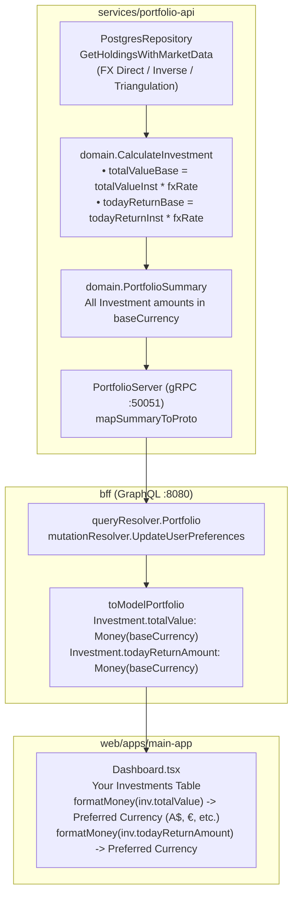

# Investment Preferred Currency Conversion Implementation Plan

> **Target**: Convert "Total Value" ("Total amount") and "Today's Return" in the "Your Investments" table to the investor's preferred base currency.  
> **Scope**: `services/portfolio-api/internal/domain/calculator.go`, `services/portfolio-api/internal/repository/queries.go`, `services/portfolio-api/internal/domain/calculator_test.go`, and `web/apps/main-app/src/components/Dashboard.tsx`  
> **Key Principle**: All aggregated financial amounts in the investor portfolio view—including individual holding valuations and daily returns—must be denominated in the portfolio's active base currency (reflecting the user's preferred display currency). Traded asset price remains quoted in the instrument's native exchange currency to preserve market context.

---

## 1. Problem Statement & Root Cause Analysis

### 1.1 Observed Behavior
When an investor has selected a preferred currency other than USD (for example, Australian Dollar `AUD` or Euro `EUR`), the primary portfolio dashboard hero metrics correctly reflect that preferred currency:
- Total Portfolio Value: `A$150,000.00`
- Today's Return: `+A$1,234.50 (+0.82%)`
- Cash Balance: `A$8,450.00`

However, in the **"Your Investments"** table:
- **Total Value** ("Total amount") is displayed in the instrument's listing currency (e.g., `$26,493.60` USD).
- **Today's Return** is displayed in the instrument's listing currency (e.g., `+$555.75` USD).
- **Total Return** is displayed in the preferred currency (e.g., `+A$4,230.10` AUD).

This creates an inconsistency where the holding valuations and daily gains do not sum to the portfolio totals shown in the hero section, confusing investors.

### 1.2 Root Cause Analysis
In `services/portfolio-api/internal/domain/calculator.go`:

```go
func CalculateInvestment(h HoldingWithPrice, baseCurrency string) InvestmentSummary {
	totalValueInst := h.Quantity.Mul(h.LatestPrice)
	fxRate := h.FXRateToBase
	if fxRate.IsZero() {
		fxRate = one
	}

	totalValueBase := totalValueInst.Mul(fxRate)

	// Today's price movement in instrument currency
	priceDelta := h.LatestPrice.Sub(h.PrevPrice)
	todayReturnAmountInst := h.Quantity.Mul(priceDelta)

	// Today's return percentage
	var todayReturnPercent decimal.Decimal
	if h.PrevPrice.IsPositive() {
		todayReturnPercent = priceDelta.DivRound(h.PrevPrice, 6).Mul(oneHundred).Round(2)
	}

	// Total return = Current Value (Base) - Cost Basis (Base) + Realized PnL (Base) + Dividends (Base)
	totalReturnAmountBase := totalValueBase.Sub(h.CostBasisBase).Add(h.RealizedPnLBase).Add(h.DividendsBase)

	var totalReturnPercent decimal.Decimal
	if h.CostBasisBase.IsPositive() {
		totalReturnPercent = totalReturnAmountBase.DivRound(h.CostBasisBase, 6).Mul(oneHundred).Round(1)
	}

	return InvestmentSummary{
		ID:                 h.InstrumentID.String(),
		Ticker:             h.Ticker,
		Name:               h.Name,
		Price:              NewMoney(h.LatestPrice.Round(2), h.InstrumentCurrency),
		Quantity:           h.Quantity,
		TotalValue:         NewMoney(totalValueInst.Round(2), h.InstrumentCurrency),       // <-- BUG: Uses instrument currency instead of baseCurrency
		TodayReturnAmount:  NewMoney(todayReturnAmountInst.Round(2), h.InstrumentCurrency), // <-- BUG: Uses instrument currency instead of baseCurrency
		TodayReturnPercent: todayReturnPercent,
		TotalReturnAmount:  NewMoney(totalReturnAmountBase.Round(2), baseCurrency),        // <-- Already baseCurrency
		TotalReturnPercent: totalReturnPercent,
	}
}
```

1. **`TotalValue`**: `totalValueBase` is already computed on line 21 using `fxRate`, but the return struct instantiates `NewMoney(totalValueInst.Round(2), h.InstrumentCurrency)`.
2. **`TodayReturnAmount`**: `todayReturnAmountInst` is multiplied only in instrument currency, ignoring `fxRate`, and returned with `h.InstrumentCurrency`.
3. In `web/apps/main-app/src/components/Dashboard.tsx`, the table renders:
   ```tsx
   <td>{formatMoney(inv.totalValue)}</td>
   <td>
     <span className="amount">{todayPos ? '+' : ''}{formatMoney(inv.todayReturnAmount)}</span>
   </td>
   ```
   Because `formatMoney` respects `currencyCode` attached to each `MoneyValue`, it renders the values using `USD` (`$`) instead of the user's preferred currency.

---

## 2. Proposed Architecture & Calculation Engine

### 2.1 Currency Domain Rules
| Field | Currency Denomination | Rationale |
| :--- | :--- | :--- |
| `Price` | `h.InstrumentCurrency` | Quoted market price on listing exchange (e.g. AAPL on NASDAQ is $185.92 USD). |
| `Quantity` | Unit scalar (`decimal.Decimal`) | Exact share count. |
| `TotalValue` | `baseCurrency` (Preferred) | Valuation of the investor's position in portfolio base currency (`Quantity * Price * FXRate`). |
| `TodayReturnAmount` | `baseCurrency` (Preferred) | Portfolio gain/loss today from this holding in base currency (`Quantity * (LatestPrice - PrevPrice) * FXRate`). |
| `TodayReturnPercent` | Percentage scalar (`decimal.Decimal`) | Daily asset price movement percentage (`(LatestPrice - PrevPrice) / PrevPrice * 100`). |
| `TotalReturnAmount` | `baseCurrency` (Preferred) | Consolidated holding gain in base currency (`TotalValueBase - CostBasisBase + RealizedPnLBase + DividendsBase`). |
| `TotalReturnPercent` | Percentage scalar (`decimal.Decimal`) | Return on invested capital percentage (`TotalReturnAmountBase / CostBasisBase * 100`). |

### 2.2 Mathematical Consistency
In `CalculatePortfolioSummary`:
$$\text{TotalHoldingsValueBase} = \sum (\text{Quantity}_i \times \text{LatestPrice}_i \times \text{FXRate}_i)$$
$$\text{TodayReturnAmountBase} = \sum (\text{Quantity}_i \times (\text{LatestPrice}_i - \text{PrevPrice}_i) \times \text{FXRate}_i)$$

By updating each holding's `TotalValue` and `TodayReturnAmount` to `baseCurrency`, the sum of the table rows will exactly equal the portfolio summary totals:
$$\sum \text{inv.TotalValue} = \text{TotalHoldingsValueBase}$$
$$\sum \text{inv.TodayReturnAmount} = \text{summary.TodayReturnAmount}$$

---

## 3. Layer-by-Layer Technical Changes



### 3.1 Domain Layer (`services/portfolio-api/internal/domain/calculator.go`)
Update `CalculateInvestment`:
1. Guard `fxRate` against non-positive values:
   ```go
   fxRate := h.FXRateToBase
   if !fxRate.IsPositive() {
       fxRate = one
   }
   ```
2. Compute `todayReturnAmountBase`:
   ```go
   priceDelta := h.LatestPrice.Sub(h.PrevPrice)
   todayReturnAmountInst := h.Quantity.Mul(priceDelta)
   todayReturnAmountBase := todayReturnAmountInst.Mul(fxRate)
   ```
3. Return `TotalValue` and `TodayReturnAmount` denominated in `baseCurrency`:
   ```go
   return InvestmentSummary{
       ID:                 h.InstrumentID.String(),
       Ticker:             h.Ticker,
       Name:               h.Name,
       Price:              NewMoney(h.LatestPrice.Round(2), h.InstrumentCurrency),
       Quantity:           h.Quantity,
       TotalValue:         NewMoney(totalValueBase.Round(2), baseCurrency),
       TodayReturnAmount:  NewMoney(todayReturnAmountBase.Round(2), baseCurrency),
       TodayReturnPercent: todayReturnPercent,
       TotalReturnAmount:  NewMoney(totalReturnAmountBase.Round(2), baseCurrency),
       TotalReturnPercent: totalReturnPercent,
   }
   ```

### 3.2 Repository Query Resilience (`services/portfolio-api/internal/repository/queries.go`)
In `getHoldingsWithMarketDataSQL`, add USD triangulation to `COALESCE` for foreign cross-rates where neither direct nor inverse pair exists in `portfolio.fx_rates`:
```sql
COALESCE(
    direct_fx.rate,
    CASE WHEN inverse_fx.rate > 0 THEN 1.0 / inverse_fx.rate ELSE NULL END,
    triangulated_fx.rate,
    1.0
) AS fx_rate_to_base
```
Joined with:
```sql
LEFT JOIN LATERAL (
    SELECT (usd_base.rate / usd_inst.rate) AS rate
    FROM (
        SELECT rate FROM portfolio.fx_rates 
        WHERE base_currency = 'USD' AND quote_currency = p.base_currency 
        ORDER BY rate_date DESC LIMIT 1
    ) usd_base
    CROSS JOIN (
        SELECT rate FROM portfolio.fx_rates 
        WHERE base_currency = 'USD' AND quote_currency = i.currency_code 
        ORDER BY rate_date DESC LIMIT 1
    ) usd_inst
    WHERE usd_inst.rate > 0
) triangulated_fx ON (i.currency_code <> p.base_currency AND direct_fx.rate IS NULL AND inverse_fx.rate IS NULL)
```

### 3.3 Backend-for-Frontend (`bff/graph/helpers.go` & `bff/graph/schema.resolvers.go`)
The BFF already maps `Investment.TotalValue` and `Investment.TodayReturnAmount` using `toModelMoney`, which propagates `amount` and `currencyCode` into the GraphQL response without truncation or coercion. No schema changes are required.

### 3.4 Web Frontend (`web/apps/main-app/src/components/Dashboard.tsx`)
1. The frontend query already requests:
   ```graphql
   investments {
     id
     ticker
     name
     price { amount, currencyCode }
     quantity
     totalValue { amount, currencyCode }
     todayReturnAmount { amount, currencyCode }
     todayReturnPercent
     totalReturnAmount { amount, currencyCode }
     totalReturnPercent
   }
   ```
2. With `totalValue` and `todayReturnAmount` returning `currencyCode = baseCurrency`, `formatMoney(inv.totalValue)` and `formatMoney(inv.todayReturnAmount)` automatically format with the preferred currency symbol (e.g., `A$`, `€`, `£`, `$`).
3. For additional visual clarity in the table, verify that column headings and cell formatting consistently denote currency context (e.g. `Price` shows its native currency code like `USD`).

---

## 4. Verification & Testing Strategy

### 4.1 Unit Testing (`services/portfolio-api/internal/domain/calculator_test.go`)
1. **`TestCalculateInvestment_SameCurrency`**:
   - `InstrumentCurrency = "USD"`, `baseCurrency = "USD"`, `FXRateToBase = 1.0`.
   - Assert `TotalValue.Amount == "26493.60"`, `TotalValue.CurrencyCode == "USD"`.
   - Assert `TodayReturnAmount.Amount == "555.75"`, `TodayReturnAmount.CurrencyCode == "USD"`.
2. **`TestCalculateInvestment_ForeignCurrency`**:
   - `InstrumentCurrency = "USD"`, `baseCurrency = "AUD"`, `FXRateToBase = 1.5230`.
   - `LatestPrice = 185.92`, `PrevPrice = 182.02`, `Quantity = 142.5`.
   - Expected `TotalValue`: $142.5 \times 185.92 \times 1.5230 = 40,349.75\text{ AUD}$.
   - Expected `TodayReturnAmount`: $142.5 \times (185.92 - 182.02) \times 1.5230 = 846.41\text{ AUD}$.
   - Assert `Price.CurrencyCode == "USD"` (preserved native currency).
   - Assert `TotalValue.CurrencyCode == "AUD"`.
   - Assert `TodayReturnAmount.CurrencyCode == "AUD"`.
   - Assert `TotalReturnAmount.CurrencyCode == "AUD"`.

### 4.2 Regression Testing
- Run all microservice tests: `go test -v -race ./...` in `services/portfolio-api` and `bff`.
- Verify zero regression in existing portfolio calculations, ledger projections, and valuations.

### 4.3 Manual & Browser Verification
1. Start local stack: microservices, BFF, and main app.
2. Open main app (`http://localhost:5173`).
3. Open Investor Preferences modal, select `AUD` as display currency, and save.
4. Verify hero metrics display `AUD` (`A$`).
5. Verify "Your Investments" table:
   - "Total Value" shows `A$` amounts matching converted position valuations.
   - "Today's Return" shows `+A$` / `-A$` amounts matching converted daily returns.
   - Sum of holding "Total Value" rows plus cash balance matches hero Total Portfolio Value.
   - Sum of holding "Today's Return" rows matches hero Today's Return.
