# Multi-Broker CSV Ingestion Implementation Plan (CommSec & nabtrade)

> **Target**: Comprehensive end-to-end implementation plan for ingesting, normalizing, validating, previewing, and persisting transaction records from Australian stockbrokers (**CommSec** and **nabtrade**).  
> **Scope**: `proto/portfolio/v1/portfolio.proto`, `services/portfolio-api`, `bff/`, and `web/apps/main-app`.  
> **Key Principle**: Strict zero floating-point arithmetic policy using arbitrary-precision decimals (`shopspring/decimal` in Go and exact string/scalar representations in TypeScript/GraphQL), deterministic idempotent deduplication, graceful row-level error reporting, and automatic post-import ledger replay & valuation synchronization.

---

## 1. Architectural Overview & Ingestion Data Flow

Investors managing Australian portfolios frequently export CSV trade confirmations and ledger histories from major domestic brokerages like **Commonwealth Bank's CommSec** and **National Australia Bank's nabtrade**. These brokers use distinct column schemas, proprietary transaction type labels, metadata wrapper rows, and localized currency formatting.

The ingestion pipeline enables users to upload CSV exports, automatically detects or confirms the broker dialect, runs robust client-side validation using **Zod**, presents an interactive **Preview & Discrepancy Modal**, and executes an atomic bulk batch persist in `portfolio-api` that re-evaluates tax lots, holding projections, and historical valuation snapshots.

```mermaid
sequenceDiagram
    autonumber
    actor Investor as Investor
    participant Web as Main App (:5173 React + Zod)
    participant BFF as BFF (:8080 GraphQL)
    participant Svc as Portfolio API (:50051 gRPC)
    participant DB as PostgreSQL (portfolio schema)
    participant Replay as ProcessLedger Engine
    participant Val as Valuation Engine

    Investor->>Web: Drops CSV into "Import Transactions" modal
    Web->>Web: Sniff headers (CommSec vs nabtrade) & tokenize rows
    Web->>Web: Run Zod schema validation & compute idempotent hash
    Web->>BFF: query checkTransactionDuplicates(portfolioId, externalRefs)
    BFF->>Svc: gRPC CheckTransactionDuplicates(portfolioId, externalRefs)
    Svc->>DB: Query existing transactions by external_ref
    Svc-->>BFF: Return existing external_refs
    BFF-->>Web: Duplication status per row
    Web-->>Investor: Display Preview Summary (Valid, Duplicates, Malformed Rows)
    
    Investor->>Web: Confirms "Import X Transactions" (Skip duplicates = true)
    Web->>BFF: mutation importTransactions(input: { transactions: [...] })
    BFF->>Svc: gRPC BatchImportTransactions(BatchImportTransactionsRequest)
    
    rect rgb(24, 32, 47)
    note right of Svc: Atomic Batch Persistence & Ledger Replay
    Svc->>DB: Batch insert valid transactions (ON CONFLICT DO NOTHING)
    Svc->>DB: Lock portfolio row (SELECT FOR UPDATE)
    Svc->>Replay: RebuildProjections(portfolioId)
    Replay-->>Svc: Updated tax lots, holdings, cash
    Svc->>Val: BackfillPortfolioValuations(portfolioId, minTradeDate)
    end

    Svc-->>BFF: BatchImportTransactionsResponse (importedCount, skippedCount, portfolio)
    BFF-->>Web: ImportTransactionsPayload
    Web-->>Investor: Closes modal, shows success toast, live updates Dashboard & Ledger
```



---

## 2. Broker Input Specifications & Dialect Analysis

### 2.1 Format A: CommSec (Commonwealth Securities)
CommSec exports either single-order confirmations or full transaction ledger history downloads.

#### Column Signatures & Variants
| Standard Column | Alternate Header | Data Type | Notes & Transformation |
|---|---|---|---|
| `Date` | `Transaction Date` | `DD/MM/YYYY` | Parse Australian date format to ISO `YYYY-MM-DD`. |
| `Type` | `Transaction Type` | String | Values: `Buy`, `Sell`, `Div`, `Dividend`, `DRP`. Map to `BUY`, `SELL`, `DIVIDEND`. |
| `Code` | `ASX Code`, `Security` | String | e.g. `BHP`, `VAS`, `CBA`. Uppercase, trim whitespace, normalize symbol. |
| `Units` | `Quantity` | Numeric String | Remove commas (`"1,500"` $\to$ `1500`). Must be positive for trades. |
| `Unit Price ($)` | `Price`, `Unit Price` | Currency String | Strip `$`, commas, and whitespace (`"$45.20"` $\to$ `45.20`). |
| `Brokerage ($)` | `Brokerage (inc GST)`, `Fee` | Currency String | Strip `$`, commas (`"$19.95"` $\to$ `19.95`). Defaults to `0.00`. |
| `Total Value ($)` | `Net Consideration`, `Value`| Currency String | Strip `$`, commas (`"$67,819.95"` $\to$ `67819.95`). |

#### CommSec Specific Caveats & Edge Cases
- **Negative / Parenthesized Values**: Some CommSec ledger exports display sells or fees in accounting parentheses `(19.95)` or with a minus sign `-$19.95`. Normalization must convert to absolute positive magnitudes while honoring the transaction `Type`.
- **Net Consideration vs Principal**: `Net Consideration` for a `BUY` equals `(Units * Price) + Brokerage`; for a `SELL` it equals `(Units * Price) - Brokerage`. If `Total Value` is omitted, recalculate deterministically.
- **Header Metadata**: Certain historical exports start directly with column headers, while others prepend 1 or 2 blank rows. The reader must scan until the header row is found.
- **Idempotency**: CommSec CSVs do not guarantee a unique trade confirmation reference number on general transaction history exports. Therefore, generate a deterministic SHA-256 hash from:
  $$\text{ExternalRef} = \text{SHA256}(\text{"commsec"} \parallel \text{Date} \parallel \text{Code} \parallel \text{Type} \parallel \text{Units} \parallel \text{TotalValue})$$

---

### 2.2 Format B: nabtrade (National Australia Bank)
nabtrade exports comprehensive trade confirmation logs and cash/stock transaction files.

#### Column Signatures & Variants
| Standard Column | Alternate Header | Data Type | Notes & Transformation |
|---|---|---|---|
| `Confirmation Number` | `Ref Number`, `Trade Ref` | String | Unique trade ID (e.g. `C10982347`, `NT-99812`). Used as direct `external_ref`. |
| `Trade Date` | `Date` | `DD/MM/YYYY` | Execution date. Parse to ISO `YYYY-MM-DD`. Primary accounting date. |
| `Settlement Date` | `Settle Date` | `DD/MM/YYYY` | Optional settlement date (T+2 / T+1). Stored in `portfolio.transactions.settle_date`. |
| `Transaction Type` | `Type`, `Action` | String | `BUY`, `SELL`, `DIVIDEND`, `DRP`, `APPLICATION`. Map to `BUY`/`SELL`/`DIVIDEND`. |
| `Code` | `Security Code`, `Symbol` | String | e.g. `MQG`, `TLS.AX`. Strip `.AX` suffix if standard ASX exchange. |
| `Quantity` | `Units` | Numeric String | Handle localized thousand separators (`"10,000"` $\to$ `10000`). |
| `Price` | `Unit Price`, `Average Price` | Currency String | Strip `$`, commas (`"182.40"` $\to$ `182.40`). |
| `Brokerage` | `Fees`, `Brokerage (Inc. GST)` | Currency String | Strip `$`, commas (`"14.95"` $\to$ `14.95`). Defaults to `0.00`. |
| `Total Consideration` | `Net Amount`, `Gross Amount` | Currency String | Strip `$`, commas (`"18,254.95"` $\to$ `18254.95`). |

#### nabtrade Specific Caveats & Edge Cases
- **Header Disclaimer Rows**: nabtrade exports almost always begin with 2 to 4 metadata rows (e.g. `Account Number: 12345678`, `Account Name: John Doe`, `Generated: 09/10/2026`). The parser must locate the row containing `Confirmation Number` or `Trade Date` as the true CSV header line.
- **Footer Disclaimer Text**: nabtrade exports often end with legal boilerplate lines (e.g. `"nabtrade is a service provided by Wealthhub Securities Limited..."`). The parser must stop processing when an empty or non-data footer row is encountered.
- **Native Reference Numbers**: `Confirmation Number` is guaranteed unique per trade execution by nabtrade. Prefix with `nabtrade:` (e.g. `nabtrade:C10982347`) to form a collision-proof `external_ref`.

---

## 3. Parser & Normalization Architecture

The system uses a **Broker Adapter Pattern** with a sniffing detector. To optimize user experience and eliminate unnecessary backend load for malformed files, initial parsing, dialect sniffing, and schema validation run on the client via TypeScript + Zod.

```text
                               ┌──────────────────────────┐
                               │   Raw CSV String / File  │
                               └─────────────┬────────────┘
                                             │
                                             ▼
                               ┌──────────────────────────┐
                               │   BrokerFormatDetector   │
                               │  (Header Fingerprinting) │
                               └──────┬────────────┬──────┘
                                      │            │
                   "commsec" detected │            │ "nabtrade" detected
                                      ▼            ▼
                           ┌─────────────────┐  ┌─────────────────┐
                           │ CommSecAdapter  │  │ nabtradeAdapter │
                           └────────┬────────┘  └────────┬────────┘
                                    │                    │
                                    └─────────┬──────────┘
                                              ▼
                               ┌──────────────────────────┐
                               │  Zod Schema Normalizer   │
                               │  - Date parsing (AU)     │
                               │  - Number sanitization   │
                               │  - Type enum mapping     │
                               │  - Hash generation       │
                               └──────────────┬───────────┘
                                              │
                      ┌───────────────────────┴───────────────────────┐
                      ▼                                               ▼
          ┌───────────────────────┐                       ┌───────────────────────┐
          │   Valid Normalized    │                       │  Malformed Row Error  │
          │   Transactions []     │                       │  Details (Row #, Msg) │
          └───────────────────────┘                       └───────────────────────┘
```

### 3.1 Normalization Data Contract (`web/apps/main-app/src/services/csv/types.ts`)

```typescript
export type SupportedBroker = 'commsec' | 'nabtrade' | 'auto';

export type NormalizedTxType = 'BUY' | 'SELL' | 'DIVIDEND';

export interface NormalizedTransactionRow {
  rowNumber: number;
  externalRef: string;
  symbol: string;
  type: NormalizedTxType;
  tradeDate: string;        // YYYY-MM-DD
  settleDate?: string;      // YYYY-MM-DD
  quantity: string;         // Arbitrary-precision numeric string
  price: string;            // Unit price numeric string
  amount: string;           // Net consideration numeric string
  fee: string;              // Brokerage fee numeric string
  currencyCode: string;     // Default "AUD"
  notes?: string;           // Audit metadata (Broker name, original row)
  isDuplicate?: boolean;    // Flagged by pre-flight check
}

export interface RowValidationError {
  rowNumber: number;
  field: string;
  rawValue: string;
  message: string;
}

export interface ParseResult {
  broker: 'commsec' | 'nabtrade';
  totalRowsRead: number;
  validRows: NormalizedTransactionRow[];
  errors: RowValidationError[];
}
```

### 3.2 Broker Format Auto-Detector (`web/apps/main-app/src/services/csv/detector.ts`)

```typescript
import { SupportedBroker } from './types';

export interface DetectionResult {
  detected: 'commsec' | 'nabtrade' | null;
  headerIndex: number;
  headers: string[];
}

const COMMSEC_SIGNATURES = [
  'units',
  'unit price ($)',
  'brokerage ($)',
  'total value ($)',
  'net consideration',
  'asx code',
];

const NABTRADE_SIGNATURES = [
  'confirmation number',
  'trade date',
  'settlement date',
  'total consideration',
  'security code',
];

export function detectBrokerFormat(lines: string[]): DetectionResult {
  for (let i = 0; i < Math.min(lines.length, 10); i++) {
    const rawLine = lines[i].trim();
    if (!rawLine) continue;

    const lower = rawLine.toLowerCase();
    const cells = lower.split(',').map((c) => c.replace(/^["']|["']$/g, '').trim());

    const hasNabtrade = NABTRADE_SIGNATURES.some((sig) => cells.includes(sig) || lower.includes(sig));
    if (hasNabtrade) {
      return { detected: 'nabtrade', headerIndex: i, headers: cells };
    }

    const hasCommSec = COMMSEC_SIGNATURES.some((sig) => cells.includes(sig) || lower.includes(sig));
    if (hasCommSec) {
      return { detected: 'commsec', headerIndex: i, headers: cells };
    }
  }

  return { detected: null, headerIndex: -1, headers: [] };
}
```

### 3.3 Field Sanitizers & Hash Utilities (`web/apps/main-app/src/services/csv/utils.ts`)

```typescript
/**
 * Strips currency symbols, commas, and whitespace.
 * Handles accounting negatives: "(19.95)" -> "19.95"
 */
export function cleanCurrency(val: string | undefined | null): string {
  if (!val) return '0.00';
  let cleaned = val.trim().replace(/[$ AUD,]/gi, '');
  if (cleaned.startsWith('(') && cleaned.endsWith(')')) {
    cleaned = cleaned.slice(1, -1);
  }
  if (cleaned.startsWith('-')) {
    cleaned = cleaned.slice(1);
  }
  return cleaned || '0.00';
}

/**
 * Parses Australian DD/MM/YYYY into ISO YYYY-MM-DD.
 */
export function parseAustralianDate(val: string): string {
  const trimmed = val.trim();
  // Handle DD/MM/YYYY
  const parts = trimmed.split(/[/.-]/);
  if (parts.length === 3) {
    let [day, month, year] = parts;
    if (year.length === 2) {
      year = `20${year}`;
    }
    const d = parseInt(day, 10);
    const m = parseInt(month, 10);
    const y = parseInt(year, 10);
    if (m >= 1 && m <= 12 && d >= 1 && d <= 31 && y >= 1990 && y <= 2100) {
      return `${year}-${month.padStart(2, '0')}-${day.padStart(2, '0')}`;
    }
  }
  throw new Error(`Invalid Australian date format: "${val}". Expected DD/MM/YYYY.`);
}

/**
 * Generates an idempotent SHA-256 hash in the browser using Web Crypto API.
 */
export async function generateIdempotentHash(seed: string): Promise<string> {
  const encoder = new TextEncoder();
  const data = encoder.encode(seed);
  const hashBuffer = await crypto.subtle.digest('SHA-256', data);
  const hashArray = Array.from(new Uint8Array(hashBuffer));
  return hashArray.map((b) => b.toString(16).padStart(2, '0')).join('').slice(0, 32);
}
```

### 3.4 Zod Validation & Parsing Adapters (`web/apps/main-app/src/services/csv/parsers/`)

#### 3.4.1 CommSec Parser (`commsec.ts`)
```typescript
import { z } from 'zod';
import { NormalizedTransactionRow, RowValidationError, ParseResult } from '../types';
import { cleanCurrency, parseAustralianDate, generateIdempotentHash } from '../utils';

export async function parseCommSecCSV(lines: string[], headerIdx: number): Promise<ParseResult> {
  const headers = lines[headerIdx]
    .split(',')
    .map((h) => h.replace(/^["']|["']$/g, '').trim().toLowerCase());

  const getCol = (cells: string[], names: string[]): string | undefined => {
    for (const name of names) {
      const idx = headers.indexOf(name);
      if (idx !== -1 && idx < cells.length) {
        return cells[idx]?.replace(/^["']|["']$/g, '').trim();
      }
    }
    return undefined;
  };

  const validRows: NormalizedTransactionRow[] = [];
  const errors: RowValidationError[] = [];

  for (let i = headerIdx + 1; i < lines.length; i++) {
    const rawLine = lines[i].trim();
    if (!rawLine) continue;

    // Parse CSV cells handling quoted commas
    const cells = rawLine.match(/(".*?"|[^",\s]+)(?=\s*,|\s*$)/g) || rawLine.split(',');
    const cleanCells = cells.map((c) => c.replace(/^"|"$/g, '').trim());

    const rawDate = getCol(cleanCells, ['date', 'transaction date']);
    const rawType = getCol(cleanCells, ['type', 'transaction type']);
    const rawCode = getCol(cleanCells, ['code', 'asx code', 'security']);
    const rawUnits = getCol(cleanCells, ['units', 'quantity']);
    const rawPrice = getCol(cleanCells, ['unit price ($)', 'price', 'unit price']);
    const rawFee = getCol(cleanCells, ['brokerage ($)', 'brokerage (inc gst)', 'brokerage', 'fee']);
    const rawTotal = getCol(cleanCells, ['total value ($)', 'net consideration', 'value']);

    const rowNum = i + 1;

    try {
      if (!rawDate) throw new Error('Missing transaction date');
      const tradeDate = parseAustralianDate(rawDate);

      if (!rawType) throw new Error('Missing transaction type');
      let type: 'BUY' | 'SELL' | 'DIVIDEND';
      const upperType = rawType.toUpperCase();
      if (upperType.includes('BUY')) type = 'BUY';
      else if (upperType.includes('SELL')) type = 'SELL';
      else if (upperType.includes('DIV')) type = 'DIVIDEND';
      else throw new Error(`Unsupported transaction type: "${rawType}"`);

      if (!rawCode) throw new Error('Missing ASX stock code');
      const symbol = rawCode.toUpperCase().replace(/\.AX$/i, '');

      const quantity = cleanCurrency(rawUnits);
      if (type !== 'DIVIDEND' && (parseFloat(quantity) <= 0 || isNaN(parseFloat(quantity)))) {
        throw new Error(`Quantity must be greater than zero, got: "${rawUnits}"`);
      }

      const price = cleanCurrency(rawPrice);
      if (type !== 'DIVIDEND' && (parseFloat(price) < 0 || isNaN(parseFloat(price)))) {
        throw new Error(`Price cannot be negative, got: "${rawPrice}"`);
      }

      const fee = cleanCurrency(rawFee);
      let amount = cleanCurrency(rawTotal);

      // Reconstruct amount if missing
      if (parseFloat(amount) === 0 && type !== 'DIVIDEND') {
        const principal = parseFloat(quantity) * parseFloat(price);
        amount = (type === 'BUY' ? principal + parseFloat(fee) : principal - parseFloat(fee)).toFixed(2);
      }

      const hashSeed = `commsec:${tradeDate}:${symbol}:${type}:${quantity}:${amount}:${fee}`;
      const externalRef = `cs_${await generateIdempotentHash(hashSeed)}`;

      validRows.push({
        rowNumber: rowNum,
        externalRef,
        symbol,
        type,
        tradeDate,
        quantity,
        price,
        amount,
        fee,
        currencyCode: 'AUD',
        notes: `Imported from CommSec CSV (Row ${rowNum})`,
      });
    } catch (err: any) {
      errors.push({
        rowNumber: rowNum,
        field: 'Row',
        rawValue: rawLine,
        message: err.message || 'Malformed row',
      });
    }
  }

  return {
    broker: 'commsec',
    totalRowsRead: lines.length - (headerIdx + 1),
    validRows,
    errors,
  };
}
```

#### 3.4.2 nabtrade Parser (`nabtrade.ts`)
```typescript
import { NormalizedTransactionRow, RowValidationError, ParseResult } from '../types';
import { cleanCurrency, parseAustralianDate, generateIdempotentHash } from '../utils';

export async function parseNabtradeCSV(lines: string[], headerIdx: number): Promise<ParseResult> {
  const headers = lines[headerIdx]
    .split(',')
    .map((h) => h.replace(/^["']|["']$/g, '').trim().toLowerCase());

  const getCol = (cells: string[], names: string[]): string | undefined => {
    for (const name of names) {
      const idx = headers.indexOf(name);
      if (idx !== -1 && idx < cells.length) {
        return cells[idx]?.replace(/^["']|["']$/g, '').trim();
      }
    }
    return undefined;
  };

  const validRows: NormalizedTransactionRow[] = [];
  const errors: RowValidationError[] = [];

  for (let i = headerIdx + 1; i < lines.length; i++) {
    const rawLine = lines[i].trim();
    if (!rawLine) continue;

    // Terminate on legal footer notes
    if (rawLine.toLowerCase().includes('nabtrade is a service provided') || rawLine.startsWith('***')) {
      break;
    }

    const cells = rawLine.split(',').map((c) => c.replace(/^["']|["']$/g, '').trim());
    const rowNum = i + 1;

    const rawConfirm = getCol(cells, ['confirmation number', 'ref number']);
    const rawTradeDate = getCol(cells, ['trade date', 'date']);
    const rawSettleDate = getCol(cells, ['settlement date', 'settle date']);
    const rawType = getCol(cells, ['transaction type', 'type']);
    const rawCode = getCol(cells, ['code', 'security code', 'symbol']);
    const rawQty = getCol(cells, ['quantity', 'units']);
    const rawPrice = getCol(cells, ['price', 'unit price']);
    const rawBrokerage = getCol(cells, ['brokerage', 'fees']);
    const rawConsideration = getCol(cells, ['total consideration', 'net amount']);

    try {
      if (!rawTradeDate) throw new Error('Missing trade date');
      const tradeDate = parseAustralianDate(rawTradeDate);

      let settleDate: string | undefined;
      if (rawSettleDate) {
        try {
          settleDate = parseAustralianDate(rawSettleDate);
        } catch {
          // Non-fatal if settle date fails
        }
      }

      if (!rawType) throw new Error('Missing transaction type');
      let type: 'BUY' | 'SELL' | 'DIVIDEND';
      const upperType = rawType.toUpperCase();
      if (upperType.includes('BUY')) type = 'BUY';
      else if (upperType.includes('SELL')) type = 'SELL';
      else if (upperType.includes('DIV')) type = 'DIVIDEND';
      else throw new Error(`Unsupported transaction type: "${rawType}"`);

      if (!rawCode) throw new Error('Missing stock code');
      const symbol = rawCode.toUpperCase().replace(/\.AX$/i, '');

      const quantity = cleanCurrency(rawQty);
      if (type !== 'DIVIDEND' && (parseFloat(quantity) <= 0 || isNaN(parseFloat(quantity)))) {
        throw new Error(`Quantity must be greater than zero, got: "${rawQty}"`);
      }

      const price = cleanCurrency(rawPrice);
      if (type !== 'DIVIDEND' && (parseFloat(price) < 0 || isNaN(parseFloat(price)))) {
        throw new Error(`Price cannot be negative, got: "${rawPrice}"`);
      }

      const fee = cleanCurrency(rawBrokerage);
      const amount = cleanCurrency(rawConsideration);

      let externalRef: string;
      if (rawConfirm) {
        externalRef = `nabtrade:${rawConfirm}`;
      } else {
        const hashSeed = `nabtrade:${tradeDate}:${symbol}:${type}:${quantity}:${amount}`;
        externalRef = `nt_${await generateIdempotentHash(hashSeed)}`;
      }

      validRows.push({
        rowNumber: rowNum,
        externalRef,
        symbol,
        type,
        tradeDate,
        settleDate,
        quantity,
        price,
        amount,
        fee,
        currencyCode: 'AUD',
        notes: `Imported from nabtrade CSV (Conf: ${rawConfirm || 'N/A'})`,
      });
    } catch (err: any) {
      errors.push({
        rowNumber: rowNum,
        field: 'Row',
        rawValue: rawLine,
        message: err.message || 'Malformed row',
      });
    }
  }

  return {
    broker: 'nabtrade',
    totalRowsRead: lines.length - (headerIdx + 1),
    validRows,
    errors,
  };
}
```

---

## 4. Layer-by-Layer Technical Specifications

### 4.1 Protocol Buffers (`proto/portfolio/v1/portfolio.proto`)

Extend the service contract with dedicated batch import and duplicate check RPCs:

```protobuf
service PortfolioService {
  // Existing RPCs
  rpc GetPortfolio(GetPortfolioRequest) returns (GetPortfolioResponse) {}
  rpc AddTransaction(AddTransactionRequest) returns (AddTransactionResponse) {}
  rpc ListTransactions(ListTransactionsRequest) returns (ListTransactionsResponse) {}
  rpc DeleteTransaction(DeleteTransactionRequest) returns (DeleteTransactionResponse) {}

  // New Batch Ingestion RPCs
  rpc CheckTransactionDuplicates(CheckTransactionDuplicatesRequest) returns (CheckTransactionDuplicatesResponse) {}
  rpc BatchImportTransactions(BatchImportTransactionsRequest) returns (BatchImportTransactionsResponse) {}
}

message CheckTransactionDuplicatesRequest {
  string          user_id       = 1;
  repeated string external_refs = 2;
}

message CheckTransactionDuplicatesResponse {
  repeated string existing_external_refs = 1;
}

message ImportTransactionItem {
  TransactionType   type          = 1;
  string            symbol        = 2; // e.g. "BHP"
  string            trade_date    = 3; // YYYY-MM-DD
  string            settle_date   = 4; // Optional: YYYY-MM-DD
  common.v1.Decimal quantity      = 5;
  common.v1.Money   price         = 6;
  common.v1.Money   amount        = 7;
  common.v1.Money   fee           = 8;
  string            external_ref  = 9; // e.g. "nabtrade:C10982347" or "cs_sha256..."
  string            notes         = 10;
}

message BatchImportTransactionsRequest {
  string                         user_id          = 1;
  repeated ImportTransactionItem transactions     = 2;
  bool                           skip_duplicates  = 3; // Default true: ignores existing external_refs
}

message BatchImportTransactionsResponse {
  bool      success         = 1;
  int32     imported_count  = 2;
  int32     skipped_count   = 3;
  Portfolio portfolio       = 4; // Updated portfolio snapshot
  string    message         = 5;
}
```

---

### 4.2 Database & Repository Layer (`services/portfolio-api/`)

#### 4.2.1 Repository Queries (`internal/repository/queries.go`)
The table `portfolio.transactions` already possesses `UNIQUE (portfolio_id, external_ref)` from migration `000002_portfolios_and_transactions.up.sql`.

Add SQL queries for duplicate checks and bulk batch inserts:

```go
const (
    checkExistingExternalRefsSQL = `
SELECT external_ref
FROM portfolio.transactions
WHERE portfolio_id = $1
  AND external_ref = ANY($2);`

    bulkInsertTransactionsSQL = `
INSERT INTO portfolio.transactions (
    portfolio_id, instrument_id, type, trade_date, settle_date,
    quantity, price, amount, currency_code, fee, fx_rate_to_base,
    external_ref, notes
) VALUES (
    $1, $2, $3, $4, $5, $6, $7, $8, $9, $10, $11, $12, $13
)
ON CONFLICT (portfolio_id, external_ref) DO NOTHING
RETURNING id;`
)
```

#### 4.2.2 Repository Interface (`internal/repository/repository.go`)
```go
type Repository interface {
    // Existing methods...
    InsertTransaction(ctx context.Context, tx domain.Transaction) (*domain.Transaction, error)
    
    // New batch ingestion methods
    FindExistingExternalRefs(ctx context.Context, portfolioID uuid.UUID, externalRefs []string) ([]string, error)
    BatchInsertTransactions(ctx context.Context, txs []domain.Transaction) (int, error)
}
```

#### 4.2.3 Implementation (`internal/repository/postgres.go`)
```go
func (r *PostgresRepository) FindExistingExternalRefs(ctx context.Context, portfolioID uuid.UUID, externalRefs []string) ([]string, error) {
    if len(externalRefs) == 0 {
        return nil, nil
    }

    rows, err := r.pool.Query(ctx, checkExistingExternalRefsSQL, portfolioID, externalRefs)
    if err != nil {
        return nil, fmt.Errorf("repository: check existing external refs: %w", err)
    }
    defer rows.Close()

    var existing []string
    for rows.Next() {
        var ref string
        if err := rows.Scan(&ref); err != nil {
            return nil, err
        }
        existing = append(existing, ref)
    }
    return existing, nil
}

func (r *PostgresRepository) BatchInsertTransactions(ctx context.Context, txs []domain.Transaction) (int, error) {
    if len(txs) == 0 {
        return 0, nil
    }

    batch := &pgx.Batch{}
    for _, tx := range txs {
        batch.Queue(bulkInsertTransactionsSQL,
            tx.PortfolioID,
            tx.InstrumentID,
            string(tx.Type),
            tx.TradeDate,
            tx.SettleDate,
            tx.Quantity,
            tx.Price,
            tx.Amount,
            tx.CurrencyCode,
            tx.Fee,
            tx.FXRateToBase,
            tx.ExternalRef,
            tx.Notes,
        )
    }

    br := r.pool.SendBatch(ctx, batch)
    defer br.Close()

    inserted := 0
    for i := 0; i < len(txs); i++ {
        var id uuid.UUID
        err := br.QueryRow().Scan(&id)
        if err == nil {
            inserted++
        } else if errors.Is(err, pgx.ErrNoRows) {
            // Skipped due to ON CONFLICT DO NOTHING
            continue
        } else {
            return inserted, fmt.Errorf("repository: batch insert row %d failed: %w", i, err)
        }
    }

    return inserted, nil
}
```

---

### 4.3 Service Layer (`services/portfolio-api/internal/service/`)

#### 4.3.1 Batch Import Implementation (`internal/service/transaction.go`)

```go
type BatchImportInput struct {
    UserID         string
    Transactions   []domain.ImportTransactionItem
    SkipDuplicates bool
}

type BatchImportResult struct {
    ImportedCount int
    SkippedCount  int
    Portfolio     *domain.PortfolioSummary
}

func (s *portfolioService) BatchImportTransactions(ctx context.Context, input BatchImportInput) (*BatchImportResult, error) {
    userID := input.UserID
    if userID == "" {
        userID = "1"
    }

    portfolio, err := s.repo.FindPortfolioByUser(ctx, userID)
    if err != nil {
        return nil, fmt.Errorf("service: find portfolio: %w", err)
    }

    if len(input.Transactions) == 0 {
        summary, _ := s.GetPortfolioSummary(ctx, userID)
        return &BatchImportResult{ImportedCount: 0, SkippedCount: 0, Portfolio: summary}, nil
    }

    // 1. Gather all external refs to check duplicates
    var refsToCheck []string
    for _, item := range input.Transactions {
        if item.ExternalRef != "" {
            refsToCheck = append(refsToCheck, item.ExternalRef)
        }
    }

    existingSet := make(map[string]bool)
    if len(refsToCheck) > 0 {
        existingRefs, err := s.repo.FindExistingExternalRefs(ctx, portfolio.ID, refsToCheck)
        if err != nil {
            return nil, fmt.Errorf("service: check duplicates: %w", err)
        }
        for _, ref := range existingRefs {
            existingSet[ref] = true
        }
    }

    var txsToInsert []domain.Transaction
    var earliestTradeDate time.Time
    skippedCount := 0

    // 2. Resolve instruments & validate rows
    for _, item := range input.Transactions {
        if existingSet[item.ExternalRef] {
            skippedCount++
            continue
        }

        inst, err := s.repo.FindInstrumentBySymbol(ctx, item.Symbol)
        if err != nil {
            // Auto-create or flag unmapped instrument
            return nil, fmt.Errorf("service: instrument %s not found: %w", item.Symbol, err)
        }

        var fxRate *decimal.Decimal
        if inst.CurrencyCode != portfolio.BaseCurrency {
            rate, err := s.repo.GetFXRate(ctx, inst.CurrencyCode, portfolio.BaseCurrency)
            if err == nil && rate.IsPositive() {
                fxRate = &rate
            }
        }

        tx := domain.Transaction{
            PortfolioID:  portfolio.ID,
            InstrumentID: &inst.ID,
            Type:         item.Type,
            TradeDate:    item.TradeDate,
            SettleDate:   item.SettleDate,
            Quantity:     &item.Quantity,
            Price:        &item.Price,
            Amount:       item.Amount,
            CurrencyCode: inst.CurrencyCode,
            Fee:          item.Fee,
            FXRateToBase: fxRate,
            ExternalRef:  &item.ExternalRef,
            Notes:        &item.Notes,
        }

        txsToInsert = append(txsToInsert, tx)

        if earliestTradeDate.IsZero() || item.TradeDate.Before(earliestTradeDate) {
            earliestTradeDate = item.TradeDate
        }
    }

    // 3. Bulk insert to database
    insertedCount, err := s.repo.BatchInsertTransactions(ctx, txsToInsert)
    if err != nil {
        return nil, fmt.Errorf("service: batch insert transactions: %w", err)
    }

    // 4. Rebuild ledger projections ONCE for the entire batch
    if insertedCount > 0 {
        if err := s.RebuildProjections(ctx, userID); err != nil {
            return nil, fmt.Errorf("service: rebuild projections: %w", err)
        }

        // 5. Retroactively backfill daily portfolio valuations from earliest trade date
        if s.valuations != nil && !earliestTradeDate.IsZero() {
            todayUTC := s.nowFunc().UTC().Truncate(24 * time.Hour)
            earliestTruncated := earliestTradeDate.UTC().Truncate(24 * time.Hour)
            if earliestTruncated.Before(todayUTC) {
                _ = s.valuations.BackfillPortfolioValuations(ctx, portfolio.ID, earliestTruncated)
            } else {
                _, _ = s.valuations.SnapshotValuation(ctx, portfolio.ID, todayUTC)
            }
        }
    }

    summary, err := s.GetPortfolioSummary(ctx, userID)
    if err != nil {
        return nil, fmt.Errorf("service: get updated summary: %w", err)
    }

    return &BatchImportResult{
        ImportedCount: insertedCount,
        SkippedCount:  skippedCount + (len(txsToInsert) - insertedCount),
        Portfolio:     summary,
    }, nil
}
```

---

### 4.4 Backend-for-Frontend (BFF) GraphQL Layer (`bff/`)

#### 4.4.1 Schema Extension (`bff/graph/schema.graphqls`)

```graphql
input ImportTransactionInput {
  externalRef: String!
  symbol: String!
  type: TransactionType!
  tradeDate: String!       # YYYY-MM-DD
  settleDate: String       # YYYY-MM-DD
  quantity: Decimal!
  price: Decimal!
  amount: Decimal!
  fee: Decimal!
  currencyCode: String     # Default "AUD"
  notes: String
}

input BatchImportTransactionsInput {
  transactions: [ImportTransactionInput!]!
  skipDuplicates: Boolean = true
}

type BatchImportTransactionsPayload {
  success: Boolean!
  importedCount: Int!
  skippedCount: Int!
  portfolio: Portfolio!
  message: String!
}

extend type Query {
  checkTransactionDuplicates(externalRefs: [String!]!): [String!]!
}

extend type Mutation {
  importTransactions(input: BatchImportTransactionsInput!): BatchImportTransactionsPayload!
}
```

#### 4.4.2 Resolvers (`bff/graph/schema.resolvers.go`)
- `Query.checkTransactionDuplicates`: Converts strings to `CheckTransactionDuplicatesRequest`, invokes gRPC `CheckTransactionDuplicates`, and returns array of already-persisted `external_refs`.
- `Mutation.importTransactions`: Converts input array to `BatchImportTransactionsRequest`, maps `Decimal` scalar strings via `pkg/decimalpb`, calls gRPC `BatchImportTransactions`, and formats return payload.

---

### 4.5 Frontend User Experience & Components (`web/apps/main-app/`)

#### 4.5.1 Component Hierarchy
```text
web/apps/main-app/src/
├── components/
│   ├── ImportTransactionsModal.tsx       # Main multi-step workflow container
│   ├── ImportTransactionsModal.css       # Dark glassmorphic styles
│   ├── TransactionLedger.tsx             # Adds "Import CSV" button in toolbar
│   └── Dashboard.tsx                     # Listens to onImportSuccess for live refresh
└── services/
    └── csv/
        ├── types.ts                      # Interfaces & data contracts
        ├── utils.ts                      # Cleaners, AU date parser, SHA-256
        ├── detector.ts                   # Signature detection
        └── parsers/
            ├── commsec.ts                # CommSec parser & normalizer
            └── nabtrade.ts               # nabtrade parser & header stripper
```

#### 4.5.2 Multi-Step Workflow States

1. **Step 1: Upload & Format Selection**:
   - Broker selector dropdown: `[Auto-detect (Recommended), CommSec, nabtrade]`.
   - Drag-and-drop file upload target supporting `.csv` files.
   - Sample CSV download links / format help tooltips.
   - Fast client-side parsing upon file selection with feedback indicator.

2. **Step 2: Validation Summary & Interactive Preview**:
   - **Summary Metric Cards**:
     - 📊 Total Rows Processed
     - ✅ Ready to Import (Clean rows)
     - ⚠️ Duplicates Detected (Will be skipped by default)
     - ❌ Malformed / Invalid Rows (Excluded with reason)
   - **Pre-flight Duplicate Check**: Calls GraphQL `checkTransactionDuplicates` in real-time to highlight existing trades already present in the portfolio database.
   - **Interactive Preview Table**:
     - Columns: `Row #`, `Status Badge`, `Date`, `Type`, `Symbol`, `Quantity`, `Price`, `Fee`, `Total Net`.
     - Filter tabs: `All`, `Valid Only`, `Duplicates`, `Errors`.
   - **Malformed Rows Accordion**:
     - Lists every invalid row number, the offending raw CSV text, and the specific validation error (e.g. `Row 4: Invalid date format "32/13/2024"`).

3. **Step 3: Confirmation & Persistence**:
   - Checkbox: `[x] Skip duplicates (Recommended)`.
   - Button: `Import ${validCount} Transactions`.
   - Loading spinner with progress feedback during GraphQL mutation execution.
   - On completion: Displays success toast, automatically closes modal, and refreshes both `Dashboard` hero metrics and `TransactionLedger`.

---

## 5. Test Plan & Edge Case Verification

Following GraphFolio standards, all backend tests use Go's standard library `testing` package exclusively (zero `testify`), pass race detection (`go test -race`), and verify exact decimal arithmetic. Frontend parsers are validated via comprehensive unit tests.

### 5.1 Unit Test Suites

#### 1. CommSec CSV Parser Tests (`web/apps/main-app/src/services/csv/parsers/commsec.test.ts`)
- **Standard Trades**: Parses standard `Buy` and `Sell` rows with `Units`, `Unit Price ($)`, `Brokerage ($)`, `Total Value ($)`.
- **Dividends**: Parses `Div` rows where quantity and unit price are empty or zero, but net consideration is positive.
- **Formatting**: Handles numbers with commas (`"1,250"`), dollar signs (`"$42.50"`), extra spaces, and trailing decimals.
- **Parentheses Negatives**: Validates that sells marked `(5,000.00)` convert to positive amount `5000.00`.
- **Net Consideration Calculation**: Verifies that when `Total Value` is blank, amount is derived as `(Units * Price) + Fee` for buys and `(Units * Price) - Fee` for sells.

#### 2. nabtrade CSV Parser Tests (`web/apps/main-app/src/services/csv/parsers/nabtrade.test.ts`)
- **Metadata Header Skipping**: Accurately skips 1 to 4 introductory account metadata lines before the actual column headers.
- **Legal Footer Truncation**: Ignores disclaimer footer lines and stops reading data rows cleanly.
- **Confirmation Number Retention**: Extracts `Confirmation Number` as `external_ref` prefixed with `nabtrade:`.
- **Settlement Date**: Extracts both `Trade Date` and `Settlement Date`.
- **Ticker Stripping**: Converts `BHP.AX` to `BHP`.

#### 3. Broker Detector Tests (`web/apps/main-app/src/services/csv/detector.test.ts`)
- Correctly identifies CommSec files with mixed-case headers.
- Correctly identifies nabtrade files with leading metadata rows.
- Returns `null` when given random or unsupported CSVs (e.g., standard bank statement or generic ledger) and displays graceful error message.

#### 4. Backend Service Tests (`services/portfolio-api/internal/service/transaction_test.go`)
- **Table-Driven Tests**: `TestBatchImportTransactions`
  - Valid batch insertion with 10 rows $\to$ asserts exactly 10 inserted.
  - Partial batch with 3 duplicates $\to$ asserts 7 inserted, 3 skipped.
  - Rebuilds projections once $\to$ verifies holding balance matches sum of transactions.
  - Valuations backfill hook $\to$ verifies `BackfillPortfolioValuations` called with earliest trade date.

### 5.2 Edge Cases Matrix

| Category | Edge Case Scenario | Expected Behavior |
|---|---|---|
| **Formatting** | Thousand commas in numbers (`"2,500"`, `"$12,450.95"`) | Cleans commas without NaN errors; preserves exact cents. |
| **Formatting** | Non-standard whitespace (`"  BHP  "`, `" 12/03/2024 "`) | Trims all cells before validation. |
| **Integrity** | Overlapping CSV exports containing identical trades | Checks `external_ref` / idempotent hash against database; flags row as duplicate and skips without failing batch. |
| **Integrity** | Missing optional fee column | Defaults fee to `0.00 AUD`. |
| **Integrity** | Negative prices or zero quantities on BUY/SELL | Flags specific row as malformed with error `"Quantity must be greater than zero"`; valid rows continue processing. |
| **Security** | CSV Formula Injection (cells starting with `=`, `+`, `-`, `@`) | Sanitizes string values before display; strips executable prefixes in notes. |
| **Resilience** | Empty CSV or CSV containing only headers | Displays warning `"No transaction records found in CSV"`. Prevents submission. |

---

## 6. Implementation Checklist & Phased Roadmap

### Phase 1: Normalization & Parser Layer (Frontend)
- [ ] Create `web/apps/main-app/src/services/csv/types.ts` defining data contracts.
- [ ] Create `web/apps/main-app/src/services/csv/utils.ts` (currency sanitizers, AU date parser, SHA-256 hash).
- [ ] Create `web/apps/main-app/src/services/csv/detector.ts` with header fingerprinting.
- [ ] Implement `CommSecParser` in `web/apps/main-app/src/services/csv/parsers/commsec.ts`.
- [ ] Implement `NabtradeParser` in `web/apps/main-app/src/services/csv/parsers/nabtrade.ts`.
- [ ] Add unit tests for parsers, format detection, and edge cases.

### Phase 2: Backend Persistence & Batch Ingestion
- [ ] Update `proto/portfolio/v1/portfolio.proto` with `CheckTransactionDuplicates` and `BatchImportTransactions`.
- [ ] Run `make proto` to compile Go protobuf stubs.
- [ ] Add `FindExistingExternalRefs` and `BatchInsertTransactions` to `internal/repository/`.
- [ ] Implement `BatchImportTransactions` in `internal/service/transaction.go` with single projection replay and valuation backfill hook.
- [ ] Add table-driven unit tests in `internal/service/transaction_test.go`.
- [ ] Expose gRPC server endpoints in `internal/server.go`.

### Phase 3: BFF GraphQL Integration
- [ ] Extend `bff/graph/schema.graphqls` with `ImportTransactionInput` and `importTransactions` mutation.
- [ ] Run `make generate` to generate gqlgen models and update `@graphfolio/api-client`.
- [ ] Implement query and mutation resolvers in `bff/graph/schema.resolvers.go`.
- [ ] Add unit tests in `bff/graph/schema.resolvers_test.go`.

### Phase 4: UI Modal & Integration
- [ ] Create `ImportTransactionsModal.tsx` and `ImportTransactionsModal.css` in `web/apps/main-app/src/components/`.
- [ ] Add "Import CSV" button to `TransactionLedger.tsx` toolbar.
- [ ] Hook pre-flight duplication query to display live duplicate tags.
- [ ] Render interactive preview table with tabbed error filtering.
- [ ] Connect `importTransactions` mutation and trigger dashboard / ledger state refresh on success.
- [ ] Verify complete user flow end-to-end with real CommSec and nabtrade sample files.
