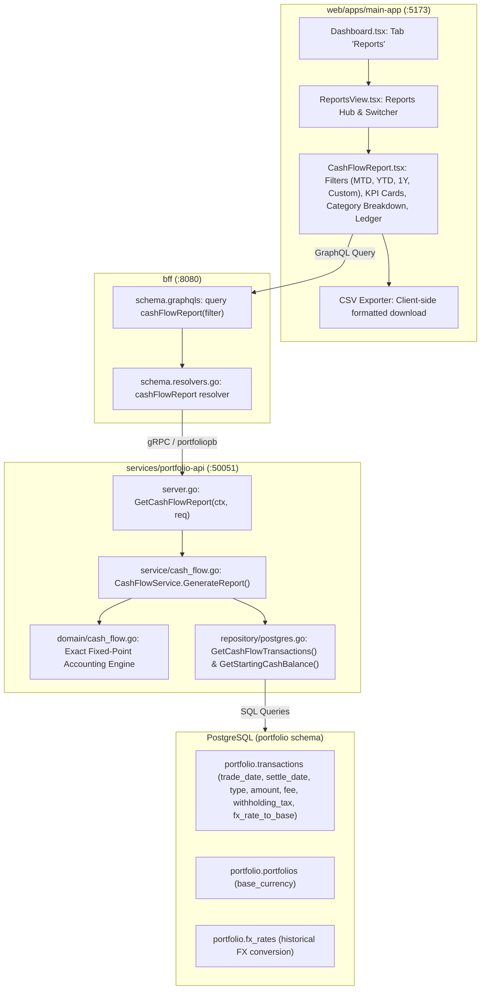

# Implementation Plan: Portfolio Cash Flow Report Generation

> **User Story**: [portfolio-cash-flow-report-generation.md](file:///Users/oscargarcia/workspace/graphfolio/docs/user-stories/portfolio-cash-flow-report-generation.md)  
> **Status**: Completed  
> **Roadmap Reference**: [FEATURES.md (Feature #27)](file:///Users/oscargarcia/workspace/graphfolio/FEATURES.md)  
> **Standards Compliance**: [financial-calculations skill](file:///Users/oscargarcia/workspace/graphfolio/.agents/skills/financial-calculations/SKILL.md) (GIPS, US GAAP ASC 946, IFRS 9)  
> **Target Layers**: Protobuf (`proto/portfolio/v1/`), Domain Microservice (`services/portfolio-api`), BFF (`bff/`), Web Monorepo (`web/apps/main-app`)  

---

## 1. Executive Summary & Financial Objectives

### 1.1 Problem Statement & Investor Motivation
Investors tracking investment portfolios need clear visibility into actual cash liquidity and movements beyond mark-to-market stock price changes. Existing screens in GraphFolio show current uninvested cash and the chronological transaction ledger, but lack:
1. **Time-Bound Net Cash Movement**: How much new cash entered the portfolio vs. how much capital was withdrawn over a given timeframe (MTD, YTD, 12M, or custom window).
2. **Passive Income Tracking**: Separating external capital contributions from organic cash generation (dividends and cash sweep interest).
3. **True Cash Reconciliation**: A mathematically provable accounting identity that reconciles the starting cash balance, total inflows, total outflows, and ending cash balance without rounding drift.
4. **Historical Running Cash Balances**: Knowing what the uninvested cash balance was at each discrete settlement point throughout the reporting period.
5. **Tax & Audit Export**: Downloading complete, structured cash flow reports (summary KPIs and itemized rows) for personal accounting, financial advisors, or tax filing.

### 1.2 The Cash Flow Accounting Identity
All calculations adhere to strict zero-floating-point arithmetic (`github.com/shopspring/decimal` in Go and the GraphQL `Decimal` scalar). For any selected timeframe $[t_{\text{start}}, t_{\text{end}}]$:

$$\text{Ending Cash Balance} \equiv \text{Starting Cash Balance} + \text{Total Inflows} - \text{Total Outflows}$$

$$\text{Net Cash Flow} = \text{Total Inflows} - \text{Total Outflows}$$

Where:
- $\text{Starting Cash Balance} = \sum_{\tau < t_{\text{start}}} \Delta\text{Cash}_{\tau}$ (cumulative net cash impact of all transactions settled before the start date).
- $\text{Total Inflows} = \sum_{k \in \text{Inflows}} \Delta\text{Cash}_k$ (sum of all positive cash additions in the period).
- $\text{Total Outflows} = \sum_{j \in \text{Outflows}} |\Delta\text{Cash}_j|$ (sum of all negative cash deductions in the period).
- $\text{Running Cash Balance}_m = \text{Starting Cash Balance} + \sum_{i=1}^m \Delta\text{Cash}_i$.

For the final transaction $N$ in the period:
$$\text{Running Cash Balance}_N \equiv \text{Ending Cash Balance}$$

---

## 2. Technical Architecture & End-to-End Data Flow



---

## 3. Cash Event Taxonomy & Mathematical Specifications

### 3.1 Event Classification & Base Currency Conversion Matrix

Every transaction in `portfolio.transactions` is converted into the portfolio's base currency ($C_{\text{base}}$) using its event exchange rate $\text{FX}_{\text{event}}$ (stored on the transaction as `fx_rate_to_base`, or looked up from `portfolio.fx_rates` on the event date, defaulting to $1.0$ for domestic transactions).

| Transaction Type | Cash Flow Direction | Category | Net Cash Impact ($\Delta\text{Cash}$) | Description / Accounting Treatment |
| :--- | :---: | :--- | :--- | :--- |
| **`DEPOSIT`** | **Inflow (+)** | `CAPITAL_DEPOSITS` | $+(\text{Amount} \times \text{FX}) - (\text{Fee} \times \text{FX}_{\text{fee}})$ | External cash injected into the account. |
| **`DIVIDEND`** | **Inflow (+)** | `DIVIDENDS` | $+(\text{Amount} - \text{WithholdingTax}) \times \text{FX}$ | Net cash dividend received. (Gross dividend is recorded, foreign withholding tax is accounted). |
| **`INTEREST`** | **Inflow (+)** | `INTEREST` | $+(\text{Amount} \times \text{FX})$ | Cash sweep yield, high-interest savings or bond coupon interest credited. |
| **`SELL`** | **Inflow (+)** | `SALE_PROCEEDS` | $+(\text{Amount} \times \text{FX}) - (\text{Fee} \times \text{FX}_{\text{fee}})$ | Net proceeds received from closing an equity/ETF position. |
| **`TRANSFER_IN`** | **Inflow (+)** | `CAPITAL_DEPOSITS` | $+(\text{Amount} \times \text{FX})$ | Cash transfer into portfolio account from linked broker. |
| **`WITHDRAWAL`** | **Outflow (-)** | `CAPITAL_WITHDRAWALS` | $-(\text{Amount} \times \text{FX}) - (\text{Fee} \times \text{FX}_{\text{fee}})$ | Cash withdrawn to external bank account. |
| **`BUY`** | **Outflow (-)** | `PURCHASES` | $-(\text{Amount} \times \text{FX}) - (\text{Fee} \times \text{FX}_{\text{fee}})$ | Cash debited to settle security acquisition including brokerage commissions. |
| **`TRANSFER_OUT`** | **Outflow (-)** | `CAPITAL_WITHDRAWALS` | $-(\text{Amount} \times \text{FX})$ | Cash transfer out to linked broker. |
| **`FEE`** | **Outflow (-)** | `FEES` | $-(\text{Amount} \times \text{FX})$ | Custody fee, subscription fee, or margin loan financing interest. |
| **`TAX`** | **Outflow (-)** | `TAXES` | $-(\text{Amount} \times \text{FX})$ | Account-level withholding or transaction stamp duty/tax. |
| **`SPLIT`** | **Neutral (0)** | `CORPORATE_ACTIONS` | $0.00$ | Non-cash corporate action. Excluded from cash flow report. |
| **`FX_CONVERSION`** | **Variable** | `FX_CONVERSIONS` | Net conversion fee/spread impact | Multi-currency cash balance transfer. |

### 3.2 Date Resolution & Settlement Rules (US GAAP ASC 946 / IFRS 9)
1. **Event Date Determination**:
   ```sql
   COALESCE(t.settle_date, t.trade_date)
   ```
   - In accordance with cash statement accounting, cash flows only realize when settled.
   - If `settle_date` is populated (e.g. from nabtrade / CommSec CSV statements), `settle_date` is the definitive accounting date.
   - If `settle_date` is NULL (e.g. manually entered trade), `trade_date` is used as the fallback.
2. **Pending / Unsettled Inflows**:
   - Declared dividends or trade executions with settlement dates strictly after the report's `to_date` are excluded from the current period.
3. **Dividend Reinvestment Plans (DRIP)**:
   - Evaluated as a dual-leg transaction:
     - Leg 1: Inflow `DIVIDEND` of $+\$X.XX$
     - Leg 2: Outflow `BUY` of $-\$X.XX$
   - Both legs appear in the itemized ledger and category breakdowns, maintaining true passive income attribution while keeping the net cash impact correctly neutral ($+\$X - \$X = \$0$).
4. **Handling Negative Cash Balances (Overdraft / Margin)**:
   - When trades are executed prior to cash deposit imports, the running cash balance may be negative.
   - All equations are invariant to sign: starting balances and running balances handle negative values seamlessly without breaking $\text{Starting} + \text{Inflows} - \text{Outflows} \equiv \text{Ending}$.

---

## 4. Contract Specifications

### 4.1 Protocol Buffers Contract (`proto/portfolio/v1/portfolio.proto`)

Extend `PortfolioService` with a dedicated `GetCashFlowReport` RPC and corresponding messages:

```protobuf
// Add to PortfolioService in proto/portfolio/v1/portfolio.proto:
service PortfolioService {
  ...
  // Portfolio Cash Flow Report
  rpc GetCashFlowReport(GetCashFlowReportRequest) returns (GetCashFlowReportResponse) {}
}

enum CashFlowTimeframe {
  CASH_FLOW_TIMEFRAME_UNSPECIFIED = 0;
  CASH_FLOW_TIMEFRAME_MTD = 1;         // Month-to-date
  CASH_FLOW_TIMEFRAME_YTD = 2;         // Year-to-date
  CASH_FLOW_TIMEFRAME_1M = 3;          // Trailing 1 month
  CASH_FLOW_TIMEFRAME_3M = 4;          // Trailing 3 months
  CASH_FLOW_TIMEFRAME_6M = 5;          // Trailing 6 months
  CASH_FLOW_TIMEFRAME_1Y = 6;          // Trailing 1 year (12 months)
  CASH_FLOW_TIMEFRAME_ALL = 7;         // Inception to date
  CASH_FLOW_TIMEFRAME_CUSTOM = 8;      // Custom from_date / to_date
}

message GetCashFlowReportRequest {
  string             user_id   = 1;
  CashFlowTimeframe  timeframe = 2;
  string             from_date = 3;    // YYYY-MM-DD (required when timeframe == CUSTOM)
  string             to_date   = 4;    // YYYY-MM-DD (optional, defaults to current date)
  string             currency  = 5;    // Optional currency filter (defaults to portfolio base)
}

message CashFlowSummary {
  common.v1.Money starting_cash_balance = 1;
  common.v1.Money total_inflows         = 2;
  common.v1.Money total_outflows        = 3;
  common.v1.Money net_cash_flow         = 4;
  common.v1.Money ending_cash_balance   = 5;
}

message CashFlowCategoryBreakdown {
  // Inflow Categories
  common.v1.Money deposits       = 1;
  common.v1.Money dividends      = 2;
  common.v1.Money interest       = 3;
  common.v1.Money sales_proceeds = 4;

  // Outflow Categories
  common.v1.Money withdrawals    = 5;
  common.v1.Money purchases      = 6;
  common.v1.Money fees           = 7;
  common.v1.Money taxes          = 8;
}

message CashFlowItem {
  string            id              = 1;
  string            event_date      = 2; // YYYY-MM-DD
  TransactionType   type            = 3;
  string            flow_direction  = 4; // "INFLOW" or "OUTFLOW"
  string            category        = 5; // e.g. "DIVIDENDS", "PURCHASES", "CAPITAL_DEPOSITS"
  string            symbol          = 6; // e.g. "AAPL", "IVV.AX", or empty
  string            instrument_name = 7;
  string            description     = 8;
  common.v1.Money   net_amount      = 9; // In base currency (+ for inflow, - for outflow)
  common.v1.Money   running_balance = 10;// Cumulative cash balance in base currency
  common.v1.Money   local_amount    = 11;// Original transaction currency & amount
  common.v1.Money   fee             = 12;
  common.v1.Money   withholding_tax = 13;
}

message GetCashFlowReportResponse {
  CashFlowSummary           summary        = 1;
  CashFlowCategoryBreakdown breakdown      = 2;
  repeated CashFlowItem     items          = 3;
  string                    base_currency  = 4;
  string                    from_date      = 5;
  string                    to_date        = 6;
}
```

### 4.2 GraphQL BFF Schema (`bff/graph/schema.graphqls`)

Extend GraphQL schema to support query operations:

```graphql
enum CashFlowTimeframe {
  MTD
  YTD
  M1
  M3
  M6
  Y1
  ALL
  CUSTOM
}

enum CashFlowDirection {
  INFLOW
  OUTFLOW
}

enum CashFlowCategory {
  CAPITAL_DEPOSITS
  DIVIDENDS
  INTEREST
  SALE_PROCEEDS
  CAPITAL_WITHDRAWALS
  PURCHASES
  FEES
  TAXES
}

input CashFlowFilterInput {
  timeframe: CashFlowTimeframe!
  fromDate: String       # YYYY-MM-DD
  toDate: String         # YYYY-MM-DD
  currency: String       # Optional target currency
}

type CashFlowSummary {
  startingCashBalance: Money!
  totalInflows: Money!
  totalOutflows: Money!
  netCashFlow: Money!
  endingCashBalance: Money!
}

type CashFlowCategoryBreakdown {
  deposits: Money!
  dividends: Money!
  interest: Money!
  salesProceeds: Money!
  withdrawals: Money!
  purchases: Money!
  fees: Money!
  taxes: Money!
}

type CashFlowItem {
  id: ID!
  eventDate: String!
  type: TransactionType!
  flowDirection: CashFlowDirection!
  category: CashFlowCategory!
  symbol: String
  instrumentName: String
  description: String!
  netAmount: Money!
  runningBalance: Money!
  localAmount: Money!
  fee: Money!
  withholdingTax: Money!
}

type CashFlowReport {
  summary: CashFlowSummary!
  breakdown: CashFlowCategoryBreakdown!
  items: [CashFlowItem!]!
  baseCurrency: String!
  fromDate: String!
  toDate: String!
}

extend type Query {
  cashFlowReport(filter: CashFlowFilterInput!): CashFlowReport!
}
```

---

## 5. Domain Microservice Implementation (`services/portfolio-api`)

### 5.1 Domain Models (`internal/domain/cash_flow.go`)
Create domain entities for calculations:

```go
package domain

import (
	"time"

	"github.com/google/uuid"
	"github.com/shopspring/decimal"
)

type CashFlowCategory string

const (
	CategoryCapitalDeposits    CashFlowCategory = "CAPITAL_DEPOSITS"
	CategoryDividends          CashFlowCategory = "DIVIDENDS"
	CategoryInterest           CashFlowCategory = "INTEREST"
	CategorySaleProceeds       CashFlowCategory = "SALE_PROCEEDS"
	CategoryCapitalWithdrawals CashFlowCategory = "CAPITAL_WITHDRAWALS"
	CategoryPurchases          CashFlowCategory = "PURCHASES"
	CategoryFees               CashFlowCategory = "FEES"
	CategoryTaxes              CashFlowCategory = "TAXES"
)

type CashFlowDirection string

const (
	FlowInflow  CashFlowDirection = "INFLOW"
	FlowOutflow CashFlowDirection = "OUTFLOW"
)

type CashFlowFilter struct {
	UserID    string
	Timeframe string
	FromDate  time.Time
	ToDate    time.Time
	Currency  string
}

type CashFlowItem struct {
	ID              uuid.UUID
	EventDate       time.Time
	Type            TransactionType
	Direction       CashFlowDirection
	Category        CashFlowCategory
	Symbol          *string
	InstrumentName  *string
	Description     string
	NetAmountBase   decimal.Decimal // Positive for inflow, negative for outflow
	RunningBalance  decimal.Decimal
	LocalAmount     decimal.Decimal
	LocalCurrency   string
	FeeBase         decimal.Decimal
	TaxBase         decimal.Decimal
}

type CashFlowSummary struct {
	StartingCashBalance decimal.Decimal
	TotalInflows        decimal.Decimal
	TotalOutflows       decimal.Decimal
	NetCashFlow         decimal.Decimal
	EndingCashBalance   decimal.Decimal
	BaseCurrency        string
}

type CashFlowCategoryBreakdown struct {
	Deposits      decimal.Decimal
	Dividends     decimal.Decimal
	Interest      decimal.Decimal
	SalesProceeds decimal.Decimal
	Withdrawals   decimal.Decimal
	Purchases     decimal.Decimal
	Fees          decimal.Decimal
	Taxes         decimal.Decimal
	BaseCurrency  string
}

type CashFlowReport struct {
	Summary      CashFlowSummary
	Breakdown    CashFlowCategoryBreakdown
	Items        []CashFlowItem
	BaseCurrency string
	FromDate     time.Time
	ToDate       time.Time
}
```

### 5.2 Repository Queries (`internal/repository/postgres.go` & `queries.go`)
Define queries to retrieve:
1. All settled transactions for the portfolio up to `toDate` (ordered chronologically by `COALESCE(settle_date, trade_date) ASC, created_at ASC, id ASC`).
2. Calculation of pre-window starting balance and window transactions.

```sql
-- queries.go: getCashFlowTransactionsSQL
SELECT 
    t.id, t.portfolio_id, t.instrument_id, t.type, t.trade_date, t.settle_date,
    t.quantity, t.price, t.amount, t.currency_code, t.fee, t.withholding_tax,
    t.fx_rate_to_base, t.external_ref, t.notes, t.fee_currency_code, t.created_at,
    i.symbol, i.name AS instrument_name
FROM portfolio.transactions t
LEFT JOIN portfolio.instruments i ON i.id = t.instrument_id
WHERE t.portfolio_id = $1
  AND COALESCE(t.settle_date, t.trade_date) <= $2
ORDER BY COALESCE(t.settle_date, t.trade_date) ASC, t.created_at ASC, t.id ASC;
```

### 5.3 Cash Flow Engine & Business Logic (`internal/service/cash_flow.go`)
Create calculation routine that:
1. Replays transactions prior to `FromDate` to compute exact `StartingCashBalance`.
2. Evaluates transactions between `FromDate` and `ToDate`:
   - Classifies each into `INFLOW` vs `OUTFLOW` and specific category.
   - Computes base-currency net cash impact $\Delta\text{Cash}$.
   - Maintains rolling cumulative `RunningBalance`:
     $$\text{RunningBalance}_i = \text{RunningBalance}_{i-1} + \Delta\text{Cash}_i$$
   - Generates friendly descriptions (e.g., `"Quarterly Dividend - 12 shares"`, `"Buy 10 AAPL @ $220.50"`, `"Funds Transfer Deposit"`).
3. Sums category subtotals and checks mathematical reconciliation:
   $$\text{EndingCashBalance} = \text{StartingCashBalance} + \text{TotalInflows} - \text{TotalOutflows}$$
4. Returns the structured `CashFlowReport`.

---

## 6. BFF Layer Implementation (`bff/`)

1. **Resolver Implementation (`bff/graph/schema.resolvers.go`)**:
   Implement `cashFlowReport(ctx context.Context, filter model.CashFlowFilterInput)`:
   - Map GraphQL timeframe enum and optional custom dates to gRPC `GetCashFlowReportRequest`.
   - Call `r.portfolioClient.GetCashFlowReport(ctx, req)`.
   - Map proto `CashFlowSummary`, `CashFlowCategoryBreakdown`, and `CashFlowItem` into generated GraphQL models.
2. **Precision Decimal Helpers (`bff/graph/helpers.go`)**:
   - Convert `portfoliopb.Money` to GraphQL `model.Money` with exact string decimals.
   - Map `TransactionType` and `CashFlowCategory` safely.
3. **Unit Tests (`bff/graph/schema.resolvers_test.go`)**:
   - Validate GraphQL query resolver with mock gRPC responses.

---

## 7. Web Application Implementation (`web/apps/main-app`)

### 7.1 Top-Level Navigation Tab in `Dashboard.tsx`
In anticipation of expanding analytical reports in future releases, the top-level tab switcher in `Dashboard.tsx` introduces a unified **`Reports`** tab alongside `Overview` and `Transaction Ledger`:

```tsx
// Dashboard.tsx
const [activeTab, setActiveTab] = useState<'overview' | 'ledger' | 'reports'>('overview');

...

<div className="view-tabs">
  <button
    type="button"
    className={`view-tab-btn ${activeTab === 'overview' ? 'active' : ''}`}
    onClick={() => setActiveTab('overview')}
  >
    Overview
  </button>
  <button
    type="button"
    className={`view-tab-btn ${activeTab === 'ledger' ? 'active' : ''}`}
    onClick={() => setActiveTab('ledger')}
  >
    Transaction Ledger
  </button>
  <button
    type="button"
    className={`view-tab-btn ${activeTab === 'reports' ? 'active' : ''}`}
    onClick={() => setActiveTab('reports')}
  >
    Reports
  </button>
</div>
```

When `activeTab === 'reports'`, `Dashboard.tsx` renders `<ReportsView />`.

---

### 7.2 Reports Hub & Directory (`src/components/ReportsView.tsx` & `.css`)
To provide a clean, extensible architectural foundation for GraphFolio's reporting suite, create `ReportsView`:
1. **Sub-Navigation / Report Selector**:
   - Modern pill or tab navigation allowing the investor to choose their active report:
     - **Cash Flow Report** (Default / Active)
     - **Tax Lots & Capital Gains** *(Planned — Feature #22)*
     - **Dividend Calendar & Yield** *(Planned — Feature #23)*
     - **Look-Through Owner Earnings** *(Planned — Feature #15)*
2. **Upcoming Reports Drawer / Badge**:
   - Non-active planned reports are shown with subtle `SOON` badges or descriptive cards, providing immediate architectural room for upcoming features without cluttering the main dashboard.
3. **Report Viewport**:
   - When `"cash-flow"` is active (the default), renders `<CashFlowReport />`.

---

### 7.3 Cash Flow Report Component (`src/components/CashFlowReport.tsx` & `.css`)
Create a modern, dark glassmorphic report component:
1. **Timeframe Filter Toolbar**:
   - Quick preset pills: `MTD`, `YTD`, `Trailing 12M`, `Trailing 6M`, `Trailing 3M`, `All Time`, `Custom Range`.
   - When `Custom Range` is selected, renders start and end HTML5 `<input type="date">` controls with auto-query on change.
2. **Top KPI Summary Cards**:
   - 5-card grid:
     - **Starting Cash**: Neutral gray balance.
     - **Total Inflows**: Vibrant green badge with total additions.
     - **Total Outflows**: Coral red badge with total deductions.
     - **Net Cash Flow**: Dynamic color (green if positive, coral if negative).
     - **Ending Cash**: Reconciled cash position with reconciliation checkmark (`✓ Reconciled`).
3. **Category Breakdown Grid**:
   - Two panels side-by-side (or responsive stack):
     - **Inflows Breakdown**: Deposits, Dividends, Cash Interest, Stock Sale Proceeds.
     - **Outflows Breakdown**: Withdrawals, Stock Purchases, Brokerage/Custody Fees, Taxes.
     - Visual progress/ratio bars showing percentage of total flow.
4. **Itemized Cash Flow Table**:
   - Columns:
     - `Date` (Settlement date)
     - `Type` (Colored pill badge: Deposit, Dividend, Buy, Sell, Interest, etc.)
     - `Asset / Symbol` (Ticker or "—")
     - `Description` (Note or generated description)
     - `Cash Flow Amount` (Green `+$...` or Coral `-$...`)
     - `Running Balance` (Computed cumulative cash position)
   - Interactive column sorting: Sort by Date (asc/desc), Cash Flow Amount, or Category.
5. **Export Functionality (AC 5)**:
   - Dedicated "Export CSV" button.
   - Client-side CSV generator formats:
     - Metadata section (Portfolio Name, Base Currency, Date Window, Generation Date).
     - Executive Summary section (Starting, Inflows, Outflows, Net, Ending).
     - Category breakdown totals.
     - Complete itemized ledger table.
   - Auto-triggers browser download (`GraphFolio_CashFlowReport_YYYYMMDD.csv`).

---

## 8. Verification & Quality Assurance Strategy

### 8.1 Backend Unit Testing (`services/portfolio-api`)
Create table-driven tests in `services/portfolio-api/internal/service/cash_flow_test.go`:
1. **Reconciliation Invariant**:
   Assert that $\text{StartingCash} + \text{Inflows} - \text{Outflows} == \text{EndingCash}$ across diverse portfolios.
2. **Pre-Period Replay (Starting Balance)**:
   Ensure transactions before `FromDate` establish the correct starting cash balance, including multiple foreign currencies.
3. **DRIP Two-Leg Handling**:
   Verify that a dividend + reinvestment pair records both income and purchase outflow, yielding zero net cash change.
4. **Negative Cash Balances**:
   Verify that portfolios with overdraft or negative balances compute running balances and totals accurately without error.
5. **Boundary Date Inclusions**:
   Verify that transactions occurring on `FromDate` and `ToDate` are correctly included.

### 8.2 BFF Unit Testing (`bff/graph/`)
- Test GraphQL resolvers with mock gRPC responses in `bff/graph/schema.resolvers_test.go`.

### 8.3 Frontend & Build Validation
- Run TypeScript compile check: `npm run build` in `web/apps/main-app`.
- Ensure zero lint errors, proper formatting, and flawless responsive layout.

---

## 9. Implementation Checklist & Phase Roadmap

- [x] **Phase 1: Protocol Buffers Definition & Code Generation**
  - [x] Add `CashFlowTimeframe`, `GetCashFlowReportRequest`, `GetCashFlowReportResponse`, `CashFlowSummary`, `CashFlowCategoryBreakdown`, and `CashFlowItem` to `proto/portfolio/v1/portfolio.proto`.
  - [x] Run `make proto` to generate Go proto code.
- [x] **Phase 2: Domain Microservice Engine (`services/portfolio-api`)**
  - [x] Create domain types in `internal/domain/cash_flow.go`.
  - [x] Implement `getCashFlowTransactionsSQL` in `internal/repository/queries.go`.
  - [x] Implement repository query methods in `internal/repository/postgres.go`.
  - [x] Implement `CashFlowService` in `internal/service/cash_flow.go` with exact fixed-point arithmetic.
  - [x] Implement gRPC server endpoint `GetCashFlowReport` in `internal/server.go`.
  - [x] Add comprehensive unit tests in `internal/service/cash_flow_test.go` and `internal/server_test.go`.
- [x] **Phase 3: BFF GraphQL Layer (`bff/`)**
  - [x] Extend `bff/graph/schema.graphqls` with cash flow types and `cashFlowReport` query.
  - [x] Implement resolver in `bff/graph/schema.resolvers.go` and mapping helpers in `bff/graph/helpers.go`.
  - [x] Add resolver unit tests in `bff/graph/schema.resolvers_test.go`.
- [x] **Phase 4: Client Generation & Web UI (`web/`)**
  - [x] Run `make generate` to regenerate GraphQL models and GenQL client in `@graphfolio/api-client`.
  - [x] Create `ReportsView.tsx` and `ReportsView.css` as the extensible reports center with report directory & switcher.
  - [x] Create `CashFlowReport.tsx` and `CashFlowReport.css` with KPI cards, category breakdown, itemized table, and CSV export.
  - [x] Integrate `'reports'` tab in `web/apps/main-app/src/components/Dashboard.tsx`.
- [x] **Phase 5: Verification & Documentation**
  - [x] Run full test suite: `make test`.
  - [x] Update [FEATURES.md](file:///Users/oscargarcia/workspace/graphfolio/FEATURES.md) to register Feature #27 as DONE.
  - [x] Update user story status to Completed.

