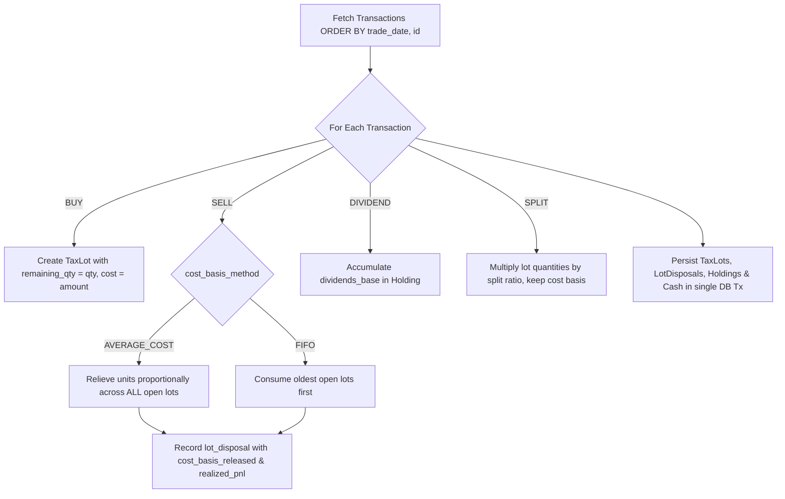

# Portfolio Service & Repository Layer Implementation Plan

> Branch: `feat/service-layer` (or `feat/db-layer`)  
> Target Service: `services/portfolio-api`  
> Database: PostgreSQL (`graphfolio.portfolio` schema via `pkg/database` & `pgx/v5`)  
> Precision: Exact arithmetic via `github.com/shopspring/decimal`  

---

## 1. Overview & Objectives

With the PostgreSQL database schema, migrations, and seed data now in place, `services/portfolio-api` needs to transition from returning hardcoded mock data to executing real database queries and domain calculations.

### Primary Goals
1. **Repository Layer**: Implement hand-written SQL queries with `pgx/v5` adhering to the project's contract-first, zero-float principles.
2. **Domain & Calculation Engine**: Implement exact financial formulas for:
   - Portfolio valuation (market value of holdings + cash balance converted to portfolio base currency).
   - "Today's Return" (holding-level price change + FX fluctuation vs. previous close).
   - "Total Return" (current value minus cost basis + realized P&L + dividends).
   - Time-Weighted Return (TWR) and annualized return percentage derived from historical valuations.
3. **Ledger Projection Engine**: Logic to process `transactions` into `tax_lots`, `lot_disposals`, `holdings`, and `cash_balances` for both `AVERAGE_COST` and `FIFO` accounting methods.
4. **Seamless Integration**: Replace the mock in `internal/server.go` so `GetPortfolio` serves live data from the database to gRPC and GraphQL BFF clients.

---

## 2. Layered Architecture

In accordance with `AGENTS.md` §2, `services/portfolio-api` will maintain strict internal separation of concerns:

```text
services/portfolio-api/
├── cmd/server/
│   └── main.go                 # Entrypoint: pool init, graceful shutdown, server wiring
├── internal/
│   ├── domain/                 # Pure domain entities, value objects, math calculations
│   │   ├── money.go            # Money & Decimal value objects with currency tags
│   │   ├── portfolio.go        # Portfolio, Holding, Investment aggregate entities
│   │   ├── transaction.go      # Transaction, TaxLot, LotDisposal entities
│   │   └── calculator.go       # Return metrics, TWR annualization, weighted averages
│   ├── repository/             # Database access interfaces & pgx implementations
│   │   ├── repository.go       # Repository interfaces
│   │   ├── postgres.go         # PostgresRepository struct wrapping *pgxpool.Pool
│   │   ├── queries.go          # Raw SQL constants (schema-qualified, parameterized)
│   │   ├── portfolio_repo.go   # GetPortfolio, GetHoldingsWithPrices, GetCashBalances
│   │   └── ledger_repo.go      # GetTransactions, SaveLots, SaveHoldings (for rebuilds)
│   ├── service/                # Application & orchestration layer
│   │   ├── service.go          # PortfolioService interface & implementation
│   │   └── projection.go       # RebuildEngine: ledger -> tax lots -> holdings
│   └── server/
│       └── grpc.go             # gRPC PortfolioServiceServer implementation (proto mapper)
├── migrations/                 # Embedded SQL schema migrations
├── seeds/                      # Local dev seed scripts
└── go.mod
```

---

## 3. Domain Model & Mathematical Formulas

All arithmetic is executed using `decimal.Decimal` (never Go `float32` or `float64`).

### 3.1 Holding Valuation & Today's Return
For each holding $i$ with quantity $Q_i$, instrument price $P_{t,i}$, previous close $P_{t-1,i}$, and FX rate to base currency $FX_{t,i}$:

$$\text{Value}_{\text{inst}, i} = Q_i \times P_{t,i}$$

$$\text{Value}_{\text{base}, i} = \text{Value}_{\text{inst}, i} \times FX_{t,i}$$

$$\Delta P_i = P_{t,i} - P_{t-1,i}$$

$$\text{TodayReturnAmount}_{\text{inst}, i} = Q_i \times \Delta P_i$$

$$\text{TodayReturnAmount}_{\text{base}, i} = \text{TodayReturnAmount}_{\text{inst}, i} \times FX_{t,i}$$

$$\text{TodayReturnPercent}_i = \begin{cases} \left(\frac{\Delta P_i}{P_{t-1,i}}\right) \times 100, & \text{if } P_{t-1,i} > 0 \\ 0, & \text{otherwise} \end{cases}$$

### 3.2 Total Return
$$\text{CostBasis}_{\text{base}, i} = \text{Holdings.cost\_basis\_base}_i$$

$$\text{TotalReturnAmount}_{\text{base}, i} = \text{Value}_{\text{base}, i} - \text{CostBasis}_{\text{base}, i} + \text{RealizedPnL}_{\text{base}, i} + \text{Dividends}_{\text{base}, i}$$

$$\text{TotalReturnPercent}_i = \begin{cases} \left(\frac{\text{TotalReturnAmount}_{\text{base}, i}}{\text{CostBasis}_{\text{base}, i}}\right) \times 100, & \text{if } \text{CostBasis}_{\text{base}, i} > 0 \\ 0, & \text{otherwise} \end{cases}$$

### 3.3 Portfolio Aggregates
$$\text{TotalHoldingsValue}_{\text{base}} = \sum \text{Value}_{\text{base}, i}$$

$$\text{TotalCash}_{\text{base}} = \sum (\text{CashBalance}_c \times FX_{t,c})$$

$$\text{TotalPortfolioValue} = \text{TotalHoldingsValue}_{\text{base}} + \text{TotalCash}_{\text{base}}$$

$$\text{TodayPortfolioReturnAmount} = \sum \text{TodayReturnAmount}_{\text{base}, i}$$

$$\text{TodayPortfolioReturnPercent} = \frac{\text{TodayPortfolioReturnAmount}}{\text{TotalPortfolioValue} - \text{TodayPortfolioReturnAmount}} \times 100$$

### 3.4 Annualized Return (TWR)
From the latest record in `portfolio.portfolio_valuations`:
- Given cumulative growth factor $\text{TWRIndex}$ (e.g. $1.1420$) over $D$ calendar days since inception ($D \ge 1$):

$$\text{AnnualizedReturnPercent} = \left( \text{TWRIndex}^{\frac{365.25}{D}} - 1 \right) \times 100$$

*(If total history is under 1 year, we can optionally report non-annualized cumulative TWR or annualized per user preference).*

---

## 4. Repository Layer Design

### 4.1 Interface Contract
```go
package repository

import (
    "context"
    "github.com/google/uuid"
    "portfolio-api/internal/domain"
)

type Repository interface {
    // Queries for GetPortfolio
    FindPortfolioByUser(ctx context.Context, userID string) (*domain.Portfolio, error)
    GetHoldingsWithMarketData(ctx context.Context, portfolioID uuid.UUID) ([]domain.HoldingWithPrice, error)
    GetCashBalances(ctx context.Context, portfolioID uuid.UUID) ([]domain.CashBalance, error)
    GetLatestValuation(ctx context.Context, portfolioID uuid.UUID) (*domain.PortfolioValuation, error)
    
    // Ledger & Rebuild Operations
    GetTransactions(ctx context.Context, portfolioID uuid.UUID) ([]domain.Transaction, error)
    GetCorporateActions(ctx context.Context, instrumentIDs []uuid.UUID) ([]domain.CorporateAction, error)
    SaveProjectionsTx(ctx context.Context, portfolioID uuid.UUID, lots []domain.TaxLot, disposals []domain.LotDisposal, holdings []domain.Holding, cash []domain.CashBalance) error
}
```

### 4.2 Key SQL Queries

#### 1. Holdings with Latest & Previous Market Prices
```sql
SELECT 
    h.portfolio_id,
    h.instrument_id,
    i.symbol,
    i.name,
    i.currency_code AS instrument_currency,
    h.quantity,
    h.cost_basis,
    h.cost_basis_base,
    h.realized_pnl_base,
    h.dividends_base,
    COALESCE(curr_p.close, 0) AS latest_price,
    COALESCE(prev_p.close, curr_p.close, 0) AS prev_price,
    COALESCE(curr_fx.rate, 1.0) AS fx_rate_to_base
FROM portfolio.holdings h
JOIN portfolio.instruments i ON i.id = h.instrument_id
JOIN portfolio.portfolios p ON p.id = h.portfolio_id
-- Latest price (most recent trading day)
LEFT JOIN LATERAL (
    SELECT close 
    FROM portfolio.instrument_prices 
    WHERE instrument_id = h.instrument_id 
    ORDER BY price_date DESC LIMIT 1
) curr_p ON true
-- Previous price (second most recent trading day)
LEFT JOIN LATERAL (
    SELECT close 
    FROM portfolio.instrument_prices 
    WHERE instrument_id = h.instrument_id 
      AND price_date < CURRENT_DATE 
    ORDER BY price_date DESC LIMIT 1
) prev_p ON true
-- FX rate from instrument currency to portfolio base currency
LEFT JOIN LATERAL (
    SELECT rate 
    FROM portfolio.fx_rates 
    WHERE base_currency = i.currency_code 
      AND quote_currency = p.base_currency 
    ORDER BY rate_date DESC LIMIT 1
) curr_fx ON (i.currency_code <> p.base_currency)
WHERE h.portfolio_id = $1 AND h.quantity > 0
ORDER BY (h.quantity * COALESCE(curr_p.close, 0)) DESC;
```

#### 2. Portfolio Lookup by User (with Demo/Single-User Fallback)
```sql
-- Supports UUID lookup, or matches "1" to the default seeded demo portfolio
SELECT id, user_id, name, base_currency, cost_basis_method, created_at
FROM portfolio.portfolios
WHERE ($1 = '1' OR user_id::text = $1)
  AND archived_at IS NULL
ORDER BY created_at ASC
LIMIT 1;
```

---

## 5. Ledger Projection Engine (Rebuild Engine)

To support both **AVERAGE_COST** and **FIFO**, the service includes an in-memory or transactional replay engine:



### Pro-Rata Relief (Average Cost)
When selling $S$ units out of total open quantity $Q = \sum q_j$:
For each open lot $j$:
$$s_j = S \times \frac{q_j}{Q}$$
$$\text{CostReleased}_j = \text{cost\_basis}_j \times \frac{s_j}{q_j}$$
The sum of $\text{CostReleased}_j$ across all lots equals $S \times \frac{\sum \text{cost\_basis}_j}{Q}$, reproducing exact average cost down to the penny. Any cent-rounding discrepancies are allocated to the largest lot.

---

## 6. gRPC Server Implementation (`server/grpc.go`)

The gRPC handler maps internal domain aggregates to `graphfolio/proto/portfolio/v1` protobuf messages:

```go
func (s *PortfolioGRPCServer) GetPortfolio(ctx context.Context, req *pb.GetPortfolioRequest) (*pb.GetPortfolioResponse, error) {
    dto, err := s.service.GetPortfolioSummary(ctx, req.GetUserId())
    if err != nil {
        return nil, status.Errorf(codes.Internal, "failed to get portfolio: %v", err)
    }

    return &pb.GetPortfolioResponse{
        Portfolio: mapper.ToProto(dto),
    }, nil
}
```

---

## 7. Implementation Phases

| Phase | Tasks | Deliverables | Verification Criteria |
|---|---|---|---|
| **Phase 1** | **Domain Entities & Math** | `internal/domain/`: `portfolio.go`, `holding.go`, `calculator.go`, `calculator_test.go` | Unit tests verify zero-rounding error math, edge cases (zero cost basis, 0 holdings). |
| **Phase 2** | **Repository Layer** | `internal/repository/`: `queries.go`, `postgres.go`, `portfolio_repo.go`, `integration_test.go` | Query tests against seeded `graphfolio_test` return AAPL, MSFT, TSLA, NVDA, V. |
| **Phase 3** | **Service & Orchestration** | `internal/service/`: `service.go`, assembling holdings + cash + TWR into final response DTO | Service unit tests verify correct aggregation and fallback logic. |
| **Phase 4** | **Rebuild Engine (Lots)** | `internal/service/projection.go`, lot matching for `AVERAGE_COST` and `FIFO` | Unit tests verify the $1,000 (avg) vs $1,500 (FIFO) realized P&L test scenario from seed. |
| **Phase 5** | **gRPC Server & Wiring** | `internal/server/grpc.go`, update `cmd/server/main.go` to inject Postgres pool into service | Server runs, starts without errors, logs `database pool connected`. |
| **Phase 6** | **End-to-End Verification** | Smoke test with `make run` and GraphQL query | Dashboard at `localhost:5173` loads real seeded DB numbers; BFF returns identical values. |

---

## 8. Verification & Test Plan

1. **Pure Unit Tests**:
   - `calculator_test.go`: Test calculations of today's return %, total return %, market values, and annualized TWR without database dependencies.
   - `projection_test.go`: Table-driven tests for lot matching (Buy 10 @ 100, Buy 10 @ 200, Sell 10 @ 250) asserting exact outputs for both `AVERAGE_COST` and `FIFO`.
2. **Repository Integration Tests**:
   - Run against `graphfolio_test` using `pkg/database.NewPool`.
   - Verify lateral join correctly extracts latest vs. previous day close prices.
   - Verify FX rate lookup returns 1.0 when instrument currency equals portfolio base currency.
3. **End-to-End Verification**:
   - Run `make db-reset && make run`.
   - Query GraphQL BFF endpoint at `http://localhost:8080/query`.
   - Verify all 5 investments and total portfolio metrics match the seeded figures ($124,532.89 total value, $8,450.00 cash).
