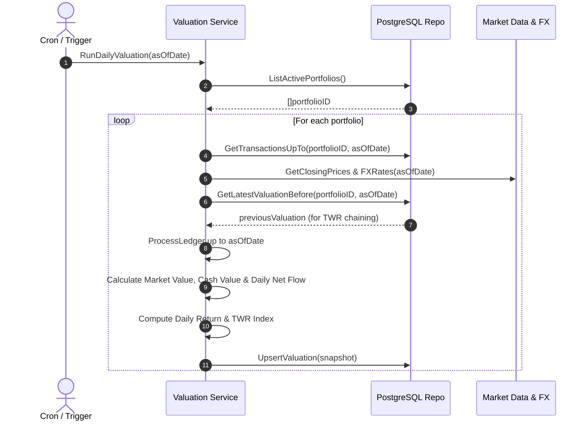

# Portfolio Valuation Engine & Historical Backfill Implementation Plan

> **Branch**: `feat/portfolio-valuation-engine`  
> **Targets**: `services/portfolio-api` (`internal/domain/`, `internal/repository/`, `internal/service/`, `cmd/worker/`)  
> **Key Principle**: Provide an automated, deterministic pipeline to populate and maintain daily time-series snapshots in `portfolio.portfolio_valuations` using exact fixed-point arithmetic and industry-standard Time-Weighted Return (TWR) formulas.

---

## 1. Architectural Overview & Problem Context

`portfolio.portfolio_valuations` is the foundational time-series table backing GraphFolio's performance curves, period returns, and annualized growth metrics. In production, this table must be populated and maintained across two distinct scenarios:

1. **Daily End-of-Day (EOD) Valuation Job**: Automatically snapshots every active portfolio at daily market close and FX fixing times.
2. **Historical Ledger Backfill**: Automatically replays and reconstructs daily historical snapshots when:
   - A user imports historical trade history (CSV / brokerage sync).
   - A back-dated transaction is added, modified, or cancelled.
   - A portfolio cost-basis method or corporate action is applied retroactively.



---

## 2. Mathematical Formulation & Precision Rules

All calculations strictly use `github.com/shopspring/decimal.Decimal` with zero floating-point arithmetic.

### 2.1 Total Portfolio Value ($V_t$)
At valuation date $t$, for portfolio with base currency $C_{\text{base}}$:

$$V_t = \text{MarketValue}_t + \text{CashValue}_t$$

Where:
$$\text{MarketValue}_t = \sum_{i \in \text{Holdings}_t} \left( Q_{i,t} \times P_{i,t} \times \text{FX}(C_i \to C_{\text{base}}, t) \right)$$
$$\text{CashValue}_t = \sum_{c \in \text{Currencies}} \left( B_{c,t} \times \text{FX}(c \to C_{\text{base}}, t) \right)$$

- $Q_{i,t}$: Quantity of instrument $i$ held at end of date $t$.
- $P_{i,t}$: Official market close price of instrument $i$ on date $t$.
- $B_{c,t}$: Cash balance in currency $c$ at end of date $t$.
- $\text{FX}(A \to B, t)$: Currency conversion rate on date $t$. If date $t$ is a weekend or public holiday, carry forward the most recent available trading day's price/rate (**Last Available Observation / LOCF**).

### 2.2 External Net Cash Flow ($F_t$)
Net external capital injections or withdrawals executed on date $t$ (converted to portfolio base currency):

$$F_t = \sum \text{Deposits}_t - \sum \text{Withdrawals}_t$$

*Note: Dividends received in cash and internal transfers between assets are internal returns/reallocations and are **not** external cash flows.*

### 2.3 Sub-Period Daily Return ($R_t$)
To prevent deposits or withdrawals from artificially inflating or depressing performance returns, the sub-period daily return isolates market performance:

$$R_t = \frac{(V_t - F_t) - V_{t-1}}{V_{t-1}}$$

**Boundary Cases**:
- If $V_{t-1} = 0$:
  - If $V_t - F_t \le 0$, $R_t = 0$.
  - First capital deposit does not produce an artificial infinite return: $R_t = 0$.
- If $V_{t-1} > 0$ and $V_t = 0$ (full account liquidation):
  - $R_t = \frac{-F_t - V_{t-1}}{V_{t-1}}$.

### 2.4 Cumulative Time-Weighted Return Index ($\text{TWR}_t$)
The cumulative TWR index tracks the compound growth of 1.0 unit of currency invested from portfolio inception:

$$\text{TWR}_t = \text{TWR}_{t-1} \times (1 + R_t)$$

- Inception baseline: $\text{TWR}_0 = 1.000000000000$ (stored to 12 decimal places).
- Annualized Return:
  $$\text{AnnualizedReturn} = \left( \text{TWR}_t^{\frac{365}{\text{Days}}} - 1 \right) \times 100$$

---

## 3. Database Schema & Query Design

The target table is already defined in [`services/portfolio-api/migrations/000006_projections.up.sql`](file:///Users/oscargarcia/workspace/graphfolio/services/portfolio-api/migrations/000006_projections.up.sql#L24-L33):

```sql
CREATE TABLE portfolio.portfolio_valuations (
    portfolio_id        uuid           NOT NULL REFERENCES portfolio.portfolios(id) ON DELETE CASCADE,
    valuation_date      date           NOT NULL,
    market_value_base   numeric(20,6)  NOT NULL,
    cash_value_base     numeric(20,6)  NOT NULL,
    net_flow_base       numeric(20,6)  NOT NULL DEFAULT 0,
    daily_return        numeric(20,12),
    twr_index           numeric(20,12) NOT NULL,
    PRIMARY KEY (portfolio_id, valuation_date)
);
```

### 3.1 Repository Query Extensions (`internal/repository/queries.go`)

```go
// 1. Batch upsert valuation snapshots
UpsertValuationsBatch(ctx context.Context, valuations []domain.PortfolioValuation) error

// 2. Fetch latest valuation snapshot before a given date (for TWR chaining)
GetLatestValuationBefore(ctx context.Context, portfolioID uuid.UUID, beforeDate time.Time) (*domain.PortfolioValuation, error)

// 3. Batch fetch historical instrument closing prices across date range with LOCF
GetHistoricalPriceMatrix(ctx context.Context, instrumentIDs []uuid.UUID, fromDate, toDate time.Time) (map[uuid.UUID]map[string]decimal.Decimal, error)

// 4. Batch fetch historical FX rates across date range with LOCF
GetHistoricalFXMatrix(ctx context.Context, currencies []string, baseCurrency string, fromDate, toDate time.Time) (map[string]map[string]decimal.Decimal, error)

// 5. Delete future valuations after a historical edit point
DeleteValuationsFromDate(ctx context.Context, portfolioID uuid.UUID, fromDate time.Time) error
```

---

## 4. Layer-by-Layer Implementation Specs

### 4.1 Domain Layer (`services/portfolio-api/internal/domain/valuation.go`)

Define core valuation calculator models:

```go
package domain

import (
	"time"
	"github.com/google/uuid"
	"github.com/shopspring/decimal"
)

type PortfolioValuationSnapshot struct {
	PortfolioID     uuid.UUID
	ValuationDate   time.Time
	MarketValueBase decimal.Decimal
	CashValueBase   decimal.Decimal
	NetFlowBase     decimal.Decimal
	DailyReturn     *decimal.Decimal
	TWRIndex        decimal.Decimal
}

// CalculateDailyReturn computes sub-period daily return with exact precision.
func CalculateDailyReturn(currentVal, previousVal, netFlow decimal.Decimal) *decimal.Decimal

// ChainTWR calculates the updated TWR index from the previous index and daily return.
func ChainTWR(previousTWR decimal.Decimal, dailyReturn *decimal.Decimal) decimal.Decimal
```

### 4.2 Service Layer (`services/portfolio-api/internal/service/valuation.go`)

Implement the `ValuationEngine` service:

```go
type ValuationService interface {
	// SnapshotValuation computes and stores the daily valuation snapshot for a single date.
	SnapshotValuation(ctx context.Context, portfolioID uuid.UUID, asOfDate time.Time) (*domain.PortfolioValuationSnapshot, error)

	// BackfillPortfolioValuations replays history and recomputes all daily valuations from fromDate onwards.
	BackfillPortfolioValuations(ctx context.Context, portfolioID uuid.UUID, fromDate time.Time) error

	// RunDailyValuationJob runs the scheduled valuation snapshot across all active portfolios.
	RunDailyValuationJob(ctx context.Context, asOfDate time.Time) error
}
```

#### Backfill Algorithm:
1. Identify `earliest_date = max(fromDate, portfolio.InceptionDate)`.
2. Delete existing records: `DeleteValuationsFromDate(ctx, portfolioID, earliest_date)`.
3. Fetch `prevValuation = GetLatestValuationBefore(ctx, portfolioID, earliest_date)`. If none exists, `prevValuation.TWRIndex = 1.0`.
4. Fetch all transactions for the portfolio up to `today`.
5. Pre-fetch historical market prices and FX rates matrix for all involved instruments and currencies across the date window.
6. Step through calendar days $t = \text{earliest\_date} \to \text{today}$:
   - Filter transactions where `TxDate <= t` to build end-of-day holdings and cash balances.
   - Sum deposits and withdrawals where `TxDate == t` for `net_flow_base`.
   - Calculate $V_t$, $R_t$, and $\text{TWR}_t$.
   - Append to batch buffer.
7. Execute `UpsertValuationsBatch(ctx, buffer)` inside a database transaction.

### 4.3 Trigger Integration: Transaction Ingestion Hook

In [`services/portfolio-api/internal/service/service.go`](file:///Users/oscargarcia/workspace/graphfolio/services/portfolio-api/internal/service/service.go):
- Modify `AddTransaction`:
  ```go
  // After saving transaction and RebuildProjections:
  if req.TransactionDate.Before(todayUTC) {
      // Historical transaction detected; trigger historical valuation replay
      go func() {
          _ = s.valuationService.BackfillPortfolioValuations(context.Background(), portfolioID, req.TransactionDate)
      }()
  } else {
      // Current day transaction; update today's snapshot
      _ = s.valuationService.SnapshotValuation(ctx, portfolioID, todayUTC)
  }
  ```

### 4.4 Scheduled EOD Worker (`cmd/worker/main.go`)

Create a lightweight background job runner or cron task:
- Executes at scheduled market close (e.g., `0 22 * * 1-5` for weekdays 22:00 UTC).
- Calls `RunDailyValuationJob(ctx, todayUTC)`.
- Emits structured metrics (number of portfolios processed, duration, errors).

---

## 5. Step-by-Step Implementation Phases

| Phase | Tasks | Verification Criteria |
|---|---|---|
| **Phase 1: Domain & Mathematics** | 1. Create `internal/domain/valuation.go`<br>2. Unit tests for $V_t$, $R_t$, TWR chaining, and zero-start cases in `internal/domain/valuation_test.go` | Tests pass with 100% precision coverage; zero floating-point math. |
| **Phase 2: Repository Queries** | 1. Implement `UpsertValuationsBatch`<br>2. Implement `GetLatestValuationBefore`<br>3. Implement matrix queries for `instrument_prices` & `fx_rates` with LOCF fallback in `internal/repository/` | Integration and mock tests pass; queries return correct time-series buckets. |
| **Phase 3: Backfill & Valuation Engine** | 1. Create `internal/service/valuation.go`<br>2. Implement `SnapshotValuation` & `BackfillPortfolioValuations`<br>3. Unit tests with `MockRepository` in `internal/service/valuation_test.go` | Unit tests verify multi-day replay across deposits, buys, sells, and dividends. |
| **Phase 4: Ingestion Hook & Daily Job** | 1. Hook `AddTransaction` to trigger backfills for past-dated transactions<br>2. Implement `RunDailyValuationJob`<br>3. Add gRPC endpoint `RebuildValuations` in `portfolio.proto` | Adding a back-dated transaction updates subsequent valuations in Postgres. |
| **Phase 5: CLI / Worker Entrypoint** | 1. Add `services/portfolio-api/cmd/worker/main.go`<br>2. Add `make run-valuation-job` command in `Makefile` | Command runs cleanly against local DB and updates valuation snapshots. |

---

## 6. Testing & Quality Assurance

- **Zero 3rd-Party Assertions**: Standard `testing` package only (`t.Run`, `t.Errorf`, `t.Fatalf`).
- **Decimal Assertions**: Use `.Equal()`, never `==`.
- **Edge Case Tests**:
  - Deposits followed by immediate market decline.
  - Zero starting balance (first funding).
  - Complete portfolio liquidation ($V_t \to 0$).
  - Weekend transactions and missing closing prices (LOCF carry-forward verification).
- **Race Condition Safety**: Must pass `go test -v -race ./...`.
