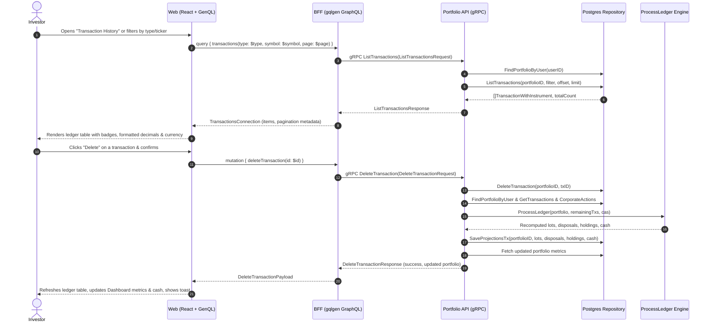

# Transaction History & Ledger Management Implementation Plan

> **Target**: Transaction Ledger History, Filtering, Pagination, and Deletion with Automatic Projection Replay  
> **Scope**: `proto/`, `services/portfolio-api`, `bff/`, and `web/`  
> **Key Principle**: The ledger (`portfolio.transactions`) is the authoritative source of truth. Deleting or modifying a ledger entry immediately invokes the deterministic ledger projection engine (`RebuildProjections`), recalculating all tax lots, holdings, and cash balances atomically.

---

## 1. Architectural Overview & Data Flow

Users can inspect their complete transaction history, filter by type (`BUY`, `SELL`, `DIVIDEND`, `DEPOSIT`, `WITHDRAWAL`) or ticker, and delete mistakes. Deleting a transaction removes it from the append-only ledger and triggers `RebuildProjections` to re-align holdings and tax lots.



---

## 2. Layer-by-Layer Specifications

### 2.1 Protocol Buffers (`proto/portfolio/v1/portfolio.proto`)

Extend the service contract with `ListTransactions` and `DeleteTransaction` RPCs:

```protobuf
message TransactionItem {
  string            id              = 1;
  TransactionType   type            = 2;
  string            symbol          = 3; // empty for cash events
  string            instrument_name = 4;
  string            trade_date      = 5; // YYYY-MM-DD
  common.v1.Decimal quantity        = 6; // nullable
  common.v1.Money   price           = 7; // nullable
  common.v1.Money   amount          = 8;
  common.v1.Money   fee             = 9;
  string            notes           = 10;
  string            created_at      = 11;
}

message ListTransactionsRequest {
  string          user_id   = 1;
  TransactionType type      = 2; // optional filter (0 = all)
  string          symbol    = 3; // optional symbol filter
  int32           page      = 4; // 1-indexed, default 1
  int32           page_size = 5; // default 20, max 100
}

message ListTransactionsResponse {
  repeated TransactionItem transactions = 1;
  int32                    total_count  = 2;
  int32                    page         = 3;
  int32                    page_size    = 4;
}

message DeleteTransactionRequest {
  string user_id        = 1;
  string transaction_id = 2;
}

message DeleteTransactionResponse {
  bool      success   = 1;
  Portfolio portfolio = 2; // Recomputed portfolio metrics
}

service PortfolioService {
  rpc GetPortfolio(GetPortfolioRequest) returns (GetPortfolioResponse) {}
  rpc AddTransaction(AddTransactionRequest) returns (AddTransactionResponse) {}
  rpc ListInstruments(ListInstrumentsRequest) returns (ListInstrumentsResponse) {}
  rpc ListTransactions(ListTransactionsRequest) returns (ListTransactionsResponse) {}
  rpc DeleteTransaction(DeleteTransactionRequest) returns (DeleteTransactionResponse) {}
}
```

---

### 2.2 Microservice Layer (`services/portfolio-api`)

#### 1. Domain Entities (`internal/domain/transaction.go`)
```go
type TransactionWithInstrument struct {
    Transaction
    Symbol         *string
    InstrumentName *string
}

type TransactionFilter struct {
    Type     *TransactionType
    Symbol   *string
    Page     int
    PageSize int
}
```

#### 2. Repository Layer (`internal/repository/`)
- **Files**: `repository.go`, `queries.go`, `postgres.go`
- **Queries**:
  - `listTransactionsSQL`:
    ```sql
    SELECT 
        t.id, t.portfolio_id, t.instrument_id, t.type, t.trade_date,
        t.quantity, t.price, t.amount, t.currency_code, t.fee,
        t.withholding_tax, t.fx_rate_to_base, t.external_ref, t.notes,
        t.created_at, i.symbol, i.name AS instrument_name,
        COUNT(*) OVER() AS total_count
    FROM portfolio.transactions t
    LEFT JOIN portfolio.instruments i ON i.id = t.instrument_id
    WHERE t.portfolio_id = $1
      AND ($2::text IS NULL OR t.type::text = $2)
      AND ($3::text IS NULL OR i.symbol = $3)
    ORDER BY t.trade_date DESC, t.created_at DESC, t.id DESC
    LIMIT $4 OFFSET $5;
    ```
  - `deleteTransactionSQL`:
    ```sql
    DELETE FROM portfolio.transactions
    WHERE id = $1 AND portfolio_id = $2;
    ```
- **Repository Interface Methods**:
  ```go
  ListTransactions(ctx context.Context, portfolioID uuid.UUID, filter domain.TransactionFilter) ([]domain.TransactionWithInstrument, int, error)
  DeleteTransaction(ctx context.Context, portfolioID uuid.UUID, transactionID uuid.UUID) error
  ```

#### 3. Service Layer (`internal/service/transaction.go`)
- **`ListTransactions(ctx, userID, filter)`**:
  1. Resolves portfolio for `userID`.
  2. Defaults `filter.Page = 1` and `filter.PageSize = 20` (capped at 100).
  3. Invokes `repo.ListTransactions`.
- **`DeleteTransaction(ctx, userID, transactionID)`**:
  1. Resolves portfolio for `userID`.
  2. Executes `repo.DeleteTransaction(ctx, portfolio.ID, txUUID)`.
  3. Replays projections: invokes `s.RebuildProjections(ctx, userID)` to re-evaluate open lots, disposals, holdings, and cash balances across remaining transactions.
  4. Returns `s.GetPortfolioSummary(ctx, userID)` so caller receives the updated snapshot.

#### 4. gRPC Server Handlers (`internal/server.go`)
- Implement `ListTransactions(ctx, req)` mapping database rows to `pb.TransactionItem` with `decimalpb`.
- Implement `DeleteTransaction(ctx, req)` returning updated `pb.Portfolio`.

---

### 2.3 Backend-for-Frontend Layer (`bff/`)

#### 1. GraphQL Schema (`bff/graph/schema.graphqls`)
```graphql
type TransactionItem {
  id: ID!
  type: TransactionType!
  symbol: String
  instrumentName: String
  tradeDate: String!
  quantity: Decimal
  price: Money
  amount: Money!
  fee: Money!
  notes: String
  createdAt: String!
}

type TransactionsConnection {
  items: [TransactionItem!]!
  totalCount: Int!
  page: Int!
  pageSize: Int!
}

extend type Query {
  transactions(
    type: TransactionType
    symbol: String
    page: Int = 1
    pageSize: Int = 20
  ): TransactionsConnection!
}

type DeleteTransactionPayload {
  success: Boolean!
  portfolio: Portfolio!
}

extend type Mutation {
  deleteTransaction(id: ID!): DeleteTransactionPayload!
}
```

#### 2. GraphQL Resolvers (`bff/graph/schema.resolvers.go`)
- `Query.transactions`: Forwards filter and pagination arguments to `PortfolioClient.ListTransactions`.
- `Mutation.deleteTransaction`: Calls `PortfolioClient.DeleteTransaction` and returns updated `portfolio`.

---

### 2.4 Frontend Layer (`web/`)

#### 1. Code Generation
- Run `make generate` to regenerate `genql` client with `transactions` query and `deleteTransaction` mutation.

#### 2. UI Components & UX
- **Navigation / View Toggle**:
  - Add view switcher on Dashboard: **[Portfolio Overview]** and **[Transaction Ledger]** (or a dedicated collapsible section below investments).
- **New Component: `TransactionLedger`** (`web/src/components/TransactionLedger.tsx` & `TransactionLedger.css`):
  - **Filter Toolbar**:
    - Type filter dropdown / pills: `ALL`, `BUY`, `SELL`, `DIVIDEND`, `DEPOSIT`, `WITHDRAWAL`.
    - Search input by ticker / symbol.
  - **Data Table**:
    - **Date**: Formatted ISO date.
    - **Type**: Colored badge (`BUY` green, `SELL` red, `DIVIDEND` blue, `DEPOSIT` purple, `WITHDRAWAL` orange).
    - **Asset**: Symbol + Name (or "Cash" for deposits/withdrawals).
    - **Quantity & Price**: Formatted numbers with exact decimal strings.
    - **Total Amount**: Formatted currency (`formatMoney`).
    - **Fee**: Brokerage fee if $> 0$.
    - **Notes**: Collapsible or tooltip on hover.
    - **Actions**: Trash icon button triggering confirmation modal.
  - **Pagination Controls**:
    - Showing "1–20 of 145 transactions".
    - `Previous` and `Next` buttons with active page numbers.
  - **Delete Confirmation Modal**:
    - Warning: "Deleting this transaction will re-calculate your portfolio holdings, tax lots, and cost basis."
    - Confirms deletion -> triggers `deleteTransaction` mutation -> updates ledger list and parent Dashboard portfolio metrics simultaneously -> shows success toast.

---

## 3. Implementation Phases & Work Breakdown

| Phase | Tasks & Files | Deliverables & Verification |
|---|---|---|
| **Phase 1: Contracts & Proto** | 1. Update `proto/portfolio/v1/portfolio.proto`<br>2. Run `make proto` | Proto compiles; generated Go stubs include `ListTransactions` and `DeleteTransaction`. |
| **Phase 2: Service & Repository** | 1. Add `ListTransactions` and `DeleteTransaction` in `repository/`<br>2. Add service logic with automatic `RebuildProjections` on delete<br>3. Implement handlers in `server.go`<br>4. Generate mocks: `go generate ./...` | Unit tests in `transaction_test.go` and `server_test.go` pass with `go test -v -race ./services/portfolio-api/...`. |
| **Phase 3: BFF GraphQL** | 1. Update `bff/graph/schema.graphqls`<br>2. Run `gqlgen generate`<br>3. Implement resolvers in `schema.resolvers.go`<br>4. Add resolver unit tests | BFF unit tests pass; `curl`/Playground query returns paginated transactions. |
| **Phase 4: Web UI Component** | 1. Regenerate GenQL client: `npx genql ...`<br>2. Build `TransactionLedger.tsx` & `.css`<br>3. Wire into `Dashboard.tsx` with live metric refresh | UI displays paginated history, filters by type/symbol, and deleting a trade updates dashboard metrics immediately. |
| **Phase 5: Verification & Polish** | 1. Run `make generate`<br>2. Check `gofmt`<br>3. Run `go vet ./...`<br>4. Run `make test`<br>5. `npm run build` | All tests pass, race detection clean, zero linter warnings. |

---

## 4. Verification & Testing Strategy

1. **Service Unit Tests (`services/portfolio-api/internal/service/transaction_test.go`)**:
   - Test `ListTransactions` with filters and pagination limits.
   - Test `DeleteTransaction` verifies repository delete is called and `RebuildProjections` is immediately executed.
   - Test deleting non-existent transaction returns not found error.
2. **Server Unit Tests (`services/portfolio-api/internal/server_test.go`)**:
   - Test gRPC status codes (`InvalidArgument` for bad pagination, `NotFound` for invalid ID).
   - Test protobuf mapping of nullable quantities, prices, and symbols.
3. **BFF Unit Tests (`bff/graph/schema.resolvers_test.go`)**:
   - Verify pagination offset and total count mapping.
   - Verify `deleteTransaction` mutation response.
4. **End-to-End Verification**:
   - Execute `make run`.
   - Add a transaction in the UI (e.g. BUY 5 MSFT @ $400).
   - Open Transaction Ledger -> verify the new transaction appears at the top of the list.
   - Filter by `BUY` or `MSFT` -> verify table updates.
   - Delete the transaction -> confirm modal -> verify transaction disappears, holding count decreases, and cash balance restores automatically.
