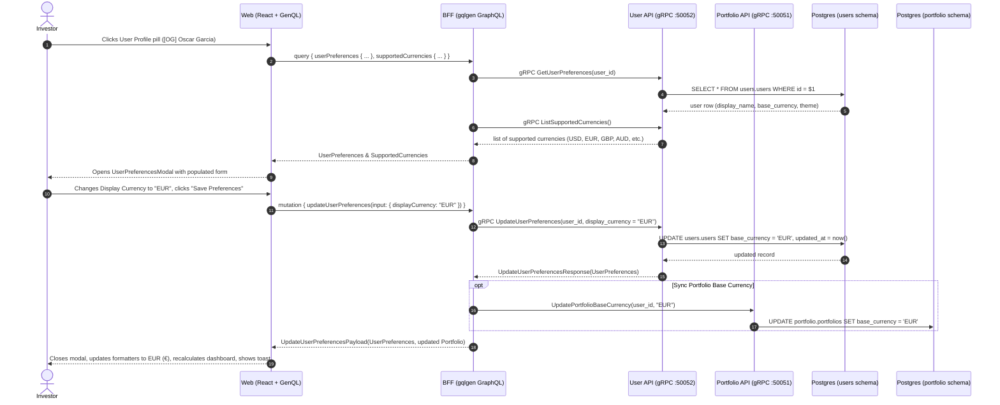

# User Preferences & Display Currency Implementation Plan

> **Target**: User Profile & Preferences Management (Viewing, Updating Display Currency, Display Name, and Theme)  
> **Scope**: `proto/user/v1/`, `services/user-api`, `bff/`, and `web/`  
> **Key Principle**: `user-api` is the authoritative service for user identity and personal preferences (`users.users`). The Backend-for-Frontend (BFF) orchestrates between `user-api` and `portfolio-api` so that changing the user's preferred display currency dynamically re-anchors portfolio valuations and currency formatting across the entire application without data drift.

---

## 1. Architectural Overview & System Topology

GraphFolio separates user identity/preferences from financial portfolio ledgers.
- `services/user-api` owns the `users` PostgreSQL schema (`user_svc` role) on `:50052`.
- `services/portfolio-api` owns the `portfolio` schema (`portfolio_svc` role) on `:50051`.
- `bff` on `:8080` connects via gRPC to both microservices and stitches data together for the frontend.
- `web` interacts with the GraphQL endpoint using a strongly-typed auto-generated client (`genql`).



---

## 2. Layer-by-Layer Technical Specifications

### 2.1 Protocol Buffers (`proto/user/v1/user.proto`)

Define the contracts for `UserService`:

```protobuf
syntax = "proto3";

package user.v1;

option go_package = "graphfolio/proto/user/v1;userpb";

service UserService {
  rpc GetUserPreferences(GetUserPreferencesRequest) returns (GetUserPreferencesResponse) {}
  rpc UpdateUserPreferences(UpdateUserPreferencesRequest) returns (UpdateUserPreferencesResponse) {}
  rpc ListSupportedCurrencies(ListSupportedCurrenciesRequest) returns (ListSupportedCurrenciesResponse) {}
}

message UserPreferences {
  string user_id          = 1;
  string email            = 2;
  string display_name     = 3;
  string display_currency = 4; // 3-letter ISO code: "USD", "EUR", "GBP", "AUD", etc.
  string theme            = 5; // "DARK", "LIGHT", "SYSTEM"
  string created_at       = 6;
  string updated_at       = 7;
}

message CurrencyInfo {
  string code   = 1; // "USD"
  string name   = 2; // "US Dollar"
  string symbol = 3; // "$"
}

message GetUserPreferencesRequest {
  string user_id = 1;
}

message GetUserPreferencesResponse {
  UserPreferences preferences = 1;
}

message UpdateUserPreferencesRequest {
  string user_id          = 1;
  optional string display_name     = 2;
  optional string display_currency = 3;
  optional string theme            = 4;
}

message UpdateUserPreferencesResponse {
  UserPreferences preferences = 1;
}

message ListSupportedCurrenciesRequest {}

message ListSupportedCurrenciesResponse {
  repeated CurrencyInfo currencies = 1;
}
```

Update root `Makefile` to include `proto/user/v1/user.proto` in `make proto`:
```makefile
proto:
	@echo "Generating Protocol Buffers code..."
	cd proto && protoc \
		--go_out=. --go_opt=paths=source_relative \
		--go-grpc_out=. --go-grpc_opt=paths=source_relative \
		common/v1/decimal.proto portfolio/v1/portfolio.proto user/v1/user.proto
```

---

### 2.2 Database & Migrations (`services/user-api`)

#### 1. Schema Migration (`services/user-api/migrations/000002_add_theme.up.sql`)
Extend the existing `users.users` table with theme preference and date format:
```sql
-- 000002_add_theme.up.sql
ALTER TABLE users.users
    ADD COLUMN IF NOT EXISTS theme text NOT NULL DEFAULT 'DARK' CHECK (theme IN ('DARK', 'LIGHT', 'SYSTEM'));
```

Down migration (`000002_add_theme.down.sql`):
```sql
ALTER TABLE users.users DROP COLUMN IF EXISTS theme;
```

#### 2. Seed Data (`services/user-api/seeds/dev_seed.sql`)
Seed the demo investor account matching the fixed demo UUID (`018f0000-0000-7000-8000-000000000001`):
```sql
INSERT INTO users.users (id, email, display_name, base_currency, theme)
VALUES (
    '018f0000-0000-7000-8000-000000000001',
    'demo@graphfolio.internal',
    'Oscar Garcia',
    'USD',
    'DARK'
)
ON CONFLICT (id) DO UPDATE
SET display_name = EXCLUDED.display_name,
    base_currency = EXCLUDED.base_currency,
    theme = EXCLUDED.theme;
```

---

### 2.3 Microservice Layer (`services/user-api`)

Create a clean layered domain structure inside `services/user-api/internal/`:

#### 1. Domain Entities (`internal/domain/user.go`)
```go
package domain

import (
	"time"
	"github.com/google/uuid"
)

type User struct {
	ID              uuid.UUID
	Email           string
	DisplayName     string
	DisplayCurrency string
	Theme           string
	CreatedAt       time.Time
	UpdatedAt       time.Time
}

type CurrencyInfo struct {
	Code   string
	Name   string
	Symbol string
}

var SupportedCurrencies = []CurrencyInfo{
	{Code: "USD", Name: "US Dollar", Symbol: "$"},
	{Code: "EUR", Name: "Euro", Symbol: "€"},
	{Code: "GBP", Name: "British Pound", Symbol: "£"},
	{Code: "AUD", Name: "Australian Dollar", Symbol: "A$"},
	{Code: "CAD", Name: "Canadian Dollar", Symbol: "C$"},
	{Code: "JPY", Name: "Japanese Yen", Symbol: "¥"},
	{Code: "CHF", Name: "Swiss Franc", Symbol: "CHF"},
}
```

#### 2. Repository (`internal/repository/`)
- `repository.go`:
  ```go
  type Repository interface {
      GetUserByID(ctx context.Context, id uuid.UUID) (*domain.User, error)
      UpdateUserPreferences(ctx context.Context, id uuid.UUID, displayName *string, currency *string, theme *string) (*domain.User, error)
  }
  ```
- `postgres.go`:
  Implement queries with `pgxpool.Pool`.
  `UpdateUserPreferences`: Builds an atomic `UPDATE users.users SET ... WHERE id = $1 RETURNING ...` query.

#### 3. Service Layer (`internal/service/`)
- `service.go`: Business logic and input validation:
  - Validates 3-letter currency against `SupportedCurrencies`.
  - Validates display name length (between 1 and 100 characters).
  - Validates theme (`DARK`, `LIGHT`, `SYSTEM`).
- Mock generation: Generate `MockRepository` and `MockUserService` using `go.uber.org/mock`.

#### 4. gRPC Server Adapter (`internal/server.go`)
- Implement `userpb.UserServiceServer`:
  - `GetUserPreferences`
  - `UpdateUserPreferences`
  - `ListSupportedCurrencies`
- Connect in `cmd/server/main.go` and register on port `:50052`.

---

### 2.4 Backend-for-Frontend Layer (`bff/`)

#### 1. GraphQL Schema (`bff/graph/schema.graphqls`)
Extend the schema with user preferences:

```graphql
type UserPreferences {
  userId: ID!
  email: String!
  displayName: String!
  displayCurrency: String!
  theme: String!
  createdAt: String!
  updatedAt: String!
}

type Currency {
  code: String!
  name: String!
  symbol: String!
}

input UpdateUserPreferencesInput {
  displayName: String
  displayCurrency: String
  theme: String
}

type UpdateUserPreferencesPayload {
  preferences: UserPreferences!
  portfolio: Portfolio
}

extend type Query {
  userPreferences: UserPreferences!
  supportedCurrencies: [Currency!]!
}

extend type Mutation {
  updateUserPreferences(input: UpdateUserPreferencesInput!): UpdateUserPreferencesPayload!
}
```

#### 2. gRPC Client & Server Wiring (`bff/cmd/server/main.go`)
- Connect to `user-api` on `localhost:50052`.
- Add `UserClient userpb.UserServiceClient` to `graph.Resolver`.

#### 3. Resolvers (`bff/graph/schema.resolvers.go`)
- `Query.userPreferences`: Calls `UserClient.GetUserPreferences`.
- `Query.supportedCurrencies`: Calls `UserClient.ListSupportedCurrencies`.
- `Mutation.updateUserPreferences`:
  1. Calls `UserClient.UpdateUserPreferences`.
  2. If `displayCurrency` was updated, optionally invokes `PortfolioClient` to update base currency or retrieve freshly revalued portfolio.
  3. Returns `UpdateUserPreferencesPayload`.

---

### 2.5 Web Frontend Layer (`web/`)

#### 1. Code Generation
Run `make generate` to regenerate `genql` typed client containing `userPreferences`, `supportedCurrencies`, and `updateUserPreferences`.

#### 2. Component: `UserPreferencesModal` (`web/src/components/UserPreferencesModal.tsx` & `.css`)
- **Trigger**: Clickable user badge in `Dashboard.tsx` (`[OG] Oscar Garcia`).
- **Modal Content**:
  - **User Info Banner**: Avatar with user initials, email display.
  - **Display Name**: Text input with real-time character count.
  - **Display Currency**: Rich select dropdown displaying flag/symbol, currency code, and full name (e.g. `USD ($) - US Dollar`, `EUR (€) - Euro`, `AUD (A$) - Australian Dollar`).
  - **Theme**: Segmented pill picker: `[ 🌙 Dark ] [ ☀️ Light ] [ 💻 System ]`.
  - **Action Buttons**: `Cancel` and `Save Preferences` (with spinner when saving).
- **User Feedback**:
  - Displays instant toast on save: `"Preferences saved. Display currency updated to EUR (€)"`.
  - Dynamic currency propagation: Formatter utilities immediately adopt the selected currency for all portfolio calculations.

---

## 3. Work Breakdown & Implementation Phases

| Phase | Tasks & Files | Deliverables & Verification |
|---|---|---|
| **Phase 1: Contracts & Database** `[COMPLETED]` | 1. Define `proto/user/v1/user.proto`<br>2. Update `Makefile` proto target<br>3. Run `make proto`<br>4. Add migration `000002_add_theme.up.sql`<br>5. Add seed file `services/user-api/seeds/dev_seed.sql` | `make proto` generates `userpb`; database migrations apply cleanly. |
| **Phase 2: User Microservice** `[COMPLETED]` | 1. Implement domain models in `internal/domain/`<br>2. Implement repository in `internal/repository/`<br>3. Implement service & validation in `internal/service/`<br>4. Implement gRPC server in `internal/server.go`<br>5. Wire server in `cmd/server/main.go`<br>6. Generate mocks and write unit tests in `service_test.go` and `server_test.go` | `go test -v -race ./services/user-api/...` passes with standard library testing. |
| **Phase 3: BFF Orchestration** `[COMPLETED]` | 1. Extend `bff/graph/schema.graphqls`<br>2. Run `gqlgen generate`<br>3. Connect gRPC client to `:50052` in `bff/cmd/server/main.go`<br>4. Implement resolvers in `schema.resolvers.go`<br>5. Add unit tests in `schema.resolvers_test.go` | `go test -v -race ./bff/...` passes; GraphQL playground can query preferences. |
| **Phase 4: Web UI & Settings Modal** `[COMPLETED]` | 1. Regenerate GenQL client: `npx genql ...`<br>2. Build `UserPreferencesModal.tsx` & `UserPreferencesModal.css`<br>3. Wire modal into `Dashboard.tsx` profile button<br>4. Connect dynamic currency formatter and toast alerts | Modal opens on profile click; changing currency updates currency symbols across dashboard. |
| **Phase 5: Verification & End-to-End Testing** `[COMPLETED]` | 1. Run `make generate`<br>2. Check `gofmt`<br>3. Run `go vet ./...`<br>4. Run `make test`<br>5. Run `npm run build` | All tests pass across all packages with race detection; production bundle builds cleanly. |

---

## 4. Verification & Testing Strategy

1. **User API Service Unit Tests (`services/user-api/internal/service/service_test.go`)**:
   - Test retrieving preferences for valid user.
   - Test updating display name and currency with valid and invalid codes (e.g. invalid currency code rejects with `ErrInvalidCurrency`).
   - Test updating theme (`DARK`, `LIGHT`, `SYSTEM`).
2. **User API Server Tests (`services/user-api/internal/server_test.go`)**:
   - Test gRPC status codes (`InvalidArgument` for bad input, `NotFound` for non-existent user).
3. **BFF Integration Tests (`bff/graph/schema.resolvers_test.go`)**:
   - Verify `userPreferences` and `supportedCurrencies` queries return valid mapped structures.
   - Verify `updateUserPreferences` mutation dispatches to `UserClient`.
4. **End-to-End Verification**:
   - Run `make run`.
   - Open browser dashboard at `http://localhost:5173`.
   - Click user profile pill in header -> Confirm `UserPreferencesModal` opens with current values.
   - Change currency from `USD` to `EUR` -> Click "Save Preferences".
   - Confirm toast message appears, modal closes, and dashboard display updates.
