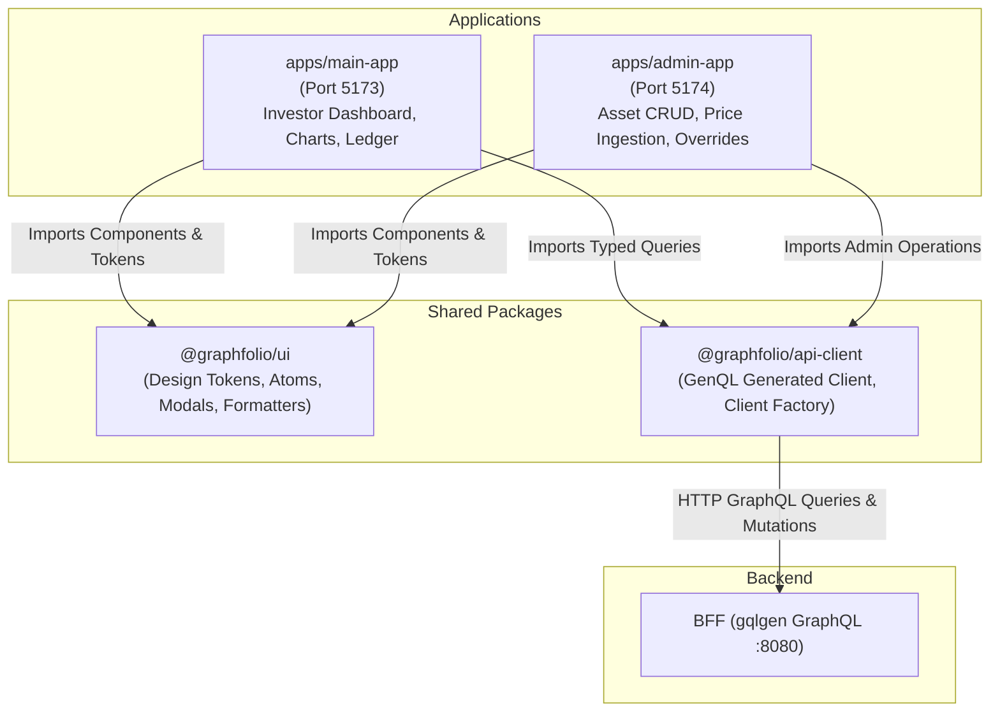

# Frontend Workspace Refactoring Implementation Plan
## Transitioning `web/` to a Monorepo Workspace Structure (`main-app` & `admin-app`)

> **Target**: Transition `web/` to an npm-driven multi-application workspace with shared design system (`@graphfolio/ui`) and GraphQL client (`@graphfolio/api-client`)  
> **Scope**: `web/` directory, `Makefile`, `bff/graph/schema.graphqls`, and project documentation  
> **Key Principle**: Zero configuration duplication and zero UI component duplication. Share design tokens, atomic UI primitives, and the auto-generated GraphQL client across the public-facing investor app (`main-app`) and internal operations portal (`admin-app`) while maintaining instantaneous Vite Hot Module Replacement (HMR).

---

## 1. Executive Summary & Architectural Motivation

GraphFolio's web frontend currently exists as a single monolithic Vite + React application in `web/`. As GraphFolio expands to include administrative capabilities—specifically **Asset & Instrument Management** (tickers, asset classes, currencies, active status) and **Market Price Ingestion & Overrides** (historical EOD prices, FX fixings, manual adjustments)—bundling admin interfaces into the public investor application introduces several critical issues:
1. **Security & Attack Surface**: Exposing admin workflows, internal operational tools, and administrative GraphQL mutations in the bundle served to end-investors.
2. **Bundle Bloat**: End-investors download administrative forms, tables, and ingestion monitoring widgets they will never use.
3. **Deployment Independence**: The investor dashboard and internal administrative tools have distinct lifecycle, deployment, and access-control requirements.

By refactoring `web/` into a standard npm workspace monorepo, we cleanly decouple the two applications while sharing a single source of truth for:
- **Design Tokens & UI Components** (`@graphfolio/ui`): Dark-mode glassmorphic styling, buttons, modals, tables, badges, and financial formatters.
- **Typed GraphQL API Client** (`@graphfolio/api-client`): Unified GenQL code generation and client factory.
- **Tooling & Configurations**: Shared TypeScript base configs, Oxlint rules, and standardized Vite bundler settings.

---

## 2. Architecture & Directory Tree Comparison

### 2.1 Current State (Monolithic Single App)

```text
web/
├── package.json              # Single package (scripts: dev, build, lint)
├── package-lock.json
├── index.html
├── vite.config.ts
├── tsconfig.json
├── tsconfig.app.json
├── tsconfig.node.json
├── .oxlintrc.json
└── src/
    ├── main.tsx
    ├── App.tsx
    ├── App.css
    ├── index.css             # Global tokens and styling
    ├── graphql/client.ts     # Local GenQL client instance
    ├── generated/            # GenQL generated artifacts
    └── components/
        ├── Dashboard.tsx & .css
        ├── PerformanceChart.tsx & .css
        ├── TransactionLedger.tsx & .css
        └── AddTransactionModal.tsx & .css
```

---

### 2.2 Target Workspace Architecture

```text
web/
├── package.json              # Workspace root declaring "workspaces": ["apps/*", "packages/*"]
├── package-lock.json         # Hoisted single lockfile
├── tsconfig.base.json        # Shared compiler options for all workspaces
├── .oxlintrc.json            # Shared linting configuration
│
├── apps/
│   ├── main-app/             # 1. Primary User-Facing Application (Port 5173)
│   │   ├── index.html
│   │   ├── package.json      # name: "@graphfolio/main-app"
│   │   ├── vite.config.ts    # Configured with alias to shared packages for instant HMR
│   │   ├── tsconfig.json     # Extends ../../tsconfig.base.json
│   │   └── src/
│   │       ├── main.tsx      # Mounts main React tree
│   │       ├── App.tsx
│   │       ├── App.css
│   │       └── components/
│   │           ├── Dashboard.tsx & .css
│   │           ├── PerformanceChart.tsx & .css
│   │           ├── TransactionLedger.tsx & .css
│   │           └── AddTransactionModal.tsx & .css
│   │
│   └── admin-app/            # 2. Internal Operations Portal (Port 5174)
│       ├── index.html
│       ├── package.json      # name: "@graphfolio/admin-app"
│       ├── vite.config.ts    # Configured on port 5174 with BFF proxying
│       ├── tsconfig.json     # Extends ../../tsconfig.base.json
│       └── src/
│           ├── main.tsx      # Mounts admin React tree
│           ├── App.tsx
│           ├── App.css
│           ├── components/
│           │   ├── AdminLayout.tsx & .css       # Sidebar navigation and header
│           │   ├── AssetManagement.tsx & .css   # Instrument CRUD & active toggles
│           │   ├── PriceManagement.tsx & .css   # Closing price overrides & ingestion trigger
│           │   ├── AddInstrumentModal.tsx & .css# Modal for registering new assets
│           │   └── PriceOverrideModal.tsx & .css# Modal for manual price adjustments
│           └── pages/
│               ├── AssetsPage.tsx
│               └── PricesPage.tsx
│
└── packages/
    ├── ui/                   # 3. Shared Design System & UI Primitives
    │   ├── package.json      # name: "@graphfolio/ui"
    │   ├── tsconfig.json     # Extends ../../tsconfig.base.json
    │   └── src/
    │       ├── index.ts      # Barrel exports
    │       ├── styles/
    │       │   ├── tokens.css      # CSS variables (colors, borders, glows, fonts)
    │       │   └── reset.css       # Box-sizing, baseline CSS resets
    │       ├── components/
    │       │   ├── Button/         # Button.tsx, Button.css (primary, secondary, danger, ghost)
    │       │   ├── Modal/          # Modal.tsx, Modal.css (accessible glassmorphic dialog)
    │       │   ├── Card/           # Card.tsx, Card.css (glassmorphic container)
    │       │   ├── Badge/          # Badge.tsx, Badge.css (BUY, SELL, DIVIDEND, ACTIVE, etc.)
    │       │   ├── Table/          # Table.tsx, Table.css (striped, responsive data table)
    │       │   ├── Input/          # Input.tsx, Input.css (form input with error label)
    │       │   └── Select/         # Select.tsx, Select.css (custom glass dropdown)
    │       └── utils/
    │           ├── formatters.ts   # formatMoney, formatDecimal, formatPercent, formatDate
    │           └── classnames.ts   # Lightweight CSS class combiner utility
    │
    └── api-client/           # 4. Shared GraphQL Client & GenQL Code
        ├── package.json      # name: "@graphfolio/api-client"
        ├── tsconfig.json     # Extends ../../tsconfig.base.json
        └── src/
            ├── index.ts      # Re-exports client factory, types, and schema helpers
            ├── generated/    # Target directory for `make generate` (GenQL SDK)
            ├── client.ts     # Configurable GraphQL client singleton / factory
            └── operations/   # Shared query & mutation definitions
```

---

## 3. Architecture & Dependency Flow



---

## 4. Layer-by-Layer Specifications

### 4.1 Workspace Root Configuration (`web/package.json`)

The root `package.json` coordinates dependencies, runs hoisted tasks, and provides ergonomic shortcuts for running or building individual applications.

```json
{
  "name": "graphfolio-web-monorepo",
  "private": true,
  "workspaces": [
    "apps/*",
    "packages/*"
  ],
  "scripts": {
    "dev:main": "npm run dev -w @graphfolio/main-app",
    "dev:admin": "npm run dev -w @graphfolio/admin-app",
    "build:main": "npm run build -w @graphfolio/main-app",
    "build:admin": "npm run build -w @graphfolio/admin-app",
    "build": "npm run build --workspaces",
    "lint": "oxlint apps packages",
    "codegen": "genql --schema ../bff/graph/schema.graphqls --output ./packages/api-client/src/generated"
  },
  "devDependencies": {
    "@genql/cli": "^6.3.4",
    "@types/node": "^24.13.3",
    "@types/react": "^19.2.18",
    "@types/react-dom": "^19.2.7",
    "@vitejs/plugin-react": "^6.1.1",
    "graphql": "^16.14.2",
    "oxlint": "^1.81.0",
    "typescript": "~6.0.2",
    "vite": "^8.3.0"
  }
}
```

---

### 4.2 Shared TypeScript Configuration (`web/tsconfig.base.json`)

To prevent divergence in compiler options across projects, define `web/tsconfig.base.json`. Each app and package inherits this base configuration:

```json
{
  "compilerOptions": {
    "target": "ES2023",
    "lib": ["ES2023", "DOM", "DOM.Iterable"],
    "module": "ESNext",
    "moduleResolution": "bundler",
    "types": ["vite/client"],
    "allowArbitraryExtensions": true,
    "skipLibCheck": true,
    "verbatimModuleSyntax": true,
    "moduleDetection": "force",
    "noEmit": true,
    "jsx": "react-jsx",
    "strict": true,
    "noUnusedLocals": true,
    "noUnusedParameters": true,
    "erasableSyntaxOnly": true,
    "noFallthroughCasesInSwitch": true
  }
}
```

---

### 4.3 Shared Package: `@graphfolio/ui` (`packages/ui/`)

#### 1. `packages/ui/package.json`
```json
{
  "name": "@graphfolio/ui",
  "version": "0.0.1",
  "private": true,
  "type": "module",
  "main": "./src/index.ts",
  "types": "./src/index.ts",
  "peerDependencies": {
    "react": "^19.0.0",
    "react-dom": "^19.0.0"
  }
}
```

#### 2. Design Tokens (`packages/ui/src/styles/tokens.css`)
Consolidates glassmorphism styles, color variables, borders, and typography:
```css
:root {
  --bg-color: #050505;
  --bg-gradient: radial-gradient(circle at 50% -20%, #1a1a2e 0%, var(--bg-color) 70%);
  --text-primary: #ffffff;
  --text-secondary: #a1a1aa;
  --text-muted: #71717a;
  
  --accent-green: #10b981;
  --accent-green-glow: rgba(16, 185, 129, 0.15);
  --accent-red: #ef4444;
  --accent-red-glow: rgba(239, 68, 68, 0.15);
  --accent-blue: #3b82f6;
  --accent-blue-glow: rgba(59, 130, 246, 0.15);
  --accent-amber: #f59e0b;
  
  --card-bg: rgba(255, 255, 255, 0.03);
  --card-bg-hover: rgba(255, 255, 255, 0.06);
  --card-border: rgba(255, 255, 255, 0.08);
  --card-border-active: rgba(255, 255, 255, 0.15);
  
  --glass-blur: blur(12px);
  --radius-sm: 6px;
  --radius-md: 10px;
  --radius-lg: 16px;
  
  font-family: 'Inter', system-ui, Avenir, Helvetica, Arial, sans-serif;
  line-height: 1.5;
  color-scheme: dark;
}
```

#### 3. Core Component Library
- **`Button`**: Reusable with variants (`primary`, `secondary`, `danger`, `ghost`, `icon`) and loading states.
- **`Modal`**: Accessible backdrop, escape key support, title bar, and close button, encapsulating the glassmorphism dialog style currently duplicated in modals.
- **`Card`**: Standardized glass container with optional header, footer, and glow highlights.
- **`Badge`**: Color-coded badges for transaction types (`BUY`, `SELL`, `DIVIDEND`, `DEPOSIT`, `WITHDRAWAL`) and asset statuses (`ACTIVE`, `INACTIVE`, `EQUITY`, `ETF`, `CRYPTO`).
- **`Table`**: Structured responsive table wrapper with sticky header, striped rows, and sorting indicators.
- **`Input` / `Select`**: Form elements styled with transparent backgrounds, subtle borders, focus glow, and error message rendering.
- **`Formatters` (`src/utils/formatters.ts`)**:
  - `formatMoney(amount, currencyCode)`
  - `formatPercent(decimalValue)`
  - `formatDate(dateString)`
  - `formatDecimal(decimalValue, decimals)`

---

### 4.4 Shared Package: `@graphfolio/api-client` (`packages/api-client/`)

#### 1. `packages/api-client/package.json`
```json
{
  "name": "@graphfolio/api-client",
  "version": "0.0.1",
  "private": true,
  "type": "module",
  "main": "./src/index.ts",
  "types": "./src/index.ts",
  "dependencies": {
    "graphql": "^16.14.2"
  }
}
```

#### 2. Client Factory & Configuration (`packages/api-client/src/client.ts`)
Allows injecting endpoint URLs or auth tokens for local development, test environments, or production:
```typescript
import { createClient as createGenqlClient, Client } from './generated';

export interface ClientConfig {
  url?: string;
  headers?: Record<string, string>;
}

const DEFAULT_URL = 'http://localhost:8080/query';

export function createGraphfolioClient(config: ClientConfig = {}): Client {
  return createGenqlClient({
    url: config.url || DEFAULT_URL,
    headers: config.headers,
  });
}

// Default singleton client instance for applications
export const client = createGraphfolioClient();
export * from './generated';
```

---

### 4.5 Application 1: `apps/main-app/` (Primary User Application)

#### 1. `apps/main-app/package.json`
```json
{
  "name": "@graphfolio/main-app",
  "private": true,
  "version": "0.0.1",
  "type": "module",
  "scripts": {
    "dev": "vite",
    "build": "tsc -b && vite build",
    "preview": "vite preview"
  },
  "dependencies": {
    "@graphfolio/ui": "*",
    "@graphfolio/api-client": "*",
    "react": "^19.2.8",
    "react-dom": "^19.2.8"
  }
}
```

#### 2. `apps/main-app/vite.config.ts`
Enables instant hot-module replacement for shared packages without requiring pre-compilation:
```typescript
import { defineConfig } from 'vite';
import react from '@vitejs/plugin-react';
import path from 'path';

export default defineConfig({
  plugins: [react()],
  server: {
    port: 5173,
  },
  resolve: {
    alias: {
      '@graphfolio/ui': path.resolve(__dirname, '../../packages/ui/src'),
      '@graphfolio/api-client': path.resolve(__dirname, '../../packages/api-client/src'),
    },
  },
});
```

#### 3. Component Migration
- Relocate `Dashboard.tsx`, `PerformanceChart.tsx`, `TransactionLedger.tsx`, and `AddTransactionModal.tsx` into `apps/main-app/src/components/`.
- Replace inline modal shells with `<Modal>` from `@graphfolio/ui`.
- Replace raw currency and decimal formatters with `formatMoney` and `formatPercent` from `@graphfolio/ui`.
- Update API client imports from `../graphql/client` to `@graphfolio/api-client`.

---

### 4.6 Application 2: `apps/admin-app/` (Internal Admin Portal)

#### 1. `apps/admin-app/package.json`
```json
{
  "name": "@graphfolio/admin-app",
  "private": true,
  "version": "0.0.1",
  "type": "module",
  "scripts": {
    "dev": "vite",
    "build": "tsc -b && vite build",
    "preview": "vite preview"
  },
  "dependencies": {
    "@graphfolio/ui": "*",
    "@graphfolio/api-client": "*",
    "react": "^19.2.8",
    "react-dom": "^19.2.8"
  }
}
```

#### 2. `apps/admin-app/vite.config.ts`
Runs on port 5174 to run alongside `main-app` without port conflicts:
```typescript
import { defineConfig } from 'vite';
import react from '@vitejs/plugin-react';
import path from 'path';

export default defineConfig({
  plugins: [react()],
  server: {
    port: 5174,
  },
  resolve: {
    alias: {
      '@graphfolio/ui': path.resolve(__dirname, '../../packages/ui/src'),
      '@graphfolio/api-client': path.resolve(__dirname, '../../packages/api-client/src'),
    },
  },
});
```

#### 3. Admin Capabilities & Views
The admin portal provides two core operational domains:

1. **Asset Management (`AssetManagement.tsx`)**:
   - Tabular view of all registered instruments (`ID`, `Symbol`, `Name`, `AssetClass`, `Currency`, `Status`).
   - Filters for searching tickers and toggling between Active and Inactive assets.
   - **Add Instrument Modal** (`AddInstrumentModal.tsx`): Form allowing operators to register new tradable assets with symbol, legal name, currency, and asset class (`EQUITY`, `ETF`, `CRYPTO`, `COMMODITY`).
   - **Edit Asset Status**: Toggle to activate/deactivate an instrument.

2. **Price Management & Ingestion Monitoring (`PriceManagement.tsx`)**:
   - Table of closing prices (`Date`, `Symbol`, `Closing Price`, `Currency`, `Source`, `Updated At`).
   - **Price Override Modal** (`PriceOverrideModal.tsx`): Allows operators to manually correct bad or missing closing ticks for any instrument and date, automatically triggering valuation re-alignment.
   - **Ingestion Status & Manual Sync Trigger**: Button to trigger on-demand market data sync for historical backfills or current EOD price verification (aligning with `docs/market-data-ingestion-implementation-plan.md`).

3. **Admin Layout (`AdminLayout.tsx`)**:
   - Dedicated side navigation bar with GraphFolio Admin branding, navigation links (`Assets`, `Prices`, `System Status`), and operator environment badge (`DEV` / `LOCAL`).

---

## 5. BFF GraphQL Schema Updates for Admin Support

To support asset and price operations, extend `bff/graph/schema.graphqls` with administrative queries and mutations:

```graphql
input CreateInstrumentInput {
  symbol: String!
  name: String!
  currencyCode: String!
  assetClass: String!
}

input UpdateInstrumentInput {
  id: ID!
  name: String
  currencyCode: String
  assetClass: String
  isActive: Boolean
}

input ManualPriceInput {
  symbol: String!
  priceDate: String! # YYYY-MM-DD
  price: Decimal!
  currencyCode: String!
}

type MarketPriceItem {
  id: ID!
  symbol: String!
  priceDate: String!
  price: Money!
  source: String!
  updatedAt: String!
}

type IngestionJobStatus {
  lastRunAt: String!
  status: String!
  symbolsUpdated: Int!
}

extend type Query {
  adminInstruments(includeInactive: Boolean = true): [Instrument!]!
  instrumentPrices(symbol: String!, fromDate: String, toDate: String): [MarketPriceItem!]!
  latestIngestionStatus: IngestionJobStatus!
}

extend type Mutation {
  createInstrument(input: CreateInstrumentInput!): Instrument!
  updateInstrument(input: UpdateInstrumentInput!): Instrument!
  recordManualPrice(input: ManualPriceInput!): MarketPriceItem!
  triggerMarketDataSync(symbol: String): IngestionJobStatus!
}
```

---

## 6. Makefile & Build Integration

Update the root `Makefile` to integrate the workspace commands:

```makefile
# --- Frontend Workspace Targets ---
.PHONY: run-web run-admin run-all-web build-web

install-web:
	@echo "Installing frontend workspace dependencies..."
	cd web && npm install

generate: proto
	@echo "Generating GraphQL backend models..."
	cd bff && go run github.com/99designs/gqlgen generate
	@echo "Generating genql frontend client in shared api-client package..."
	cd web && npx genql --schema ../bff/graph/schema.graphqls --output ./packages/api-client/src/generated
	@echo "Generating Go mocks..."
	cd services/portfolio-api && go generate ./...

run-web:
	@echo "Starting Main Investor Web Application (port 5173)..."
	cd web && npm run dev:main

run-admin:
	@echo "Starting Admin Portal Application (port 5174)..."
	cd web && npm run dev:admin

run-all-web:
	@echo "Starting both Main and Admin web applications concurrently..."
	$(MAKE) -j 2 run-web run-admin

build-web:
	@echo "Building all web workspaces..."
	cd web && npm run build
```

---

## 7. Step-by-Step Phased Implementation Plan

```mermaid
gantt
    title Frontend Workspace Refactoring Phases
    dateFormat  X
    axisFormat  Day %d

    section Phase 1: Workspace Skeleton
    Create directories & package skeletons     :p1_1, 0, 1
    Set up tsconfig.base.json & oxlint         :p1_2, after p1_1, 1d

    section Phase 2: Shared Packages
    Extract @graphfolio/ui tokens & components  :p2_1, after p1_2, 2d
    Scaffold @graphfolio/api-client & codegen   :p2_2, after p2_1, 1d

    section Phase 3: Main App Migration
    Move existing components to apps/main-app   :p3_1, after p2_2, 2d
    Wire @graphfolio/ui & @graphfolio/api-client:p3_2, after p3_1, 1d
    Verify main-app functionality               :p3_3, after p3_2, 1d

    section Phase 4: Admin App Implementation
    Build AdminLayout & navigation              :p4_1, after p3_3, 1d
    Implement AssetManagement & Modals          :p4_2, after p4_1, 2d
    Implement PriceManagement & Overrides       :p4_3, after p4_2, 2d

    section Phase 5: Verification & DX
    Makefile targets & documentation updates    :p5_1, after p4_3, 1d
    End-to-end multi-app validation             :p5_2, after p5_1, 1d
```



### Phase 1: Workspace Skeleton & Configuration Setup
1. Create `web/apps/main-app`, `web/apps/admin-app`, `web/packages/ui`, and `web/packages/api-client`.
2. Move root build/dev scripts to `web/package.json` with workspace configuration (`workspaces: ["apps/*", "packages/*"]`).
3. Author `web/tsconfig.base.json` and configure `web/.oxlintrc.json` to cover `apps` and `packages`.
4. Run `npm install` in `web/` to generate workspace symlinks in `web/node_modules`.

### Phase 2: Shared Packages Setup
1. **`@graphfolio/ui`**:
   - Extract design tokens from `web/src/index.css` into `packages/ui/src/styles/tokens.css`.
   - Build reusable components: `Button`, `Modal`, `Card`, `Badge`, `Table`, `Input`, `Select`.
   - Implement `packages/ui/src/utils/formatters.ts` for consistent currency/decimal display.
2. **`@graphfolio/api-client`**:
   - Move GenQL generation target to `packages/api-client/src/generated`.
   - Add client singleton factory `packages/api-client/src/client.ts`.
   - Run `npx genql` into the new output path to verify code generation.

### Phase 3: Migrate Primary User Application (`main-app`)
1. Relocate `web/src/components/*` into `web/apps/main-app/src/components/`.
2. Move `web/src/App.tsx`, `App.css`, `main.tsx`, and `index.html` to `web/apps/main-app/`.
3. Configure `web/apps/main-app/vite.config.ts` with aliases for `@graphfolio/ui` and `@graphfolio/api-client`.
4. Replace local client imports with `@graphfolio/api-client` and common UI elements with `@graphfolio/ui`.
5. Verify `npm run dev:main` builds and renders the complete dashboard, charts, ledger, and modal.

### Phase 4: Implement Administrative Portal (`admin-app`)
1. Scaffold `web/apps/admin-app/index.html`, `vite.config.ts` (port 5174), and `src/main.tsx`.
2. Create `AdminLayout` with navigation between **Assets** and **Market Prices**.
3. Implement `AssetManagement` view with instrument listing, filtering, and `AddInstrumentModal`.
4. Implement `PriceManagement` view with daily closing prices table, manual price override modal, and sync trigger button.
5. Apply `@graphfolio/ui` components to ensure identical high-end dark glassmorphic aesthetics.

### Phase 5: Build Tooling, Documentation & Verification
1. Update root `Makefile` targets: `install-web`, `run-web`, `run-admin`, `run-all-web`, and `generate`.
2. Clean up legacy root `web/src` directory.
3. Update `AGENTS.md` and `README.md` to reflect the workspace directory tree and run commands.
4. Run full validation pipeline:
   - `npm run lint` across all workspaces
   - `npm run build` across all workspaces
   - Browser smoke test on `http://localhost:5173` (`main-app`) and `http://localhost:5174` (`admin-app`).

---

## 8. Verification Matrix & Quality Checks

| Check | Command | Success Criteria |
|---|---|---|
| **Dependency Resolution** | `cd web && npm install` | Clean symlinking of `@graphfolio/ui` and `@graphfolio/api-client` into `web/node_modules/` |
| **GenQL Codegen** | `make generate` | Generates TypeScript client in `packages/api-client/src/generated/` without errors |
| **Static Linting** | `cd web && npm run lint` | Oxlint passes 0 errors across `apps/` and `packages/` |
| **Type Check & Build** | `cd web && npm run build` | TypeScript compiler (`tsc -b`) and Vite production bundles succeed for both `main-app` and `admin-app` |
| **Main App Dev Server** | `make run-web` | Starts on `http://localhost:5173`, renders portfolio dashboard, performance chart, and transaction ledger |
| **Admin App Dev Server** | `make run-admin` | Starts on `http://localhost:5174`, renders asset management table and price management override tools |
| **Cross-Package HMR** | Edit token in `packages/ui` | Changes immediately reflect in both running applications without page refresh |

---

## 9. Risk Assessment & Mitigation

| Risk | Impact | Mitigation |
|---|---|---|
| **Vite HMR failure across workspace symlinks** | High DX friction; requires constant rebuilding of packages | Configure `resolve.alias` in `vite.config.ts` pointing directly to package source files (`src/index.ts`). Vite will treat shared packages as live source code rather than external dependencies. |
| **Duplicate React instances / Hook errors** | Runtime failure ("Invalid hook call / Multiple copies of React") | Hoist `react` and `react-dom` in root `web/package.json` devDependencies; packages define `react` as `peerDependencies`. |
| **BFF schema mismatch for admin queries** | Compile-time or runtime query failures in `admin-app` | Mock admin data initially using fallback handlers in `admin-app` until the corresponding BFF admin resolvers are implemented. |
| **Broken imports during migration** | Build breakages in `main-app` | Keep file paths structured identically inside `apps/main-app/src/components/` and execute automated find-and-replace for `@graphfolio/api-client` and `@graphfolio/ui`. |
