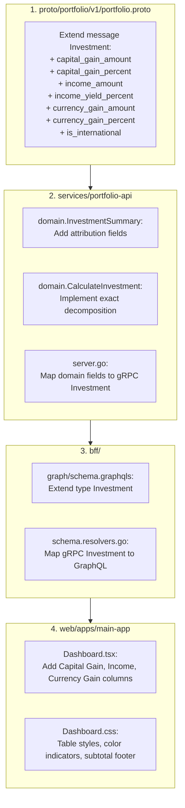

# User Story: Investment Holding Return Attribution (Capital Gain, Income & Currency Gain/Loss)

> **Target**: Primary Investor Application (`web/apps/main-app`), Backend-for-Frontend (`bff/`), Portfolio Service (`services/portfolio-api`), Protobuf (`proto/portfolio/v1/`)  
> **Status**: Done  
> **Implementation Plan**: [holding-return-attribution-implementation-plan.md](file:///Users/oscargarcia/workspace/graphfolio/docs/plans/holding-return-attribution-implementation-plan.md)  
> **Roadmap Reference**: [FEATURES.md (Feature #25)](file:///Users/oscargarcia/workspace/graphfolio/FEATURES.md#L35)  
> **Calculation Standard**: [financial-calculations skill](file:///Users/oscargarcia/workspace/graphfolio/.agents/skills/financial-calculations/SKILL.md)  

---

## 1. Story Statement

> **As an** investor holding both domestic and international equities,  
> **I want to** view distinct columns for Capital Gain/Loss, Income (Dividends/Interest), and Currency Gain/Loss for every investment holding in my dashboard,  
> **So that** I can accurately understand the true economic drivers of my performance, isolate foreign exchange headwinds/tailwinds from underlying stock price movement, and track cumulative passive income earned per asset.

---

## 2. Background & Financial Problem Context

Traditional investment platforms often display a single, blended "Total Return" or "Unrealized Gain" figure. For multi-currency portfolios (e.g., an Australian or European investor holding US-listed stocks like `AAPL`, `MSFT`, or `NVDA`), this aggregated figure obscures critical realities:

1. **Foreign Exchange Distortion**: An international stock might be up +20% in its local trading currency (e.g., USD), but if the investor's base currency appreciated by +25% against USD over the same period, the investor experiences a net loss in base currency terms. Conversely, currency tailwinds can mask poor equity performance.
2. **Invisible Income**: Investors need to know how much cash return has been extracted via dividends and interest versus mark-to-market capital appreciation.
3. **Attribution Integrity**: According to CFA Institute and GIPS standards, multi-currency portfolio returns decompose cleanly into:
   $$\text{Total Return} = \text{Capital Gain/Loss} + \text{Currency Gain/Loss} + \text{Income} \ (+ \text{Realized PnL})$$

---

## 3. Financial Attribution & Mathematical Formulation

All calculations adhere strictly to the [financial-calculations standards](file:///Users/oscargarcia/workspace/graphfolio/.agents/skills/financial-calculations/SKILL.md) using arbitrary-precision fixed-point arithmetic (`shopspring/decimal`).

### 3.1 Holding Input Variables
For a given holding of instrument $i$ at valuation date $t$:
- $C_{\text{base}}$: Portfolio base currency (e.g. `AUD`, `EUR`, `USD`).
- $C_{\text{inst}}$: Instrument denomination currency (e.g. `USD` for `AAPL`, `AUD` for `BHP`).
- $Q_t$: Current open share quantity ($Q_t > 0$).
- $P_t$: Latest market close price in local instrument currency $C_{\text{inst}}$.
- $\text{FX}_t$: Current spot exchange rate converting $1$ unit of $C_{\text{inst}} \to C_{\text{base}}$.
- $C_{\text{local}}$: Total cost basis in local instrument currency ($\sum \text{LotCost}_{\text{local}}$).
- $C_{\text{base}}$: Total cost basis in portfolio base currency ($\sum \text{LotCost}_{\text{base}}$), recording the exact historical FX rate at the trade date of each acquisition.
- $\overline{\text{FX}}_0$: Weighted-average historical acquisition exchange rate:
  $$\overline{\text{FX}}_0 = \begin{cases} \frac{C_{\text{base}}}{C_{\text{local}}} & \text{if } C_{\text{local}} > 0 \\ 1.0 & \text{otherwise} \end{cases}$$
- $V_{\text{local}}$: Current market value in instrument currency ($Q_t \times P_t$).
- $V_{\text{base}}$: Current market value in portfolio base currency ($V_{\text{local}} \times \text{FX}_t$).
- $\text{Income}_{\text{base}}$: Cumulative net cash dividends and interest received in portfolio base currency (`dividends_base`).

---

### 3.2 Return Component Decomposition

#### 1. Capital Gain / Loss (Asset Price Movement)
Isolates the price performance of the underlying equity from currency movement:
- **Local Currency Amount**:
  $$\text{CapGain}_{\text{local}} = V_{\text{local}} - C_{\text{local}} = (Q_t \times P_t) - C_{\text{local}}$$
- **Base Currency Amount (at historical cost FX)**:
  $$\text{CapGain}_{\text{base}} = \text{CapGain}_{\text{local}} \times \overline{\text{FX}}_0$$
- **Capital Gain Percentage**:
  $$\text{CapGain}\% = \begin{cases} \frac{\text{CapGain}_{\text{local}}}{C_{\text{local}}} \times 100\% & \text{if } C_{\text{local}} > 0 \\ 0.00\% & \text{otherwise} \end{cases}$$

#### 2. Currency Gain / Loss (Foreign Exchange Movement)
Isolates the impact of exchange rate fluctuations between $C_{\text{inst}}$ and $C_{\text{base}}$:
- **Domestic Equities ($C_{\text{inst}} = C_{\text{base}}$)**:
  $$\text{FXGain}_{\text{base}} = 0.00, \quad \text{FXGain}\% = 0.00\% \quad (\text{Rendered as neutral or } \text{---})$$
- **International Equities ($C_{\text{inst}} \ne C_{\text{base}}$)**:
  $$\text{FXGain}_{\text{base}} = V_{\text{local}} \times (\text{FX}_t - \overline{\text{FX}}_0)$$
- **Currency Gain Percentage**:
  $$\text{FXGain}\% = \begin{cases} \frac{\text{FX}_t - \overline{\text{FX}}_0}{\overline{\text{FX}}_0} \times 100\% & \text{if } \overline{\text{FX}}_0 > 0 \\ 0.00\% & \text{otherwise} \end{cases}$$

> [!NOTE]
> **Mathematical Verification (Attribution Identity)**:
> $$\text{CapGain}_{\text{base}} + \text{FXGain}_{\text{base}} = (V_{\text{local}} - C_{\text{local}}) \times \overline{\text{FX}}_0 + V_{\text{local}} \times (\text{FX}_t - \overline{\text{FX}}_0)$$
> $$= V_{\text{local}} \overline{\text{FX}}_0 - C_{\text{local}} \overline{\text{FX}}_0 + V_{\text{local}} \text{FX}_t - V_{\text{local}} \overline{\text{FX}}_0$$
> $$= (V_{\text{local}} \times \text{FX}_t) - (C_{\text{local}} \times \overline{\text{FX}}_0) = V_{\text{base}} - C_{\text{base}}$$
> The sum of Capital Gain and Currency Gain exactly reconciles to the total mark-to-market Unrealized Gain/Loss in base currency without rounding drift or discrepancies!

#### 3. Income (Dividends & Instrument Interest)
Cumulative passive cash distributions credited to this holding:
- **Base Currency Amount**:
  $$\text{Income}_{\text{base}} = \sum (\text{GrossDistribution} - \text{WithholdingTax}) \times \text{FX}_{\text{distribution\_date}}$$
- **Yield on Cost (YOC)**:
  $$\text{YOC}\% = \begin{cases} \frac{\text{Income}_{\text{base}}}{C_{\text{base}}} \times 100\% & \text{if } C_{\text{base}} > 0 \\ 0.00\% & \text{otherwise} \end{cases}$$

#### 4. Total Return (Unified Consolidation)
Combines all economic components:
$$\text{TotalReturn}_{\text{base}} = \text{CapGain}_{\text{base}} + \text{FXGain}_{\text{base}} + \text{Income}_{\text{base}} + \text{RealizedPnL}_{\text{base}}$$
$$\text{TotalReturn}\% = \begin{cases} \frac{\text{TotalReturn}_{\text{base}}}{C_{\text{base}}} \times 100\% & \text{if } C_{\text{base}} > 0 \\ 0.00\% & \text{otherwise} \end{cases}$$

---

## 4. UI/UX Layout & Column Specification

The "Your Investments" table in [Dashboard.tsx](file:///Users/oscargarcia/workspace/graphfolio/web/apps/main-app/src/components/Dashboard.tsx) will expand from 6 columns to 9 high-density, glassmorphic columns:

| Column Header | Field / Content | Value Format | Secondary Sub-Text / Pill | Styling & Semantic Color |
| :--- | :--- | :--- | :--- | :--- |
| **Asset** | Ticker & Company Name | `AAPL` | `Apple Inc.` | Neutral text, bold ticker |
| **Price** | Latest Market Price | `$235.40 USD` | Daily change or local ccy | Neutral |
| **Quantity** | Open Shares | `25` | Fractional up to 6 decimals | Neutral |
| **Total Value** | Market Value in Base Ccy | `$5,885.00 AUD` | Local: `$3,825.25 USD` | Neutral / Primary |
| **Capital Gain** | Pure stock price appreciation | `+$820.50 AUD` | `+16.2%` | Positive (green) / Negative (red) |
| **Income** | Total dividends & interest | `+$145.20 AUD` | `+2.8% YOC` | Positive (green) / Neutral if $0 |
| **Currency Gain** | FX movement against base ccy | `-$115.30 AUD` | `-2.3% FX` (or `—` for domestic) | Positive (green) / Negative (red) / Neutral (`—`) |
| **Total Return** | Net economic profit ($\sum$) | `+$850.40 AUD` | `+16.7%` | High-emphasis green/red |
| **Today's Return** | 1-day market movement | `+$42.10 AUD` | `+0.72%` | Green / Red |

---

## 5. Acceptance Criteria

### AC 1: Table Column Expansion & Responsive Architecture
- **Scenario: Inspecting holding columns**
  - **Given** I am an investor viewing the "Your Investments" section on the portfolio dashboard,
  - **When** the investments table renders,
  - **Then** it displays columns for:
    1. `Asset`
    2. `Price`
    3. `Quantity`
    4. `Total Value`
    5. `Capital Gain`
    6. `Income`
    7. `Currency Gain`
    8. `Total Return`
    9. `Today's Return`
  - **And** the container supports smooth horizontal scrolling (`table-responsive`) with sticky column options or compact numerical formatting on smaller viewport widths.

### AC 2: Capital Gain / Loss Attribution
- **Scenario: Asset price appreciation with no currency impact**
  - **Given** an asset has increased in market price above its average acquisition cost,
  - **When** viewing the `Capital Gain` column,
  - **Then** the value displays the positive profit in base currency with a leading `+` sign and green accent (`--accent-green`),
  - **And** the secondary line displays the exact capital gain percentage $\text{CapGain}\%$.
- **Scenario: Asset price depreciation**
  - **Given** an asset's market price has fallen below its average acquisition cost,
  - **When** viewing the `Capital Gain` column,
  - **Then** the value displays the negative loss in base currency with a leading `-` sign and red accent (`--accent-red`).

### AC 3: Income (Dividends & Interest) Tracking
- **Scenario: Holding has received dividend distributions**
  - **Given** an equity holding has associated historical `DIVIDEND` transactions,
  - **When** viewing the `Income` column,
  - **Then** the column displays the net cash amount received in portfolio base currency (summing `dividends_base`),
  - **And** the secondary line displays the Yield on Cost (`YOC%`).
- **Scenario: Growth stock with zero distributions**
  - **Given** an instrument that has paid no dividends or interest,
  - **When** viewing the `Income` column,
  - **Then** it displays `$0.00` (or `—`) with neutral styling (`var(--text-secondary)`).

### AC 4: Currency Gain / Loss for International Equities
- **Scenario: International asset with foreign exchange movement**
  - **Given** a portfolio with base currency `AUD` and a holding denominated in `USD`,
  - **When** the USD exchange rate has moved relative to the acquisition date,
  - **Then** the `Currency Gain` column calculates $V_{\text{local}} \times (\text{FX}_t - \overline{\text{FX}}_0)$,
  - **And** displays the gain or loss with semantic coloring (green for favorable currency appreciation, red for unfavorable depreciation),
  - **And** displays the FX change percentage relative to the weighted acquisition exchange rate.
- **Scenario: Domestic asset in portfolio base currency**
  - **Given** a holding denominated in the portfolio's base currency (e.g. `BHP.AX` in an `AUD` portfolio),
  - **When** viewing the `Currency Gain` column,
  - **Then** it displays an em-dash `—` with a tooltip indicating *"Domestic holding — zero currency exposure"*, avoiding clutter.

### AC 5: Subtotal Footer Row Reconciliation
- **Scenario: Viewing aggregate table subtotals**
  - **Given** multiple domestic and international holdings in the table,
  - **When** scrolling to the table footer (`table-footer-subtotal`),
  - **Then** the footer displays aggregate sums across all holdings for:
    - `Total Value` Subtotal
    - `Capital Gain` Subtotal ($\sum \text{CapGain}_{\text{base}}$)
    - `Income` Subtotal ($\sum \text{Income}_{\text{base}}$)
    - `Currency Gain` Subtotal ($\sum \text{FXGain}_{\text{base}}$)
    - `Total Return` Subtotal ($\sum \text{TotalReturn}_{\text{base}}$)
    - `Today's Return` Subtotal
  - **And** the sum of $(\text{Capital Gain Subtotal} + \text{Currency Gain Subtotal} + \text{Income Subtotal} + \text{Realized PnL Subtotal})$ strictly matches the `Total Return Subtotal`.

### AC 6: Interactive Return Attribution Tooltip / Popover
- **Scenario: Hovering or clicking on return metrics**
  - **Given** any holding row,
  - **When** the user hovers over or clicks an information trigger in the `Total Return` cell,
  - **Then** a popover appears decomposing the return:
    - Base Currency Cost Basis vs Current Value
    - Capital Gain: `$X.XX` ($+Y.Y\%$)
    - Currency Impact: `$X.XX` ($+Z.Z\%$, initial FX $\overline{\text{FX}}_0$ vs current FX $\text{FX}_t$)
    - Dividends / Income: `$X.XX` ($+W.W\%$ YOC)
    - Realized PnL: `$X.XX` (if partial disposals occurred)

---

## 6. Non-Functional Requirements & Precision Rules

1. **Zero Floating-Point Policy**:
   - All server-side domain logic in `services/portfolio-api` must use `github.com/shopspring/decimal`.
   - Never use IEEE 754 `float32` or `float64` for currency amounts, FX rates, or return percentages.
2. **Division by Zero Protection**:
   - If $C_{\text{local}} = 0$ or $C_{\text{base}} = 0$ (e.g., gift/spin-off shares or zero-cost transfers), percentage returns must be safely returned as `decimal.Zero` (never `NaN` or `+Inf`).
3. **Multi-Currency Triangulation**:
   - Exchange rates must support direct currency pairs, inverse lookup ($1 / \text{rate}$), and USD triangulation via `portfolio.fx_rates`.
4. **Exact Consistency with Ledger Replay**:
   - Values must update dynamically whenever `AddTransaction`, `DeleteTransaction`, or `BatchImportTransactions` rebuilds projections via `service.ProcessLedger`.

---

## 7. Architectural Layer Breakdown



### 7.1 Protocol Buffers (`proto/portfolio/v1/portfolio.proto`)
Add fields to `message Investment`:
```protobuf
message Investment {
  string            id                     = 1;
  string            ticker                 = 2;
  string            name                   = 3;
  common.v1.Money   price                  = 4;
  common.v1.Decimal quantity               = 5;
  common.v1.Money   total_value            = 6;
  common.v1.Money   today_return_amount    = 7;
  common.v1.Decimal today_return_percent   = 8;
  common.v1.Money   total_return_amount    = 9;
  common.v1.Decimal total_return_percent   = 10;
  
  // Return Attribution Enhancements
  common.v1.Money   capital_gain_amount    = 11;
  common.v1.Decimal capital_gain_percent   = 12;
  common.v1.Money   income_amount          = 13;
  common.v1.Decimal income_yield_percent   = 14;
  common.v1.Money   currency_gain_amount   = 15;
  common.v1.Decimal currency_gain_percent  = 16;
  bool              is_international       = 17;
}
```

### 7.2 Backend-for-Frontend (`bff/graph/schema.graphqls`)
Add fields to `type Investment`:
```graphql
type Investment {
  id: ID!
  ticker: String!
  name: String!
  price: Money!
  quantity: Decimal!
  totalValue: Money!
  todayReturnAmount: Money!
  todayReturnPercent: Decimal!
  totalReturnAmount: Money!
  totalReturnPercent: Decimal!

  # Return Attribution Breakdown
  capitalGainAmount: Money!
  capitalGainPercent: Decimal!
  incomeAmount: Money!
  incomeYieldPercent: Decimal!
  currencyGainAmount: Money!
  currencyGainPercent: Decimal!
  isInternational: Boolean!
}
```

---

## 8. Related Documentation

- **Calculation Standards**: [financial-calculations skill](file:///Users/oscargarcia/workspace/graphfolio/.agents/skills/financial-calculations/SKILL.md)
- **Features Roadmap**: [FEATURES.md](file:///Users/oscargarcia/workspace/graphfolio/FEATURES.md)
- **Holding Projection Engine**: [projection.go](file:///Users/oscargarcia/workspace/graphfolio/services/portfolio-api/internal/service/projection.go)
- **Investment Calculator**: [calculator.go](file:///Users/oscargarcia/workspace/graphfolio/services/portfolio-api/internal/domain/calculator.go)
- **Main App Dashboard**: [Dashboard.tsx](file:///Users/oscargarcia/workspace/graphfolio/web/apps/main-app/src/components/Dashboard.tsx)
